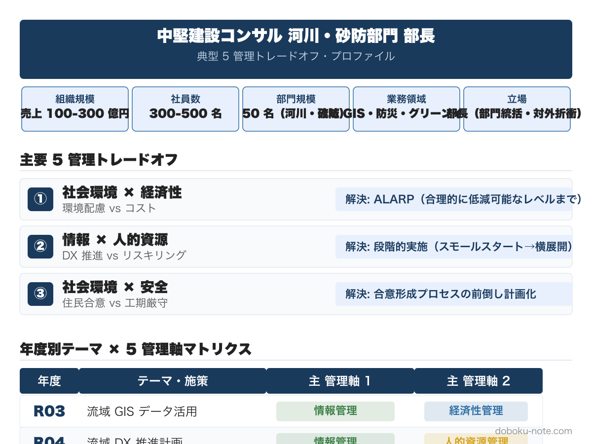

# 令和7年度 総監記述式 模範論文｜河川コンサル版（少子高齢化）

**こんな人のための記事です**

- 中堅建設コンサル河川・砂防部門の技術者として総監記述式を受験する
- 流域治水の担い手不足と地域コミュニティ衰退の同時進行をどう論じるか組み立て中
- 住民参画 DX とピア・サポート、自治体への河川管理包括支援と若手出向ローテをどう書き分けるか迷っている
- 設問（３）で流域マネジメント制度改革と自然共生型まちづくりをどう書き分けるか知りたい

**この記事でわかること**

- 令和7年度 必須科目（少子高齢化）の **3,000 字級フル模範論文（河川コンサル版）**
- 「住民・自治体・コンサル」三者すべての担い手不足を中核に据える構成
- 流域住民参画 DX 化＋ピア・サポートと、自治体河川管理包括支援＋若手出向ローテの 2 施策
- 5 管理間トレードオフを「**社会環境×経済性**」「**人的資源×経済性×社会環境**」「**社会環境（広域×地域自治）**」で立てる王道パターン
- 採点者視点でのチェックポイント（4 項目）

---

河川コンサルペルソナの過去 5 年分（R03-R07）をセットにした **magazine ¥1,980（単品 5 本 ¥2,500 → 21%OFF）** もあわせてご覧ください。

https://note.com/dobokunote/m/PLACEHOLDER_RIVER_MAGAZINE

---

技術士総合技術監理部門 令和7年度 記述式試験（テーマ：少子高齢化）を、**中堅建設コンサル河川・砂防部門の部長** の立場で解いた模範論文。設問の三層構造（現在 → 近い将来 5 年以内 → 我が国における施策）に対応し、各段階で 5 管理間トレードオフを明示する。

> 本論文は「自分の業務経験を活かして 3,000 字を書ききる」ためのテンプレートとして提示します。**そのまま暗記するのではなく、自分の組織規模・業務領域・経験事例に置き換えて再構成する** 前提で読んでください。設定を入れ替えても論文の骨格（三層構造・トレードオフ明示・残余リスク）は流用できます。

## 想定する管理対象と前提条件

| 項目 | 設定 |
|---|---|
| 事業名 | 中堅建設コンサルタント ○○河川・砂防部門 |
| 規模 | 売上 100〜300 億円規模、社員 300〜500 名、河川・砂防部門は 50 名規模 |
| 業務領域 | 河川整備計画・治水計画・砂防基本計画・流域治水・気候適応 |
| 立場 | 部長（部門統括、技術指導、対外折衝、提案・受注） |
| 前提条件 | 流域治水関連業務の受注は増加傾向だが住民合意形成・自治体支援の負荷が増大、ベテラン技術者の退職進行、若手は入社後 3〜5 年で他社・行政へ流出、自治体側の河川管理者も人員削減で連携負荷が増 |

河川コンサルペルソナの他の組織パターンへの置き換えは [河川コンサル向け 模範論文ハブ](https://doboku-note.com/docs/pe-comprehensive-management-pattern-essay-river-consultant?utm_source=note&utm_medium=referral&utm_campaign=essay-river-r07) を参照してください。

## 設問（１）事業や組織の内容と少子高齢化への対応状況

### 事業内容と少子高齢化への対応

- **名称**: 中堅建設コンサルタント ○○河川・砂防部門
- **目的**: 河川整備計画策定、治水計画、砂防基本計画、流域治水推進、気候変動適応計画策定を通じて、流域住民の安全・安心と河川環境の保全に貢献する
- **成果物**: 河川整備計画書、治水計画図書、砂防基本計画書、住民説明資料、流域治水協議会運営支援資料

### 顕在化している課題、施策、効果

**課題**: 流域治水関連業務の受注は増加しているが、社会の高齢化と若手離職が同時進行している。具体的には（１）流域住民の高齢化で住民説明会への参加が減り合意形成が難航、（２）自治体（市町村）の河川管理者が人員削減で技術力低下、（３）当部門のベテラン技術者の退職進行、（４）若手は入社後 3〜5 年で他社・行政へ流出。技術継承と業務体制維持が同時に困難である。

**施策**: 住民説明は対面に加えてオンライン併用で参加機会を拡大、流域治水協議会の事務局運営を当部門が代行することで自治体負担を軽減、ベテラン技術者の知見を動画化し若手向け OJT 教材として整備、若手向けに段階的な業務責任付与と外部研修機会の提供を進めている。

**効果**: 住民説明のオンライン併用で参加者層が拡大し意見の多様化が進んだ。協議会事務局代行で自治体担当の負担が減り、関係性が強化された。動画化教材で若手の OJT 効率が向上した。

### 施策の問題点

オンライン併用は高齢住民が参加困難な場合があり、デジタルディバイドが新たな合意形成阻害要因となる。協議会事務局代行は当部門の業務負荷を増やし、原価管理を圧迫する。動画化教材は特定領域のみで、全体カバー率が低い。若手定着率の改善は限定的で、退職連鎖が止まらない。

## 設問（２）近い将来（5 年以内）に想定される課題と施策

### 施策 1：流域住民参画 DX 化と高齢者への対面サポート併設

**内容**: 住民説明会・流域治水協議会・防災避難計画の運営を、デジタルツール（オンライン会議・流域 GIS 共有プラットフォーム・SNS 連携）で本格的に DX 化する。一方で、高齢者向けに地域コミュニティセンターでの対面説明・スマートフォン操作支援を並行して継続し、デジタルディバイドを生まない設計とする。地域包括支援センター・自治会・民生委員と連携し、住民組織の中で説明者を育成する「ピア・サポート」モデルを構築する。

**効果**: 若い世代・働き盛り世代の参加が拡大し、流域全体の合意形成スピードが向上する。高齢者も対面サポートで取り残されず、住民組織内の説明者育成で持続可能な体制が築ける。

**障害と克服策（トレードオフ）**:
- **障害（社会環境管理）**: デジタルツール導入で参加層が変わり、従来の住民組織との関係が変質しうる。新ツールに馴染めない高齢者が「置き去り」と感じるリスク
- **障害（経済性管理）**: オンラインと対面の両建運営は当部門の業務工数を 1.5〜2 倍に増やす。現状の業務単価では採算悪化を招く
- **克服策**: ピア・サポート育成で運営工数を住民組織側にも分担し、当部門は伴走役に位置付け直す。自治体への業務発注時に「伴走支援費」として明示計上し、継続契約化する
- **トレードオフ**: 参画拡大（社会環境管理）と業務採算（経済性管理）の両立を、住民組織との分担と継続契約化で解消する

### 施策 2：自治体（市町村）河川管理体制の包括支援と若手育成連動

**内容**: 自治体の河川管理者削減を踏まえ、当部門が複数自治体に対して「河川管理包括支援」を提供する継続契約モデルを構築する。具体的には（１）流域 GIS 整備・更新、（２）河川点検・補修計画策定、（３）住民説明・避難計画運営、（４）流域治水協議会運営、（５）気候適応計画更新を 5 年単位の包括契約で受注する。並行して、当部門の若手を自治体に出向（1〜2 年）させ、現場経験を積ませて部門に戻すローテーションを制度化する。

**効果**: 自治体の体制脆弱化を補い、流域全体の安全度を維持できる。当部門の若手は出向で実戦経験を積み、定着率と早期戦力化を同時に達成できる。包括契約で当部門の継続収入が安定する。

**障害と克服策（トレードオフ）**:
- **障害（人的資源管理）**: 出向中の若手は当部門の戦力から外れ、短期的な業務遂行に支障が出る。出向先での待遇差・キャリア不安も離職リスクを高める
- **障害（経済性管理）**: 包括契約は単価交渉が難しく、自治体予算減で契約規模が縮小する可能性がある
- **克服策**: 出向は業務評価・処遇に明示加算し、復帰後の役職昇格パスを保証する。包括契約は複数自治体並行受注でリスク分散し、業務標準化で原価を抑制する
- **トレードオフ**: 若手成長（人的資源管理）と短期戦力（経済性管理）、包括サービス（社会環境管理）と契約採算（経済性管理）の両立を、制度化と業務標準化で解消する

## 設問（３）我が国における少子高齢化に関する課題と施策

### 施策 1：流域マネジメントの制度改革（権限移譲・財源確保・流域圏スケール）

**①課題と施策**: 少子高齢化により自治体（特に市町村）の河川管理体制は今後 10 年でさらに脆弱化する。一方で気候変動による豪雨頻発で治水需要は増加し、現状の市町村単位での管理は限界に達する。よって、流域圏スケールでの広域マネジメント体制（流域連合・流域圏管理組合）の制度化と、安定財源の確保が課題である。

施策として、（１）流域圏単位の広域連合を法制化し、河川・砂防の管理権限と財源を集約、（２）流域治水交付金の継続化と増額、（３）気候適応に関する科学的助言体制（流域科学アドバイザリー）の整備を進める。

**②有効性と実現性**: 流域治水関連法は既に成立しており、広域連合化は既存の地方自治法の枠組みで実現可能である。流域治水協議会も全国で運用開始されており、これを発展させる形で実現性は高い。

**③重大な障害と克服策**: 最も重大な障害は、市町村合併と異なる「流域圏」での権限移譲は住民の自治感覚と齟齬を生み、合意形成に長期を要する点である。**広域効率化（社会環境管理）と地域自治（社会環境管理内部）の両立** を、住民代表参画と段階的権限移譲で解消する。

### 施策 2：地域コミュニティの再構築と防災・自然共生型まちづくり

**①課題と施策**: 少子高齢化と人口流出により地域コミュニティが衰退すると、災害時の共助（避難支援・初動対応）が機能しなくなる。よって、流域治水と地域コミュニティ再構築を一体で進めることが課題である。

施策として、（１）コンパクトシティ計画と流域治水を統合した「自然共生型まちづくり」の推進、（２）多世代共生・移住者受入れ・関係人口の制度的支援、（３）地域防災力の見える化（CCUS のような地域防災キャリアアップシステム）の制度化を進める。

**②有効性と実現性**: コンパクトシティ計画は既に多くの自治体で運用されており、流域治水との統合は実現可能である。関係人口・移住支援は地方創生の枠組みで段階拡大できる。

**③重大な障害と克服策**: 最も重大な障害は、コンパクトシティで集約されない地域（中山間地・過疎集落）の防災維持コストである。**防災維持（安全管理）と国土計画の効率化（経済性管理・社会環境管理）の両立** を、流域単位での役割分担（上流の保水機能・下流の都市機能）で解消する。

## トレードオフと解決フレームの整理

本論文で論じたトレードオフを、頻出ペアの枠組みで再整理する。

| 設問 | 論じたトレードオフ | 解決フレーム |
|---|---|---|
| (2) 施策 1 | 社会環境管理 × 経済性管理 | [合意形成](https://doboku-note.com/docs/pe-comprehensive-management-management-tradeoffs?utm_source=note&utm_medium=referral&utm_campaign=essay-river-r07#合意形成情報開示)（ピア・サポート育成と継続契約化） |
| (2) 施策 2 | 人的資源管理 × 経済性管理 × 社会環境管理 | 制度化（出向ローテと包括契約） + 業務標準化 |
| (3) 施策 1 | 社会環境管理（広域） × 社会環境管理（地域自治） | [合意形成](https://doboku-note.com/docs/pe-comprehensive-management-management-tradeoffs?utm_source=note&utm_medium=referral&utm_campaign=essay-river-r07#合意形成情報開示) + 段階的権限移譲 |
| (3) 施策 2 | 安全管理 × 経済性管理 × 社会環境管理 | 流域単位の役割分担（上流・下流） |

## 採点者視点でのチェックポイント

R7 河川コンサル版は「住民・自治体・コンサル」の三者すべての担い手不足を中核に書く。採点者がチェックする 4 点：

- (1) 既存施策（オンライン併用・協議会代行・OJT 教材）の限界を率直に明示することで、(2) のピア・サポートと包括支援の必然性が立つ
- (2) では各施策で必ずトレードオフを書く。河川コンサル版では「社会環境管理」が常に主役のトレードオフ要因になるのが特徴
- (3) では事業単独の枠を超えて「流域マネジメント制度改革」と「自然共生型まちづくり」の 2 施策で広げる。技術論だけでなく、制度・財源・地域自治まで踏み込む
- 全体を通じて部長としての権限（部門統括・受注戦略・人事）を活かした施策を提示する

---

## doboku-note の関連ガイド

- [河川コンサル向け 模範論文ハブ](https://doboku-note.com/docs/pe-comprehensive-management-pattern-essay-river-consultant?utm_source=note&utm_medium=referral&utm_campaign=essay-river-r07) — 共通ペルソナと R3〜R7 の年度別模範論文の起点
- [令和7年度 総監記述式 過去問解説](https://doboku-note.com/docs/pe-comprehensive-management-r07-secondary?utm_source=note&utm_medium=referral&utm_campaign=essay-river-r07) — 必須科目の問題文全文と他ペルソナの解き方
- [5 管理間トレードオフ 頻出パターンと解決フレーム](https://doboku-note.com/docs/pe-comprehensive-management-management-tradeoffs?utm_source=note&utm_medium=referral&utm_campaign=essay-river-r07) — 合意形成・段階的実施などのフレーム集

---

## magazine セット販売のお知らせ

河川コンサルペルソナの過去 5 年分（R03-R07）の模範論文を全 5 本セットにした magazine を販売しています。

- 単品: 各 ¥500 × 5 = ¥2,500
- magazine セット: **¥1,980（21%OFF）**

R03（データ利活用）/ R04（DX）/ R05（SWOT）/ R06（カーボンニュートラル）/ R07（少子高齢化）と、テーマは毎年異なりますが、**河川コンサル・地域密着として書ける論点とトレードオフは共通パターン** があります。5 年分をまとめて読むことで、テーマが変わっても応用できる「自分用テンプレート」が構築できます。

https://note.com/dobokunote/m/PLACEHOLDER_RIVER_MAGAZINE
