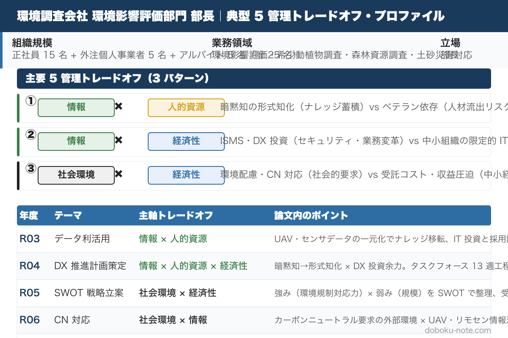

# 令和3年度 総監記述式 模範論文｜環境調査事務所版（データ利活用）

**こんな人のための記事です**

- 地方拠点・中小規模の環境調査コンサルとして総監記述式を受験する
- R3 の「データ利活用」テーマで自社の制約（GIS 部分利用・紙残存・属人化）をどう書けば説得力が出るか迷っている
- 設問三層構造（現在 → 5 年以内 2 施策 → 5〜10 年後）で何を書くか組み立て中
- 中小コンサルの規模感に合った「現実的な 2 施策＋将来の差別化」を 3,000 字に落とし込む書き方を知りたい

**この記事でわかること**

- 令和3年度 必須科目（データ利活用）の **3,000 字級フル模範論文（環境調査事務所版）**
- 中小コンサルの「GIS 部分利用・紙残存」を率直に書きつつ、UAV+AI と GIS クラウドの 2 施策で立て直す論じ筋
- 5〜10 年後の「気候変動 × 生態系予測モデル」で地域特化型の差別化に持ち込むパターン
- 5 管理間トレードオフを「**経済性×情報×人的資源**」「**情報×経済性×人的資源**」「**情報×人的資源×社会環境**」で立てる王道パターン
- 採点者視点でのチェックポイント（4 項目）

---

環境調査ペルソナの過去 5 年分（R03-R07）をセットにした **magazine ¥1,980（単品 5 本 ¥2,500 → 21%OFF）** もあわせてご覧ください。

https://note.com/dobokunote/m/PLACEHOLDER_ENV_MAGAZINE

---

技術士総合技術監理部門 令和3年度 記述式試験（テーマ：データ利活用）を、**地方拠点・中小規模の環境調査事務所部長** の立場で解いた模範論文。設問の三層構造（現在のデータ利活用 → 近い将来の 2 施策 → 5〜10 年後の新たな利活用）に対応し、各段階で 5 管理間トレードオフを明示する。

> 本論文は「自分の業務経験を活かして 3,000 字を書ききる」ためのテンプレートとして提示します。**そのまま暗記するのではなく、自分の組織規模・業務領域・経験事例に置き換えて再構成する** 前提で読んでください。R3 は「現状不十分でも記してよい」と前文で明示されているため、中小コンサルの現実的な制約を率直に書くと説得力が出ます。

## 想定する管理対象と前提条件

| 項目 | 設定 |
|---|---|
| 事業名 | ○○環境調査事務所（A コンサルティング社） |
| 拠点 | 地方都市 |
| 規模 | 正社員 15 名 + 外注個人事業者 5 名 + アルバイト 5 名（計 25 名） |
| 業務領域 | 環境影響評価、希少動植物調査、森林資源調査、土砂災害の事前防災・復旧支援 |
| 立場 | 部長（業務全体を統括管理） |
| 前提条件 | GIS の部分利用にとどまり、データ蓄積が個人 PC・紙・クラウドに分散、AI 活用は未着手 |

環境調査ペルソナの他の管理対象パターン（地方拠点／大手環境部門等）への置き換えは [環境調査向け 模範論文ハブ](https://doboku-note.com/docs/pe-comprehensive-management-pattern-essay-environment-survey?utm_source=note&utm_medium=referral&utm_campaign=essay-env-r03) を参照してください。

## 設問（１）事業の内容と現在のデータ利活用の状況

### 名称・概要・目的

地方都市に拠点を置く環境調査事務所（A コンサルティング社）であり、自然環境調査・分析・評価および土砂災害の事前防災・復旧支援を行う。私は部長として業務全体を統括管理する。

### 創出している成果物

環境影響評価書、希少動植物調査報告書、森林資源調査報告書、土砂災害復旧設計図書、住民説明資料。ソフト面の成果物として、調査・評価を通じて培った地形地質・植生・希少種に関する技術ノウハウ。

### 現在のデータ利活用の状況

- **収集・解析しているデータ**: 現地踏査で取得する写真・スケッチ・植生調査票・地質柱状図、UAV による測量データ（DEM・オルソ画像）、過去の調査報告書、自治体・国の公開データ（地形図・気象データ・土砂災害警戒区域図）
- **事業への活用方法**: GIS ソフトに重ね合わせて環境影響範囲・希少種分布の可視化、報告書の図面作成、住民説明資料の作成に利用
- **現在の留意点**: データの著作権・個人情報の取扱い、住民の特定地点情報の機密保持
- **問題点・今後の課題**:
  - データが個人 PC・紙・クラウドに分散し、過去案件の知見が組織として蓄積されない（属人化）
  - GIS 操作スキルが特定社員に集中し、若手・パートが活用できない
  - 過去報告書のデジタル化が部分的で、検索・参照が困難
  - 蓄積データを次の調査・提案に活かす分析・予測の段階に到達していない

## 設問（２）今後導入が可能なデータ利活用の方法

### 方法 1：UAV + AI 画像解析による森林・植生調査の標準化

**①利活用するデータと方法**: UAV（LiDAR 搭載）で取得する地形・樹高・林相データに加え、AI 画像解析による樹種同定・植生分類モデルを導入する。撮影 → 自動解析 → GIS への取込みまでを定型ワークフロー化し、若手・パートでも標準業務として実施可能にする。

**②期待できる効果と理由**: 従来 4 名 1 組で 1 週間を要した森林調査が 2 名 2 日で完了し、人員数は延べ 20 名から 4 名に減少する。移動に伴う温室効果ガスも抑制される。さらに、AI による一次判定で熟練技術者の作業時間を確保し、より高難度の判断業務に集中させられる。標準化により若手・パートでも基本業務を担えるため、属人化が緩和される。

**③課題やリスク（2 つ以上の管理視点）**:
- **経済性管理**: ハード・ソフト・ライセンスの初期投資が 1,000 万円以上と高額である。既存の個人事業者・アルバイトの仕事を維持しつつ移行する必要があり、移行期は二重コストが発生する
- **情報管理**: AI モデルの判定根拠（説明可能性）が低い場合、官公庁納品時の品質保証が難しい。教師データのバイアス（偏った樹種データでの学習）も検証が必要
- **人的資源管理**: 現場作業から減る人員の業務転換（解析・住民説明等への配置換え）が必要で、教育投資が伴う

### 方法 2：GIS クラウドと過去案件のナレッジベース化

**①利活用するデータと方法**: 過去 10 年の調査報告書・図面・写真をデジタル化し、GIS クラウド上で位置情報と紐付けて全社員が検索・閲覧できるナレッジベースを構築する。新規案件着手時、対象地域の過去調査履歴・周辺の希少種分布・地質特性を即座に参照できる。

**②期待できる効果と理由**: 提案・調査計画の精度が向上し、若手・パートでも過去事例を学習しながら業務を進められる。属人化の緩和と、提案フェーズでの差別化（「対象地域は過去 X 年に Y 案件の実績あり」と具体性を示せる）にも寄与する。

**③課題やリスク（2 つ以上の管理視点）**:
- **情報管理**: 過去報告書には顧客機密・住民個人情報・希少種の正確な位置情報が含まれ、扱い方を間違えると重大な情報漏洩リスクを生む。アクセス権限設計と ISMS 準拠の運用が必須
- **経済性管理**: 過去報告書のデジタル化（OCR・タグ付け・GIS 紐付け）は工数が大きく、外注も含めて 5,000 万円規模の投資となる可能性がある
- **人的資源管理**: ナレッジ整備担当者の確保と、整備後の活用文化醸成（検索する習慣を全社員に浸透させる）の両方が必要

## 設問（３）将来（5〜10 年後）の新たなデータ利活用の方法

### ①利活用するデータと方法

**「気候変動・生態系変化を組み込んだ環境影響予測モデル」** を取り上げる。

5〜10 年後には、各自治体・国・研究機関が公開するオープンデータ（気象長期トレンド・植生変化・希少種分布変化・土砂災害発生履歴）が大規模に蓄積され、AI/機械学習モデルでこれらを統合した予測が実用域に入ると考えられる。本事務所では、自社の累積調査データと公開オープンデータを組み合わせ、対象地域の **将来 30 年の環境変化を確率的に予測** するモデルを構築し、環境影響評価・防災計画策定の高度化サービスとして提供する。

### ②期待できる効果と理由

従来の環境影響評価は「現状調査と短期影響予測」に留まっていたが、気候変動の長期影響を確率的に提示できれば、自治体・事業者の中長期計画策定に大きく貢献する。地方の中小コンサルでも、地域固有のデータと地域知見を強みとすれば、大手にはできない地域特化型の予測サービスとして差別化できる。

### ③課題やリスク（データ利用可能性・技術実現性は対象外）

- **情報管理**: 予測モデルの不確実性（誤差・前提条件）を顧客にどう説明するかが最大の課題である。説明不足では誤った政策決定を導きうる
- **人的資源管理**: 予測モデルを運用・解釈できる人材は中小では希少で、大学・研究機関との連携が必要となる。地方拠点の弱みが顕在化する
- **社会環境管理**: 予測結果が「特定地域の環境悪化」を示した場合、自治体・住民との対話設計を誤ると風評被害や合意形成の混乱を招く

## トレードオフと解決フレームの整理

本論文で論じたトレードオフを、頻出ペアの枠組みで再整理する。

| 設問 | 論じたトレードオフ | 解決フレーム |
|---|---|---|
| (2) 方法 1 | 経済性管理 × 情報管理 × 人的資源管理 | [段階的実施](https://doboku-note.com/docs/pe-comprehensive-management-management-tradeoffs?utm_source=note&utm_medium=referral&utm_campaign=essay-env-r03#段階的実施)（試行 → 標準化 → 全社展開） |
| (2) 方法 2 | 情報管理 × 経済性管理 × 人的資源管理 | ISMS 準拠 + 補助金活用（DX 投資の段階導入） |
| (3) 将来取組 | 情報管理 × 人的資源管理 × 社会環境管理 | [合意形成](https://doboku-note.com/docs/pe-comprehensive-management-management-tradeoffs?utm_source=note&utm_medium=referral&utm_campaign=essay-env-r03#合意形成情報開示)（不確実性の説明と対話設計） |

## 採点者視点でのチェックポイント

R3 環境調査事務所版は「現状不十分」を率直に認めた上で、現実的な 2 施策 + 将来の差別化を組み立てる。採点者がチェックする 4 点：

- (1) では「個人 PC に分散」「紙が残る」など中小コンサルのリアルな制約を率直に書く。前文で「不十分でも記してよい」とあるので減点にならない
- (2) では UAV+AI（実装可能性高）と GIS クラウド+ナレッジ（属人化解消の本丸）の 2 軸で書く。各施策で 2 つ以上の管理視点からリスクを必ず記す
- (3) では「気候変動 × 生態系」のように、5〜10 年後にデータと AI モデルが揃う領域を選ぶ。技術論だけでなく、不確実性の社会的扱いまで踏み込むのが定石
- 全体を通じて「中小規模の地方コンサル」という前提を一貫させる。大手と同じ方策を書くと採点者から見て不自然になる

---

## doboku-note の関連ガイド

- [環境調査向け 模範論文ハブ](https://doboku-note.com/docs/pe-comprehensive-management-pattern-essay-environment-survey?utm_source=note&utm_medium=referral&utm_campaign=essay-env-r03) — 共通ペルソナと R3〜R7 の年度別模範論文の起点
- [令和3年度 総監記述式 過去問解説](https://doboku-note.com/docs/pe-comprehensive-management-r03-secondary?utm_source=note&utm_medium=referral&utm_campaign=essay-env-r03) — 必須科目の問題文全文と前文分析・論文骨子
- [5 管理間トレードオフ 頻出パターンと解決フレーム](https://doboku-note.com/docs/pe-comprehensive-management-management-tradeoffs?utm_source=note&utm_medium=referral&utm_campaign=essay-env-r03) — 段階的実施・合意形成・ISMS などのフレーム集

---

## magazine セット販売のお知らせ

環境調査ペルソナの過去 5 年分（R03-R07）の模範論文を全 5 本セットにした magazine を販売しています。

- 単品: 各 ¥500 × 5 = ¥2,500
- magazine セット: **¥1,980（21%OFF）**

R03（データ利活用）/ R04（DX）/ R05（SWOT）/ R06（カーボンニュートラル）/ R07（少子高齢化）と、テーマは毎年異なりますが、**中小コンサル・地方拠点として書ける論点とトレードオフは共通パターン** があります。5 年分をまとめて読むことで、テーマが変わっても応用できる「自分用テンプレート」が構築できます。

https://note.com/dobokunote/m/PLACEHOLDER_ENV_MAGAZINE
