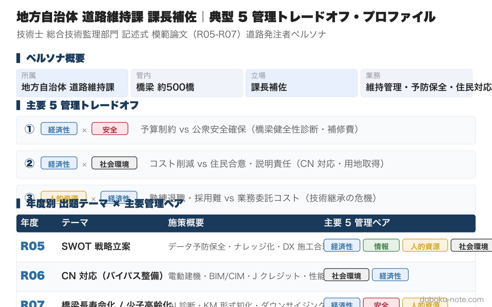

# 令和7年度 総監記述式 模範論文｜道路発注者版（橋梁長寿命化）

**こんな人のための記事です**

- 地方公共団体・道路維持管理担当 or 道路建設担当として総監記述式を受験する
- 「5 管理間トレードオフ」をどのペアで立てれば総監らしさが出るか判断できない
- 設問の三層構造（現在 → 5 年以内 → 2050 年）に何を書くか組み立て中
- 自分の業務経験を 3,000 字の論文に落とし込む書き方が知りたい

**この記事でわかること**

- 令和7年度 必須科目（少子高齢化）の **3,000 字級フル模範論文（道路発注者版）2 バージョン併記**
  - **A 案: 橋梁長寿命化版**（維持管理経験者向け・人的×経済の王道）
  - **B 案: バイパス整備版**（新設プロジェクト経験者向け・情報×安全の生産性軸）
- 設問三層構造の組み立て方と 5 管理間トレードオフを「**情報×経済**」「**人的×経済**」「**社環×人的**」「**情報×安全**」「**社環×経済**」で立てる王道パターン
- A 案 vs B 案 の選択判断表（試験本番で問題文ヒントから瞬時に選ぶ）
- 採点者視点でのチェックポイント（4 項目）

---

道路発注者ペルソナの過去 3 年分（R05-R07）をセットにした **magazine ¥1,200（単品 3 本 ¥1,500 → 20%OFF）** もあわせてご覧ください。

https://note.com/dobokunote/m/PLACEHOLDER_ROAD_MAGAZINE

---

技術士総合技術監理部門 令和7年度 記述式試験（テーマ：少子高齢化）を、**地方公共団体の道路発注者** の立場で **A 案: 橋梁長寿命化修繕事業（維持管理）** と **B 案: バイパス道路整備事業（新設）** の 2 つの管理対象パターンで解いた模範論文。設問の三層構造（現在 → 5 年以内 → 2050 年）に対応し、各段階で 5 管理間トレードオフを明示する。

> **本記事の構成**: 前半（A 案）は橋梁長寿命化版の完全模範論文、後半（B 案）はバイパス整備版の完全模範論文を併記しています。維持管理経験が中心なら A 案、新設プロジェクト経験が中心なら B 案を本番選択の基準にしてください。両案の使い分け判断表は記事末尾に掲載。

> 本論文は「自分の業務経験を活かして 3,000 字を書ききる」ためのテンプレートとして提示します。**そのまま暗記するのではなく、自分の管内橋梁数・組織規模・経験事例に置き換えて再構成する** 前提で読んでください。設定を入れ替えても論文の骨格（三層構造・トレードオフ明示・残余リスク）は流用できます。

## A 案: 橋梁長寿命化版 — 想定する管理対象と前提条件

| 項目 | 設定 |
|---|---|
| 事業名 | ○○市道路部 橋梁長寿命化修繕事業 |
| 目的 | 管内橋梁約 500 橋の安全性確保と LCC 最小化 |
| 成果物 | 橋梁点検結果報告書、補修設計図書、長寿命化修繕計画 |
| 立場 | 道路維持課 課長補佐 |
| 前提条件 | 厳しい財政制約、熟練技術者の大量退職、ベテラン依存からの脱却が急務 |

道路発注者ペルソナの他の管理対象パターン（バイパス・トンネル・法面）への置き換えは [道路発注者向け 模範論文ハブ](https://doboku-note.com/docs/pe-comprehensive-management-pattern-essay-road-municipality?utm_source=note&utm_medium=referral&utm_campaign=essay-road-r07) を参照してください。

## A 案 設問（１）事業の内容と少子高齢化への対応状況

### 事業の内容、目的、成果物

- **名称**: ○○市道路部 橋梁長寿命化修繕事業
- **目的**: 管内の老朽化橋梁の安全性を確保し、限られた予算内で効率的に長寿命化を図ることで市民の安全・安心な通行を維持する
- **成果物**: 橋梁点検結果報告書、補修設計図書、長寿命化修繕計画（更新版）

### 現在顕在化している課題と施策の内容、効果

**課題**: 団塊世代の熟練技術者の大量退職により、橋梁の健全性診断に必要な知見の継承が滞り、点検・診断の質にばらつきが生じている。新規採用も困難で、職員の年齢構成に偏りがある。

**施策**: OB 技術者の再雇用によるアドバイザー制度を導入。退職者の知見を若手技術者に直接指導（OJT）する体制を構築する。

**効果**: 熟練者の知見が現場で共有され、診断精度の向上が図られるとともに、若手職員の技術力向上が期待できる。

### 施策の問題点

再雇用職員は勤務時間が限定的（週 3 日など）であるため、突発的な現場対応や詳細な設計協議への参画が難しく、技術指導の機会が形骸化する恐れがある。アドバイザー制度のみでは、若手の自走に必要な「形式知化された判断基準」が組織資産として残らない。

## A 案 設問（２）近い将来（5 年以内）に導入すべき施策の組合せ

### 施策 1：AI を用いた橋梁点検支援システムの導入

**内容**: 過去の膨大な点検データ（写真・所見）を AI に学習させ、変状の自動検出と健全性診断の一次判定を支援するシステムを導入する。

**効果**:
- **経済性管理**: 一次診断の自動化により職員の事務負担を軽減し、外注コストの削減が図れる
- **情報管理**: 診断結果がデジタルデータとして標準化され、将来の劣化予測精度が向上する

**障害と克服策（トレードオフ）**:
- **障害**: 高精度な AI 診断には膨大な教師データが必要だが、形式知化されていないデータが多く、初期導入コストも高額となる（**情報管理 × 経済性管理** のトレードオフ）
- **克服策**: 近隣自治体と連携してデータを共有するプラットフォームを構築し、コストを分担する。標準的な診断ルールを定式化し、AI の判定根拠を発注者が検証できる仕組みを併設する

### 施策 2：ナレッジマネジメント（KM）による技術情報の形式知化

**内容**: 熟練者の暗黙知（現場での判断基準やコツ）を動画や図解でデータベース化し、タブレット等で現場閲覧できるナレッジベースを構築する。

**効果**:
- **人的資源管理**: 時間や場所を問わず熟練者の技術を疑似体験でき、若手職員の教育期間を短縮できる
- **品質管理**: 担当者による判断のばらつきが抑えられ、維持管理品質が均質化される

**障害と克服策（トレードオフ）**:
- **障害**: 熟練職員への聞き取りやデータ化に多大な工数を要し、通常業務を圧迫する（**人的資源管理 × 経済性管理** のトレードオフ）
- **克服策**: 音声入力 AI や RPA を活用して事務作業を自動化し、捻出した時間で「重点領域」（特殊橋・大規模補修事例）に絞ったナレッジ化を集中的に行う。技術継承を業務評価項目に設定し組織的動機付けを図る

## A 案 設問（３）2050 年時点の少子高齢化に向けた施策

### 有効と考える施策

**インフラの集約化・ダウンサイジングと自動運転専用レーンの整備**

2050 年には生産年齢人口が大幅に減少し、全てのインフラを現状維持することは財政・人員の両面で不可能となる。維持管理対象を重要路線に集約し、AI・ロボットによる完全自動点検を前提とした設計（メンテナンスフリー化）を取り入れることで、極小人数での管理が可能となる。

### 有効性と実現性

- **有効性**: 維持管理対象が絞られ、ライフサイクルコスト全体の大幅な圧縮が可能となる。残された路線には超長寿命材料・自己治癒コンクリート等を投入し、世代をまたぐメンテナンスフリー化を実現する
- **実現性**: マイナンバーを基盤とした住民の居住実態データに基づき、公共交通と道路網を最適化する「都市の再編」が、デジタルツイン技術の進展により精緻に計画できる。国レベルで集約方針を策定し、補助金・交付金を集約路線に重点配分すれば実装可能

### 重大な障害とその克服策

**重大な障害**: 道路の廃止や集約化に伴う、沿道住民や周辺自治体との合意形成が極めて困難（**社会環境管理 × 人的資源管理** の対立）。生活道路を失う住民の心理的抵抗は強く、技術論だけでは突破できない。

**克服策**:
- **社会環境管理**: VR/AR 技術を用いて将来のリスク（インフラ崩壊や生活利便性低下のシナリオ）を可視化し、住民との対話型コミュニケーションを促進する
- **経済性管理**: 廃止区間の住民に対し、自動運転 MaaS による移動手段の代替提供をセットで提案し、全体の LCC 抑制分をサービス維持に充当する仕組みを構築する

## B 案: バイパス整備版 — 想定する管理対象と前提条件

> 維持管理経験ではなく新設プロジェクト経験を持つ受験者向けに、同じ R7（少子高齢化）テーマをバイパス整備事業で書いた場合の模範論文を併記します。ICT 施工と若手入職促進を主軸に、生産性向上で少子高齢化に対応する構造です。

| 項目 | 設定 |
|---|---|
| 事業名 | ○○県 都市計画道路バイパス整備事業（延長 3.0 km） |
| 目的 | 現道の渋滞解消と物流効率化、災害時緊急輸送道路の確保 |
| 成果物 | 道路構造物（土工・舗装・排水）、3 次元完成モデル、維持管理マニュアル |
| 立場 | 本庁道路建設課 課長補佐（総括監理者） |
| 前提条件 | 地元建設業界の入職者減少、県職員の高齢化、ICT スキル不足、2024 年問題による工期制約 |

## B 案 設問（１）事業の内容と少子高齢化への対応状況

### 事業の内容、目的、成果物

- **名称**: ○○県 都市計画道路バイパス整備事業（延長 3.0 km）
- **目的**: 現道の渋滞解消と物流効率化を図るとともに、災害時の緊急輸送道路を確保する
- **成果物**: 道路構造物（土工、舗装、排水施設）、完成図書（3 次元モデル含む）、維持管理マニュアル

### 現在顕在化している課題と施策の内容、効果

**課題**: 地元建設業界の生産年齢人口減少により、入札不調や工事の長期化リスクが顕在化している。また、県職員内でもベテラン層の退職により、現場監督の技術力が低下している。

**施策**: 「発注者指定型 ICT 活用工事」の全件導入。3 次元データの活用を義務付け、施工の自動化・省人化を図る。

**効果**: 現場の作業員数を削減しつつ施工速度を向上させ、若手入職者にとって魅力ある「スマートな現場」を実現できる。

### 施策の問題点

ICT 機器の導入費用や 3 次元データの作成負荷が大きく、中小の地元業者にとって経済的負担が過重となる。また、発注者側でもデータ検査のための高度な IT スキル習得が追いついていない。

## B 案 設問（２）近い将来（5 年以内）に導入すべき施策の組合せ

### 施策 B-1: ウェアラブルデバイスを用いた遠隔臨場の全面採用

**内容**: 監督員が現場に赴く代わりに、受注者が装着したスマートグラス映像を通じてリアルタイムで段階確認や材料検査を行う。

**効果**:
- **人的資源管理**: 移動時間を削減し、1 人の監督員が同時に複数の現場を管理可能となる（少人数での多現場管理）
- **安全管理**: 監督員の移動に伴う交通事故リスクや、現場内での歩行災害リスクを低減できる

**障害と克服策（トレードオフ）**:
- **障害**: 通信環境の不安定さによる見落としリスク（**情報管理 × 安全・品質管理** のトレードオフ）
- **克服策**: 5G 通信環境の整備支援を行うとともに、重要な箇所については「静止画＋動画＋位置情報」をセットで記録する標準ルールを策定し、証拠能力を補完する

### 施策 B-2: BIM/CIM を活用したデジタル検測・精算システム

**内容**: 3 次元計測データから土量や出来形を自動算出し、設計値との差分を瞬時に判定して工事費精算に反映させる。

**効果**:
- **経済性管理**: 検測作業の時間を大幅に短縮し、工事全体の工期短縮とコスト削減に寄与する
- **人的資源管理**: 熟練者の経験に頼っていた出来形判断をデジタルで客観化し、若手職員でも精度の高い監督業務が可能となる

**障害と克服策（トレードオフ）**:
- **障害**: システム構築とデータ維持に多大なコストがかかる（**情報管理 × 経済性管理** のトレードオフ）
- **克服策**: クラウド型のプラットフォームを近隣自治体と共同利用することで、初期投資とランニングコストを分散し、投資対効果を最適化する

## B 案 設問（３）2050 年時点の少子高齢化に向けた施策（国レベルの視点）

### 有効と考える施策

「道路インフラの標準化・プレキャスト化の完全義務化」と「自動運転専用空間の創出」

### 有効性と実現性

- **有効性**: 現場での複雑な作業を徹底的に排除し、工場製作された部材をロボットが設置するだけの施工体系に移行することで、現場労働力を極小化できる
- **実現性**: 2050 年には全車両の自動運転化が普及していることを前提に、路車協調システム（V2I）を組み込んだ「メンテナンス・アップデートが容易な道路構造」が標準となる

### 重大な障害とその克服策

**重大な障害**: 既存の多種多様な既設構造物との接続や、地域ごとの独自基準の存在が標準化を阻む（**社会環境管理 × 経済性管理** の対立）

**克服策（管理行為）**:
- **情報管理**: 全国共通のインフラ・データ・プラットフォームを構築し、設計から廃棄までの全ライフサイクルを一元管理する
- **人的資源管理**: 技術基準を「性能規定型」へ完全に移行させ、民間の自由な発想による技術開発を促す
- **経済性管理**: 構造物の集約化（ダウンサイジング）を並行して進め、総延長を縮小することで維持管理予算の破綻を防ぐ「スマート・シュリンク」を断行する

## A 案 vs B 案 — どちらを選ぶか

| 観点 | A 案: 橋梁長寿命化版 | B 案: バイパス整備版 |
|---|---|---|
| 受験者の業務経験 | 維持管理経験が中心 | 新設プロジェクト経験が中心 |
| 主軸トレードオフ | 情報×経済 / 人的×経済 / 社環×人的 | 情報×安全 / 情報×経済 / 社環×経済 |
| 5 年内施策の核 | AI 診断 + ナレッジマネジメント | 遠隔臨場 + BIM/CIM デジタル検測 |
| 2050 年抜本策 | インフラ集約 + 自動運転連携 | 標準化・プレキャスト + V2I |
| 「管理行為」要素 | VR/AR 対話・MaaS 代替・LCC 抑制 | 性能規定移行・スマートシュリンク |
| 問題文ヒント | アセットマネジメント・予防保全・既設活用 | ICT 施工・生産性向上・新設整備 |

維持管理の現場経験を持つ受験者は A 案、新設プロジェクトの経験を持つ受験者は B 案を選ぶ。試験本番では問題文に「アセットマネジメント」「予防保全」が出ていれば A 案、「ICT 施工」「生産性向上」が出ていれば B 案を即選択する。

## トレードオフと解決フレームの整理

本論文で論じたトレードオフを、頻出 6 ペアの枠組みで再整理する。

| 設問 | 論じたトレードオフ | 解決フレーム |
|---|---|---|
| (2) 施策 1 | 情報管理 × 経済性管理 | [段階的実施](https://doboku-note.com/docs/pe-comprehensive-management-management-tradeoffs?utm_source=note&utm_medium=referral&utm_campaign=essay-road-r07#段階的実施)（自治体間の共同利用） |
| (2) 施策 2 | 人的資源管理 × 経済性管理 | [合意形成](https://doboku-note.com/docs/pe-comprehensive-management-management-tradeoffs?utm_source=note&utm_medium=referral&utm_campaign=essay-road-r07#合意形成情報開示)（業務評価項目への組込み） |
| (3) | 社会環境管理 × 人的資源管理 | [合意形成](https://doboku-note.com/docs/pe-comprehensive-management-management-tradeoffs?utm_source=note&utm_medium=referral&utm_campaign=essay-road-r07#合意形成情報開示) + [LCA](https://doboku-note.com/docs/pe-comprehensive-management-management-tradeoffs?utm_source=note&utm_medium=referral&utm_campaign=essay-road-r07#lca外部不経済の内部化) |

## 採点者視点でのチェックポイント

R7 の三層構造は「現在の限界 → 5 年以内の現実的施策 → 2050 年の構造変革」で書く。採点者がチェックする 4 点：

- (1) 現在の施策に「問題点」を明示することで、(2) の施策の必然性が立つ（採点者は接続の論理性を見る）
- (2) では施策ごとに必ずトレードオフを書く。書かないと「総監らしさ」が出ず減点される
- (3) では「重大な障害」を社会環境管理 × 人的資源管理で立てるのが王道。技術論だけで終わらせない
- 全体を通じて発注者の権限（仕様書義務化・補助金活用・自治体間連携）を活かした施策を提示する

---

## doboku-note の関連ガイド

- [道路発注者向け 模範論文ハブ](https://doboku-note.com/docs/pe-comprehensive-management-pattern-essay-road-municipality?utm_source=note&utm_medium=referral&utm_campaign=essay-road-r07) — 管理対象 4 パターン（橋梁・バイパス・トンネル・法面）の選び方と前提条件のテンプレート集
- [令和7年度 総監記述式 過去問解説](https://doboku-note.com/docs/pe-comprehensive-management-r07-secondary?utm_source=note&utm_medium=referral&utm_campaign=essay-road-r07) — 必須科目の問題文全文と他ペルソナの解き方
- [5 管理間トレードオフ 頻出パターンと解決フレーム](https://doboku-note.com/docs/pe-comprehensive-management-management-tradeoffs?utm_source=note&utm_medium=referral&utm_campaign=essay-road-r07) — 段階的実施・合意形成・LCA などフレーム集

---

## magazine セット販売のお知らせ

道路発注者ペルソナの過去 3 年分（R05-R07）の模範論文を全 3 本セットにした magazine を販売しています。

- 単品: 各 ¥500 × 3 = ¥1,500
- magazine セット: **¥1,200（20%OFF）**

R05（社会資本維持）/ R06（CN 化）/ R07（少子高齢化）と、テーマは毎年異なりますが、**道路発注者として書ける論点とトレードオフは共通パターン** があります。3 年分をまとめて読むことで、テーマが変わっても応用できる「自分用テンプレート」が構築できます。

https://note.com/dobokunote/m/PLACEHOLDER_ROAD_MAGAZINE
