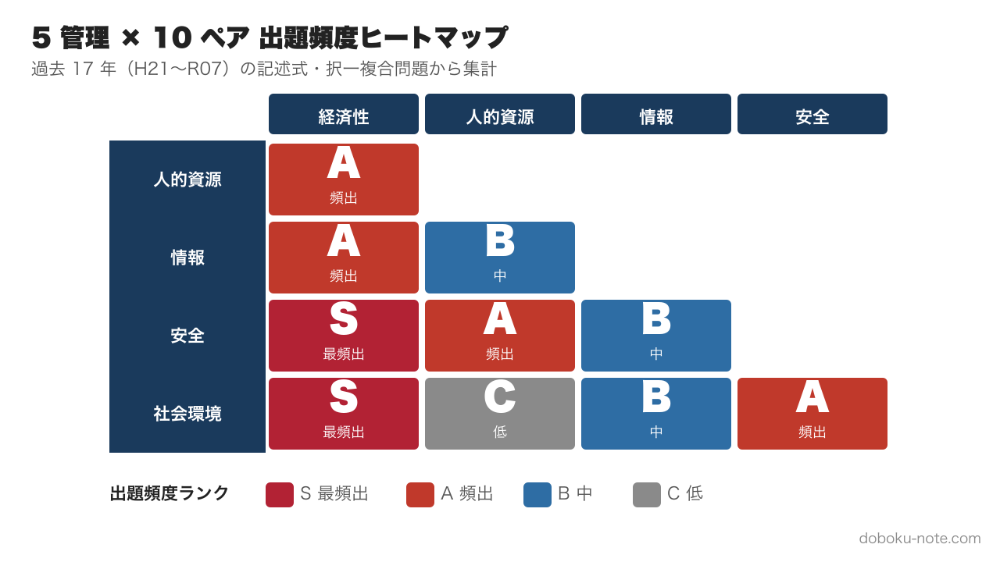
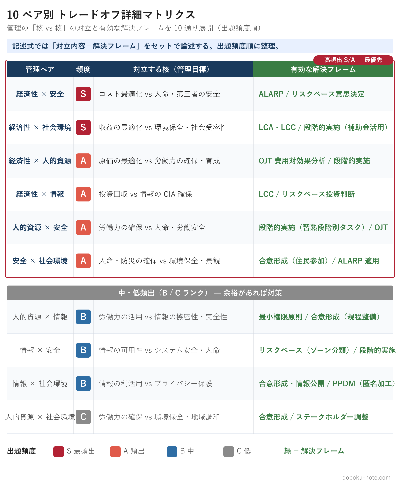
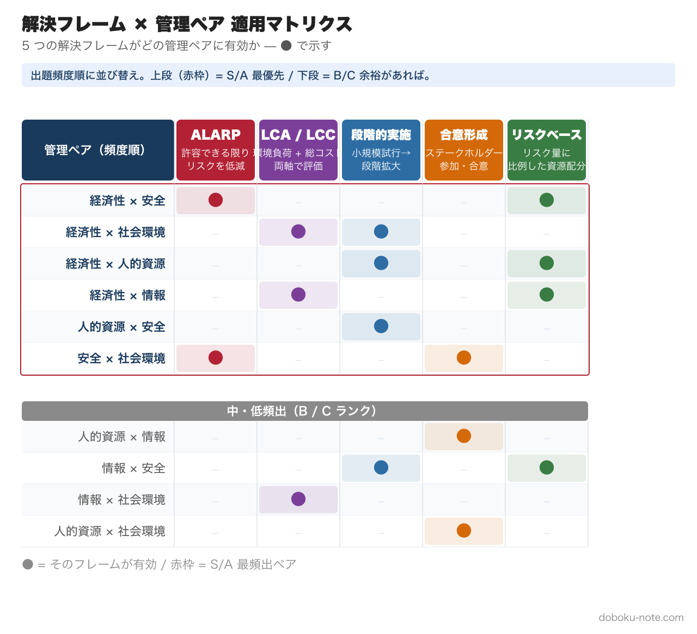

# 総監の合否を分ける「トレードオフ思考」理論編｜5管理×10組み合わせのマトリクスで対立構造を理解する

**この記事でわかること**

- トレードオフとは何か --- 5つの管理間の対立構造を正しく理解する
- 5管理間トレードオフマトリクスの全体像（10通りの組み合わせ）
- 日常業務と記述式答案でトレードオフ思考を使いこなす方法

---

総監試験の合否を分ける最大のポイントは「トレードオフ思考」だと言い切ってよいでしょう。択一式でも記述式でも口頭試験でも、5つの管理間で発生するトレードオフをどう認識し、どう調整するかが繰り返し問われます。

しかし、一般部門の合格者であっても「トレードオフ」という概念を正確に理解していないまま総監に挑む受験者は少なくありません。本記事では、トレードオフの基本から実践的な活用法まで、受験対策として必要な内容を体系的に整理していきます。

## 1. トレードオフとは何か

### 1.1 定義: 5つの管理間の対立構造

トレードオフとは、一方を改善しようとすると他方が悪化する関係のことです。総監の文脈では、**5つの管理（[経済性管理](https://doboku-note.com/docs/pe-comprehensive-management-economic-management-pillar?utm_source=note&utm_medium=referral&utm_campaign=99-tradeoff-thinking)・[人的資源管理](https://doboku-note.com/docs/pe-comprehensive-management-human-resource-management-pillar?utm_source=note&utm_medium=referral&utm_campaign=99-tradeoff-thinking)・[情報管理](https://doboku-note.com/docs/pe-comprehensive-management-information-management-pillar?utm_source=note&utm_medium=referral&utm_campaign=99-tradeoff-thinking)・[安全管理](https://doboku-note.com/docs/pe-comprehensive-management-safety-management-pillar?utm_source=note&utm_medium=referral&utm_campaign=99-tradeoff-thinking)・[社会環境管理](https://doboku-note.com/docs/pe-comprehensive-management-social-environment-management-pillar?utm_source=note&utm_medium=referral&utm_campaign=99-tradeoff-thinking)）の間で生じる対立構造**を指します。

たとえば、土木工事で安全設備を充実させれば（安全管理の向上）、そのぶんコストが増加し工期が延びます（経済性管理の悪化）。これが最も典型的なトレードオフです。

ここで注意すべき点があります。**総監が求めるトレードオフは、主に異なる管理間の対立**です。たとえば「品質を上げると工程が遅れる」は、どちらも経済性管理の範囲内（QCD のトレードオフ）であり、総監として問いたい横断的な対立ではありません。

正確には、青本でも QCD（品質・コスト・工程）や CIA（機密性・完全性・可用性）など **同一管理内の三すくみ** が概念としては存在します。ただし記述式・択一式で頻繁に問われるのは、そうした管理内の局所的な対立ではなく、**5 管理の垣根を越える対立** です。本記事も以降、この「異なる管理間トレードオフ」を中心に扱います。

### 1.2 なぜトレードオフが総監の本質なのか

一般部門の技術士は、専門技術を深く掘り下げて最適な解決策を提示する能力が求められます。それに対して総監技術士は、業務全体を俯瞰し、複数の管理分野にまたがる要求事項を総合的に判断・調整する能力が求められます。

この「総合的な判断・調整」こそがトレードオフの処理にほかなりません。5 つの管理すべてを 100% 満たすことは現実には不可能であり、限られた資源の中でどの管理を優先し、どこで妥協するかを判断する --- それが総監技術士の仕事です。

本記事（理論編）では、トレードオフを **(1) 具体例 3 選で実感 → (2) 5 管理 × 10 組み合わせのマトリクスで俯瞰 → (3) 第三の管理で解決する 4 段フレーム** の順に体系化します。答案サンプル 2 本と 3 週間集中ドリルは、続編の**[実践編](https://note.com/dobokunote)**で扱います。

## 2. トレードオフの具体例 3 選

抽象的な理解だけでは試験に対応できません。実務で発生する具体的なトレードオフを3つ示します。

### 例1: 土木工事の安全設備（経済性管理 vs 安全管理）

建設現場における安全設備の設置は、安全管理の根幹です。しかし、安全設備の充実はそのままコスト増と工期延長につながります。経済性管理はコスト抑制と工期厳守を要求する一方、安全管理は安全設備の万全な整備を要求し、両者の対立の本質は安全性の確保がそのまま経済的負担として跳ね返る点にあります。

この対立は、あらゆる建設プロジェクトで日常的に発生します。総監技術士として重要なのは、この対立を「仕方のないもの」として受け流すのではなく、明確に認識した上で判断の根拠を示すことです。

### 例2: ベテラン活用と情報漏洩リスク（人的資源管理 vs 情報管理）

経験豊富なベテラン技術者に重要な業務を任せたい。しかし、[アクセス権限](https://doboku-note.com/docs/pe-comprehensive-management-access-control?utm_source=note&utm_medium=referral&utm_campaign=99-tradeoff-thinking)を広く付与すればするほど、[情報漏洩](https://doboku-note.com/docs/pe-comprehensive-management-data-leak-tampering-loss?utm_source=note&utm_medium=referral&utm_campaign=99-tradeoff-thinking)のリスクが高まります。人的資源管理はベテランの知識・経験を最大限に活用したいと要求する一方、情報管理は情報セキュリティを確保し漏洩リスクを最小化したいと要求するため、人材活用と情報管理の厳格化が真っ向から相反します。

近年のDX推進やテレワーク普及に伴い、この種のトレードオフは増加傾向にあります。択一式でも出題されやすいテーマです。実例として [令和4年度 記述式（DX）](https://doboku-note.com/docs/pe-comprehensive-management-r04-secondary?utm_source=note&utm_medium=referral&utm_campaign=99-tradeoff-thinking)・[令和3年度 記述式（データ利活用）](https://doboku-note.com/docs/pe-comprehensive-management-r03-secondary?utm_source=note&utm_medium=referral&utm_campaign=99-tradeoff-thinking) は、この対立構造を直球で問うた典型例です。

### 例3: エネルギーの安定供給と環境負荷（経済性管理 vs 社会環境管理）

社会インフラの維持にはエネルギーの安定供給が不可欠ですが、化石燃料への依存は環境負荷を増大させます。経済性管理はエネルギーの安定かつ経済的な供給を要求する一方、社会環境管理は環境負荷の低減と[脱炭素](https://doboku-note.com/docs/pe-comprehensive-management-carbon-neutral?utm_source=note&utm_medium=referral&utm_campaign=99-tradeoff-thinking)を要求し、両者の対立の本質は短期的な経済合理性と長期的な環境保全のあいだに横たわります。

このトレードオフは社会全体のスケールで議論されるものですが、総監の記述式では個別のプロジェクトレベルに落とし込んで論じることが求められます。[令和6年度 記述式（カーボンニュートラル）](https://doboku-note.com/docs/pe-comprehensive-management-r06-secondary?utm_source=note&utm_medium=referral&utm_campaign=99-tradeoff-thinking)・[令和7年度 記述式（少子高齢化）](https://doboku-note.com/docs/pe-comprehensive-management-r07-secondary?utm_source=note&utm_medium=referral&utm_campaign=99-tradeoff-thinking) はこの対立構造を真正面から問う典型例です。

## 3. 5 管理間トレードオフマトリクス

### 3.1 出題頻度マトリクス（全体像）

5 つの管理のあらゆる組み合わせ --- 全 10 通り --- でトレードオフが発生しえます。下図は、過去 10 年（H27〜R6）の記述式・択一複合問題における各ペアの **出題頻度** をヒートマップで示したものです（**S = 最頻出 / A = 頻出 / B = 中 / C = 低**）。

経済性管理を片側に含むペア 4 本（経済性 × 人的資源・情報・安全・社会環境）がすべて S または A で、これだけで全出題の約 6〜7 割を占めます。次いで安全 × 社会環境（防災 × 景観）と人的資源 × 安全（労働安全）が頻出。記述式対策では左上から右下に向けて優先度を下げて学習配分すれば効率的です。

### 3.2 ペア別 詳細マトリクス（典型対立 + 解決フレーム）

出題頻度だけでなく、**各ペアで何が対立しているのか・どう解決するのか**まで把握することが記述式攻略の鍵です。下図に 10 通りすべての「典型対立構造」と「有効な解決フレーム」を展開しました。

このマトリクスを「暗記する」必要はありません。重要なのは、**自分の業務経験の中にこの10通りのどれが当てはまるかを考えられるようになること**です。記述式では、与えられた事例に対してこのマトリクスのどの部分が問われているかを素早く判断し、論述に組み込むことが求められます。

このマトリクスの詳細な解説や過去問出題パターンは、[doboku-note の 5 管理間トレードオフ解説ページ](https://doboku-note.com/docs/pe-comprehensive-management-management-tradeoffs?utm_source=note&utm_medium=referral&utm_campaign=99-tradeoff-thinking)で確認できます。doboku-note では 17 年分の択一式・記述式データをもとに各ペアの頻出パターンを整理しています。直近では [令和5年度（SWOT・組織戦略）](https://doboku-note.com/docs/pe-comprehensive-management-r05-secondary?utm_source=note&utm_medium=referral&utm_campaign=99-tradeoff-thinking)・[令和2年度（異常気象 BCP）](https://doboku-note.com/docs/pe-comprehensive-management-r02-secondary?utm_source=note&utm_medium=referral&utm_campaign=99-tradeoff-thinking)・[令和元年度（ヒューマンエラー）](https://doboku-note.com/docs/pe-comprehensive-management-r01-secondary?utm_source=note&utm_medium=referral&utm_campaign=99-tradeoff-thinking) などで本マトリクスのパターンが顕著に問われています。

### 3.3 10 ペア × 第三の管理 完全マッピング

記述式で最も評価されるのは「対立する 2 管理を解決するために **第三の管理を持ち込む** 構造」です。10 ペアそれぞれで、最も有効な第三の管理と具体施策キーワードを以下に整理しました。

**S/A ランク（最頻出 + 頻出）**

- 経済性 × 安全（**S**）— 第三：**情報管理** / 施策キーワード: AI による事故予兆検知 / IoT モニタリング / 過去災害データのシミュレーション
- 経済性 × 社会環境（**S**）— 第三：**人的資源管理** / 施策: 環境教育 / グリーンスキル研修 / ESG 視点での意思決定権限委譲
- 経済性 × 人的資源（**A**）— 第三：**情報管理** / 施策: OJT 効果測定 KPI 可視化 / 教育 ROI 分析 / スキルマップのデータベース化
- 経済性 × 情報（**A**）— 第三：**安全管理** / 施策: ALARP に基づくセキュリティ投資 / リスクベース投資判断 / 損害コスト評価
- 人的資源 × 安全（**A**）— 第三：**経済性管理** / 施策: 安全装備の費用便益分析 / 教育コストの定量評価 / 労災保険コスト最適化
- 安全 × 社会環境（**A**）— 第三：**人的資源管理** / 施策: 防災教育 / 住民参加型ワークショップ / ステークホルダー対話の組織化

**B/C ランク（中・低頻出）**

- 人的資源 × 情報（**B**）— 第三：**安全管理** / 施策: アクセス権限の段階化 / セキュリティ教育 / 心理的安全性の確保
- 情報 × 安全（**B**）— 第三：**経済性管理** / 施策: サイバー保険 / セキュリティ投資 ROI / 損害賠償リスクの定量化
- 情報 × 社会環境（**B**）— 第三：**経済性管理** / 施策: データ収集コストの最適化 / 環境モニタリング投資の段階化 / 規制対応費の予算配分
- 人的資源 × 社会環境（**C**）— 第三：**経済性管理** / 施策: グリーン雇用 / CSR 投資の費用便益 / ESG 評価による採用差別化

**覚え方のコツ**: S/A ランクの 6 ペアでは、**第三の管理に「情報」「人的資源」「経済性」が頻出**します。記述式本番で詰まったら、まずこの 3 つから当てはまるものを探すと突破口が見えます。安全管理と社会環境管理を「第三」に置くのは、対立軸が安全 / 環境系のペア（人的資源 × 安全、人的資源 × 情報、情報 × 安全）に限られます。

## 4. トレードオフ改善の考え方 --- 第三の管理で解決する

トレードオフを認識した次のステップは、それをどう「改善」するかです。ここで総監特有の発想が求められます。

### 4.1 二者間の調整ではなく、第三の視点を持ち込む

一般的なトレードオフの処理は「どちらかを優先し、もう一方を妥協する」というものです。しかし総監では、**対立する2つの管理とは別の管理の視点を持ち込むことで、対立そのものを緩和する**アプローチが評価されます。

たとえば、経済性管理と安全管理のトレードオフを考えてみましょう。「コストを優先して安全対策を削減する」でも「安全を優先してコスト超過を受け入れる」でもなく、**情報管理を活用**して現場調査を行い、費用対効果の高い安全機器を特定する --- というのが総監的な解決策です。

このように、ある管理間の対立を第三の管理の視点から解決する発想は、記述式で最も高く評価されるパターンです。

### 4.2 解決フレームの種類と使い分け

「第三の管理を持ち込む」といっても、具体的にどう持ち込むかが問われます。本節で扱うのは、青本・キーワード集に見出し語として収録され、答案で **名指しすれば加点される試験必修の汎用コアフレーム 5 つ** です。各フレームについて **適用条件・答案で使う典型フレーズ・減点される NG パターン** を併記します。

なお、土木・建設・国土交通分野には「暗黙知の形式知化（SECI）」「外部不経済の内部化」「群マネ／ポートフォリオ管理」「資産の変動費化（CapEx → OpEx）」「新技術による能力補完」など、業界特化の解決フレームが他にも存在します。これらは別記事『（仮）国土交通分野で効く解決フレーム集』で深掘りする予定です（本記事はコア 5 つに絞って試験対策上の要点を凝縮します）。

#### ① [ALARP](https://doboku-note.com/docs/pe-comprehensive-management-alarp-principle?utm_source=note&utm_medium=referral&utm_campaign=99-tradeoff-thinking)（As Low As Reasonably Practicable）

リスクを「合理的に実行可能な限り」低減する考え方。許容不可領域・ALARP 領域・広義許容領域の 3 段階で整理する。

- **適用条件**: 安全管理と経済性管理の対立。リスクをゼロにできない・許容不能でもない「中間領域」がある場合
- **答案フレーズ例**: 「本事業のリスクは ALARP 領域にあり、追加対策の限界費用と便益を比較した上で、費用対効果が見合う範囲まで低減を図る」
- **NG パターン**: 「ALARP の原則に従い対策する」だけで終わる。**3 領域のどこにあるか・なぜそう判断したか** を述べないと評価されない

#### ② LCA / LCC（[ライフサイクル評価](https://doboku-note.com/docs/pe-comprehensive-management-lifecycle-management?utm_source=note&utm_medium=referral&utm_campaign=99-tradeoff-thinking)）

LCA（Life Cycle Assessment、環境負荷の一体評価）と LCC（Life Cycle Cost、総コスト評価）を組み合わせる。**両者を混同しないことが採点上きわめて重要**（LCA = 環境、LCC = コスト）。

- **適用条件**: 経済性管理と社会環境管理の対立。短期コストと長期環境負荷が競合する場合
- **答案フレーズ例**: 「LCC で総保有コストを比較しつつ、LCA で CO2 排出と廃棄影響を定量評価し、両軸で最適解を選定する」
- **NG パターン**: 「LCA でライフサイクルコストを評価する」と書くと **概念混同で減点必至**

#### ③ 段階的実施（Phased Approach）

小規模試行 → 効果検証 → 段階拡大、のサイクルでリスクとコストを抑える。

- **適用条件**: 経済性管理と人的資源管理・情報管理の対立。新技術導入・大規模変革の意思決定で不確実性が高い場合
- **答案フレーズ例**: 「Phase 1 で限定部署にパイロット導入し、KPI（生産性／インシデント率）を 3 ヶ月測定。閾値達成を確認後、Phase 2 で全社展開する」
- **NG パターン**: 「徐々に進める」「様子を見ながら」だけ。**フェーズ区切りの判定基準** を書かないと一般論扱い

#### ④ [合意形成](https://doboku-note.com/docs/pe-comprehensive-management-consensus-instruments?utm_source=note&utm_medium=referral&utm_campaign=99-tradeoff-thinking)（Consensus Building）

ステークホルダーを早期に巻き込み、納得感のもとで意思決定する。説明責任と透明性が鍵。

- **適用条件**: 人的資源管理・社会環境管理との対立。利害関係者が複数（住民・労組・取引先・行政）で対立しやすい場合
- **答案フレーズ例**: 「住民説明会・労使協議会・パブリックコメントの 3 段階で意見を聴取し、影響評価結果と対策案を併せて公表する」
- **NG パターン**: 「ステークホルダーと話し合う」だけ。**手段（説明会・協議会・調査）と段階** を具体化する必要あり

#### ⑤ リスクベース意思決定（Risk-Based Decision Making）

リスク量（発生確率 × 影響度）に比例した資源配分を行う。最頻出の万能フレームで、ALARP・LCC とも組み合わせやすい。

- **適用条件**: 経済性管理と安全管理・情報管理・社会環境管理の対立すべて。資源制約下での優先順位付けが必要な場合
- **答案フレーズ例**: 「リスクマトリクス（発生頻度 × 影響度）で重大リスクを 3 件抽出し、対策投資額を 7:2:1 の比率で配分する」
- **NG パターン**: 「重要なリスクから対策する」だけ。**リスク評価の手法（マトリクス・PRA・FMEA）と配分根拠** を示さないと採点者には届かない

下図は、この 5 つのフレームが 10 の管理ペアに対してどう適用できるかをまとめたものです。

5 つの解決フレームの詳細な使い方や実際の記述例は、[doboku-note の記述式戦略ページ](https://doboku-note.com/docs/pe-comprehensive-management-essay-exam-strategy?utm_source=note&utm_medium=referral&utm_campaign=99-tradeoff-thinking)にまとめています。答案の骨格として活用してください。

### 4.3 改善のステップ

トレードオフ改善の思考プロセスは、次のステップで整理できます。

1. **対立する2つの管理を明確にする** --- 「何と何が対立しているのか」を言語化する
2. **対立の原因を分析する** --- なぜ対立が生じているのか、制約条件は何か
3. **評価軸を設定する** --- どの軸で全体最適を判断するかを宣言する（B/C 比、LCC、定量／長期、ステークホルダー満足度 等）
4. **第三の管理を検討する** --- 残り3つの管理のうち、この対立を緩和できる視点はないか
5. **具体的な対策を提示する** --- 解決フレーム（ALARP / LCA / 段階的実施 等）を名指しして適用方法を示す
6. **[残留リスク](https://doboku-note.com/docs/pe-comprehensive-management-residual-risk?utm_source=note&utm_medium=referral&utm_campaign=99-tradeoff-thinking)を評価する** --- 改善策を講じてもなお残るリスクを認識し、監視体制と見直しトリガー（年次レビュー・KPI 閾値超過時の再評価 等）を示す

このステップは、記述式の答案構成にそのまま使えます。

---

理論編はここで終わりです。答案サンプル 2 本（R02 異常気象 BCP / R06 カーボンニュートラル）と 3 週間集中ドリルは、続編の**[実践編（note リンク）](https://note.com/dobokunote)**で扱います。

---

## 関連リソース

**doboku-note — 17 年分の過去問 + 650 キーワード解説（無料）**
https://doboku-note.com/category/pe-comprehensive-management?utm_source=note&utm_medium=referral&utm_campaign=99-tradeoff-thinking

- 17 年分の択一式過去問（全問解答解説付き）
- 650 以上のキーワード解説ページ
- 5 管理間トレードオフの解決フレーム（[詳細記事](https://doboku-note.com/docs/pe-comprehensive-management-management-tradeoffs?utm_source=note&utm_medium=referral&utm_campaign=99-tradeoff-thinking)）
- スマホ対応（通勤中の学習に最適）

**マガジン購入で割引（総監記述式 完全対策セット）**
- 本書 ¥1,200 + 実践編 + 総監択一式 頻出計算問題 5 パターン完全攻略 ¥980 + 総監記述式 論文骨子テンプレート（A-1）¥1,980 = 単品合計 ¥4,160
- セット価格 **¥3,480**（16% OFF）
