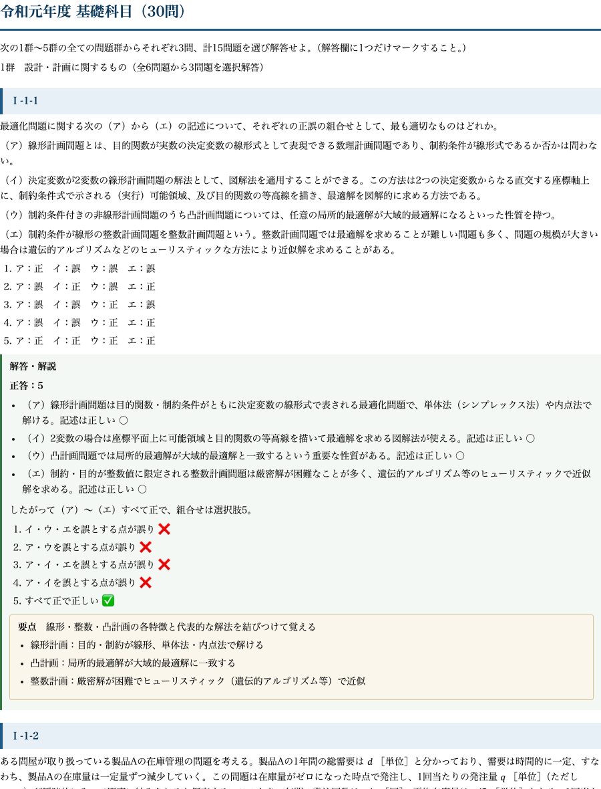

# 技術士 第一次試験｜過去問PDF 合本（基礎・適性・専門 令和元〜7年度 全560問・全選択肢解説）

**こんな人のための記事です**

- 技術士 第一次試験（建設部門）を、過去問を軸に短期で突破したい
- 基礎科目・適性科目・専門科目を一冊で通しで回したい
- 市販の解説は結論だけで、なぜその選択肢が正しい/誤りなのかの根拠が薄いと感じる

技術士 第一次試験は、基礎科目・適性科目・専門科目のいずれも、**過去問と同じ論点・同じ問われ方が繰り返し出題される**試験です。合格の近道は、過去問を「全選択肢について根拠から説明できる」状態に仕上げることに尽きます。

この教材は、**令和元年度から令和7年度までの7年分**について、基礎科目210問・適性科目105問・専門科目（建設部門）245問の**合計560問を1問残らず収録**し、各選択肢に正誤の理由を付けたA4印刷用PDFです。3科目を横断して一冊で回せるよう再編集しています。

## 収録内容

- **基礎科目 210問**（設計・情報・解析・材料化学・環境の5群を7年分）
- **適性科目 105問**（技術士法・技術者倫理を7年分）
- **専門科目・建設部門 245問**（土質・構造・河川・道路・施工など建設11分野を7年分）
- **全問・全選択肢に正誤の理由を明記**（穴埋め・組合せ・計算のいずれも根拠つき）
- 計算問題は途中式つき、組合せ問題は表で整理
- A4・通しページ番号つきの印刷用PDF、出典・著作権・免責を明記

## 中身サンプル

実際の紙面はこの品質です（基礎科目の冒頭）。

たとえば穴埋め問題は、次のように「なぜその組合せか」まで解説します。

> **Ⅰ-1-1　構造物の設計に関する記述の空欄に入る語句の組合せとして、最も適切なものはどれか。**（性能設計の流れ：ア→イ→ウ→エ）
>
> 1. ア：合理的／イ：使用性能／ウ：施工計画／エ：詳細設計
> 3. ア：合理的／イ：要求性能／ウ：構造計画／エ：構造詳細
> 5. ア：合理的／イ：要求性能／ウ：構造計画／エ：詳細設計

**正答：3**

性能設計は「より合理的な構造体を目指し（ア）、用途・機能を果たす要求性能を設定し（イ）、それを満たす構造計画を行い（ウ）、その後に構造詳細を設定して（エ）、設計耐用期間を通じて要求性能の充足を照査する」という流れです。3だけがア〜エすべて整合します。5はエだけが「詳細設計」で誤りです。

このように、正答番号ではなく「5が違うのはエが構造詳細だから」まで言えるようにするのが、本番で崩れない解き方です。全560問がこの粒度で解説されています。

## PDF のダウンロードと使い方

ここから先で、全560問・全選択肢解説のA4印刷用PDF（この記事の末尾に添付）をダウンロードできます。以下は、3科目を効率よく仕上げる回し方です。

**専門科目から先に固める**

配点比重と対策効率から、まず専門科目（建設部門）を1周します。建設分野の実務・学習経験がある人ほど得点源になりやすく、ここで合格ラインの土台をつくります。誤り肢の理由まで読むことで、1問から複数分野の知識が入ります。

**基礎科目は5群を均等に回す**

基礎科目は設計・情報・解析・材料化学・環境の5群から各3問選択の形式です。捨て群をつくらず、各群の頻出論点を過去問で押さえます。計算問題は途中式を追い、解法パターンを手に覚えさせます。

**適性科目は直前に集中**

適性科目は技術士法と技術者倫理が中心で、過去問の反復が最も効きます。直前期に7年分を通しで回し、条文の趣旨と典型的なひっかけ（守秘義務・信用失墜行為・公益確保など）を頭に入れれば得点が安定します。

3科目とも「新しい問題集を足す」より、この560問を全肢説明できる状態にするほうが、合格に直結します。

## 出典・免責

本教材は、公益社団法人 日本技術士会が実施する技術士第一次試験の過去問題を出典としています。問題文の著作権は出典元に帰属します。解答・解説および科目別・複数年度の編集・再構成は著者（doboku-note）によるものです。

本教材は正確を期して作成していますが、内容を保証するものではありません。法令・基準は改正されることがあるため、受験にあたっては必ず最新の一次情報をご確認ください。
