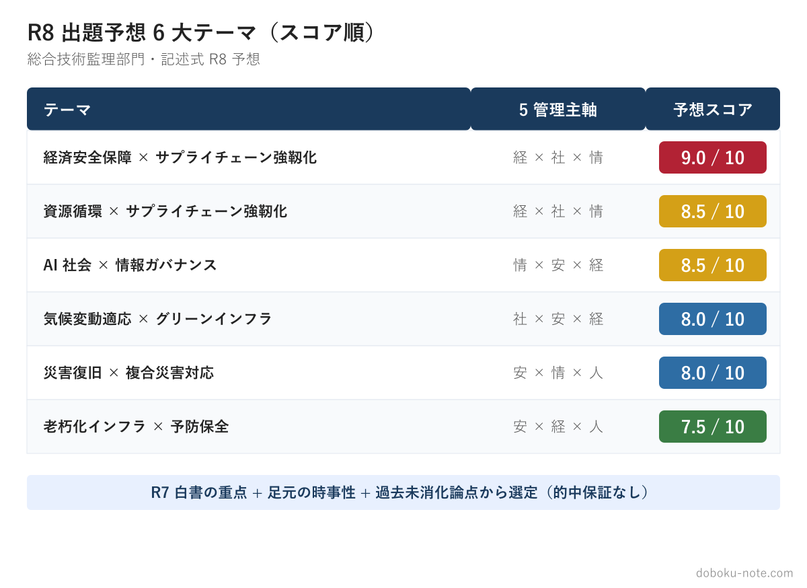
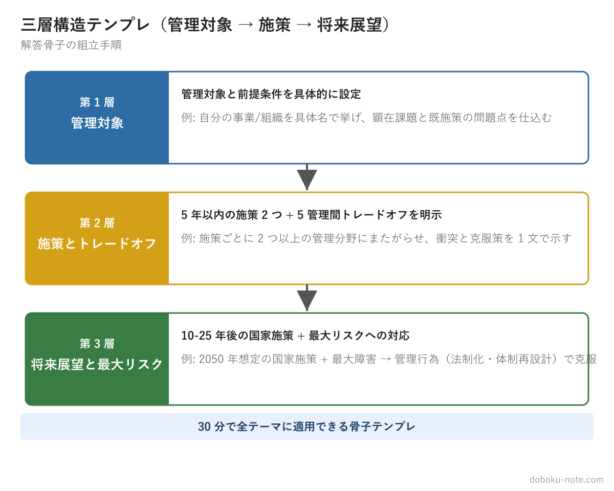
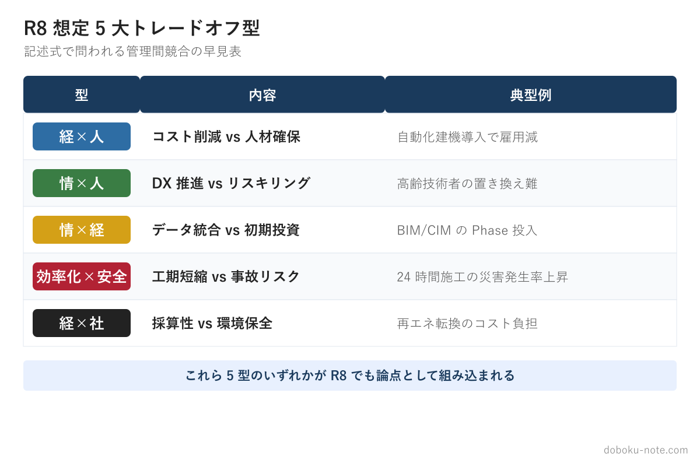

# 令和8年度 総監記述式 R8予想問題｜出題予想6大テーマと三層構造で書き切る解答型

**こんな人のための記事です**

- 技術士総合技術監理部門 令和8年度（2026年7月）記述式試験を受験する
- 試験 1〜2 ヶ月前で「予想問題で実戦演習したい」と考えている
- 過去問は一通り解いたが「論点の組み立て方」に自信が持てない
- 自分の専門外のテーマが出ても書ける応用力をつけたい

**この記事でわかること**

- R8 で出題が予想されるホットテーマ 6 つと、その選定理由（R7 白書の重点・足元の時事性・過去に問われていない論点）
- どんなテーマでも 30 分で骨子が立つ「専門分野不問の三層構造テンプレ」
- ほぼ全ての設問で使える「5 大トレードオフ型パターン」
- 試験当日の活用フローと、2 ヶ月前からの逆算学習スケジュール

---

技術士総監記述式試験のテーマには、その年の社会的関心や政策の重点が反映される傾向があります。

本記事は、令和 7 年版の各白書が重点化したテーマ・足元の時事性・過去 5 年の記述式で問われていない論点を手がかりに、**令和 8 年度**（2026 年 7 月）**試験で出題が考えられるホットテーマ 6 つ**と、テーマが外れても通用する「三層構造の解答型」を無料で解説します。

各テーマの予想問題本文（公式試験形式）・出題予想根拠・三層構造解答骨子・自治体 道路担当ペルソナの 3,000 字級フル模範論文・採点者視点のチェックポイントは、有料マガジン **「令和 8 年度 総監記述式 R8 予想問題集」** に収録しています（末尾の各テーマ記事リンクを参照）。

> **本記事と予想問題集の方針**: 提供するのは「予想テーマの問題文」「三層構造の解答骨子」「フル模範論文」「専門分野不問の三層構造テンプレ」です。「R8 で必ず出る」という断定的予想ではありません（あくまで確率的）。予想は的中保証ではありませんが、**「型」を持っておけば、テーマが外れても応用可能**です。

---

<!-- cta:pack-top -->
> 本番直前の総仕上げは、出題予想6テーマ×三層骨子で「何が出ても書ける型」を最短装填できるR8予想問題集が決め手。書き方の型から固めるなら、型・設問(3)の弾薬・R8演習を1セットにした記述式コアパックが入口に最適です。

https://note.com/dobokunote/m/m6854c7437d4d

https://note.com/dobokunote/m/m6e7de5e4ea3d


## R8 で何が出るのか — 予想の根拠と 6 大テーマ

総監記述式の必須科目は、その年の社会・政策の重点課題を題材に出題されてきました（直近では R05 SWOT・組織戦略、R06 カーボンニュートラル、R07 少子高齢化）。

本記事の予想は、(1) 令和 7 年版の各白書が重点化したテーマ、(2) 足元の時事性、(3) 過去 5 年（R03-R07）の記述式で主題化されていない論点、の 3 点を手がかりに 6 テーマを選定したものです。白書テーマが翌年そのまま出題されるという機械的な相関を主張するものではありません。

### R7 白書（2025 年 6 月公表）の重点テーマ

R7 白書・通商白書 R7・経済安保政策の動向では、以下が新たに重点化されました。

- **資源循環**（サーキュラーエコノミー）: 建設廃棄物・資材高騰・サプライチェーン課題
- **気候変動適応**（流域治水深化）: 線状降水帯・グリーンインフラ・Eco-DRR
- **経済安全保障**: 重要物資の調達多角化・技術主権・経済安保推進法の運用
- **i-Construction 2.0 進化**: 自動化・省人化・生成 AI・PLATEAU 拡張
- **インフラメンテナンス**: 地域インフラ群マネジメント・ウォーター PPP
- **防災・減災**: 能登半島地震の教訓・複合災害・受援体制



### R8 予想 6 大テーマ

R7 白書の重点 + 通商白書・経済安保政策の動向を踏まえた予想です。出題予想スコアは筆者の主観的な見立てで、的中を保証するものではありません。各テーマのフル模範論文は、有料マガジンの対応する記事に収録しています。

- **経済安全保障 × サプライチェーン強靱化**（5 管理主軸: 経 × 社 × 情／出題予想スコア **9.0/10**）
- **資源循環 × サプライチェーン強靭化**（経 × 社 × 情／**8.5/10**）
- **AI 社会 × 情報ガバナンス**（情 × 安 × 経／**8.5/10**）
- **気候変動適応 × グリーンインフラ**（社 × 安 × 経／**8.0/10**）
- **災害復旧 × 複合災害対応**（安 × 情 × 人／**8.0/10**）
- **老朽化インフラ × 予防保全**（安 × 経 × 人／**7.5/10**）

R7（少子高齢化）で扱ったテーマが R8 で **完全に同じ形式で再出題される可能性は低い**一方、地政学リスクの恒常化を背景に経済安全保障が最有力テーマへ浮上しています。少子高齢化・カーボンニュートラル（R06）・担い手不足は直近年度との重複度が高いため、上記 6 テーマに絞りました。

---

## 専門分野不問の三層構造テンプレ — 30 分で骨子が立つ型

### なぜ「三層構造」が万能か

総監記述式の出題形式は、ほぼ全年度で以下の構造に固定されています。

- 設問 (1) 事業/組織の現状と課題 — 管理対象設定 + 顕在課題 + 既施策の問題点 → **Ⅰ 管理対象と前提条件**
- 設問 (2) 5 年以内の施策 2 つ + トレードオフ — 施策の組合せ + 5 管理間衝突 + 克服策 → **Ⅱ 施策とトレードオフ**
- 設問 (3) 将来（10-25 年）の施策 + 最大リスク — 国レベル視点 + 重大障害 + 管理行為での克服 → **Ⅲ 将来展望と最大リスク**

どんなテーマでもこの三層に当てはめれば 30 分で骨子が立ちます。

### 三層構造の詳細設計

**Ⅰ 管理対象と前提条件**（設問 1） — 役割は、後段の課題と施策が成立するための制約条件を意図的に仕込むことです。

事業/組織の名称・目的・成果物を事実ベースで具体的に書き、経営資源・業務プロセスを示したうえで、後段で扱うトレードオフの種となる**顕在課題**（人手不足・予算制約・技術偏在・データ分散など）を仕込みます。既施策はその**問題点**を明示し、設問 2 への伏線とします。

「我が国の建設業」のような抽象的な対象設定は避け、「私が担当する○○工事」「○○市道路部」のように具体的な組織・事業に絞ります。

**Ⅱ 施策とトレードオフ**（設問 2） — 役割は、5 管理間の衝突を明示し、監理者の視点で調整することです。

5 年以内に導入可能な施策を 2 つ挙げ、各施策が 2 つ以上の管理分野にまたがるようにし、**異なる管理分野間のトレードオフ**（経 × 人 / 情 × 安 など）を必ず記述します。克服策は「両立する」と書くだけでなく、具体的なマネジメント手法で示します。

「DX 化・予防保全・LCC 最適化」のように良いことだけを羅列し、何かを犠牲にする構造がない論文は、トレードオフ不在と判定されて低評価になります。

**Ⅲ 将来展望と最大リスク**（設問 3） — 役割は、事業や組織の枠を超え、国レベルの視点で持続可能性を論じることです。

10-25 年後（2050 年想定）に有効な施策 2 つを、技術革新・経済情勢・社会構造の変化を踏まえて挙げ、**最も重大な障害**（構造的な制約条件）と、その克服策を示します。克服策は新技術の導入だけでは不十分で、**「管理行為」**で書きます。

管理行為の例は、評価制度の変更（最低価格落札方式 → 総合評価方式）、ルールの法制化（環境配慮型調達基準・データ標準化）、体制の再設計（広域インフラ管理組織）、情報管理（デジタルツインでの可視化・トレーサビリティ）です。



### 抽象化された 5 大トレードオフ型パターン

専門分野不問で、ほぼ全ての設問で使える 5 つのトレードオフ型です。



**型 1: 経済性 × 人的資源** — 人材確保・賃金改善（人）と コスト増大（経）の衝突。少子高齢化・働き方改革・外国人材で典型的。克服策は LCC 試算で長期効果を可視化、段階的処遇改善、ICT による省人化。

**型 2: 情報 × 人的資源** — ナレッジ管理・DX（情）と 業務負荷増・スキル習得時間（人）の衝突。知識管理・i-Construction・暗黙知の形式知化で典型的。克服策は RPA で記録作業を半自動化、教育を業務評価項目に組み込む。

**型 3: 情報 × 経済性** — AI/IoT 導入（情）と 初期投資・維持管理費（経）の衝突。デジタルツイン・予防保全システム・データ基盤で典型的。克服策は共同利用でコスト分担、段階的 PoC で投資回収率を実証。

**型 4: 効率化 × 安全・品質** — 省人化・自動化（情/経）と 監視低下による事故・品質低下（安/品）の衝突。遠隔臨場・無人化施工・サプライチェーン短縮で典型的。克服策は重要工程の記録ルール厳格化、ALARP 原則で許容範囲を設定。

**型 5: 経済性 × 社会環境** — コスト最適化（経）と 環境負荷・住民影響（社）の衝突。脱炭素・循環経済・住民合意形成で典型的。克服策は外部不経済の内部化（カーボンプライシング）、合意形成プロセスの制度化。

### 試験当日 30 分での骨子組み立てフロー

```
[5 分] 問題確認
  └ 設問 (1) のテーマを特定 → 6 大予想テーマと照合 → 該当なしでもテンプレで対応可
[10 分] 管理対象設定（Ⅰ）
  └ 自分のペルソナを思い出す → 具体的な組織/事業名を設定 → 顕在課題を 1 つに絞る
[10 分] 施策とトレードオフ（Ⅱ）
  └ 5 大トレードオフ型から 2 つを選ぶ → 各施策に克服策を 1 文で添える
[5 分] 将来展望（Ⅲ）
  └ 国レベルの施策 1-2 個 → 最大リスクを「管理行為」で解決
```

残り 165 分で 3,000 字（600 字 × 5 枚、33 分/枚）を執筆します。

---

## 試験当日の活用法と逆算スケジュール

### 試験当日の活用フロー

```
[試験開始]
[5 分] 問題文を 2 回読み、テーマを特定
[3 分] 本記事の 6 大予想テーマと照合
  ├ 一致 → 該当テーマの骨子例を頭に展開
  └ 不一致 → 三層構造テンプレに当てはめ
[10 分] 管理対象設定（Ⅰ）の骨子
[10 分] 施策とトレードオフ（Ⅱ）の骨子 ← 5 大トレードオフ型から 2 つ選定
[2 分] 将来展望（Ⅲ）の骨子 ← 「管理行為で解決」を意識
[165 分] 答案執筆（600 字 × 5 枚、33 分/枚）
[15 分] 見直し（数値・固有名詞・トレードオフ明示の確認）
```

### 試験 2 ヶ月前からの逆算スケジュール

- **60 日前**（2 ヶ月）: 本記事の通読 + 過去問演習開始 — 予想根拠と三層構造テンプレを深く読み込む
- **45 日前**（1.5 ヶ月）: 予想テーマの骨子を自分で書く練習 — 有料マガジンの各テーマ記事を 1 つずつ写経
- **30 日前**（1 ヶ月）: 自分の業務に近い過去問模範論文を反復 — 過去問マガジン（ゼネコン／河川コンサル／自治体道路担当）から 1 ペルソナを選ぶ
- **14 日前**（2 週間）: 答案執筆の時間配分演習 — 「30 分骨子組立フロー」を 5 回反復
- **7 日前**（1 週間）: 弱点トレードオフ型の補強 — 「5 大トレードオフ型」を完璧化
- **試験前日**: 三層構造テンプレのみ通読 — 三層構造を体に染み込ませる

### あわせて使いたい doboku-note の無料コンテンツ

- [総合技術監理 キーワード集 2026](https://doboku-note.com/docs/pe-comprehensive-management-keyword-2026)
- [記述式試験の解答戦略（三層構造の元解説）](https://doboku-note.com/docs/pe-comprehensive-management-essay-exam-strategy)
- [5 管理トレードオフ 頻出パターンと解決フレーム](https://doboku-note.com/docs/pe-comprehensive-management-management-tradeoffs)
- [R8 出題候補テーマ俯瞰](https://doboku-note.com/docs/pe-comprehensive-management-r8-essay-keyword-forecast)

---

## 各テーマのフル模範論文 — 有料マガジン「R8 予想問題集」

上記 6 テーマそれぞれについて、**予想問題本文**（公式試験形式）**・出題予想根拠・三層構造の解答骨子・自治体 道路担当ペルソナの 3,000 字級フル模範論文・採点者視点のチェックポイント**を、有料マガジンに収録しています。各テーマ記事は単品（¥500）でも、6 本セット（¥2,480、単品 ¥3,000 → 17%OFF）でも購入できます。

**マガジン「令和 8 年度 総監記述式 R8 予想問題集」**

https://note.com/dobokunote/m/m6854c7437d4d

**各テーマ記事**

経済安全保障 × サプライチェーン強靱化（出題予想スコア 9.0/10）

https://note.com/dobokunote/n/n0c52cfabab78

資源循環 × サプライチェーン強靭化（8.5/10）

https://note.com/dobokunote/n/n5116639ee21f

AI 社会 × 情報ガバナンス（8.5/10）

https://note.com/dobokunote/n/nb4e6f088f0e8

気候変動適応 × グリーンインフラ（8.0/10）

https://note.com/dobokunote/n/n05314b15b375

災害復旧 × 複合災害対応（8.0/10）

https://note.com/dobokunote/n/nf12d75c3e606

老朽化インフラ × 予防保全（7.5/10）

https://note.com/dobokunote/n/naace4eeaa230

---

## あわせて使いたい — 過去問模範論文マガジン（R03〜R07 の 5 年分）

R8 予想テーマだけでなく令和 7 年度までの過去問 5 年分を同じペルソナで読み込むと、テーマが変わっても応用できる「自分用テンプレート」が構築できます。

自治体 道路担当版（R03〜R07 + R8 予想 2 本 = 7 記事）

https://note.com/dobokunote/m/m52186ffd12ca

ゼネコン版（R03〜R07 = 5 記事）

https://note.com/dobokunote/m/m32aaa137f22e

河川コンサル版（R03〜R07 = 5 記事）

https://note.com/dobokunote/m/m32132ecb3033

---

予想問題は的中保証ではありませんが、**「型」を持って試験当日を迎える**ことの価値は計り知れません。合格を心より応援しています。

---

## 📅 noteのフォローで更新情報をお届け

技術士総合技術監理部門の試験対策コンテンツを **週 1-2 本の無料記事** ペースで継続発信中。

- 試験前 6 週間はカウントダウン投稿で直前対策を毎日配信予定
- 試験当日〜試験後は **解答速報・解説・再現答案分析** を順次公開
- 翌年（R9）の予想問題集・模範論文も継続展開

**フォローいただくと更新時に通知が届きます。**

---

<!-- cta:tankan-mokuji -->
総監のほかの無料記事・有料マガジンは「総監もくじ」から一覧できます。

https://note.com/dobokunote/n/n3ed4c77ceed6
