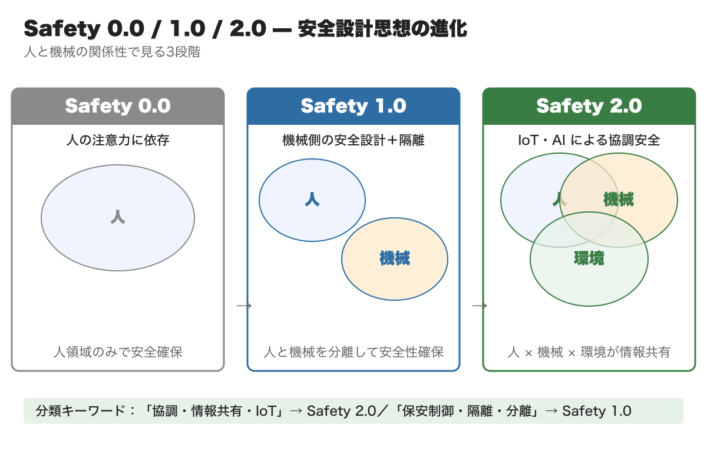
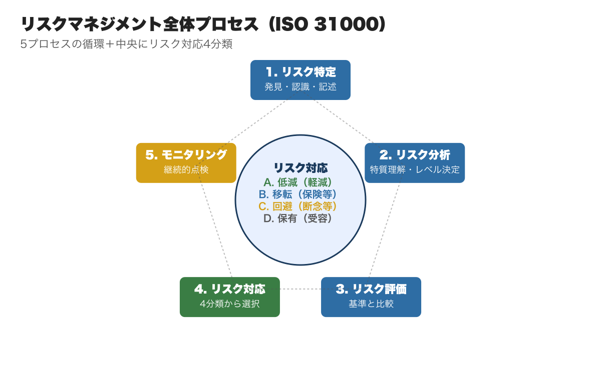
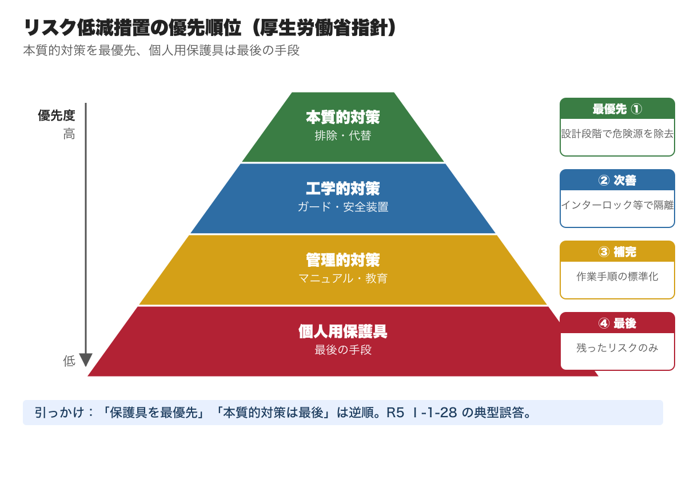
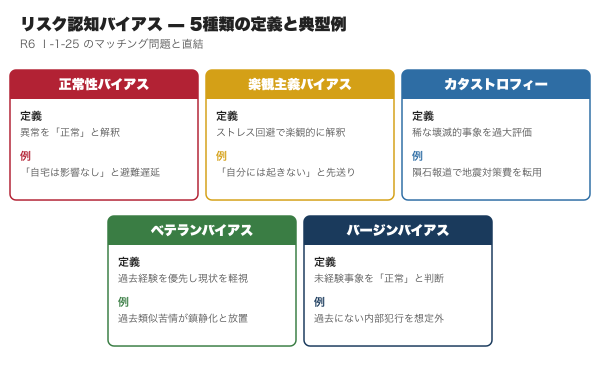
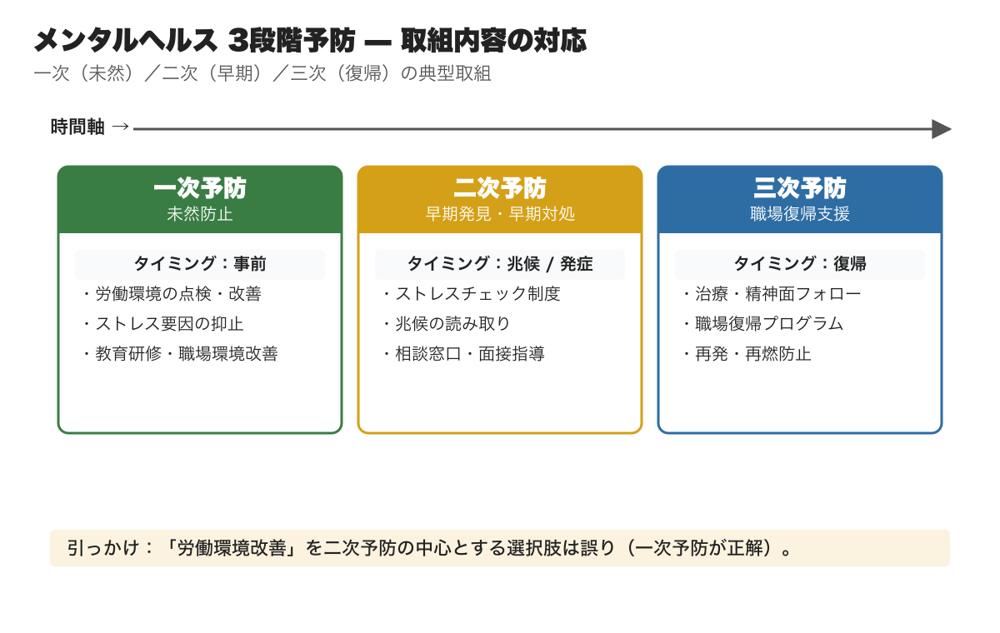
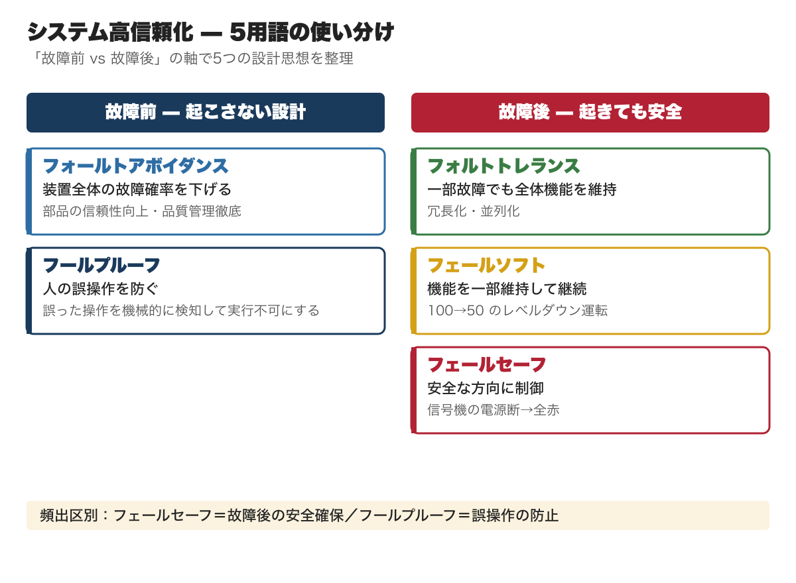
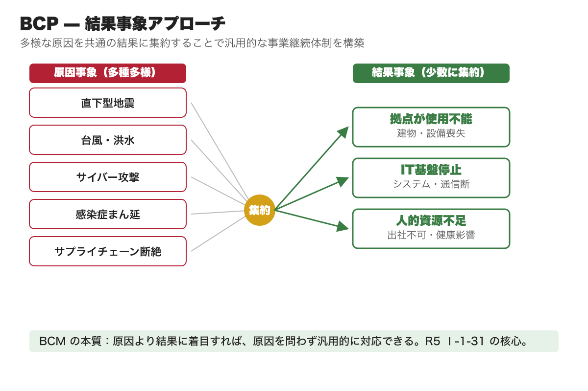
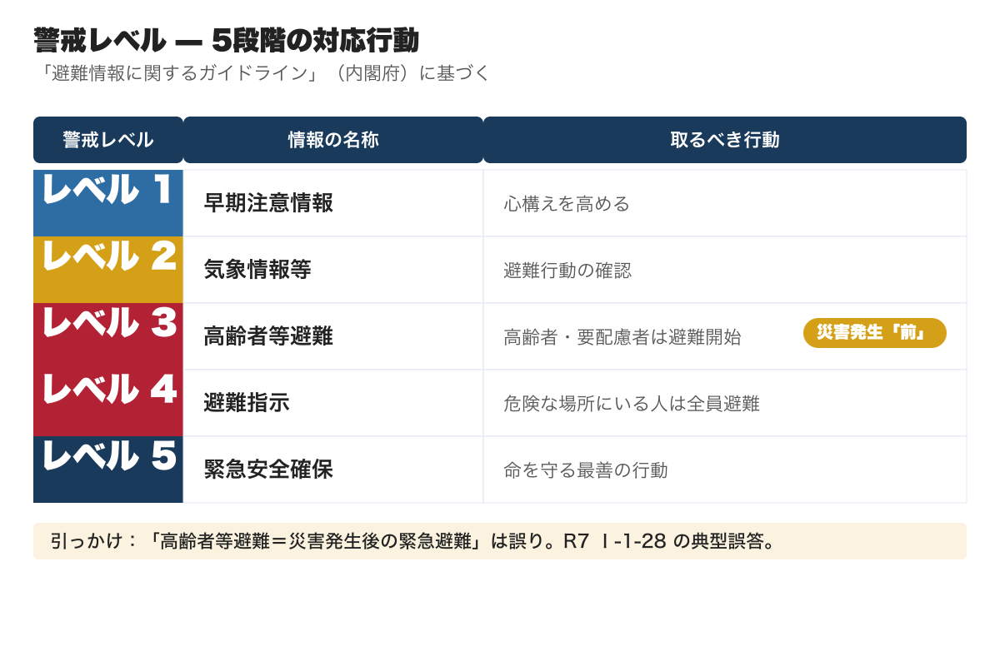
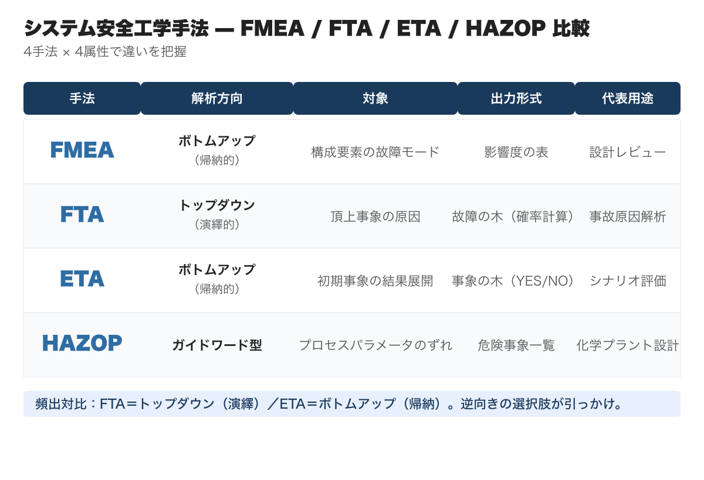
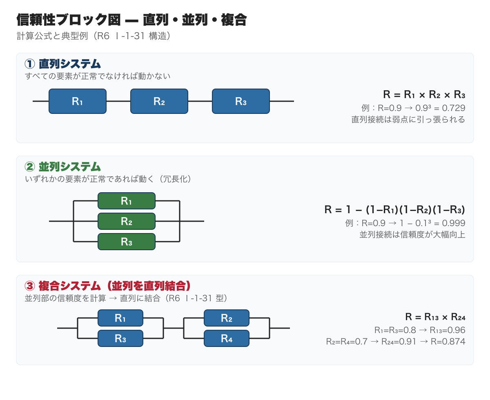

# 安全管理｜総監キーワード精読ガイド｜択一・記述直結リンク付き

**こんな人のための記事です**

- 安全管理の学習を始めたが、どこを重点的に覚えれば良いかわからない
- 択一で安全管理の問題を落としがちで、なぜ間違えるのか原因がつかめない
- 記述式で安全管理を選択肢に入れているが、使える論点が整理できていない
- 試験直前に安全管理の全体像を素早く頭に入れ直したい

**この記事でわかること**

- 全**19,000字超**の精読ガイド（キーワード解説リンク50超・R3〜R7 出題例込み）
- 安全管理の出題範囲を「優先度: 高／中／低」で仕分けして読む視点（高優先度は全体の約4割）
- 択一で繰り返し出る16論点の出題パターンと「引っかけ」の典型例
- 各キーワードの詳細解説ページへの直リンク付き（50リンク超、クリックで即確認）

---

キーワード集を読んでも論点が頭に入らない、択一の引っかけパターンが見えない、5管理の範囲が広すぎてどこから手を付ければいいか優先順位がつかない──そんな受験者のために、17年分の過去問680問を分析して5管理を体系化した精読ガイドを、5本セット ¥1,980（単品4本分の値段で5本・21%OFF）でまとめ購入できます。

https://note.com/dobokunote/m/m607bf095b02a

安全管理は総監5管理の中で**最もカバー範囲が広い分野**です。[製造物責任法](https://doboku-note.com/docs/pe-comprehensive-management-product-liability-act?utm_source=note&utm_medium=referral&utm_campaign=99-safety-management)・[リスクマネジメント](https://doboku-note.com/docs/pe-comprehensive-management-risk-management-system?utm_source=note&utm_medium=referral&utm_campaign=99-safety-management)・[労働安全衛生法](https://doboku-note.com/docs/pe-comprehensive-management-occupational-safety-act?utm_source=note&utm_medium=referral&utm_campaign=99-safety-management)・[ヒューマンエラー](https://doboku-note.com/docs/pe-comprehensive-management-human-error-probability?utm_source=note&utm_medium=referral&utm_campaign=99-safety-management)・危機管理・[システム信頼性](https://doboku-note.com/docs/pe-comprehensive-management-system-reliability?utm_source=note&utm_medium=referral&utm_campaign=99-safety-management)と、6エリアにまたがります。

全体を均等に読もうとすると、受験生のほぼ全員が「時間が足りない」と感じます。

この記事では**択一・記述式の出題視点で論点を絞り直しています**。「[製造物責任法](https://doboku-note.com/docs/pe-comprehensive-management-product-liability-act?utm_source=note&utm_medium=referral&utm_campaign=99-safety-management)の欠陥3分類」「[リスクアセスメント](https://doboku-note.com/docs/pe-comprehensive-management-risk-assessment?utm_source=note&utm_medium=referral&utm_campaign=99-safety-management)の用語定義」「[4M](https://doboku-note.com/docs/pe-comprehensive-management-four-m-analysis?utm_source=note&utm_medium=referral&utm_campaign=99-safety-management)・[4E分析](https://doboku-note.com/docs/pe-comprehensive-management-four-e-countermeasures?utm_source=note&utm_medium=referral&utm_campaign=99-safety-management)」「[ヒューマンエラー](https://doboku-note.com/docs/pe-comprehensive-management-human-error-probability?utm_source=note&utm_medium=referral&utm_campaign=99-safety-management)の分類」など、高頻度論点を優先度順に配置しています。

個々の法令条文番号より、**各手法・法律が「どのリスクに対して、どの段階で機能するか」という文脈**を押さえることが効率的な学習です。

---

## 安全管理と安全法規（優先度: 高）

安全管理の基本概念と各法律の概要を扱う分野です。**[製造物責任法](https://doboku-note.com/docs/pe-comprehensive-management-product-liability-act?utm_source=note&utm_medium=referral&utm_campaign=99-safety-management)は過去17年中10年で出題される頻出エリアです**。[安全文化](https://doboku-note.com/docs/pe-comprehensive-management-safety-culture?utm_source=note&utm_medium=referral&utm_campaign=99-safety-management)はR02・R03で連続出題されるなど出題頻度は中程度です。

**安全文化**

[安全文化](https://doboku-note.com/docs/pe-comprehensive-management-safety-culture?utm_source=note&utm_medium=referral&utm_campaign=99-safety-management)とは、組織全体で安全を最優先する価値観と行動様式です。

チェルノブイリ原発事故の原因調査を契機に国際原子力機関が提唱した概念で、米国のJ.リーズンが[安全文化](https://doboku-note.com/docs/pe-comprehensive-management-safety-culture?utm_source=note&utm_medium=referral&utm_campaign=99-safety-management)を組織内に広げるために必要な4つの文化を定式化しました。

**報告する文化** — 自分の過ちを報告する習慣の育成。実現には**報告を収集する部門と処分を行う部門の分離**が前提となります。  
**正義の文化** — 行為が故意か過失かを区別する仕組みを持ち、非難・処罰の対象・程度を明確化します。  
**柔軟な文化** — 集中管理体制ではなく、分散管理によってさまざまな事態に柔軟に対応できる組織文化です。  
**学習する文化** — 安全情報を整備して過去の経験から学ぶ体制。レッスンラーンと呼ばれる知識ベースから技術者が自由に知識を得られる文化です。

択一では「4つの文化のどれか」という定義照合が頻出です。特に「**報告する文化**（収集部門と処分部門の分離が前提）」は引っかけポイントになります。

**製造物責任法**（PL法）

[製造物責任法](https://doboku-note.com/docs/pe-comprehensive-management-product-liability-act?utm_source=note&utm_medium=referral&utm_campaign=99-safety-management)の最大の特徴は「過失の証明が不要」という無過失責任です。

被害者は①製造物に欠陥が存在したこと、②損害が発生したこと、③欠陥と損害の因果関係、この3点を証明するだけで製造業者等の責任を問えます。

**欠陥の3分類**（頻出）

- **設計上の欠陥** — 合理的な設計を採用しなかった結果、製造物全体が安全性を欠いた場合
- **製造上の欠陥** — 設計仕様を逸脱して製造・加工されたことで安全性を損なった場合
- **表示上の欠陥** — 適切な説明・警告表示があれば損害を回避できたにもかかわらず、情報を提供しなかった場合

**製造物の範囲** — 「製造または加工された動産」。不動産は対象外。ソフトウェア単体も対象外ですが、ソフトウェアを用いる機械全体として損害が生じた場合は対象になります。

**免責事由**（開発危険の抗弁） — 引き渡し時点の科学・技術の知見では欠陥を認識できなかった場合は免責されます。

**時効** — 被害者またはその法定代理人が損害と賠償義務者を知った時から**3年**、製造業者が製造物を引き渡した時から**10年**で消滅します。ただし身体に蓄積する物質や潜伏期間のある損害は損害が生じた時から起算されます。

**消費生活用製品安全法**

[消費生活用製品安全法](https://doboku-note.com/docs/pe-comprehensive-management-consumer-product-safety-act?utm_source=note&utm_medium=referral&utm_campaign=99-safety-management)は、一般消費者の生命・身体への危害を防止するため特定製品の製造・販売を規制する法律です。

**特定製品** — 危害を及ぼすおそれが特に多い製品で、PSC（Product Safety of Consumer Products）マークを付けなければなりません。

家庭用圧力なべ・乗車用ヘルメット・乳幼児用ベッド・登山用ロープ・携帯用レーザー応用装置・浴槽用温水循環器・石油給湯機・石油ふろがま・石油ストーブ・ライター・磁石製娯楽用品・吸収性合成樹脂製玩具の12品目です。

**特定保守製品** — 経年劣化による重大な危害を防ぐための長期使用製品安全点検制度の対象。事故率が下がった製品が令和3年8月に削除され、現在は**石油給湯機・石油ふろがまの2品目**のみです。

択一では「PSCマークの意味」「特定保守製品の品目数」が問われます。

また、特定保守製品取引における**説明義務は「特定保守製品取引事業者」に限定**され、不動産の個人間売買に伴って製品を引き渡す**個人売主には説明義務がありません**。「個人売主にも義務がある」という選択肢は引っかけです。

> **【出題例: [R5年度 Ⅰ-1-26](https://doboku-note.com/docs/pe-comprehensive-management-r05-primary?utm_source=note&utm_medium=referral&utm_campaign=99-safety-management#1-26)】** [消費生活用製品安全法](https://doboku-note.com/docs/pe-comprehensive-management-consumer-product-safety-act?utm_source=note&utm_medium=referral&utm_campaign=99-safety-management)で最も不適切なものはどれか。3.「個人売主が不動産の個人間売買に伴い特定保守製品を引き渡す際、個人売主には取得者に対する説明義務がある」→ **正答3：説明義務は「特定保守製品取引事業者」に限定。個人売主は対象外。**

**消費者安全法**

[消費者安全法](https://doboku-note.com/docs/pe-comprehensive-management-consumer-safety?utm_source=note&utm_medium=referral&utm_campaign=99-safety-management)は、消費者の消費生活における被害を防止し安全を確保するための基本法です。内閣総理大臣による基本方針の策定、都道府県・市区町村による消費生活相談体制の整備、消費者安全調査委員会による事故調査等を定めています。

重大事故等が発生した旨の情報を得た場合、行政機関の長・都道府県知事・市町村長・国民生活センターの長は**直ちに内閣総理大臣に通知**しなければなりません（[第12条](https://laws.e-gov.go.jp/law/421AC0000000050#Mp-At_12)）。

なお、**国民生活センターは独立行政法人**であり、都道府県が設置するものではありません。一方、消費者の相談窓口である**消費生活センター**は、都道府県が義務設置・市町村は努力義務で設置します。

「都道府県は国民生活センターを、市町村は消費生活センターを設置」という選択肢は典型的な引っかけです。

> **【出題例: [R3年度 Ⅰ-1-25](https://doboku-note.com/docs/pe-comprehensive-management-r03-primary?utm_source=note&utm_medium=referral&utm_campaign=99-safety-management#1-25)】** 消費者安全に係る記述で最も不適切なものはどれか。3.「都道府県においては国民生活センターを、市町村においては消費生活センターをそれぞれ設置しなければならない」→ **正答3：国民生活センターは独立行政法人で都道府県設置ではない。消費生活センターは都道府県が義務、市町村は努力義務。**

**消防法**

[消防法](https://doboku-note.com/docs/pe-comprehensive-management-fire-service-act?utm_source=note&utm_medium=referral&utm_campaign=99-safety-management)の目的は、火災の予防・警戒・鎮圧による国民の生命・身体・財産の保護と、災害等による傷病者の搬送の適切な実施です。

[第8条](https://laws.e-gov.go.jp/law/323AC1000000186#Mp-At_8)では、学校・病院・工場・百貨店等多数の者が出入する防火対象物の管理権原者に、**防火管理者を定めて消防計画の作成・消火訓練の実施・設備点検等を行わせる義務**を課しています。

防火管理者を定めたときは、遅滞なく所轄消防長または消防署長に届け出なければなりません。

また[消防法第36条](https://laws.e-gov.go.jp/law/323AC1000000186#Mp-At_36)では、地震等の自然災害に対応するため「防火管理者」を「**防災管理者**」と読み替えて準用することを規定しています。

**民法**

[民法第709条](https://laws.e-gov.go.jp/law/129AC0000000089#Mp-At_709)（不法行為による損害賠償）では、「故意または過失によって他人の権利または法律上保護される利益を侵害した者は、これによって生じた損害を賠償する責任を負う」と定めています。

契約不適合責任については、[民法第415条](https://laws.e-gov.go.jp/law/129AC0000000089#Mp-At_415)（債務不履行による損害賠償）で売主に帰責事由がない場合は損害賠償ができないとされています。

[民法第562条](https://laws.e-gov.go.jp/law/129AC0000000089#Mp-At_562)では買主の追完請求権（目的物が契約の内容に適合しない場合、修補・代替物引渡し・不足分引渡しを請求可能）、[第563条](https://laws.e-gov.go.jp/law/129AC0000000089#Mp-At_563)では代金減額請求権が定められています。

**協調安全**

[安全管理の協調安全](https://doboku-note.com/docs/pe-comprehensive-management-safety-control?utm_source=note&utm_medium=referral&utm_campaign=99-safety-management)の考え方は段階的に発展してきました。

- **Safety 0.0** — 人の注意力・判断力に頼って「人の領域」の安全を確保する考え方
- **[Safety 1.0](https://doboku-note.com/docs/pe-comprehensive-management-safety-2-0?utm_source=note&utm_medium=referral&utm_campaign=99-safety-management)** — 機械に安全対策を施し「機械の領域」のリスクを下げるとともに、人と機械を隔離して安全性を高める考え方
- **[Safety 2.0](https://doboku-note.com/docs/pe-comprehensive-management-safety-2-0?utm_source=note&utm_medium=referral&utm_campaign=99-safety-management)** — 人と機械と環境が**協調**することで、それぞれの領域だけでなく共存領域においても高い安全性を確保する考え方。IoTや人工知能の活用が前提

記述式論文でDXや自動化に触れる際の概念的基盤になります。

> **【出題例: [R7年度 Ⅰ-1-30](https://doboku-note.com/docs/pe-comprehensive-management-r07-primary?utm_source=note&utm_medium=referral&utm_campaign=99-safety-management#1-30)】** 5つの記述をSafety1.0とSafety2.0に分類する。（ア）協調安全による人・機械領域のリスク最小化、（イ）人・技術・組織の情報共有による安全確保、（ウ）鉄道の保安制御など固有の安全技術、（エ）IoT時代の安全概念、（オ）機械と人の共存領域をなくす安全対策→ **正答4：「協調・情報共有・IoT」＝Safety2.0、「保安制御・隔離・分離」＝Safety1.0。**

**新規科学技術分野の安全・ELSI**

[ELSI](https://doboku-note.com/docs/pe-comprehensive-management-elsi?utm_source=note&utm_medium=referral&utm_campaign=99-safety-management)（Ethical, Legal and Social Implications）は、バイオテクノロジーやコンピュータサイエンス等の新規科学技術分野が生む倫理的・法的・社会的課題を指します。

近年注目される「**トランスサイエンス**」とは、「科学に問うことはできるが、科学によってのみでは答えることができない問題」のことです。

こうした問題をELSIとして捉え、社会の懸念を特定してリスクや影響を分析・評価して対応を検討する活動が求められています。多様なステークホルダー間の対話と協働が必要です。

---

## 安全に関するリスクマネジメント（優先度: 最高）

[リスクマネジメント](https://doboku-note.com/docs/pe-comprehensive-management-risk-management-system?utm_source=note&utm_medium=referral&utm_campaign=99-safety-management)の体系（ISO 31000の枠組み）は**記述式論文の骨格にもなる**重要分野で、択一での出題頻度も非常に高いです。

**リスク管理**

[リスクマネジメント体系](https://doboku-note.com/docs/pe-comprehensive-management-risk-management-system?utm_source=note&utm_medium=referral&utm_campaign=99-safety-management)は、組織やプロジェクトに潜在するリスクを把握し、使用可能なリソースを用いて効果的な対処法を検討・実施するための技術体系です。

「JIS Q31000 リスクマネジメント—原則及び指針」では、リスクマネジメントについて以下の要点を示しています。

- あらゆる業態・規模の組織は目的達成の成否を不確かにする外部・内部要素に直面している
- リスクマネジメントは反復して行うものであり、戦略の決定・目的の達成を支援する
- リスクマネジメントは組織統治・リーダーシップの一部であり、マネジメントの基礎となる
- 人間の行動・文化的要素を含めた組織の内外の状況を考慮する

**リスクアセスメント**

[リスクアセスメント](https://doboku-note.com/docs/pe-comprehensive-management-risk-assessment?utm_source=note&utm_medium=referral&utm_campaign=99-safety-management)は、リスク管理の中核をなす活動です。「JIS Q 0073 リスクマネジメント—用語」における主要定義は以下のとおりです。

- **リスク** — 目的に対する不確かさの影響
- **[リスク特定](https://doboku-note.com/docs/pe-comprehensive-management-risk-identification?utm_source=note&utm_medium=referral&utm_campaign=99-safety-management)** — リスクを発見、認識及び記述するプロセス
- **[リスク分析](https://doboku-note.com/docs/pe-comprehensive-management-risk-analysis?utm_source=note&utm_medium=referral&utm_campaign=99-safety-management)** — リスクの特質を理解し、リスクレベルを決定するプロセス
- **リスクレベル** — 結果とその起こりやすさとの組合せとして表現される、リスクの大きさ
- **リスク評価** — [リスク分析](https://doboku-note.com/docs/pe-comprehensive-management-risk-analysis?utm_source=note&utm_medium=referral&utm_campaign=99-safety-management)の結果を[リスク基準](https://doboku-note.com/docs/pe-comprehensive-management-risk-criteria?utm_source=note&utm_medium=referral&utm_campaign=99-safety-management)と比較するプロセス
- **モニタリング** — 期待されたパフォーマンスレベルとの差異を特定するために状態を継続的に点検すること

**実施内容**（厚生労働省指針）

A. 危険性または有害性の特定  
B. 負傷・疾病の重篤度および発生可能性の見積り  
C. 見積りに基づくリスク低減の優先度設定と措置内容の検討  
D. 優先度に対応したリスク低減措置の実施

**実施時期** — ①建設物の設置・変更・解体時、②設備の新規採用・変更時、③原材料の新規採用・変更時、④作業方法・手順の新規採用・変更時、⑤労働災害発生で過去調査に問題があった場合、⑥前回調査から一定期間が経過した場合。

**リスク低減措置の優先順位**（最重要）

厚生労働省の「危険性又は有害性等の調査等に関する指針」では、リスク低減措置を以下の優先順位で検討することが定められています。

1. **本質的対策**（排除・代替） — 設計や計画の段階から危険性を除去する措置（最優先）
2. **工学的対策** — ガード・安全装置・インターロック等の機械的・電気的対策
3. **管理的対策** — マニュアルの整備・教育訓練・作業手順の標準化
4. **個人用保護具の使用** — 上記で残ったリスクへの最後の手段

「個人用保護具を最優先」「本質的対策は最後」といった**逆順の選択肢**は典型的な引っかけです。

> **【出題例: [R5年度 Ⅰ-1-28](https://doboku-note.com/docs/pe-comprehensive-management-r05-primary?utm_source=note&utm_medium=referral&utm_campaign=99-safety-management#1-28)】** [リスクアセスメント](https://doboku-note.com/docs/pe-comprehensive-management-risk-assessment?utm_source=note&utm_medium=referral&utm_campaign=99-safety-management)指針で最も不適切なものはどれか。5.「リスク低減措置の優先順位は ア）個人用保護具の使用 → イ）管理的対策 → ウ）本質的対策 の順」→ **正答5：優先順位は逆。本質的対策**（排除・代替）**を最優先し、個人用保護具は最後の手段。**

**リスク対応**

[リスク対応](https://doboku-note.com/docs/pe-comprehensive-management-risk-treatment?utm_source=note&utm_medium=referral&utm_campaign=99-safety-management)の基本式は以下です。

**リスク値 ＝ 被害額 × 発生確率**

[リスクマップ／リスクマトリクス](https://doboku-note.com/docs/pe-comprehensive-management-risk-map-matrix?utm_source=note&utm_medium=referral&utm_campaign=99-safety-management)（発生確率×影響度の2軸）で高位（右上）の事象を低位（左下）へ移すことが基本的対応方針です。

JIS Q31000が示す一般的なリスク対応の4分類は以下です。

**A. リスク低減**（軽減） — 発生確率を下げる、影響度（損害額）を少なくする、またはその両方をとる。  
**B. リスク移転**（転嫁） — 専門家に委託する、または保険をかける。専門家はリスク値を低くする術を持つ。  
**C. リスク回避** — リスク値が高く具体的な低減対策がない場合に、手法変更・事業断念等で回避する。  
**D. リスク保有**（受容） — 積極的対策を実施する方が高くつく場合等に、リスク自体を受容してモニタリングを継続しながら対策を先延ばしする。

なお、[リスク対応](https://doboku-note.com/docs/pe-comprehensive-management-risk-treatment?utm_source=note&utm_medium=referral&utm_campaign=99-safety-management)は「対象リスクを小さくするが、別のリスクを派生させることがある」とも示されており、リスクをゼロにする**絶対安全**にはできません。

[ALARP原則](https://doboku-note.com/docs/pe-comprehensive-management-alarp-principle?utm_source=note&utm_medium=referral&utm_campaign=99-safety-management)（As Low As Reasonably Practicable）— 「リスクは合理的で実行可能な限りできるだけ低くしなければならない」という原則。

記述式論文の「人的資源削減×安全確保トレードオフ」の解決策として使えます。

**リスク認知のバイアス**

[リスク認知](https://doboku-note.com/docs/pe-comprehensive-management-risk-perception?utm_source=note&utm_medium=referral&utm_campaign=99-safety-management)とは、個人・組織・社会がリスクをどう感じるかの主観的評価です。バイアスによって[社会的受容](https://doboku-note.com/docs/pe-comprehensive-management-public-acceptance?utm_source=note&utm_medium=referral&utm_campaign=99-safety-management)の判断が変わります。

5つのバイアスはそれぞれ択一の正誤問題として問われます。

- **[正常性バイアス](https://doboku-note.com/docs/pe-comprehensive-management-normalcy-bias?utm_source=note&utm_medium=referral&utm_campaign=99-safety-management)** — 異常な状態を示す情報を得ても、正常であると解釈しようとする偏向
- **[楽観主義バイアス](https://doboku-note.com/docs/pe-comprehensive-management-optimism-bias?utm_source=note&utm_medium=referral&utm_campaign=99-safety-management)** — 心理的ストレスを回避するために、楽観的に明るい方から見ようとする偏向
- **カタストロフィー・バイアス** — きわめて稀にしか起きないが壊滅的被害をもたらすリスクを過大評価する偏向
- **ベテランバイアス** — 経験豊富な事象に対して、現在の状況を考慮せず経験を優先して判断する偏向
- **[バージンバイアス](https://doboku-note.com/docs/pe-comprehensive-management-virgin-bias?utm_source=note&utm_medium=referral&utm_campaign=99-safety-management)** — 未経験な事象に対して、できるだけ正常であると判断する偏向

> **【出題例: [R6年度 Ⅰ-1-25](https://doboku-note.com/docs/pe-comprehensive-management-r06-primary?utm_source=note&utm_medium=referral&utm_campaign=99-safety-management#1-25)】** [リスク認知](https://doboku-note.com/docs/pe-comprehensive-management-risk-perception?utm_source=note&utm_medium=referral&utm_campaign=99-safety-management)バイアス4種と事例の組合せとして最も適切なものはどれか。→ **正答4：A正常性＝堤防決壊時に「自宅は影響なし」と思い込み避難遅延、B[カタストロフィー](https://doboku-note.com/docs/pe-comprehensive-management-catastrophe-bias?utm_source=note&utm_medium=referral&utm_campaign=99-safety-management)＝隕石ニュースで地震対策資金をシェルターに転用、Cベテラン＝過去類似苦情が鎮静化したからと放置、Dバージン＝過去にない内部犯行を想定外と扱い再発。**

**リスクコミュニケーション**

リスクコミュニケーションは、リスクの[社会的受容](https://doboku-note.com/docs/pe-comprehensive-management-public-acceptance?utm_source=note&utm_medium=referral&utm_campaign=99-safety-management)を得るために不可欠です。

文部科学省の「リスクコミュニケーションの推進方策」では、「リスクのより適切なマネジメントのために、社会の各層が対話・共考・協働を通じて、多様な情報及び見方の共有を図る活動」と定義しています。

**5つの目的**（同報告書第2項(3)）：

1. ステークホルダーの行動変容（個人のリスク認知を変え適切な行動へ結びつける）
2. 問題の発見と可視化（地域社会において潜在的な問題を掘り起こす）
3. 異なる価値観の調整（多様な価値観を調整しながら具体的な問題解決に寄与する）
4. リスクマネジメントに関する合意形成への参加（行政の意思決定への参加）
5. 被害の回復と未来に向けた一歩の支援（非常時後の被害者・被災者の回復に寄り添う）

コミュニケーション手段として、マスコミは注意喚起型に、対人的な媒体は合意形成型に、電子メディアは即時性・広域性に優れています。

リスクコミュニケーションは**双方向の対話**が本質であり、専門家が「危害因子の情報提供のみに特化する」一方向型では機能しません。

受け手側が情報をどう認識しているかを理解しようとする姿勢が不可欠です。

> **【出題例: [R5年度 Ⅰ-1-29](https://doboku-note.com/docs/pe-comprehensive-management-r05-primary?utm_source=note&utm_medium=referral&utm_campaign=99-safety-management#1-29)】** リスクコミュニケーションに関する記述で最も不適切なものはどれか。1.「専門家は専ら危険・危害をもたらす因子に係る知識や情報の提供に特化して説明を行う必要がある」→ **正答1：「特化」は誤り。感情的反応への配慮も含めた双方向対話が本質。**

**リスクベースメンテナンス**

[リスクベースメンテナンス（RBM）](https://doboku-note.com/docs/pe-comprehensive-management-predictive-maintenance?utm_source=note&utm_medium=referral&utm_campaign=99-safety-management)は、設備・システムの保全計画・検査計画の立案にリスク評価を取り入れた手法で、信頼性向上と保全費の最適化を図ります。

リスク（＝発生確率×影響の大きさ）値で故障の重要度を一元的に評価し、リスクの高低によって作業の順位付けをします。

**RBI**（リスクベース検査）は、設備・システムを要素レベルまで分類して不具合分析を行い、最適な検査手法や時期を検討して計画する手法です。

---

## 労働安全衛生管理（優先度: 高）

**労働安全衛生法**

[労働安全衛生法](https://doboku-note.com/docs/pe-comprehensive-management-occupational-safety-act?utm_source=note&utm_medium=referral&utm_campaign=99-safety-management)は、**危害防止基準の確立・責任体制の明確化・自主的活動の促進**により職場における労働者の安全と健康を確保し、快適な職場環境の形成を促進することを目的とした法律です。

主たる義務者は**事業者**（経営者・法人）です。職場の長や管理監督者は事業者の指揮下で安全管理を実施する立場であり、義務の主体ではありません。

[労安法第3条](https://laws.e-gov.go.jp/law/347AC0000000057#Mp-At_3)では「事業者は快適な職場環境の実現と安全衛生水準の向上に努める義務」を規定しており、択一の引っかけとして「主たる義務者は職場の長」という選択肢が頻出します。

> **【出題例: [R7年度 Ⅰ-1-26](https://doboku-note.com/docs/pe-comprehensive-management-r07-primary?utm_source=note&utm_medium=referral&utm_campaign=99-safety-management#1-26)】** 企業経営と安全に関する記述で最も不適切なものはどれか。4.「[労働安全衛生法](https://doboku-note.com/docs/pe-comprehensive-management-occupational-safety-act?utm_source=note&utm_medium=referral&utm_campaign=99-safety-management)の主たる義務者は、職場の長など現場の管理監督者である」→ **正答4：主たる義務者は「事業者」**（経営者・法人）**。管理監督者は実施役であり義務の主体ではない。**

**[安全衛生管理体制](https://doboku-note.com/docs/pe-comprehensive-management-safety-health-org-structure?utm_source=note&utm_medium=referral&utm_campaign=99-safety-management)**

- **総括安全衛生管理者**（[第10条](https://laws.e-gov.go.jp/law/347AC0000000057#Mp-At_10)） — 建設業・製造業等100人以上、その他業種300人以上の事業場ごとに選任
- **安全管理者**（[第11条](https://laws.e-gov.go.jp/law/347AC0000000057#Mp-At_11)） — 常時50人以上の事業場ごとに選任（安全に係る技術的事項を管理）
- **衛生管理者**（[第12条](https://laws.e-gov.go.jp/law/347AC0000000057#Mp-At_12)） — 常時50人以上の事業場ごとに選任（衛生に係る技術的事項を管理）
- **産業医**（[第13条](https://laws.e-gov.go.jp/law/347AC0000000057#Mp-At_13)） — 常時50人以上の事業場ごとに選任
- **安全委員会**（[第17条](https://laws.e-gov.go.jp/law/347AC0000000057#Mp-At_17)） — 建設業等50人以上の事業場に設置
- **衛生委員会**（[第18条](https://laws.e-gov.go.jp/law/347AC0000000057#Mp-At_18)） — 常時50人以上の事業場に設置
- **安全衛生委員会**（[第19条](https://laws.e-gov.go.jp/law/347AC0000000057#Mp-At_19)） — 安全委員会と衛生委員会の設置が必要なときは統合設置も可

**化学物質の[リスクアセスメント](https://doboku-note.com/docs/pe-comprehensive-management-risk-assessment?utm_source=note&utm_medium=referral&utm_campaign=99-safety-management)** （平成28年6月改正で義務化）

安全データシート（SDS）交付義務の対象である640物質が対象です。

化学物質の危険性・有害性を特定し、労働者への危険・健康被害の程度を見積もり、リスク低減対策を検討します。

**[安全衛生教育](https://doboku-note.com/docs/pe-comprehensive-management-safety-health-education?utm_source=note&utm_medium=referral&utm_campaign=99-safety-management)**

[第59条](https://laws.e-gov.go.jp/law/347AC0000000057#Mp-At_59)の**雇入れ教育** — 労働者を雇い入れた際に従事する業務に関する安全・衛生教育を行う義務。  
[第60条](https://laws.e-gov.go.jp/law/347AC0000000057#Mp-At_60)の**職長教育** — 職長等、作業中の労働者を直接指揮・監督する者に対して行う教育。

**[メンタルヘルス](https://doboku-note.com/docs/pe-comprehensive-management-mental-health?utm_source=note&utm_medium=referral&utm_campaign=99-safety-management)**

[メンタルヘルス](https://doboku-note.com/docs/pe-comprehensive-management-mental-health?utm_source=note&utm_medium=referral&utm_campaign=99-safety-management)の予防は3段階で構成されます。

- **一次予防** — メンタルヘルス不調の未然防止。教育研修・職場環境改善・ストレス要因の抑止
- **二次予防** — 早期発見・早期治療。兆候の読み取り・早期相談体制の整備
- **三次予防** — 職場復帰支援。治療・精神面フォロー・再発防止

**[ストレスチェック制度](https://doboku-note.com/docs/pe-comprehensive-management-stress-check-system?utm_source=note&utm_medium=referral&utm_campaign=99-safety-management)** （[第66条の10](https://laws.e-gov.go.jp/law/347AC0000000057#Mp-At_66_10)）— 常時**50人以上**の労働者を使用する事業場では、医師・保健師等による心理的負担の程度を把握するための検査を義務として実施しなければなりません（平成27年12月施行）。

目的は①自らのストレス状況への気づき促進、②職場ごとの集計・分析による職場環境改善、③医師による面接指導へのつなぎです。

択一では**3段階予防の取組内容を入れ替える引っかけ**が頻出です。「労働環境の点検・改善」は**一次予防**（未然防止）の中心であり、二次予防（早期発見・早期対処）の中心ではありません。

二次予防の中心はストレスチェックや相談窓口です。

> **【出題例: [R6年度 Ⅰ-1-26](https://doboku-note.com/docs/pe-comprehensive-management-r06-primary?utm_source=note&utm_medium=referral&utm_campaign=99-safety-management#1-26)】** [メンタルヘルス](https://doboku-note.com/docs/pe-comprehensive-management-mental-health?utm_source=note&utm_medium=referral&utm_campaign=99-safety-management)対策で最も不適切なものはどれか。3.「健康不全の早期発見・早期対処については、労働時間管理・人事労務管理・仕事の方法・評価制度などの改善が中心となる」→ **正答3：労働環境の改善は一次予防**（未然防止）**の内容。二次予防の中心ではない。**

**墜落制止用器具**（平成30年改正）

「安全帯」が「**墜落制止用器具**」に改称されました。ハーネス型（一本つり）と胴ベルト型（一本つり）の2種類があります。

胴ベルト型（U字つり）は墜落制止機能がないため対象外です。

高さ2m以上で作業床を設けることが困難な場所でフルハーネス型を使用する業務には、特別教育の受講が必要です。

**OSHMS**（労働安全衛生マネジメントシステム）

[OSHMS](https://doboku-note.com/docs/pe-comprehensive-management-oshms?utm_source=note&utm_medium=referral&utm_campaign=99-safety-management)はISO 45001に対応したPDCAサイクルによる継続的改善の仕組みです。

択一では「**[労働安全衛生法](https://doboku-note.com/docs/pe-comprehensive-management-occupational-safety-act?utm_source=note&utm_medium=referral&utm_campaign=99-safety-management)との違い**（法令遵守 vs PDCAによる自主的改善）」が問われます。

法律は守るべき最低基準を示すもので、[OSHMS](https://doboku-note.com/docs/pe-comprehensive-management-oshms?utm_source=note&utm_medium=referral&utm_campaign=99-safety-management)はそれを超えた自主的な改善サイクルの仕組みです。

また、**OSHMS指針の対象は[労働基準法](https://doboku-note.com/docs/pe-comprehensive-management-labor-standards-act?utm_source=note&utm_medium=referral&utm_campaign=99-safety-management)上の労働者に限定**され、ボランティアは含まれません。

ボランティアを含めた「働く人」を対象とするのは国際規格の**ISO 45001**側で、JIS Q 45001（ISO 45001の和訳JIS）と日本独自のJIS Q 45100の関係も整理しておきましょう。

> **【出題例: [R6年度 Ⅰ-1-30](https://doboku-note.com/docs/pe-comprehensive-management-r06-primary?utm_source=note&utm_medium=referral&utm_campaign=99-safety-management#1-30)】** OSHMS指針およびOSH関連規格で最も不適切なものはどれか。1.「OSHMS指針の対象者には、労働基準法における労働者ではないボランティアも含まれる」→ **正答1：OSHMS指針の対象は労働者のみ。ボランティアを含むのはISO 45001の「働く人」概念。**

**労働災害**

[労働災害](https://doboku-note.com/docs/pe-comprehensive-management-occupational-disease?utm_source=note&utm_medium=referral&utm_campaign=99-safety-management)は[労働安全衛生法](https://doboku-note.com/docs/pe-comprehensive-management-occupational-safety-act?utm_source=note&utm_medium=referral&utm_campaign=99-safety-management)[第2条第1号](https://laws.e-gov.go.jp/law/347AC0000000057#Mp-At_2)で次のように定義されています。

> 労働者の就業に係る建設物、設備、原材料等により、または業務に起因して、労働者が負傷し、疾病にかかり、または死亡すること

**[労働災害統計](https://doboku-note.com/docs/pe-comprehensive-management-accident-statistics?utm_source=note&utm_medium=referral&utm_campaign=99-safety-management)の主要指標**

- **度数率** ＝ 死傷者数 ÷ 延実労働時間数 × 1,000,000
- **強度率** ＝ 実労働損失日数 ÷ 延実労働時間数 × 1,000
- **年千人率** ＝ 1年間の死傷者数 ÷ 1年間の平均労働者数 × 1,000

度数率は**頻度**を、強度率は**災害の重さ**を表します。計算問題として出題されます。

なお、**延べ実労働時間 ＝ 従業員数 × 年間平均労働時間**で算出する点を押さえてください。

> **【出題例: [R7年度 Ⅰ-1-31](https://doboku-note.com/docs/pe-comprehensive-management-r07-primary?utm_source=note&utm_medium=referral&utm_campaign=99-safety-management#1-31)】** 従業員500人・年間労働時間1,700h・死傷者1人・損失日数30日の事業所Bと、度数率1.5・強度率0.09・年千人率2.1の事業所Aを比較する。最も適切なものはどれか。→ **正答1：B社の度数率＝1.18、強度率＝0.035、年千人率＝2.0で全指標がA社を下回る。延べ実労働時間＝従業員数×年間平均労働時間で計算。**

**高齢者の労働安全** — **フレイル** （筋力・認知機能等の低下で生活機能障害リスクが高まった状態）と **ロコモティブシンドローム** （骨・関節・筋肉等の衰えで移動機能が低下した状態）が択一の定義問題として出ます。

**公益通報者保護法**

公益通報者保護法は、公益通報をした者の解雇の無効等を定め、国民の生命・身体・財産の保護にかかわる法令の遵守を図ることを目的とします。

公益通報として保護されるには、①通報者が労働者（正社員・パート・アルバイト含む）であること、②不正の利益を得る目的など不正な目的でないこと、③労務提供先等の役員・従業員等の不正事実が対象であること、の条件があります。

保護の内容として、公益通報を理由とした解雇・派遣契約解除の無効、降格・減給等の不利益取扱いの禁止が定められています。

**2022年6月施行の改正点**として、①保護対象者に**役員**が追加（従来は労働者・1年以内退職者のみ）、②**常時使用労働者300人超**の事業者に内部公益通報対応体制の整備が義務化、③通報先（事業者内部・行政機関・報道機関等）に応じた保護要件の明確化が行われました。

「役員は保護対象に含まれない」は改正後の引っかけです。

> **【出題例: [R6年度 Ⅰ-1-29](https://doboku-note.com/docs/pe-comprehensive-management-r06-primary?utm_source=note&utm_medium=referral&utm_campaign=99-safety-management#1-29)】** 2022年改正公益通報者保護法で最も不適切なものはどれか。2.「保護される公益通報者の範囲に、労働者及び退職後一定期間以内の退職者は含まれるが、役員は含まれない」→ **正答2：2022年改正で役員も保護対象に追加された。**

---

## 事故・災害の未然防止（優先度: 最高）

**ハインリッヒの法則とヒヤリハット活動**

[ハインリッヒの法則](https://doboku-note.com/docs/pe-comprehensive-management-heinrich-law?utm_source=note&utm_medium=referral&utm_campaign=99-safety-management)は、アメリカの損保会社の技師ハインリッヒが過去の労働災害約50万件を調査した結果から発表した経験則です。

「1件の重大事故の背後には29件の軽微な事故と300件のヒヤリハット（障害のない災害）が存在する」という内容です。

重大事故を防ぐには、報告として上がってこない**ヒヤリハット**をなくしていくことが大切です。

**ヒヤリハット活動**は早期報告・早期対策と、同様業務を行うチームへの情報提供が重要とされています。[KYT](https://doboku-note.com/docs/pe-comprehensive-management-kyt?utm_source=note&utm_medium=referral&utm_campaign=99-safety-management)（危険予知訓練）と直結する考え方です。

**システムの高信頼化**

- **[フォールトアボイダンス](https://doboku-note.com/docs/pe-comprehensive-management-fault-avoidance?utm_source=note&utm_medium=referral&utm_campaign=99-safety-management)** — 装置・システム全体の故障確率を少なくする考え方。部品の信頼性向上・品質管理の徹底等
- **[フォルトトレランス](https://doboku-note.com/docs/pe-comprehensive-management-fault-tolerance?utm_source=note&utm_medium=referral&utm_campaign=99-safety-management)** — 一部の部品・機能に故障が発生しても全体機能を維持する考え方
- **[フェールソフト](https://doboku-note.com/docs/pe-comprehensive-management-fail-soft?utm_source=note&utm_medium=referral&utm_campaign=99-safety-management)** — 故障時も機能を完全喪失せず、可能な範囲で機能を維持する考え方（100→50の機能維持）
- **[フールプルーフ](https://doboku-note.com/docs/pe-comprehensive-management-fool-proof?utm_source=note&utm_medium=referral&utm_campaign=99-safety-management)** — 人が誤った操作をしても危険が生じないよう機械的・電気的に検知して実行できなくする設計思想
- **[フェールセーフ](https://doboku-note.com/docs/pe-comprehensive-management-fail-safe?utm_source=note&utm_medium=referral&utm_campaign=99-safety-management)** — 装置・部品が故障した際にも、安全な方向に制御する設計思想（例：信号機の電源断→全赤）

**[インターロック](https://doboku-note.com/docs/pe-comprehensive-management-interlock?utm_source=note&utm_medium=referral&utm_campaign=99-safety-management)** — [フールプルーフ](https://doboku-note.com/docs/pe-comprehensive-management-fool-proof?utm_source=note&utm_medium=referral&utm_campaign=99-safety-management)の手法の1つで、一定の条件が整わないと動作・機能を働かせない機構。「[停止安全](https://doboku-note.com/docs/pe-comprehensive-management-isolation-stop-safety?utm_source=note&utm_medium=referral&utm_campaign=99-safety-management)」の手段の1つです。

- **安全確認型インターロック** — 安全が確認されている間だけ機械の運転を許可。安全確認センサが故障→運転停止（[フェールセーフ](https://doboku-note.com/docs/pe-comprehensive-management-fail-safe?utm_source=note&utm_medium=referral&utm_campaign=99-safety-management)）
- **危険検出型インターロック** — 危険を検出すれば運転停止。危険検出センサが故障→危険な動作が継続するという欠点がある

**[本質的安全設計方策](https://doboku-note.com/docs/pe-comprehensive-management-inherent-safety?utm_source=note&utm_medium=referral&utm_campaign=99-safety-management)** — ガード・保護装置を使用せず、機械の設計または運転特性を変更することで危険源を除去・リスクを低減する保護方策。

「[フェールセーフ](https://doboku-note.com/docs/pe-comprehensive-management-fail-safe?utm_source=note&utm_medium=referral&utm_campaign=99-safety-management)は故障後の安全確保、[フールプルーフ](https://doboku-note.com/docs/pe-comprehensive-management-fool-proof?utm_source=note&utm_medium=referral&utm_campaign=99-safety-management)は誤操作の防止」という区別を徹底してください。

**フェールセーフ化の4制御機構**（工作機械等の制御機構フェールセーフ化ガイドライン）も択一で問われます。

- **インターロック**（ガード用） — 機械の運転中に作業者が危険領域内へ侵入するのを防止
- **急停止用** — 機械側で何らかの異常を感知したときに直ちに運転を停止
- **[非常停止用](https://doboku-note.com/docs/pe-comprehensive-management-emergency-stop-device?utm_source=note&utm_medium=referral&utm_campaign=99-safety-management)** — 作業者が異常を感知したときに直ちに運転を停止
- **ホールド・ツー・ラン** — 操作装置を押している間だけ機械が運転、手を離すと停止

「急停止＝機械側の自動検知」「非常停止＝作業者の手動操作」の区別が頻出の引っかけです。

> **【出題例: [R6年度 Ⅰ-1-27](https://doboku-note.com/docs/pe-comprehensive-management-r06-primary?utm_source=note&utm_medium=referral&utm_campaign=99-safety-management#1-27)】** フェールセーフ化の対象とする制御機構の区分と内容の組合せで最も適切なものはどれか。→ **正答2：A[インターロック](https://doboku-note.com/docs/pe-comprehensive-management-interlock?utm_source=note&utm_medium=referral&utm_campaign=99-safety-management)＝侵入防止、B急停止＝機械異常で停止、C非常停止＝作業者の手動停止、Dホールド・ツー・ラン＝押している間だけ運転。**

**事故の4M要因分析**

[事故の4M要因分析](https://doboku-note.com/docs/pe-comprehensive-management-four-m-analysis?utm_source=note&utm_medium=referral&utm_campaign=99-safety-management)は、事故・災害の原因分析で以下4つの視点から要因を抽出します。

- **Man**（人） — 関与した人に関する要因（心理的要因・生理的要因・職場的要因）
- **Machine**（設備） — 設備・機械等に関する要因（欠陥・整備不良・設計ミス）
- **Media**（作業環境） — ManとMachineの媒体に関する要因（作業環境・マニュアル・不適切手順設定）
- **Management**（管理） — 管理システムに関する要因（規定・教育訓練・監理・監督）

**事故の4E対策**

[事故の4E対策](https://doboku-note.com/docs/pe-comprehensive-management-four-e-countermeasures?utm_source=note&utm_medium=referral&utm_campaign=99-safety-management)は、事故・災害の対策検討で以下4つの視点から対策を立てます。

- **Engineering**（工学的対策） — 技術的・物理的な安全対策（設備改善・安全装置の設置）
- **Education**（教育） — 安全教育・訓練の実施
- **Enforcement**（強調・強化） — 規則・法令の強化・徹底
- **Example**（模範） — 管理者・リーダーが模範を示す

記述式論文では「[4M分析](https://doboku-note.com/docs/pe-comprehensive-management-four-m-analysis?utm_source=note&utm_medium=referral&utm_campaign=99-safety-management)で原因を特定し、[4E](https://doboku-note.com/docs/pe-comprehensive-management-four-e-countermeasures?utm_source=note&utm_medium=referral&utm_campaign=99-safety-management)で対策を論じる」構成が使えます。

択一では「**Economy**（経済性）」を含めた選択肢が頻出の引っかけです。4Eに経済性は含まれません。

第4のEは管理者が率先して手本を示す「**Example**（模範）」です。

> **【出題例: [R7年度 Ⅰ-1-25](https://doboku-note.com/docs/pe-comprehensive-management-r07-primary?utm_source=note&utm_medium=referral&utm_campaign=99-safety-management#1-25)】** 事故・災害の未然防止対応活動に関する記述で最も不適切なものはどれか。4.「4E対策は Education・Engineering・Enforcement・**Economy** の4つの観点から対策を検討する手法」→ **正答4：Economy**（経済性）**は誤り。正しくは Example**（模範）**。管理者が率先して手本を示す文化づくりが第4のEです。**

**小集団活動**

[小集団活動](https://doboku-note.com/docs/pe-comprehensive-management-small-group-activities?utm_source=note&utm_medium=referral&utm_campaign=99-safety-management)は、第一線の職場で働く人々が自主的に運営し継続的に実施する活動です。

QCサークル活動のほか、**ZD 運動** （Zero Defects、従業員の創造工夫で仕事の欠陥をゼロにし顧客満足・製品信頼性を高める）や **改善提案活動** があります。

**自主保安とKYT**

[KYT](https://doboku-note.com/docs/pe-comprehensive-management-kyt?utm_source=note&utm_medium=referral&utm_campaign=99-safety-management)（危険予知訓練）は、作業にひそむ危険要因や引き起こす現象を認識する手法です。

**[定期点検活動](https://doboku-note.com/docs/pe-comprehensive-management-periodic-inspection?utm_source=note&utm_medium=referral&utm_campaign=99-safety-management)** — 事故・災害の発生を未然に防ぐため、定期的な点検活動を定常業務の一部として行います。

**KY活動とKYT** — 日々の労働前に職場で行われる危険予知（KY）活動。KYT（危険予知訓練）では①現状把握→②本質追及→③対策樹立→④目標設定の**4ラウンド法**が用いられます。

**[TBM**（ツールボックスミーティング）**](https://doboku-note.com/docs/pe-comprehensive-management-tbm-toolbox-meeting?utm_source=note&utm_medium=referral&utm_campaign=99-safety-management)** — 作業前に職場で行われる小集団ミーティング。[KYT](https://doboku-note.com/docs/pe-comprehensive-management-kyt?utm_source=note&utm_medium=referral&utm_campaign=99-safety-management)（危険予知訓練）が実施されます。

**自動走行に関するガイドライン**

平成28年5月に警察庁より「**自動走行システムに関する公道実証実験のためのガイドライン**」が公表されました。

テストドライバーは運転に必要な運転免許を保有する必要があり、交通事故・交通違反が発生した場合はテストドライバーが運転者としての責任を負うとされています。

令和2年9月の「**自動運転の公道実証実験に係る道路使用許可基準**」では遠隔型自動運転システムにも対応し、条件を満たせば遠隔監視・操作者による走行も可能となっています。

---

## 危機管理（優先度: 高）

一般的に[リスク管理](https://doboku-note.com/docs/pe-comprehensive-management-risk-management-system?utm_source=note&utm_medium=referral&utm_campaign=99-safety-management)が**事故や危機が起きないようにする活動**を指すのに対して、**危機管理は天災等の[緊急事態](https://doboku-note.com/docs/pe-comprehensive-management-emergency?utm_source=note&utm_medium=referral&utm_campaign=99-safety-management)が発生した後の活動**を指す場合が多いです。

危機管理の目的は「不測の事態に対して適切な対応ができるようにすること」です。

**危機管理の対象事象とオールハザードアプローチ**

企業を対象にした危機の事例は、自然災害・大規模事故・[感染症](https://doboku-note.com/docs/pe-comprehensive-management-infectious-disease-pandemic?utm_source=note&utm_medium=referral&utm_campaign=99-safety-management)・サイバー攻撃・[テロ](https://doboku-note.com/docs/pe-comprehensive-management-terrorism?utm_source=note&utm_medium=referral&utm_campaign=99-safety-management)・風評被害など多彩です。

すべての危機に対応するという考え方として**[オールハザードアプローチ](https://doboku-note.com/docs/pe-comprehensive-management-all-hazard-approach?utm_source=note&utm_medium=referral&utm_campaign=99-safety-management)**があります。

特定の災害種別に限定しない対応体制の考え方で、一つの組織行動原則です。

**危機への対応**（4段階）

[危機管理マニュアル](https://doboku-note.com/docs/pe-comprehensive-management-crisis-management-manual?utm_source=note&utm_medium=referral&utm_campaign=99-safety-management)の対応は以下の段階で事前に検討・準備されている必要があります。なお危機管理においては人の安全だけでなく、危機時の警備対策や**[サイバーセキュリティ](https://doboku-note.com/docs/pe-comprehensive-management-cybersecurity-safety?utm_source=note&utm_medium=referral&utm_campaign=99-safety-management)対策**も含めて検討する必要があります。

- **平常時準備段階** — トップの危機管理に対する強い意志を示すことが重要
- **事前作業段階** — 想定危機の洗い出し・影響度検討、危機管理計画の策定・緊急対策本部等の体制準備・連絡体制整備
- **[緊急事態](https://doboku-note.com/docs/pe-comprehensive-management-emergency?utm_source=note&utm_medium=referral&utm_campaign=99-safety-management)対応段階** — 危機発生・予兆の早期発見における迅速な行動
- **事後復旧段階** — 組織を平常状態に戻す。再発防止策の検討・早期公表・信頼回復対応

**危機管理マニュアル**

[危機管理マニュアル](https://doboku-note.com/docs/pe-comprehensive-management-crisis-management-manual?utm_source=note&utm_medium=referral&utm_campaign=99-safety-management)は危機発生時の緊急時対応を円滑に実施するために策定されます。以下の要件を満たして作成する必要があります。

1. 体系的・階層的に構成する
2. 対象事象や対応方針を明確にする
3. 対応組織や体制が明確である
4. 責任と権限が明確である
5. 見直しや改正の手続きが明確である

**事業継続マネジメント**（BCP・BCM）

[BCP（Business Continuity Plan：事業継続計画）](https://doboku-note.com/docs/pe-comprehensive-management-business-continuity-plan?utm_source=note&utm_medium=referral&utm_campaign=99-safety-management)は、大地震等の自然災害・[感染症](https://doboku-note.com/docs/pe-comprehensive-management-infectious-disease-pandemic?utm_source=note&utm_medium=referral&utm_campaign=99-safety-management)まん延・[テロ](https://doboku-note.com/docs/pe-comprehensive-management-terrorism?utm_source=note&utm_medium=referral&utm_campaign=99-safety-management)・大事故・サプライチェーンの途絶など不測の事態が発生しても、重要な事業を中断させない、または中断しても可能な限り短い期間で復旧させるための方針・体制・手順等を示した計画です（内閣府『事業継続ガイドライン』より）。

**BCM**（Business Continuity Management：事業継続マネジメント）は、[BCP](https://doboku-note.com/docs/pe-comprehensive-management-business-continuity-plan?utm_source=note&utm_medium=referral&utm_campaign=99-safety-management)策定や維持・更新、予算・資源の確保、事前対策、教育・訓練、継続的改善などを行う平常時からのマネジメント活動で、経営レベルの戦略的活動として位置付けられます。

択一では「**[BCP](https://doboku-note.com/docs/pe-comprehensive-management-business-continuity-plan?utm_source=note&utm_medium=referral&utm_campaign=99-safety-management) は計画**（文書）**、BCM はそれを組織に組み込んだマネジメントシステム**」という区別が問われます。

国際規格としてISO 22301（事業継続マネジメントシステム—要求事項）が発行されています。

[BCM](https://doboku-note.com/docs/pe-comprehensive-management-business-continuity-plan?utm_source=note&utm_medium=referral&utm_campaign=99-safety-management)の実務上の重要原則は**結果事象アプローチ**です。「直下型地震」「台風」「サイバー攻撃」のような**原因事象**ではなく、「ある拠点が使用不能」「IT基盤が停止」のような**結果事象**で考えることで、原因を問わず汎用的に対応できる体制が組めます。

「原因事象で考えるべき」という選択肢は逆向きの引っかけです。

> **【出題例: [R5年度 Ⅰ-1-31](https://doboku-note.com/docs/pe-comprehensive-management-r05-primary?utm_source=note&utm_medium=referral&utm_campaign=99-safety-management#1-31)】** 民間企業の事業継続の取組で最も不適切なものはどれか。4.「BCMでは、自社に生じた事態を『ある拠点が使用不能』などの結果事象により考えるのではなく、『直下型地震』などの原因事象により考えることが望ましい」→ **正答4：BCMでは結果事象アプローチが推奨される。記述は逆。**

**国土強靱化基本計画**

[国土強靱化基本法](https://doboku-note.com/docs/pe-comprehensive-management-national-resilience-act?utm_source=note&utm_medium=referral&utm_campaign=99-safety-management)に基づく国土強靱化基本計画（最新版：令和5年7月公表）は、以下の4つを基本目標として「強さ」と「しなやかさ」を持った安全・安心な国土・地域・経済社会の構築を推進します。

1. 人命の保護が最大限図られること
2. 国家及び社会の重要な機能が致命的な障害を受けずに維持されること
3. 国民の財産及び公共施設に係る被害の最小化
4. 迅速な復旧復興

2023年6月の改正で**国土強靱化実施中期計画**が新設されました。「基本計画→実施中期計画→年次計画」という階層体系です。

**脆弱性評価は基本計画の策定時に実施**するもので、実施中期計画案の作成時に行うものではありません。

> **【出題例: [R6年度 Ⅰ-1-32](https://doboku-note.com/docs/pe-comprehensive-management-r06-primary?utm_source=note&utm_medium=referral&utm_campaign=99-safety-management#1-32)】** 2023年6月改正[国土強靱化基本法](https://doboku-note.com/docs/pe-comprehensive-management-national-resilience-act?utm_source=note&utm_medium=referral&utm_campaign=99-safety-management)で最も不適切なものはどれか。3.「政府は、国土強靱化実施中期計画案の作成時に、脆弱性評価の指針を定め、脆弱性評価を行う」→ **正答3：脆弱性評価は基本計画の策定時に実施。中期計画案ではない。**

**津波防災地域づくりに関する法律**

[国土強靱化基本法](https://doboku-note.com/docs/pe-comprehensive-management-national-resilience-act?utm_source=note&utm_medium=referral&utm_campaign=99-safety-management)と合わせて、津波防災地域づくりに関する法律は津波による災害を防止・軽減し、将来にわたって安心して暮らせる安全な地域の整備・利用・保全を総合的に推進することを目的とします。

市町村による推進計画の作成、津波災害警戒区域における警戒避難体制の整備、津波災害特別警戒区域における開発行為等の制限を定めています。

**危機に対する法律**

[災害対策基本法](https://doboku-note.com/docs/pe-comprehensive-management-disaster-countermeasures-act?utm_source=note&utm_medium=referral&utm_campaign=99-safety-management)と合わせて、具体的な危機を想定した以下の法律を整理しておきます。

- **[国民保護法](https://doboku-note.com/docs/pe-comprehensive-management-civil-protection-act?utm_source=note&utm_medium=referral&utm_campaign=99-safety-management)** — 武力攻撃から国民を保護するため緊急の必要がある場合の警報発令（[第44条](https://laws.e-gov.go.jp/law/416AC0000000112#Mp-At_44)）
- **気象業務法** — 特に異常な現象で重大な災害のおそれが著しく大きい場合の特別警報（[第13条の2](https://laws.e-gov.go.jp/law/327AC0000000165#Mp-At_13_2)）
- **[原子力災害対策特別措置法](https://doboku-note.com/docs/pe-comprehensive-management-nuclear-disaster-act?utm_source=note&utm_medium=referral&utm_campaign=99-safety-management)** — 原子力緊急事態が発生した場合の内閣総理大臣への報告義務（[第15条](https://laws.e-gov.go.jp/law/411AC0000000156#Mp-At_15)）
- **新型インフルエンザ等対策特別措置法** — 政府対策本部長による指定行政機関・都道府県等への総合調整権（[第20条](https://laws.e-gov.go.jp/law/424AC0000000031#Mp-At_20)）

**警戒レベル**

[警戒レベル](https://doboku-note.com/docs/pe-comprehensive-management-alert-levels?utm_source=note&utm_medium=referral&utm_campaign=99-safety-management)は「避難勧告等に関するガイドライン」で5段階が示されています。

- **レベル1** — 早期注意情報。心構えを高める
- **レベル2** — 気象情報等。避難行動の確認
- **レベル3** — 高齢者等避難。高齢者・障害者等は避難
- **レベル4** — 避難指示。危険な場所にいる人は全員避難
- **レベル5** — 緊急安全確保。命を守る最善の行動

択一では「レベル4＝避難指示（全員避難）、レベル3＝高齢者等避難」という数字と行動の対応が問われます。

特に重要な引っかけは、**レベル3「高齢者等避難」が災害発生「前」の早期避難情報**である点です。「災害発生後の緊急避難」と書く選択肢は誤りで、災害発生後の切迫時はレベル5「緊急安全確保」となります。

レベル4「避難指示」は警戒レベル4の立退き避難、レベル5「緊急安全確保」は立退きが危険な場合の最後の手段です。

> **【出題例: [R7年度 Ⅰ-1-28](https://doboku-note.com/docs/pe-comprehensive-management-r07-primary?utm_source=note&utm_medium=referral&utm_campaign=99-safety-management#1-28)】** 「避難情報に関するガイドライン」で最も適切なものはどれか。5.「高齢者等避難は、災害が発生し、避難に時間を要する高齢者等の要配慮者を緊急に避難させる必要がある場合に発令する」→ **正答5：誤り。高齢者等避難**（レベル3）**は災害発生「前」の早期避難情報。**

**南海トラフ地震臨時情報**

南海トラフ地震臨時情報は、気象庁が南海トラフの想定震源域で一定規模以上の地震発生やプレート境界面の異常なずれを観測した際に発表する情報です。

警戒レベルとは別系統のガイドライン（内閣府「南海トラフ地震の多様な発生形態に備えた防災対応検討ガイドライン」、2019年策定）に基づきます。発表される情報は段階的に3種類です。

- **調査中** — 観測・評価着手を開始した時点で発表
- **巨大地震注意** — 大規模地震の発生可能性が相対的に高まったと評価された場合
- **巨大地震警戒** — さらに高い可能性（M8.0以上の地震発生後等）と評価された場合

**最も警戒する期間** — 巨大地震警戒が発表された場合、**地震発生後1週間を最も警戒する期間**とすることが基本です。

1週間経過後も注意は継続しますが、最大警戒レベルは段階的に解除されます。「1か月」とする選択肢は頻出の引っかけです。

なお、臨時情報なしに突発的な大規模地震が発生する可能性もあるため、**地震対策は基本的に突発地震への備えとして平時から実施する**ことが前提となります。

臨時情報発表時も、津波リスクが明らかに高い地域を除き日常生活を継続しつつ防災行動をとることが基本方針です。

> **【出題例: [R7年度 Ⅰ-1-27](https://doboku-note.com/docs/pe-comprehensive-management-r07-primary?utm_source=note&utm_medium=referral&utm_campaign=99-safety-management#1-27)】** 南海トラフ地震の防災対応ガイドラインで最も不適切なものはどれか。3.「南海トラフ地震臨時情報（巨大地震警戒）が発表された場合、最も警戒する期間は地震発生後**1か月間**を基本とする」→ **正答3：最も警戒する期間は「1週間」が基本。「1か月間」は頻出の引っかけ。**

---

## システム安全工学手法（優先度: 中〜高）

[システム安全](https://doboku-note.com/docs/pe-comprehensive-management-system-safety?utm_source=note&utm_medium=referral&utm_campaign=99-safety-management)工学は「故障や事故の発生を体系的に予測・防止するための工学的手法」です。4つの主要手法の定義と特徴の違いを整理しておくと択一で確実に得点できます。

**FMEA**（故障モード影響分析）

[FMEA](https://doboku-note.com/docs/pe-comprehensive-management-fmea?utm_source=note&utm_medium=referral&utm_campaign=99-safety-management)（Failure Mode and Effects Analysis）は、設計の不完全な点や製品の潜在的欠陥を見つけるため、構成要素の**故障モード**を解析してシステム全体への影響を調べる**帰納的手法**（ボトムアップ）です。

部品→システムの方向で一つひとつ影響を評価します。

**FTA**（故障の木分析）

[FTA](https://doboku-note.com/docs/pe-comprehensive-management-fta?utm_source=note&utm_medium=referral&utm_campaign=99-safety-management)（Fault Tree Analysis）は、信頼性・安全性の面から好ましくない事象（**頂上事象**）を取り上げ、その原因となる事象と発生確率を論理ゲートで遡る**演繹的手法**（トップダウン）です。

確率計算による定量的評価が可能です。頂上事象から一次事象、二次事象と枝分かれして広がる形状から「故障の木」と呼ばれます。

**ETA**（事象の木分析）

[ETA](https://doboku-note.com/docs/pe-comprehensive-management-eta?utm_source=note&utm_medium=referral&utm_campaign=99-safety-management)（Event Tree Analysis）は、災害の引き金になる**初期事象**を設定し、それから結果として生じうる事象をシーケンスに列記していき、最終的に発生する災害とその発生確率を評価する**帰納的手法**です。

各事象の発生をYES/NOで表し、それぞれの発生確率を計算して二分岐させていきます。

**「[FTA](https://doboku-note.com/docs/pe-comprehensive-management-fta?utm_source=note&utm_medium=referral&utm_campaign=99-safety-management)は原因の遡及**（トップダウン）**、[ETA](https://doboku-note.com/docs/pe-comprehensive-management-eta?utm_source=note&utm_medium=referral&utm_campaign=99-safety-management)は事象の展開**（ボトムアップ）**」**という対比が択一の定番です。

**HAZOP**（危険と運転性の研究）

[HAZOP](https://doboku-note.com/docs/pe-comprehensive-management-hazop?utm_source=note&utm_medium=referral&utm_campaign=99-safety-management)（Hazard and Operability Study）は、主に化学プラントの設計・運転における危険性を明らかにする手法です。

さまざまなプロセスパラメータのずれ（なし（no）・多い（more）・少ない（less）・逆に（reverse）・他の（other than）等）の**ガイドワード**に対して、その原因と危険事象を解析して改善策を考えます。

**チェックリスト**

リスクに結びつくような事象についてのチェックリストを作成し、実際の業務の条件・状況を一つひとつ調べることでリスク要因を発見する方式です。

繰り返し業務では都度改定されるため精度が増していきます。

**ヒューマンエラー分析**

[ヒューマンエラー](https://doboku-note.com/docs/pe-comprehensive-management-human-error-probability?utm_source=note&utm_medium=referral&utm_campaign=99-safety-management)は「意図しない（悪い）結果を生じる人間の行為」とされ、複数の要因が絡むことが多いため多角的な分析が必要です。

**要因の4分類**

- **人的要因** — 本人の健康状態・心理状態・身体的条件
- **機械要因** — 機械の不具合・使いにくさ
- **環境要因** — 作業環境・物理条件・人間関係
- **管理要因** — 人・機械の管理状態・教育状態

**[トライポッド理論](https://doboku-note.com/docs/pe-comprehensive-management-tripod-theory?utm_source=note&utm_medium=referral&utm_campaign=99-safety-management)** — 無数に存在する直接的過失よりも、11個の潜在的欠陥に注目した理論です。

設計・ハードウェア・保守・手順・管理・訓練・コミュニケーション等の欠陥タイプを体系化しています。

[THERP](https://doboku-note.com/docs/pe-comprehensive-management-therp?utm_source=note&utm_medium=referral&utm_campaign=99-safety-management)（Technique for Human Error Rate Prediction：ヒューマンエラー率予測技術）— アメリカのサンディア研究所で開発された手法で、一連の作業を遂行する際に発生しうるエラーを作業別に識別して[ETA](https://doboku-note.com/docs/pe-comprehensive-management-eta?utm_source=note&utm_medium=referral&utm_campaign=99-safety-management)で分析します。

[VTA](https://doboku-note.com/docs/pe-comprehensive-management-vta-method?utm_source=note&utm_medium=referral&utm_campaign=99-safety-management)（Variation Tree Analysis：変動樹木分析）— 作業が通常どおり進めば事故は起こらないとの考えに基づき、正常な状態・判断・作業からの逸脱（変動要因）を時間軸に沿って図式化して分析する手法です。

**システム信頼度解析**

[システム信頼性](https://doboku-note.com/docs/pe-comprehensive-management-system-reliability?utm_source=note&utm_medium=referral&utm_campaign=99-safety-management)の計算では**[信頼性ブロック図](https://doboku-note.com/docs/pe-comprehensive-management-reliability-block-diagram?utm_source=note&utm_medium=referral&utm_campaign=99-safety-management)**を用います。信頼性（e）と故障率（f）には **e + f = 1** の関係があります。

**[直列システム](https://doboku-note.com/docs/pe-comprehensive-management-series-system?utm_source=note&utm_medium=referral&utm_campaign=99-safety-management)**（すべての構成要素が正常でなければ動かない）

システム故障率(fm) ＝ 1 − (1−f1) × (1−f2) × (1−f3)

各故障率が0.1の場合：システム故障率 ＝ 1 − 0.9³ ＝ 0.271、システム信頼性 ＝ 0.729

**[並列システム](https://doboku-note.com/docs/pe-comprehensive-management-parallel-system?utm_source=note&utm_medium=referral&utm_campaign=99-safety-management)**（いずれかの要素が正常であれば動く）

システム故障率(fm) ＝ f1 × f2 × f3

各故障率が0.1の場合：システム故障率 ＝ 0.1³ ＝ 0.001、信頼性 ＝ 0.999

**主要な信頼性指標**

- **MTTR**（Mean Time To Repair） — 修理開始から修復完了までの平均時間（平均修復時間）
- **MTBF**（Mean Time Between Failures） — ある故障から次の故障までの平均間隔（平均故障間隔）。故障率 f ＝ 1 ÷ MTBF
- **[アベイラビリティ](https://doboku-note.com/docs/pe-comprehensive-management-system-availability?utm_source=note&utm_medium=referral&utm_campaign=99-safety-management)** （A）— A ＝ MTBF ÷ (MTBF + MTTR)

**複合システム**（直列＋並列）**の計算手順** — まず並列部の信頼度を `1−(1−R₁)(1−R₂)` で求め、次に直列部を `R₁×R₂` で結合します。[信頼性ブロック図](https://doboku-note.com/docs/pe-comprehensive-management-reliability-block-diagram?utm_source=note&utm_medium=referral&utm_campaign=99-safety-management)の構造（どのユニットが並列でどこから直列か）を正確に読み取ることが計算の前提です。

> **【出題例: [R6年度 Ⅰ-1-31](https://doboku-note.com/docs/pe-comprehensive-management-r06-primary?utm_source=note&utm_medium=referral&utm_campaign=99-safety-management#1-31)】** ユニット1・3の信頼度0.800、ユニット2・4の信頼度0.700のシステム全体の信頼度に最も近い値はどれか。→ **正答4：0.874。並列部1-3 = 1-(1-0.8)²=0.96、並列部2-4 = 1-(1-0.7)²=0.91、直列結合 0.96×0.91=0.874。**

**[深層防護](https://doboku-note.com/docs/pe-comprehensive-management-defense-in-depth?utm_source=note&utm_medium=referral&utm_campaign=99-safety-management)** — 原子力発電所等のシビアアクシデント対策の基本概念で、何重にも安全対策を施すことです。

国際原子力機関はレベル1（異常運転の防止）〜レベル5（放射性物質の大規模放出の影響緩和）の5段階を示しています。

**論理回路**

[FTA](https://doboku-note.com/docs/pe-comprehensive-management-fta?utm_source=note&utm_medium=referral&utm_campaign=99-safety-management)で使用する論理回路（2値論理回路）の基本は以下の2種類です。

**OR回路**（論理和） — 入力端子のどれか1つが1であれば出力が1になる論理回路。  
**AND回路**（論理積） — 入力端子のすべてに1が入ったときだけ出力が1になる論理回路。

[FTA](https://doboku-note.com/docs/pe-comprehensive-management-fta?utm_source=note&utm_medium=referral&utm_campaign=99-safety-management)のゲートとして、頂上事象に向かってOR/ANDが組み合わされます。

**FTAの確率計算ルール**

- **OR**（和事象） — `P = 1−(1−P₁)(1−P₂)`。事象が独立な場合の和事象の発生確率（どちらか1つでも起きる確率）
- **AND**（積事象） — `P = P₁ × P₂`。すべての事象が同時に起きる確率（冗長系・並列系の故障計算に対応）

**計算例**

- 系統電源喪失 0.05 と自社遮断 0.10 の OR ＝ `1−(1−0.05)(1−0.10) = 0.145`
- 自家用発電機 2 台の起動失敗 AND ＝ `0.05² = 0.0025`
- 停電確率 ＝ `0.145 × 0.0025 ≒ 3.6×10⁻⁴`

> **【出題例: [R5年度 Ⅰ-1-32](https://doboku-note.com/docs/pe-comprehensive-management-r05-primary?utm_source=note&utm_medium=referral&utm_campaign=99-safety-management#1-32)】** 電源システムの停電確率をフォールトツリー分析により計算する。系統電源喪失0.05、自社による系統遮断0.10、予備自家用発電機2台のデマンド故障率各0.05のとき、1年間の停電確率に最も近い値はどれか。→ **正答3：3.6×10⁻⁴。電源喪失OR遮断＝0.145、発電機2台AND故障＝0.0025、両者AND＝3.6×10⁻⁴。**

---

## このシリーズを体系的に学ぶ

本記事の論点を体系的に押さえたら、残り4管理も同じ視点で読み通すと得点力が一段階上がります。経済性・人的資源・情報・安全・社会環境の精読ガイド5本セットを、単品4本分の値段（¥1,980）でまとめ購入できます。

https://note.com/dobokunote/m/m607bf095b02a

---

## 関連リソース

**doboku-note — 17年分の過去問 + 650キーワード解説**（無料）
https://doboku-note.com/category/pe-comprehensive-management?utm_source=note&utm_medium=referral&utm_campaign=99-safety-management

- [安全管理ピラーページ](https://doboku-note.com/docs/pe-comprehensive-management-safety-management-pillar?utm_source=note&utm_medium=referral&utm_campaign=99-safety-management)（関連キーワードの全体マップ）
- 択一式過去問: [R07](https://doboku-note.com/docs/pe-comprehensive-management-r07-primary?utm_source=note&utm_medium=referral&utm_campaign=99-safety-management) / [R06](https://doboku-note.com/docs/pe-comprehensive-management-r06-primary?utm_source=note&utm_medium=referral&utm_campaign=99-safety-management) / [R05](https://doboku-note.com/docs/pe-comprehensive-management-r05-primary?utm_source=note&utm_medium=referral&utm_campaign=99-safety-management)（安全管理の問題を確認）
- [記述式過去問 R05（高齢化社会・建設DX）](https://doboku-note.com/docs/pe-comprehensive-management-r05-secondary?utm_source=note&utm_medium=referral&utm_campaign=99-safety-management)

**マガジン購入で割引**（総監テキスト精読ガイド 5管理セット）
- 安全管理（本書）＋ 情報管理 ＋ 経済性管理 ＋ 人的資源管理 ＋ 社会環境管理 = 単品合計 ¥2,500（¥500 × 5本）
- セット価格 **¥1,980**（単品4本分の値段で5本・21% OFF）
