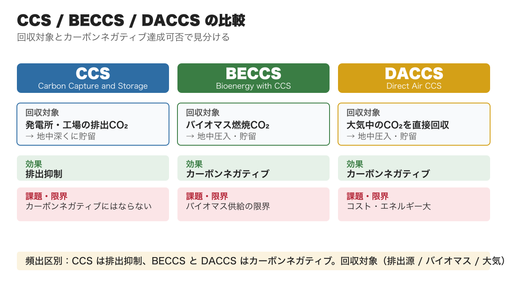
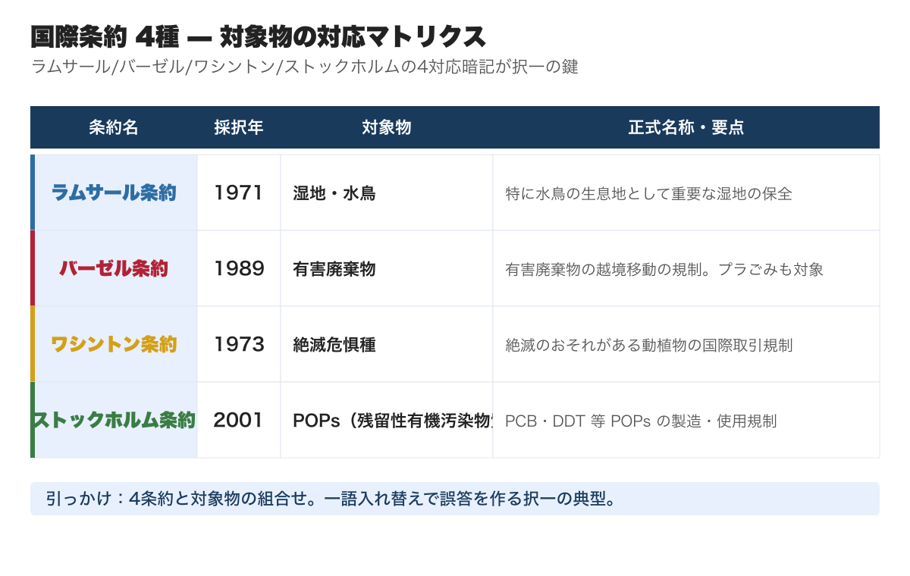
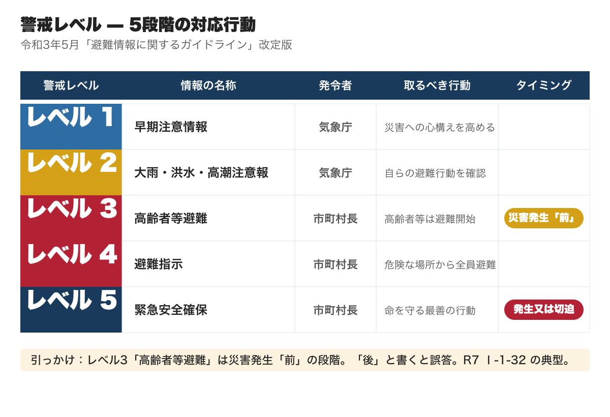
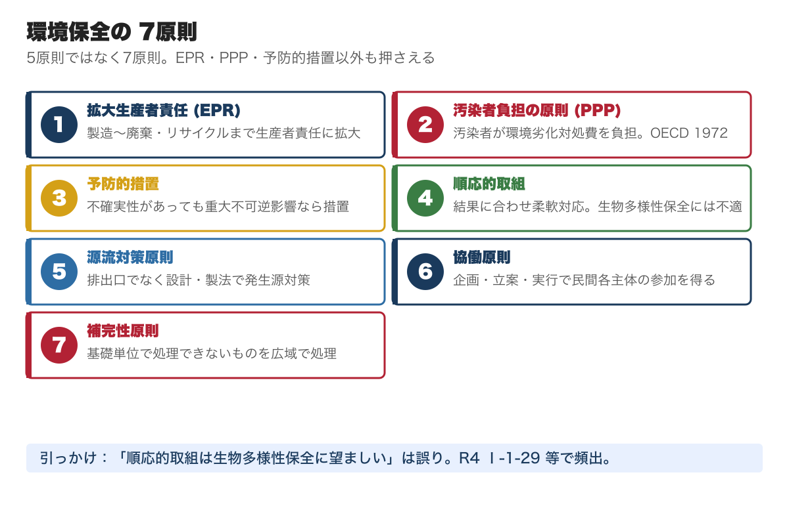
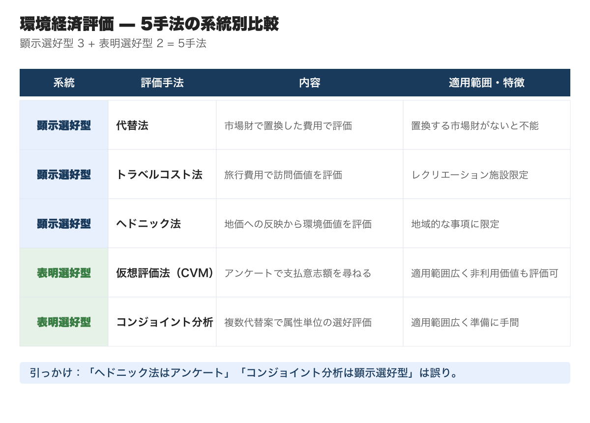
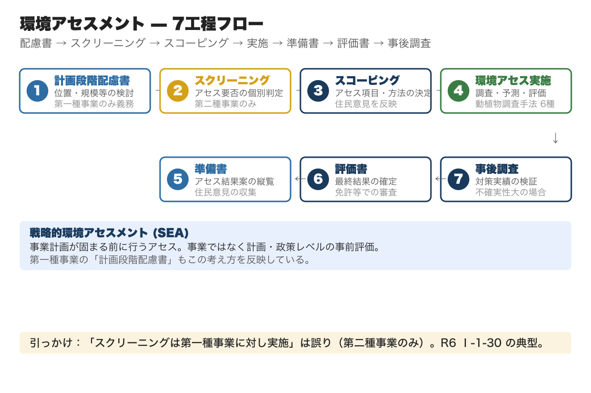
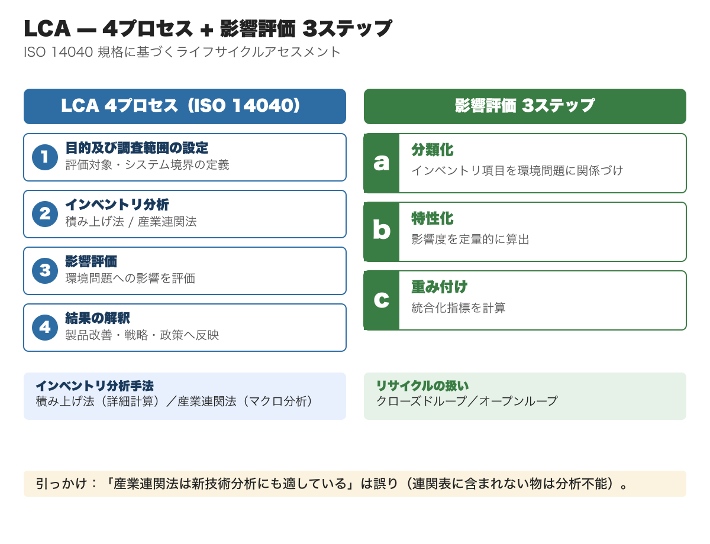
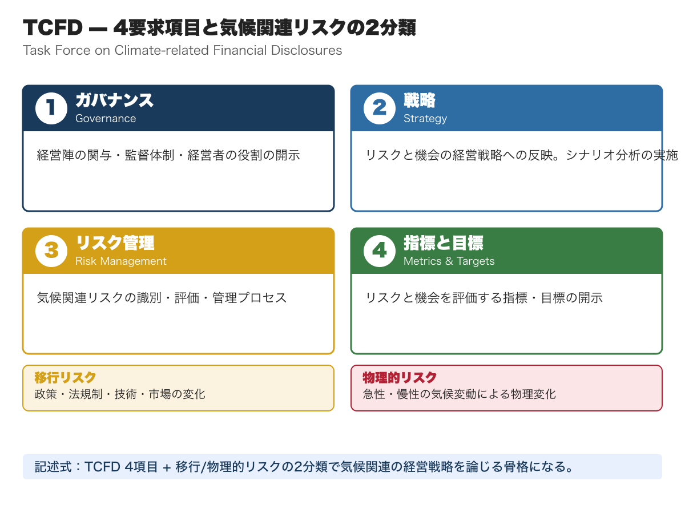

# 社会環境管理｜総監キーワード精読ガイド｜択一・記述直結リンク付き

**こんな人のための記事です**

- 社会環境管理の学習を始めたが、条約・法律・制度の数が多くて整理しきれない
- 択一で社会環境管理の問題を落としがちで、定義の言い換えに引っかかる
- 試験直前に社会環境管理の全体像を素早く頭に入れ直したい

**この記事でわかること**

- 全**2万字超**の精読ガイド（キーワード解説リンク・出題例15件・e-gov ／UNFCCC 法令リンク込み）
- **4大エリア + 30+ 細目** を試験優先度順に再整理
- 国際条約4種・環境基本法7原則・環境経済評価5手法・LCA 4プロセス・環境アセスメント全工程など、択一頻出論点を散文で解説
- 各キーワードの doboku-note 解説ページへの直リンク（クリックで定義・過去問・周辺概念が一気に確認できる）
- R3〜R7 の社会環境管理 過去問から **15件** をピックアップし、本文の論点直後に出題例として埋め込み

---

キーワード集を読んでも論点が頭に入らない、択一の引っかけパターンが見えない、5管理の範囲が広すぎてどこから手を付ければいいか優先順位がつかない──そんな受験者のために、17年分の過去問680問を分析して5管理を体系化した精読ガイドを、5本セット ¥1,980（単品4本分の値段で5本・21%OFF）でまとめ購入できます。

https://note.com/dobokunote/m/m607bf095b02a

社会環境管理は、5管理の中で **国際条約・環境法規・制度の数が最も多い分野** です。地球的規模の環境問題・地域環境問題・環境保全の基本原則・組織の社会的責任の4大エリアをカバーし、サブトピックは30以上に及びます。

択一の傾向として、条約名・法律名・制度の定義を問う問題が多く、定義文の一語入れ替えで誤答を作る形式が頻出します。記述式では「持続可能な事業運営」を論じる際の語彙として、SDGs・パリ協定・LCA・ESG投資・グリーンインフラなどが幅広く使われます。

全エリアを均等に勉強するのは非効率です。**「環境基本法と7原則」「国際条約4種」「環境アセスメント」「LCA」「ESG投資・TCFD」を最優先** とし、残りはリンク先で確認するのが効率的です。本記事では、択一・記述式の出題視点でポイントを絞り直します。

---

## 地球的規模の環境問題（優先度: 最高）

「持続可能な開発」は、1984年に国連に設置された **環境と開発に関する世界委員会** （[WCED](https://doboku-note.com/docs/pe-comprehensive-management-wced?utm_source=note&utm_medium=referral&utm_campaign=99-social-environment-management)、ブルントラント委員会）で「将来世代のニーズを損なうことなく現在世代のニーズを満たす開発」と定義されました。この定義は択一の選択肢として頻出します。

**[SDGs**（持続可能な開発目標）**](https://doboku-note.com/docs/pe-comprehensive-management-sdgs?utm_source=note&utm_medium=referral&utm_campaign=99-social-environment-management)**

SDGs は2015年9月の国連サミットで採択された「持続可能な開発のための2030アジェンダ」に基づく **2016〜2030年の国際目標** で、17の目標と169のターゲットで構成されます。前身は2001年策定の MDGs（ミレニアム開発目標）です。

**5つの P** — People（人間）／Planet（地球）／Prosperity（繁栄）／Peace（平和）／Partnership（パートナーシップ）。「誰一人取り残さない」をビジョンに掲げます。

**SDGs 実施指針 5原則** — A 普遍性 / B 包摂性 / C 参画型 / D 統合性 / E 透明性と説明責任。

**SDGs 実施指針 8つの優先課題** — ①あらゆる人々が活躍する社会／②健康・長寿の達成／③成長市場の創出・地域活性化・科学技術イノベーション／④持続可能で強靱な国土と質の高いインフラ整備／⑤省・再生可能エネルギー、防災・気候変動対策、循環型社会／⑥生物多様性、森林、海洋等の環境保全／⑦平和と安全・安心社会の実現／⑧SDGs 実施推進の体制と手段。

**[リオ宣言](https://doboku-note.com/docs/pe-comprehensive-management-rio-declaration?utm_source=note&utm_medium=referral&utm_campaign=99-social-environment-management)**

[**国連環境開発会議**](https://doboku-note.com/docs/pe-comprehensive-management-unced-earth-summit?utm_source=note&utm_medium=referral&utm_campaign=99-social-environment-management) （地球サミット）は1992年にブラジルのリオ・デ・ジャネイロで開催され、**環境と開発に関するリオ宣言** （リオ宣言）として持続可能な開発のあり方を示す27の原則が採択されました。同時に「[気候変動枠組条約](https://unfccc.int/)」「生物多様性条約」「森林原則声明」「[アジェンダ21](https://doboku-note.com/docs/pe-comprehensive-management-agenda-21?utm_source=note&utm_medium=referral&utm_campaign=99-social-environment-management)」も採択されています。

**[人間開発指数**（HDI）**](https://doboku-note.com/docs/pe-comprehensive-management-human-development-index?utm_source=note&utm_medium=referral&utm_campaign=99-social-environment-management)** — 国連開発計画が設定した、各国の人間開発の度合いを測る指数。①健康（平均寿命指数）②知識（就学予想年数指数＋平均就学年数指数）③生活水準（GNI）の3分野の平均達成度で評価します。

> **【出題例: [R3年度 Ⅰ-1-33](https://doboku-note.com/docs/pe-comprehensive-management-r03-primary?utm_source=note&utm_medium=referral&utm_campaign=99-social-environment-management#1-33)】** 持続可能な開発に関する記述で最も適切なものはどれか。 → **正答チェック対象：「将来世代のニーズを損なうことなく現在世代のニーズを満たす」というブルントラント定義の整合性。「持続可能な開発」を「経済成長を伴わない発展」と誤解させる選択肢が引っかけ。**

**[パリ協定と気候変動・国際対応](https://doboku-note.com/docs/pe-comprehensive-management-climate-change-international?utm_source=note&utm_medium=referral&utm_campaign=99-social-environment-management)**

**[パリ協定](https://unfccc.int/process-and-meetings/the-paris-agreement)** は2015年12月の COP21 で採択された地球温暖化対策の国際枠組みで、次の要素が盛り込まれています。

- 世界共通の長期目標として **2℃目標** の設定と **1.5℃に抑える努力** を追求
- 主要排出国を含むすべての国が削減目標（NDC）を **5年ごとに提出・更新**
- 二国間クレジット制度を含めた市場メカニズムの活用
- 適応の長期目標を設定し、適応報告書を提出・定期更新
- 先進国が資金提供を継続、途上国も自主的に資金提供
- すべての国が共通かつ柔軟な方法で実施状況を報告し、レビューを受ける
- 5年ごとに世界全体の実施状況を確認する仕組み（グローバル・ストックテイク）

気候変動対応では、温室効果ガス排出を抑制する **緩和策** だけでなく、すでに現れている影響を回避・軽減する **適応策** を合わせて進めることが重要とされています。

**IPCC**（気候変動に関する政府間パネル） — 世界の科学者が集まり気候変動に関する科学的根拠を評価・報告する機関。第5次評価報告書では「温暖化は疑う余地がない」「世界平均地上気温は1880〜2012年で0.85℃上昇」「世界年平均海面水位は1901〜2010年で0.19m上昇」と示されました。

**[地球温暖化対策推進法](https://doboku-note.com/docs/pe-comprehensive-management-global-warming-countermeasures-act?utm_source=note&utm_medium=referral&utm_campaign=99-social-environment-management)** — 国際条約に基づき制定された法律。[第2条](https://laws.e-gov.go.jp/law/410AC0000000117#Mp-At_2)で **温室効果ガス**（GHG）**7種** を定義します。

1. 二酸化炭素（CO₂）
2. メタン（CH₄）
3. 一酸化二窒素（N₂O）
4. ハイドロフルオロカーボン（HFC、19種類）
5. パーフルオロカーボン（PFC、9種類）
6. 六ふっ化硫黄（SF₆）
7. 三ふっ化窒素（NF₃）

我が国の2020年度の温室効果ガス排出量は11億5千万トン（CO₂換算）で、CO₂が90.8%を占めます。世界のエネルギー起源 CO₂ 排出量（2019年）は中国29.4%、米国14.1%、EU 8.9%、日本3.1%（第6位）です。

**[気候変動適応法](https://doboku-note.com/docs/pe-comprehensive-management-climate-change-adaptation-act?utm_source=note&utm_medium=referral&utm_campaign=99-social-environment-management)** — 国・地方公共団体・事業者・国民の責務を定め、政府は **気候変動適応計画** を、都道府県・市町村は **地域気候変動適応計画** の策定に努めるとされています。

**プラネタリー・バウンダリーと脱炭素**

**[プラネタリー・バウンダリー](https://doboku-note.com/docs/pe-comprehensive-management-planetary-boundaries?utm_source=note&utm_medium=referral&utm_campaign=99-social-environment-management)** （地球の限界）— 人類が地球上で持続的に生存していくために超えてはならない地球環境の限界の概念で、9つの指標があります。

1. 気候変動（CO₂濃度・地球と宇宙のエネルギー収支）
2. 大気エアゾルの負荷
3. 成層圏オゾンの破壊
4. 海洋酸性化
5. 淡水変化
6. 土地利用変化
7. 生物圏の一体性
8. 窒素・リンの生物地球化学的循環
9. 新規化学物質（プラスチック等の汚染を含む）

**[ドーナツ経済](https://doboku-note.com/docs/pe-comprehensive-management-doughnut-economics?utm_source=note&utm_medium=referral&utm_campaign=99-social-environment-management)** — ドーナツの内側を「人が暮らすために必須な要素が欠乏した状態」、外側を「地球環境に過負荷がかかっている状況」と捉え、人類はドーナツの食べられる部分の範囲で生活しようと提案する考え方です。

**[カーボンニュートラル](https://doboku-note.com/docs/pe-comprehensive-management-carbon-neutral?utm_source=note&utm_medium=referral&utm_campaign=99-social-environment-management)** — 2050年カーボンニュートラル達成に向け、CO₂回収技術が要となります。

- **CCS** （Carbon dioxide Capture and Storage）— 発電所や化学工場から排出された CO₂ を分離・回収し地中深くに貯留する技術。CO₂ 分離回収法には4種類あります。
  - 吸収法（物理吸収液・化学吸収液）
  - 吸着分離法（物理吸着・化学吸着／吸収・化学吸収炭酸塩系）
  - 膜分離法（有機膜・無機膜）
  - 深冷分離法（液化／蒸留／沸点差）
- **BECCS** （Bioenergy with CCS）— 排出量実質ゼロのバイオマス燃焼で出た CO₂ を回収・貯留することで CO₂ 排出量をマイナス（カーボンネガティブ）にする技術。
- **DACCS** （Direct Air CCS）— 空気中の CO₂ を直接回収（DAC）し CCS と組み合わせる技術。BECCS と並ぶカーボンネガティブ手法。

**[カーボンニュートラル](https://doboku-note.com/docs/pe-comprehensive-management-carbon-neutral?utm_source=note&utm_medium=referral&utm_campaign=99-social-environment-management)** で扱われる「CCS は排出された CO₂ を回収・貯留」「BECCS はバイオマス由来 CO₂ を回収」「DACCS は大気中の CO₂ を直接回収」という3者の違いが択一の引っかけポイントです。

**カーボンフットプリント** — 商品やサービスの原材料調達から廃棄・リサイクルまでのライフサイクル全体で排出される温室効果ガスを CO₂ 換算で表示する制度。LCA の手法を活用し、表示単位は g-CO₂／kg-CO₂／t-CO₂ 換算を使います。

**[エコロジカル・フットプリント](https://doboku-note.com/docs/pe-comprehensive-management-ecological-footprint?utm_source=note&utm_medium=referral&utm_campaign=99-social-environment-management)** — 人が消費するすべての再生可能資源を生産し、活動から発生する CO₂ を吸収するのに必要な生態系サービスの総量を **土地面積**（ha） で表す手法。

「カーボンフットプリント＝CO₂ 換算で表示／エコロジカル・フットプリント＝土地面積で表示」という単位の違いが択一の核心です。

> **【出題例: [R5年度 Ⅰ-1-33](https://doboku-note.com/docs/pe-comprehensive-management-r05-primary?utm_source=note&utm_medium=referral&utm_campaign=99-social-environment-management#1-33)】** 地球温暖化に関する記述で最も適切なものはどれか。 → **正答チェック対象：パリ協定の2℃目標と1.5℃努力目標の整合性、NDC の5年更新、緩和策と適応策の関係。「先進国のみが削減目標を提出する」という京都議定書時代の記述と混同させる引っかけが頻出。**

**国際的な条約**

環境問題は1国の問題ではなく国際的な課題のため、多くの条約が定められています。**ラムサール／バーゼル／ワシントン／ストックホルム** の4条約は対象物の組合せが択一の定番です。

**[ラムサール条約](https://doboku-note.com/docs/pe-comprehensive-management-ramsar-convention?utm_source=note&utm_medium=referral&utm_campaign=99-social-environment-management)** — 1971年にイランのラムサールで締結。正式名称は「特に水鳥の生息地として国際的に重要な湿地に関する条約」。**水鳥や湿地特有の動植物の生息地としての湿地生態系の保全** が目的で、3つの柱は「保全・再生」「賢明な利用」「交流・学習」です。

**[バーゼル条約](https://doboku-note.com/docs/pe-comprehensive-management-basel-convention?utm_source=note&utm_medium=referral&utm_campaign=99-social-environment-management)** — 正式名称は「**有害廃棄物** の越境移動及びその処分の規制に関するバーゼル条約」。先進国で発生した有害廃棄物が発展途上国へ輸出されることを禁止する条約。2019年には「汚れたプラスチックごみ」が追加され、すべてのプラスチック廃棄物が規定対象となりました。

**[ワシントン条約](https://doboku-note.com/docs/pe-comprehensive-management-cites?utm_source=note&utm_medium=referral&utm_campaign=99-social-environment-management)** — 1973年採択、正式名称は「**絶滅のおそれがある野生動植物** の種の国際的取引に関する条約」。野生動植物の国際取引を規制し、種の保護を目的とします。

**[ストックホルム条約](https://doboku-note.com/docs/pe-comprehensive-management-pops-convention?utm_source=note&utm_medium=referral&utm_campaign=99-social-environment-management)** （POPs条約）— 正式名称は「**残留性有機汚染物質** に関するストックホルム条約」。残留性・生物蓄積性があり毒性が高い POPs（PCB、DDT 等）の製造・使用の廃絶・制限、排出削減、廃棄物の適正処理等を規定。

「**ラムサール＝湿地／バーゼル＝有害廃棄物／ワシントン＝絶滅危惧種／ストックホルム＝POPs**」の4対応暗記が択一突破の鍵です。

> **【出題例: [R7年度 Ⅰ-1-33](https://doboku-note.com/docs/pe-comprehensive-management-r07-primary?utm_source=note&utm_medium=referral&utm_campaign=99-social-environment-management#1-33)】** 国際的な環境関係の条約と対象事項の組合せで最も不適切なものはどれか。 → **正答チェック対象：4条約と対象物の対応。ラムサール → 湿地、バーゼル → 有害廃棄物、ワシントン → 絶滅危惧種、ストックホルム → POPs**（残留性有機汚染物質）**。組合せの一語入れ替えで誤答を作る典型的引っかけ。**

**[海洋プラスチック問題](https://doboku-note.com/docs/pe-comprehensive-management-ocean-plastic?utm_source=note&utm_medium=referral&utm_campaign=99-social-environment-management)**

マイクロプラスチックに有害物質が吸着し、食物連鎖で凝縮されて最終的に人体に入ることが懸念されています。**プラスチック資源循環法** （プラスチックに係る資源循環の促進等に関する法律）は次の責務を定めます。

- **事業者** — プラスチック使用製品廃棄物・副産物を分別排出、再資源化に努める
- **消費者** — プラスチック使用製品廃棄物を分別排出、長期使用、過剰使用の抑制
- **国** — 資源循環の促進に必要な資金確保、情報の収集・整理・活用、国民理解の促進
- **市町村** — 区域内のプラスチック使用製品廃棄物の分別収集と再商品化に必要な措置

**生物多様性**

**[生物多様性条約**（CBD）**](https://doboku-note.com/docs/pe-comprehensive-management-convention-on-biodiversity?utm_source=note&utm_medium=referral&utm_campaign=99-social-environment-management)** — 1993年発効。3つの目的が定められています。

1. 生物多様性の保全
2. 生物多様性の構成要素の持続的な利用
3. **遺伝資源の利用から生ずる利益の公正かつ衡平な配分**

**[生物多様性基本法](https://doboku-note.com/docs/pe-comprehensive-management-biodiversity-basic-act?utm_source=note&utm_medium=referral&utm_campaign=99-social-environment-management)** — 「生物の多様性の保全及び持続可能な利用」を目的とする法律。[第3条第5項](https://laws.e-gov.go.jp/law/420AC0000000058#Mp-At_3)で「地球温暖化が生物の多様性に深刻な影響を及ぼすおそれ」と「生物多様性の保全と利用が地球温暖化防止に資する」という相互関係を規定しています。

**[昆明・モントリオール生物多様性枠組み](https://doboku-note.com/docs/pe-comprehensive-management-kunming-montreal-framework?utm_source=note&utm_medium=referral&utm_campaign=99-social-environment-management)** で示された **30by30 目標** は2022年の生物多様性条約 COP15（昆明・モントリオール）で採択され、2021年の G7 サミットで G7各国が自国での実現を約束しました（2030年までに陸と海の30%以上を保全する目標）。**OECM** （保護地区以外で生物多様性保全に資する地域）も併用されます。

**[名古屋議定書](https://doboku-note.com/docs/pe-comprehensive-management-nagoya-protocol?utm_source=note&utm_medium=referral&utm_campaign=99-social-environment-management)** — 2010年に名古屋で採択。正式名称は「生物の多様性に関する条約の遺伝資源の取得の機会及びその利用から生ずる利益の公正かつ衡平な配分に関する名古屋議定書」。**遺伝資源 ABS**（アクセスと利益配分） を国際的に規律する仕組み。日本は2017年批准。

**[SATOYAMA イニシアティブ](https://doboku-note.com/docs/pe-comprehensive-management-satoyama-initiative?utm_source=note&utm_medium=referral&utm_campaign=99-social-environment-management)** — 環境省が、人々が持続的に利用してきた農地や二次的な自然を保全して持続的に利用するパートナーシップとして創設。

**[レッドリスト](https://doboku-note.com/docs/pe-comprehensive-management-red-list?utm_source=note&utm_medium=referral&utm_campaign=99-social-environment-management)** — 国際自然保護連合や環境省が公表する絶滅のおそれのある野生生物の種の一覧。9区分で評価されます（絶滅／野生絶滅／絶滅危惧IA類／IB類／II類／準絶滅危惧／情報不足／絶滅のおそれのある地域個体群）。

**カルタヘナ議定書** — 2000年採択。**遺伝子組換え生物等が生物多様性に及ぼす可能性のある悪影響を防止** するための措置を規定。

**[IPBES](https://doboku-note.com/docs/pe-comprehensive-management-ipbes?utm_source=note&utm_medium=referral&utm_campaign=99-social-environment-management)** （生物多様性及び生態系サービスに関する政府間科学一政策プラットフォーム）— 2012年設立の政府間組織。①科学的評価／②能力養成／③知見生成／④政策立案支援の4機能を持ち、各国の政策に活用されています。

**[外来生物法](https://doboku-note.com/docs/pe-comprehensive-management-invasive-alien-species?utm_source=note&utm_medium=referral&utm_campaign=99-social-environment-management)** — 正式名称は「特定外来生物による生態系等に係る被害の防止に関する法律」。第2条で **特定外来生物** を「海外から導入されることにより本来の生息地外に存することとなる生物で、在来生物と性質が異なることにより生態系等に被害を及ぼし又はおそれがあるものとして政令で定めるものの個体（卵、種子等を含み、生きているものに限る）」と定義します。

択一の引っかけポイントは「**菌類・細菌類・ウイルス等の微生物は対象外**」という点と、「**意図的か非意図的かを問わず国内に侵入した外来生物は特定外来生物に指定**」される点です。

> **【出題例: [R4年度 Ⅰ-1-35](https://doboku-note.com/docs/pe-comprehensive-management-r04-primary?utm_source=note&utm_medium=referral&utm_campaign=99-social-environment-management#1-35)】** 外来生物法に関する記述で最も不適切なものはどれか。 → **正答チェック対象：「微生物**（菌類・細菌類・ウイルス）**は対象に含まれる」とする選択肢は誤り。第2条の対象範囲は「卵、種子その他政令で定めるもの」で微生物は当分の間対象外とされている。**

**[エネルギー](https://doboku-note.com/docs/pe-comprehensive-management-energy?utm_source=note&utm_medium=referral&utm_campaign=99-social-environment-management) と政策**

**第六次エネルギー基本計画** （令和3年10月閣議決定）— 2050年カーボンニュートラルと2030年度の温室効果ガス46%削減（2013年度比）を踏まえた基本計画。

**S+3E** — エネルギー政策の基本的視点。**Safety**（安全性）**+ Energy security**（安定供給）**+ Economic efficiency**（経済効率性）**+ Environment**（環境適合性） の4つの政策目標です。

択一の引っかけポイントは並び順の入れ替えと、「経済性が最優先」とする誤った主張。**S**（安全）**が大前提** で、続く3E は同列に近い扱いです。

**各エネルギー源の位置づけ**

- **再生可能エネルギー** — 主力電源化を徹底し、最優先の原則で取り組む。国民負担の抑制と地域との共生を図りながら最大限の導入を促す。
- **化石エネルギー** — 重要なエネルギー源だが、脱炭素化のため CCUS 技術や合成燃料・合成メタン等の脱炭素化の鍵を握る技術を確立しコスト低減を目指しながら活用。
- **原子力エネルギー** — 安全を最優先し、再生可能エネルギー拡大を図る中で **可能な限り原発依存を低減**。

**新エネルギー法** （新エネルギー利用等の促進に関する特別措置法）— 第1条で新エネルギー利用等を円滑に進める目的を規定。施行令第1条で新エネルギーを定義し、バイオマス、太陽熱利用、雪氷熱、地熱発電（ペンタン等）、風力、1000kW以下の水力、太陽電池発電などを含めます。

**再生可能エネルギーの固定価格買取制度**（FIT） — 太陽光・風力・水力・地熱・バイオマスの5つを対象に、電気事業者が一定価格で一定期間買い取ることを規定。費用は電気使用者が **再生可能エネルギー賦課金** として負担します。FIT から **FIP** （フィードインプレミアム：市場価格に補助額を上乗せ）への制度移行が進んでいます。

**省エネルギー技術**

- **トップランナー制度** （省エネ法）— 製造業者の判断基準として、3〜10年先の最も優れた機器水準＋技術進歩を基準にする。電気機器・自動車・情報機器・建材まで対象が広がっています。
- **建築物省エネルギー法** — 住宅・建築物の省エネ対策強化を目的に、オフィスビル・マンション・戸建住宅等に措置を定めます。
- **ESCO 事業** （Energy Service Company）— エネルギー診断 + 省エネ計画・システム設計 + 資金調達 + 改修後の運用管理までを包括的に提供するサービス。
- **コンパクトシティ** — 限られた資源を集約・効率的に利用し、持続可能な都市・社会を実現する考え方。財政・高齢者環境・地球環境・防災の4視点で必要とされます。
- **スマートグリッド** — 利用者にも発電容量に合わせて需要量を調整してもらう新しい電力システム。
- **コージェネレーションシステム** — 原動機を一次エネルギーで駆動して発電し、発生する排熱を熱として利用する **熱電併給システム**。工場・食品加工工場・ホテル・病院などへの応用が進んでいます。

> **【出題例: [R5年度 Ⅰ-1-34](https://doboku-note.com/docs/pe-comprehensive-management-r05-primary?utm_source=note&utm_medium=referral&utm_campaign=99-social-environment-management#1-34)】** 第六次エネルギー基本計画に関する記述で最も適切なものはどれか。 → **正答チェック対象：S+3Eの構成、再生可能エネルギーの主力電源化方針、原子力依存の低減方針。「経済効率性が最優先」「原発依存を高める方針」とする選択肢は誤り。**

---

## 地域環境問題（優先度: 高）

**[循環型社会形成推進基本法](https://doboku-note.com/docs/pe-comprehensive-management-circular-society-basic-act?utm_source=note&utm_medium=referral&utm_campaign=99-social-environment-management)**

第7条で、廃棄物・資源利用の処理順序が次のように定められています。

**3R+2 の優先順位** — Reduce（発生抑制）→ Reuse（再使用）→ Recycle（再生利用）→ 熱回収 → 適正処分。

「**リデュースが最上位**」（発生抑制）が択一の引っかけです。「リサイクルが最上位」「Recycle と Reuse は同列」とする誤った選択肢が頻出します。第四次循環型社会形成推進基本計画では、Reduce と Reuse の取組が遅れているため **2R** という言葉も使われています。

**循環型社会形成推進基本計画** の物質フロー指標（2025年度目標）— 資源生産性 約49万円/トン、入口側循環利用率 約18%、出口側循環利用率 約47%、最終処分量 約1,300万トン。

**リサイクル関連法**

リサイクルに関連する法律は対象物別に6種あります。

- **容器包装リサイクル法** — びん、ペットボトル、紙製・プラスチック製容器包装等
- **家電リサイクル法** — エアコン、テレビ、電気冷蔵庫・冷凍庫、電気洗濯機・衣類乾燥機
- **食品リサイクル法** — 食品残さ（事業系食品ロス半減目標）
- **建設リサイクル法** — 木材、コンクリート、アスファルト
- **自動車リサイクル法** — 使用済自動車（自動車破砕残さ・指定回収物品・フロン類）
- **小型家電リサイクル法** — 使用済小型電子機器等

法律名と対象品目の組合せが択一の頻出形式です。

**[廃棄物処理法](https://doboku-note.com/docs/pe-comprehensive-management-waste-management-act?utm_source=note&utm_medium=referral&utm_campaign=99-social-environment-management)**

正式名称は「廃棄物の処理及び清掃に関する法律」。第2条で廃棄物を区分します。

- **一般廃棄物** — 産業廃棄物以外の廃棄物（家庭系ごみ・事業系ごみ・し尿・特別管理一般廃棄物）。**処理責任は市町村**。
- **産業廃棄物** — 事業活動に伴って生じた廃棄物のうち燃え殻、汚泥、廃油、廃酸、廃アルカリ、廃プラスチック類等の20種類＋特別管理産業廃棄物。**処理責任は事業者**。
- **特別管理産業廃棄物** — 「爆発性、毒性、感染性その他の人の健康又は生活環境に係る被害を生ずるおそれがある性状を有するもの」と政令で定めるもの。

**マニフェスト制度** （産業廃棄物管理票）— 排出事業者が処理受託者に交付し、収集・運搬業者や処分業者が必要内容を記載した管理票の写しを一定期間内に排出事業者に返送する仕組み。**マニフェストは返送日から5年間保存** が義務。電子マニフェスト（情報処理センター経由）の導入も進んでいます。

> **【出題例: [R6年度 Ⅰ-1-36](https://doboku-note.com/docs/pe-comprehensive-management-r06-primary?utm_source=note&utm_medium=referral&utm_campaign=99-social-environment-management#1-36)】** 廃棄物処理法に関する記述で最も適切なものはどれか。 → **正答チェック対象：マニフェスト制度の保存期間**（5年）**、一般廃棄物の処理責任**（市町村）**、特別管理産業廃棄物の判定基準。「マニフェストは3年保存」「一般廃棄物の処理責任は事業者」とする選択肢は誤り。**

**グリーン購入法・環境配慮契約法・環境配慮促進法**

国・地方公共団体に環境配慮を求める3つの法律はセットで覚えます。

- **グリーン購入法** — 国等による環境物品等の調達の推進等に関する法律。**国・独立行政法人・地方公共団体は環境物品等の調達推進方針を作成し、その方針に基づき調達** することが努力義務。
- **環境配慮契約法** — 国等における温室効果ガス等の排出の削減に配慮した契約の推進に関する法律。**国等が排出する温室効果ガス等の削減** に配慮した契約推進が目的。
- **環境配慮促進法** — 環境情報の提供の促進等による特定事業者等の環境に配慮した事業活動の促進に関する法律。**特定事業者は事業年度終了後6月以内に環境報告書を作成・公表** する義務、大企業は努力義務。

**環境報告書の記載事項** — ①経営責任者の緒言／②環境保全に関する方針・目標・計画／③環境マネジメントに関する状況／④環境負荷の低減に向けた取組の状況。

**[PRTR 法](https://doboku-note.com/docs/pe-comprehensive-management-prtr-act?utm_source=note&utm_medium=referral&utm_campaign=99-social-environment-management)**

正式名称は「特定化学物質の環境への排出量の把握等及び管理の改善の促進に関する法律」（化管法）。**有害性のある化学物質の環境への排出量の把握と移動量を登録して公表する仕組み** で、第一種指定化学物質等取扱事業者に把握・届出を義務化しています。

**SDS** （Safety Data Sheet：安全データシート）制度 — 第14条に基づき、指定化学物質等を譲渡・提供する際に当該物質の性状・取扱情報を文書または磁気ディスクで提供する義務。**GHS** （化学品の分類および表示に関する世界調和システム）に準拠し、JIS Z 7252（分類方法）と JIS Z 7253（伝達方法）が規定されています。

**「PRTR 法 ＝ 事業者の自主的な化学物質管理改善の促進」** が択一の核心です。

**大気・水質・土壌・騒音**

地域環境問題は環境媒体ごとに4法律が定められています。

- **[大気汚染防止法](https://doboku-note.com/docs/pe-comprehensive-management-air-pollution-control-act?utm_source=note&utm_medium=referral&utm_campaign=99-social-environment-management)** — ばい煙、揮発性有機化合物、粉じん、水銀、有害大気汚染物質、自動車排出ガスを規制。**石綿** に関しては第18条の15第6項で解体等工事の元請業者・自主施工者に都道府県知事への調査結果報告を義務化。
- **[水質汚濁防止法](https://doboku-note.com/docs/pe-comprehensive-management-water-pollution-control-act?utm_source=note&utm_medium=referral&utm_campaign=99-social-environment-management)** — 工場・事業場から公共用水域に排出される水と地下浸透水を規制。生活排水対策の推進、被害者の保護も目的。
- **[土壌汚染対策法](https://doboku-note.com/docs/pe-comprehensive-management-soil-contamination-act?utm_source=note&utm_medium=referral&utm_campaign=99-social-environment-management)** — 「特定有害物質」（鉛、ひ素、トリクロロエチレン等）による土壌汚染を対象に、状況把握と被害防止措置を定める。**自然由来汚染も対象** （平成22年通知）が引っかけ。
- **騒音規制法** — 第16条で **自動車騒音の許容限度** を環境大臣が定めることを規定。第17条で市町村長は道路周辺の生活環境が著しく損なわれると認めるときは都道府県公安委員会に道路交通法上の措置を要請する。

**PM2.5** — 浮遊粒子状物質のうち粒径2.5μm以下のもの。肺の奥深くまで入りやすく、ぜんそく・肺がんに加え不整脈や心臓発作の要因。**環境基準は年平均15μg/m³以下、日平均35μg/m³以下**。直接排出と二次生成（SOx・NOx・VOC からの粒子化）があり、西日本での越境汚染の寄与が大きい（九州地方で約7割）。

**[ダイオキシン類対策特別措置法](https://doboku-note.com/docs/pe-comprehensive-management-dioxin-countermeasures-act?utm_source=note&utm_medium=referral&utm_campaign=99-social-environment-management)** — 製鋼用電気炉、廃棄物焼却炉等を「特定施設」として規制。

**異常気象**

気候変動監視レポート2021では「1時間降水量50mm以上及び80mm以上の短時間強雨の年間発生回数はともに増加」と示されています。

**[ヒートアイランド現象](https://doboku-note.com/docs/pe-comprehensive-management-heat-island-effect?utm_source=note&utm_medium=referral&utm_campaign=99-social-environment-management)** — 都市排熱（ビル・自動車）により都市部で気温が局地的に高くなる現象。局地的大雨や竜巻など **都市型水害** の発生要因にもなります。**屋上緑化** は省エネ対策としても評価されています。

**気候変動影響評価報告書** （2020年12月、環境省）— 日本の気候の長期的傾向。

- 年平均気温は世界平均より上昇速度が大きい（日本100年で1.24℃ vs 世界100年で0.74℃）
- 猛暑日は増加、冬日は減少
- 短時間強雨の年間発生回数は1976〜2019年で増加
- 日降水量1.0mm以上の日数は減少 → **無降水日が増加**

**[ハザードマップ](https://doboku-note.com/docs/pe-comprehensive-management-hazard-map?utm_source=note&utm_medium=referral&utm_campaign=99-social-environment-management)** — 自然災害による被害軽減・防災対策のため、被災想定区域・避難場所・避難経路を表示した地図。洪水・津波・土砂災害・火山ハザードマップなど災害種別がある。水防法第15条第3項で浸水想定区域を含む市町村長に住民周知の義務を規定。

**流域治水** — 集水域・河川区域・氾濫域を含めて1つの流域として捉え、関係者が協働した水災害対策。**「氾濫をできるだけ防ぐ・減らす」「被害対象を減少させる」「被害の軽減・早期復旧」を多層的・ハードソフト一体で進める** のが特徴。関連概念として[都市型水害](https://doboku-note.com/docs/pe-comprehensive-management-urban-flood?utm_source=note&utm_medium=referral&utm_campaign=99-social-environment-management)も参照。

**[警戒レベル 5段階](https://doboku-note.com/docs/pe-comprehensive-management-alert-levels?utm_source=note&utm_medium=referral&utm_campaign=99-social-environment-management)** （令和3年5月改定の「避難情報に関するガイドライン」）— 5段階で対応を区分します。

- **レベル1** — 早期注意情報 （気象庁発表）。災害への心構えを高める。
- **レベル2** — 大雨・洪水・高潮注意報 （気象庁発表）。自らの避難行動を確認。
- **レベル3** — **高齢者等避難** （市町村長発令）。**災害発生「前」** の段階で高齢者等は避難開始。
- **レベル4** — **避難指示** （市町村長発令）。危険な場所から全員避難。
- **レベル5** — **緊急安全確保** （市町村長発令）。**災害発生又は切迫**。命を守る最善の行動。

**特別警報** — 警報の発表基準をはるかに超える大雨や大津波等が予想され、重大な災害が起こるおそれが著しく高まっている場合に気象庁が発表する最大級の警報。

択一の引っかけポイントは **レベル3**（高齢者等避難）**は災害発生「前」の段階** という点です。「災害発生『後』」と誤らせる選択肢が頻出します。

**[グリーンインフラ](https://doboku-note.com/docs/pe-comprehensive-management-green-infrastructure?utm_source=note&utm_medium=referral&utm_campaign=99-social-environment-management)** — 「社会資本整備や土地利用等のハード・ソフト両面において、自然環境が有する多様な機能を活用し、持続可能で魅力ある国土・都市・地域づくりを進める取組」（令和元年7月「グリーンインフラ推進戦略」）。

**特徴と意義** — 機能の多様性／多様な主体の参画／時間の経過とともに機能を発揮。

**社会的・経済的背景** — ①気候変動への対応／②グローバル社会での都市の発展／③SDGs・ESG 投資との親和性／④人口減少社会での土地利用変化／⑤既存ストックの維持管理／⑥自然と共生する社会／⑦歴史・生活・文化等に根ざした基盤。

> **【出題例: [R4年度 Ⅰ-1-37](https://doboku-note.com/docs/pe-comprehensive-management-r04-primary?utm_source=note&utm_medium=referral&utm_campaign=99-social-environment-management#1-37)】** 警戒レベルに関する記述で最も適切なものはどれか。 → **正答チェック対象：警戒レベル3**（高齢者等避難）**は災害発生「前」、レベル4**（避難指示）**は災害のおそれ高い段階、レベル5**（緊急安全確保）**は発生又は切迫。「レベル3が災害発生後」とする選択肢は誤り。**

**放射性物質汚染対策と景観法**

**[放射性物質汚染対策対処特措法](https://doboku-note.com/docs/pe-comprehensive-management-radioactive-decontamination-act?utm_source=note&utm_medium=referral&utm_campaign=99-social-environment-management)** — 東日本大震災で発生した原子力発電所事故の放射性物質対策のための法律。**特定廃棄物** （対策地域内廃棄物＋指定廃棄物）の処理基準と、**除染特別地域** （環境省令の要件に該当する地域、国が除染を実施）を規定。

**[景観法](https://laws.e-gov.go.jp/law/416AC0000000110)** — 「美しく風格のある国土の形成、潤いのある豊かな生活環境の創造及び個性的で活力ある地域社会の実現」が目的。**景観行政団体** は地方自治法の指定都市・中核市、その他の区域では都道府県。**景観計画** は環境基本法・都市計画法・自然公園法に適合させる必要があります。基本理念4項目と景観計画の必須記載事項6項目（区域・行為制限・景観重要建造物等の指定方針・形態色彩制限・高さ制限・敷地面積最低限度）が択一の論点。

---

## 環境保全の基本原則（優先度: 高）

**[環境基本法](https://doboku-note.com/docs/pe-comprehensive-management-environmental-basic-act?utm_source=note&utm_medium=referral&utm_campaign=99-social-environment-management)**

日本の環境政策の基本法。理念・各主体の責務・施策の基本となる事項を定めています。

**環境保全の理念 3項目**

- **第3条** — 環境の恵沢の享受と継承等。「現在及び将来の世代の人間が健全で恵み豊かな環境の恵沢を享受するとともに人類の存続の基盤である環境が将来にわたって維持されるように適切に行われなければならない。」
- **第4条** — 環境への負荷の少ない持続的発展が可能な社会の構築等。「すべての者の公平な役割分担の下に自主的かつ積極的に行われる」「科学的知見の充実の下に環境の保全上の支障が未然に防がれる」
- **第5条** — 国際的協調による地球環境保全の積極的推進。「地球環境保全は人類共通の課題」「国際的協調の下に積極的に推進」

**第14条 施策の基本となる事項 3点**

1. 大気・水・土壌その他の環境の自然的構成要素が良好な状態に保持されること
2. 生態系の多様性、野生生物の種の保存、森林・農地・水辺地等の多様な自然環境の体系的保全
3. 人と自然との豊かな触れ合いが保たれること

**[環境基本計画](https://doboku-note.com/docs/pe-comprehensive-management-environmental-basic-plan?utm_source=note&utm_medium=referral&utm_campaign=99-social-environment-management)** — 第15条で規定。第五次環境基本計画（2018年閣議決定）は2030アジェンダ・パリ協定を踏まえて策定され、**6つの重点戦略** （経済・国土・地域・暮らし・技術・国際）と **6つの環境政策** （気候変動対策／循環型社会形成／生物多様性確保・自然共生／環境リスク管理／基盤施策／東日本大震災復興・大規模災害対応）で構成されます。「**[地域循環共生圏](https://doboku-note.com/docs/pe-comprehensive-management-regional-circular-symbiosis?utm_source=note&utm_medium=referral&utm_campaign=99-social-environment-management)の創造**」が目指すべき社会の姿として示されています。

**予防的取組方法** — 第3章第1項で「環境影響が懸念される問題については、科学的に不確実であることをもって対策を遅らせる理由とせず、予防的な対策を講じていくべき」と規定。安全管理の **ALARP / 予防原則** と通じる考え方です。

**環境政策の7手法**

- **規制的手法** — 法令で目標と遵守事項を示し統制的に達成（行為規制・パフォーマンス規制）
- **枠組規制的手法** — 目標達成や手続きを義務付け（一定の手順を踏む）
- **経済的手法** — 経済的インセンティブで誘導（環境税・課徴金・デポジット制度）
- **自主的取組手法** — 事業者が自主的に行動計画を設定（[バックキャスティング](https://doboku-note.com/docs/pe-comprehensive-management-backcasting?utm_source=note&utm_medium=referral&utm_campaign=99-social-environment-management)・フォアキャスティング）
- **情報的手法** — 環境負荷情報の開示で誘導（環境ラベル・SDS・環境報告書）
- **手続的手法** — 意思決定過程に環境配慮判断を組み込む（環境影響評価制度・PRTR制度）
- **事業的手法** — 国・地方公共団体が事業として実施（公共事業）

**[バックキャスティング](https://doboku-note.com/docs/pe-comprehensive-management-backcasting?utm_source=note&utm_medium=referral&utm_campaign=99-social-environment-management)** — 最初に目標とする未来像を描き、その実現のための道筋を未来像から現在にさかのぼって検討する手法。**フォアキャスティング** は現状の社会構造・外部環境を前提として将来の環境目標は明示せずできるところから行う手法。

**[環境基準](https://doboku-note.com/docs/pe-comprehensive-management-environmental-standards?utm_source=note&utm_medium=referral&utm_campaign=99-social-environment-management)** — 第16条で「**大気・水・土壌・騒音** に係る環境上の条件で、人の健康保護・生活環境保全のため維持されることが望ましい基準」と規定。**常に適切な科学的判断を加え必要な改定** が義務。

**大気環境基準 5物質** — 二酸化硫黄／一酸化炭素／浮遊粒子状物質／二酸化窒素／光化学オキシダント。

> **【出題例: [R7年度 Ⅰ-1-39](https://doboku-note.com/docs/pe-comprehensive-management-r07-primary?utm_source=note&utm_medium=referral&utm_campaign=99-social-environment-management#1-39)】** 環境基本法に関する記述で最も適切なものはどれか。 → **正答チェック対象：3つの理念**（第3条・第4条・第5条）**の整合性、施策基本3点、予防的取組方法。「経済発展と環境保全のいずれか一方を優先する」とする選択肢は誤り。**

**環境保全の7原則**

環境保全のため設けられた基本原則は7つあります。テキストでは（5原則ではなく）**7原則** であることに注意。

- **[拡大生産者責任**（EPR）**](https://doboku-note.com/docs/pe-comprehensive-management-extended-producer-responsibility?utm_source=note&utm_medium=referral&utm_campaign=99-social-environment-management)** — Extended Producer Responsibilities。OECD が提唱。製品の **製造・流通・消費** だけでなく **廃棄・リサイクル** に要する費用までも生産者の責任に拡大。循環型社会形成基本法の一原則となっており、**[環境配慮設計**（DfE）**](https://doboku-note.com/docs/pe-comprehensive-management-design-for-environment?utm_source=note&utm_medium=referral&utm_campaign=99-social-environment-management)** の促進が期待されます。
- **[汚染者負担の原則**（PPP）**](https://doboku-note.com/docs/pe-comprehensive-management-polluter-pays-principle?utm_source=note&utm_medium=referral&utm_campaign=99-social-environment-management)** — Polluter Pays Principal。OECD が1972年に取り入れ。汚染者が環境劣化に対処する費用を負担。**地域的な汚染や廃棄物処理には適用容易だが、地球温暖化のような全地球的影響には適用が難しい**。
- **[予防的措置](https://doboku-note.com/docs/pe-comprehensive-management-precautionary-principle?utm_source=note&utm_medium=referral&utm_campaign=99-social-environment-management)** — 環境に重大かつ不可逆的な影響を及ぼす可能性がある場合、**科学的因果関係が十分証明されないような不確実性があっても規制的措置を行う**。生物多様性にも適用される。
- **順応的取組** — 自然の環境変動による想定外の事態を **管理システムにあらかじめ取り込み、結果に合わせて柔軟に対応** する方法。自然再生に用いられるが、**生物多様性の保全に適用するのは望ましくない**。
- **[源流対策原則](https://doboku-note.com/docs/pe-comprehensive-management-source-control-principle?utm_source=note&utm_medium=referral&utm_campaign=99-social-environment-management)** — 排出口での規制ではなく、**製品の設計や製法に工夫を加え、汚染物質や排出物をそもそも作らない** ことを優先する原則。
- **協働原則** — 公共主体が政策を行う場合、**企画・立案・実行の各段階で民間各主体の参加** を得る原則。
- **[補完性原則](https://doboku-note.com/docs/pe-comprehensive-management-subsidiarity-principle?utm_source=note&utm_medium=referral&utm_campaign=99-social-environment-management)** — 基礎的な行政単位で処理できる事柄はその行政単位に任せ、**そうでない事柄に限って広域的な行政単位** が処理する考え方。

択一の引っかけは「**順応的取組は生物多様性保全に適用しない**」「**EPR は製造段階のみの責任ではなく廃棄・リサイクルまで含む**」という点です。

> **【出題例: [R3年度 Ⅰ-1-38](https://doboku-note.com/docs/pe-comprehensive-management-r03-primary?utm_source=note&utm_medium=referral&utm_campaign=99-social-environment-management#1-38)】** 環境保全の原則に関する記述で最も不適切なものはどれか。 → **正答チェック対象：拡大生産者責任の範囲、汚染者負担原則の適用限界、予防的措置の要件、順応的取組の対象範囲。「順応的取組は生物多様性保全に望ましい手法」とする選択肢は誤り。**

**環境経済評価**

環境利用の内部化や経済的価値評価のため、新たな評価手法が必要となりました。手法は **顕示選好型** と **表明選好型** の2系統に分かれ、合計5手法があります。

**顕示選好型** — 実際の市場行動から環境価値を推定する3手法

- **代替法** — 環境財を市場財で置換した費用で評価。必要情報が少ない半面、置換できる市場財がない場合は評価不能
- **トラベルコスト法** — 旅行費用で訪問価値を評価。情報入手が容易だが、レクリエーション施設に限定
- **ヘドニック法** — 地価への反映から環境価値を評価。市場データから取得可能だが、地域的な事項に限定

**表明選好型** — アンケートで仮想状況を提示して選好を引き出す2手法

- **仮想評価法**（CVM） — 支払意志額・受入補償額をアンケートで尋ねる。適用範囲が広く非利用価値も評価可能だが、アンケート設計で結果が左右される
- **コンジョイント分析** — 複数の代替案を示し属性単位で選好評価。適用範囲広いが、準備に手間がかかり評価結果にも影響が出やすい

仮想評価法では **Yes/No の二項選択方式** が回答者の購買行動に類似するため無回答が少なく多用されます。**プレテスト** で調査票の問題チェックを行います。**インターネットアンケートのみ** での仮想評価は回答者の偏りが生じるため望ましくないとされています。

**個人選好に訴える手法** — エコマーク、環境報告書の公表など、環境意識の高い消費者に情報を発信して環境負荷軽減を促進。

**費用内部化の手法** — 環境税、課徴金、京都議定書の排出権取引、補助金（太陽光発電設置等）。

> **【出題例: [R5年度 Ⅰ-1-37](https://doboku-note.com/docs/pe-comprehensive-management-r05-primary?utm_source=note&utm_medium=referral&utm_campaign=99-social-environment-management#1-37)】** 環境経済評価手法に関する記述で最も不適切なものはどれか。 → **正答チェック対象：5手法の系統分類、顕示選好型 vs 表明選好型、各手法の適用範囲。「ヘドニック法はアンケート手法」「コンジョイント分析は顕示選好型」とする選択肢は誤り。**

**[環境影響評価**（環境アセスメント）**](https://doboku-note.com/docs/pe-comprehensive-management-environmental-impact-assessment?utm_source=note&utm_medium=referral&utm_campaign=99-social-environment-management)**

大規模な開発事業を行うときに、あらかじめその開発が環境に与える影響を予測・評価し、住民・関係自治体の意見を聴いたり専門家の審査を受けることで適正な環境配慮を確保する手続き。**[環境影響評価法](https://laws.e-gov.go.jp/law/409AC0000000081)** に定められています。

**13対象事業** — 道路（高速自動車国道、首都高速道路、一般国道、林道）／河川（ダム、堰、放水路、湖沼開発）／鉄道（新幹線、鉄道、軌道）／飛行場／発電所（水力・火力・地熱・原子力・風力）／廃棄物最終処分場／埋立て・干拓／土地区画整理事業／新住宅市街地開発事業／工業団地造成事業／新都市基盤整備事業／流通業務団地造成事業／宅地造成事業。

**第一種事業 vs 第二種事業**

- **第一種事業** — 規模が大きく環境影響の程度が著しいおそれがあるもの。**環境アセスメントが義務**。計画立案段階で **計画段階配慮事項** を検討し、**計画段階環境配慮書** を作成しなければならない。
- **第二種事業** — 第一種事業に準ずる規模で、おそれがあるかどうか個別判定が必要なもの。判定に基づきアセスを実施。

**環境アセスメントの手続き 7工程**

1. **計画段階環境配慮書** — 第一種事業の事業者が、計画立案段階で位置・規模等を決定するに当たり環境保全配慮事項をまとめる書類。住民・専門家・地方公共団体・環境大臣・主務大臣の意見を取り入れる。第二種事業は任意。
2. **第二種事業の判定**（スクリーニング） — 第二種事業で環境アセスメントを行うかどうかの個別判定。都道府県知事の意見を聴き、主務大臣が環境大臣の判定基準に則って実施。
3. **環境アセスメント方法の決定**（スコーピング） — 環境影響方法書を作成・公表し、地方公共団体庁舎・事業者事務所・ウェブサイトで1ヶ月縦覧、説明会開催。住民・地方公共団体の意見を踏まえアセス方法を決定。
4. **環境アセスメントの実施** — 選定された項目・方法に基づいて調査・予測・評価を実施。動植物の調査手法（フィールドサイン法・トラップ法・無人撮影法・ラインセンサス法・定点記録法・ライトトラップ法・ベイトトラップ法・ツルグレン法・コドラート法）を組み合わせる。
5. **環境影響評価準備書** — 調査・予測・評価結果から事業者の考えをまとめ都道府県知事・市町村長へ送付。1ヶ月縦覧、説明会、意見提出。
6. **環境影響評価書** — 必要に応じて見直した後、事業免許を行う者と環境大臣に送付。環境大臣の意見・助言を踏まえ、最終評価書を確定し公告・縦覧。
7. **事後調査** — 環境保全対策の実績が少ない・不確実性が大きい・影響が大きい場合に実施。報告書を事業免許を行う者と環境大臣に送付し公表。

**戦略的環境アセスメント**（SEA） — 事業計画が固まる前に行う環境アセスメント。**事業ではなく計画・政策レベルの事前評価** で、環境配慮により柔軟な取り組みが可能になります。

**地方自治体の環境アセスメント制度** — 都道府県・政令指定都市は条例を設けるが、**環境影響評価法との重複を避けるため対象は法対象外の事業**。

> **【出題例: [R5年度 Ⅰ-1-39](https://doboku-note.com/docs/pe-comprehensive-management-r05-primary?utm_source=note&utm_medium=referral&utm_campaign=99-social-environment-management#1-39)】** 環境影響評価法に関する記述で最も適切なものはどれか。 → **正答チェック対象：第一種事業の義務、計画段階環境配慮書、スクリーニングとスコーピングの位置づけ、SEA との関係。「スクリーニングは第一種事業に対し実施」とする選択肢は誤り**（第二種事業のみ）**。**

**[ライフサイクルアセスメント**（LCA）**](https://doboku-note.com/docs/pe-comprehensive-management-lifecycle-assessment?utm_source=note&utm_medium=referral&utm_campaign=99-social-environment-management)**

ある製品またはサービスのライフサイクル（**原材料調達→製造→流通→使用→廃棄・リサイクル**）における環境負荷を定量的に評価する手法。最も多い対象は CO₂ で、ISO 14040 規格に基づく4プロセスで実施されます。

1. **目的及び調査範囲の設定**
2. **インベントリ分析** — 各段階の資源・エネルギーのインプットと排出物のアウトプットを集計
3. **影響評価** — インベントリ項目が環境問題にどう影響するかを評価
4. **結果の解釈** — 製品開発・改善、戦略立案、政策立案、マーケティング等の用途に活用

**インベントリ分析の2手法**

- **積み上げ法** — 製品生産の各段階で使用した資源・エネルギーのインプットと排出物のアウトプットを **詳細に計算して集計** する手法。ISO は基本的にこの方法。
- **産業連関法** — 約500項目の産業連関表で部門間のやり取りから製品の環境負荷を算定する手法。**マクロな分析ができるが、新技術やリサイクルなど産業連関表に含まれない物の分析は不可**。

**クローズドループ vs オープンループ**

- **クローズドループ** — リサイクルされる物質が分析対象とされる製品に **再度利用される** 場合。リサイクルプロセスがシステム境界内なので LCA 可能。
- **オープンループ** — リサイクルされる物質が **他の製品に使われる** 場合。様々なシステム境界が考えられ配分が難しい。

**影響評価の3ステップ**

1. **分類化** — 環境影響を及ぼすインベントリ項目がどの環境問題に影響するかを関係づける
2. **特性化** — 各環境問題に関連するインベントリ項目がどの程度影響を及ぼすかを **定量的に示す**
3. **重み付け** — 異なるインパクトカテゴリを相対比較するため重み付けを行い **統合化指標** を計算

**[環境配慮設計**（DfE）**](https://doboku-note.com/docs/pe-comprehensive-management-design-for-environment?utm_source=note&utm_medium=referral&utm_campaign=99-social-environment-management)** — 「製品のライフサイクル全般にわたって環境への影響を考慮した設計」。**環境適合設計** や **エコデザイン** とも呼ばれます。かつては末端で排水・排ガス処理を行う **[エンドオブパイプ](https://doboku-note.com/docs/pe-comprehensive-management-end-of-pipe?utm_source=note&utm_medium=referral&utm_campaign=99-social-environment-management)** 型対策が中心でしたが、[源流対策原則](https://doboku-note.com/docs/pe-comprehensive-management-source-control-principle?utm_source=note&utm_medium=referral&utm_campaign=99-social-environment-management)の流れで DfE が主流に。

> **【出題例: [R6年度 Ⅰ-1-38](https://doboku-note.com/docs/pe-comprehensive-management-r06-primary?utm_source=note&utm_medium=referral&utm_campaign=99-social-environment-management#1-38)】** LCA に関する記述で最も不適切なものはどれか。 → **正答チェック対象：4プロセスの順序、積み上げ法と産業連関法の特徴、クローズド／オープンループの定義、影響評価の3ステップ。「産業連関法は新技術の分析にも適している」とする選択肢は誤り。**

**[環境教育**（ESD）**](https://doboku-note.com/docs/pe-comprehensive-management-esd?utm_source=note&utm_medium=referral&utm_campaign=99-social-environment-management)**

**ESD** （Education for Sustainable Development、持続可能な開発のための教育）— 2002年「持続可能な開発に関する世界首脳会議」で日本が提唱。2019年のユネスコ総会で **ESD for 2030** が採択されました。環境基本法第25条、教育基本法第2条第4号、環境教育等促進法第1条で環境教育の重要性が示されています。

---

## 組織の社会的責任と環境管理活動（優先度: 高）

**[社会的責任投資**（SRI）**と ESG 投資](https://doboku-note.com/docs/pe-comprehensive-management-sri?utm_source=note&utm_medium=referral&utm_campaign=99-social-environment-management)**

**SRI** （Socially Responsible Investment）— 従来の投資先の財務的評価に加え、社会・環境・倫理など **投資先の社会的評価** を考慮する投資行動。**[CSR](https://doboku-note.com/docs/pe-comprehensive-management-csr?utm_source=note&utm_medium=referral&utm_campaign=99-social-environment-management)** （Corporate Social Responsibility、組織の社会的責任）への関心の高まりから生まれました。

**[ESG 投資](https://doboku-note.com/docs/pe-comprehensive-management-esg-investment?utm_source=note&utm_medium=referral&utm_campaign=99-social-environment-management)** — Environmental（環境）／Social（社会）／Governance（ガバナンス）の3要素を考慮した投資判断。**国連責任投資原則** （PRI）は2006年提唱、日本の年金積立金運用独立行政法人（GPIF）は2015年に署名済み。

**[グリーンボンド](https://doboku-note.com/docs/pe-comprehensive-management-green-bond?utm_source=note&utm_medium=referral&utm_campaign=99-social-environment-management)** — 企業や自治体が再生可能エネルギー事業、省エネ建築物の建設・改修、環境汚染の防止・管理などの資金調達のために発行する債券。

**ネガティブ・スクリーニング** — ESG の観点から望ましくないと考えられる投資先を投資対象から除外する選考方法。

**[TCFD](https://doboku-note.com/docs/pe-comprehensive-management-tcfd?utm_source=note&utm_medium=referral&utm_campaign=99-social-environment-management)** （Task Force on Climate-related Financial Disclosures、気候関連財務情報開示タスクフォース）— 財務諸表だけでは見えない企業の気候関連情報を開示する枠組み。**4つの要求項目** が示されています。

1. **ガバナンス** — 経営陣の関与、監督体制、経営者の役割の開示
2. **戦略** — 気候関連リスクと機会の経営戦略への反映、**シナリオ分析** の実施が推奨
3. **リスク管理** — 気候関連リスクの識別・評価・管理プロセス
4. **指標と目標** — リスクと機会を評価するための指標と目標の開示

**気候関連リスクの2分類** — ①低炭素経済への **「移行」リスク** （政策・法規制・技術・市場の変化）／②気候変動による **「物理的」変化リスク** （急性・慢性）。

TCFD 賛同機関数（2023年5月）は日本1342・英国514・米国477で、日本企業の積極対応が示されています。

**[ISO 26000 / JIS Z 26000](https://doboku-note.com/docs/pe-comprehensive-management-iso-26000?utm_source=note&utm_medium=referral&utm_campaign=99-social-environment-management)**

「社会的責任に関する手引き」として、**社会的責任の目的は持続可能な発展に貢献すること** と示されています。組織の決定及び活動が社会・環境に及ぼす影響に対し、透明かつ倫理的な行動を通じて担う責任と定義されています。

**社会的責任の7原則**

1. **説明責任** — 組織は自らが社会・経済・環境に与える影響について説明責任を負う
2. **透明性** — 組織は自らの決定・活動について透明であるべき
3. **倫理的な行動** — 組織は倫理的に行動すべき
4. **ステークホルダーの利害の尊重** — ステークホルダーの利害を尊重・配慮・対応
5. **法の支配の尊重** — 法の支配を尊重することが義務
6. **国際行動規範の尊重** — 法の支配の尊重と同時に国際行動規範も尊重
7. **人権の尊重** — 人権を尊重し、その重要性と普遍性を認識

**[環境マネジメントシステム**（ISO 14001）**](https://doboku-note.com/docs/pe-comprehensive-management-iso-14000?utm_source=note&utm_medium=referral&utm_campaign=99-social-environment-management)**

ISO 14000 シリーズの中核。組織が自主的に環境マネジメントシステム（EMS）を構築・改善するための国際規格。**経営者の責任を重くし、環境方針の決定にはトップマネジメントが深く関わる** ことが求められます。**[PDCA サイクル](https://doboku-note.com/docs/pe-comprehensive-management-pdca-cycle?utm_source=note&utm_medium=referral&utm_campaign=99-social-environment-management)** による継続的改善を中心に構築され、認証取得は義務ではなく自主的な選択。

ISO で対象とする環境は「**大気・水質・土地・天然資源・植物・動物・人およびそれらの相互関係**」を含むとされています。**ISO 9001**（品質）**との共通点**（PDCA）**と相違点**（品質 vs 環境） が択一の論点。

> **【出題例: [R7年度 Ⅰ-1-40](https://doboku-note.com/docs/pe-comprehensive-management-r07-primary?utm_source=note&utm_medium=referral&utm_campaign=99-social-environment-management#1-40)】** ISO 14001 に関する記述で最も適切なものはどれか。 → **正答チェック対象：認証取得の自主性、PDCAサイクルによる継続的改善、対象環境の範囲、トップマネジメントの関与。「ISO 14001 認証は法的義務」「対象は大気と水のみ」とする選択肢は誤り。**

**環境アカウンタビリティと環境政策**

企業活動が環境に影響を与える場面の増加から、**社会への報告責任** を重視する **環境アカウンタビリティ** が注目されています。関連する用語は多数あります。

- **環境報告書** — 企業が環境保全方針・目標、法令遵守を含めた環境マネジメント、環境負荷低減取組をまとめてステークホルダーに定期的に報告するもの。**特定事業者には提出義務、大企業には公表努力義務**。
- **[環境会計](https://doboku-note.com/docs/pe-comprehensive-management-environmental-accounting?utm_source=note&utm_medium=referral&utm_campaign=99-social-environment-management)** — 企業が環境保全のためのコストと効果を **可能な限り定量的に測定し伝達する仕組み**。**経営管理ツールとしての内部機能** と **環境配慮事業活動の説明責任に結びつく外部機能** の2機能を持つ。
- **[環境コミュニケーション](https://doboku-note.com/docs/pe-comprehensive-management-environmental-communication?utm_source=note&utm_medium=referral&utm_campaign=99-social-environment-management)** — 環境情報を正確かつ迅速にステークホルダーに伝え、相互理解と信頼関係を構築する活動。
- **環境経営** — 環境配慮を新たな競争力の源泉として捉え、自発的に環境配慮の取組を行う経営。**エコファンド** は環境経営評価の高い企業に投資する仕組み。
- **[カーボンプライシング](https://doboku-note.com/docs/pe-comprehensive-management-carbon-pricing?utm_source=note&utm_medium=referral&utm_campaign=99-social-environment-management)** — CO₂ に価格をつけて排出者の行動を変化させる政策手法。**炭素税・排出量取引** が代表的だが、石油石炭税などのエネルギー諸税、証書・クレジット制度、省エネ法、FIT 賦課金も含まれます。
- **クリーナープロダクション** — 物質を扱って材料・製品等を生産する過程で、有価物を除き **廃棄物等の不用物の発生を従来より少なくする生産方法**。
- **エコブランディング** — 「地球環境問題の解決」を軸とする経営戦略でブランド力を築く行為。
- **エシカル消費** — 消費者がそれぞれにとっての社会的課題の解決を考慮し、課題に取り組む事業者を応援しながら消費活動を行うこと。
- **[エコアクション 21](https://doboku-note.com/docs/pe-comprehensive-management-eco-action-21?utm_source=note&utm_medium=referral&utm_campaign=99-social-environment-management)** — 環境省が策定した中小企業向けの環境経営ガイドライン。**必ず把握すべき4項目** として **CO₂ 排出量・廃棄物排出量・総排水量・化学物質使用量** を示しています。
- **トリプルボトムライン** — 経済の観点だけでなく **環境・社会の観点を加えた3視点** で企業の社会的責任を評価する考え方。

> **【出題例: [R6年度 Ⅰ-1-39](https://doboku-note.com/docs/pe-comprehensive-management-r06-primary?utm_source=note&utm_medium=referral&utm_campaign=99-social-environment-management#1-39)】** 環境会計に関する記述で最も適切なものはどれか。 → **正答チェック対象：内部機能**（経営管理）**と外部機能**（説明責任）**の2機能、環境保全コストの6分類、定量化の対象範囲。「環境会計は外部報告のみが目的」とする選択肢は誤り。**

> **【出題例: [R5年度 Ⅰ-1-40](https://doboku-note.com/docs/pe-comprehensive-management-r05-primary?utm_source=note&utm_medium=referral&utm_campaign=99-social-environment-management#1-40)】** ESG 投資・TCFD に関する記述で最も適切なものはどれか。 → **正答チェック対象：ESG の3要素、PRI、TCFD の4要求項目、気候関連リスクの2分類**（移行・物理的）**、グリーンボンドの定義。「TCFD 開示は財務情報の代替」とする選択肢は誤り**（補完）**。**

---

## このシリーズを体系的に学ぶ

本記事の論点を体系的に押さえたら、残り4管理も同じ視点で読み通すと得点力が一段階上がります。経済性・人的資源・情報・安全・社会環境の精読ガイド5本セットを、単品4本分の値段（¥1,980）でまとめ購入できます。

https://note.com/dobokunote/m/m607bf095b02a

---

## 関連リソース

**doboku-note — 17年分の過去問 + 700キーワード解説**（無料）

https://doboku-note.com/category/pe-comprehensive-management?utm_source=note&utm_medium=referral&utm_campaign=99-social-environment-management

- [社会環境管理ピラーページ](https://doboku-note.com/docs/pe-comprehensive-management-social-environment-management-pillar?utm_source=note&utm_medium=referral&utm_campaign=99-social-environment-management)（関連キーワードの全体マップ）
- 択一式過去問: [R07](https://doboku-note.com/docs/pe-comprehensive-management-r07-primary?utm_source=note&utm_medium=referral&utm_campaign=99-social-environment-management) / [R06](https://doboku-note.com/docs/pe-comprehensive-management-r06-primary?utm_source=note&utm_medium=referral&utm_campaign=99-social-environment-management) / [R05](https://doboku-note.com/docs/pe-comprehensive-management-r05-primary?utm_source=note&utm_medium=referral&utm_campaign=99-social-environment-management)（社会環境管理の問題を確認）
- 記述式過去問 [R07 河川コンサル版](https://doboku-note.com/docs/pe-comprehensive-management-pattern-essay-river-consultant?utm_source=note&utm_medium=referral&utm_campaign=99-social-environment-management)

**マガジン購入で割引**（総監テキスト精読ガイド 5管理セット）

- 社会環境管理（本書）＋ 安全管理 ＋ 情報管理 ＋ 経済性管理 ＋ 人的資源管理 = 単品合計 ¥2,500（¥500 × 5本）
- セット価格 **¥1,980** （単品4本分の値段で5本・21% OFF）
