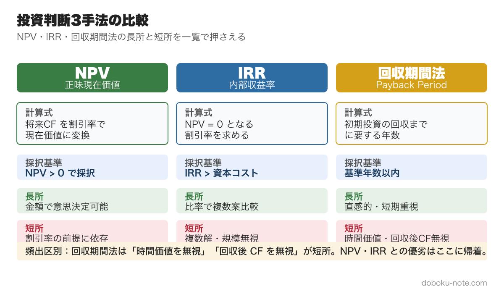
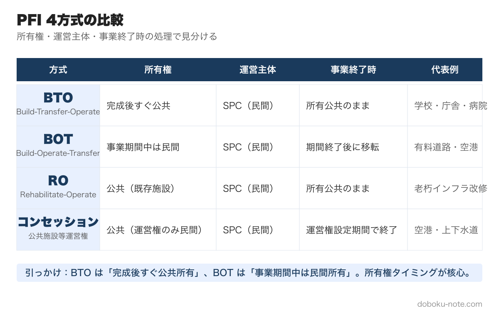
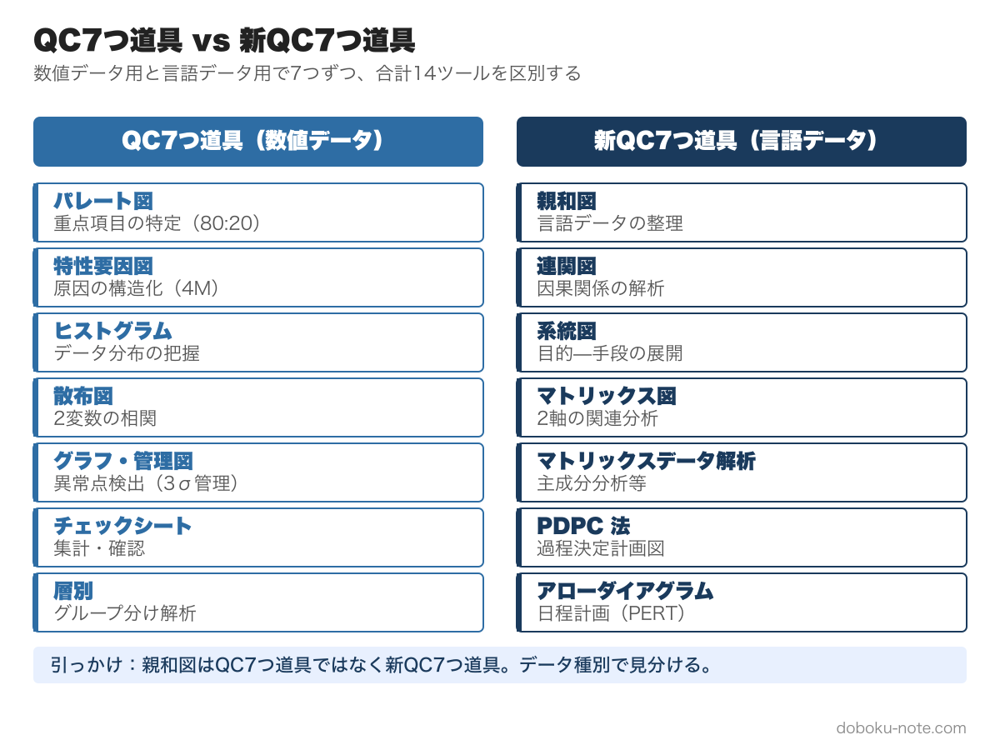
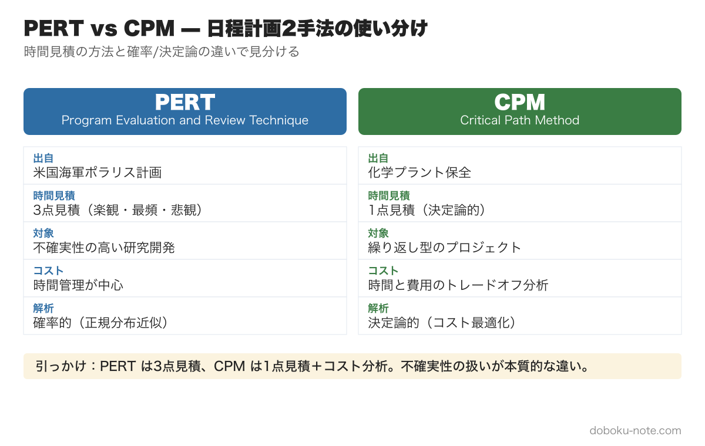
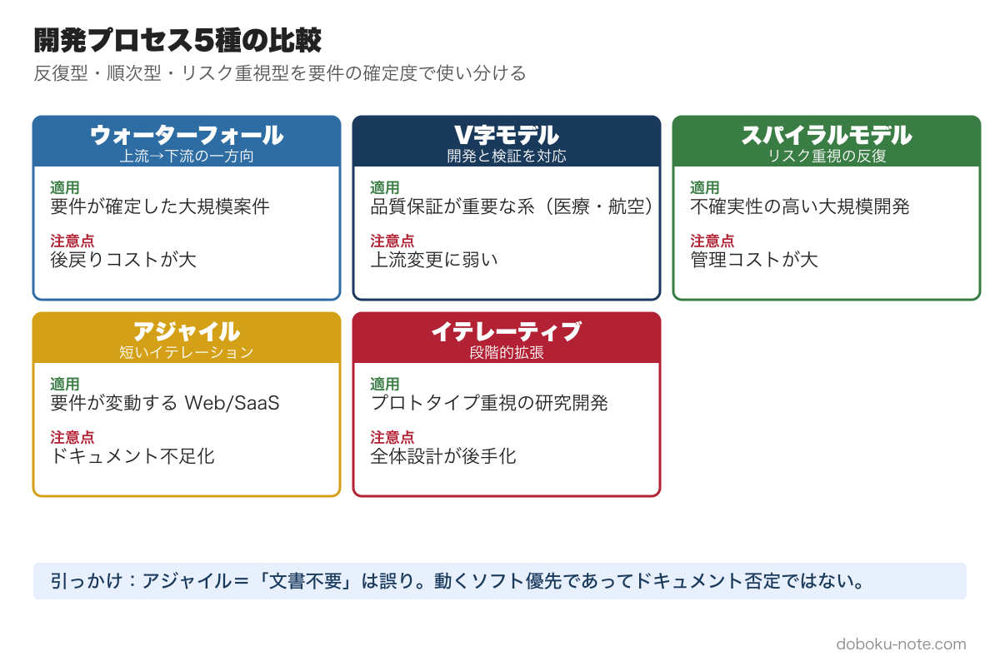
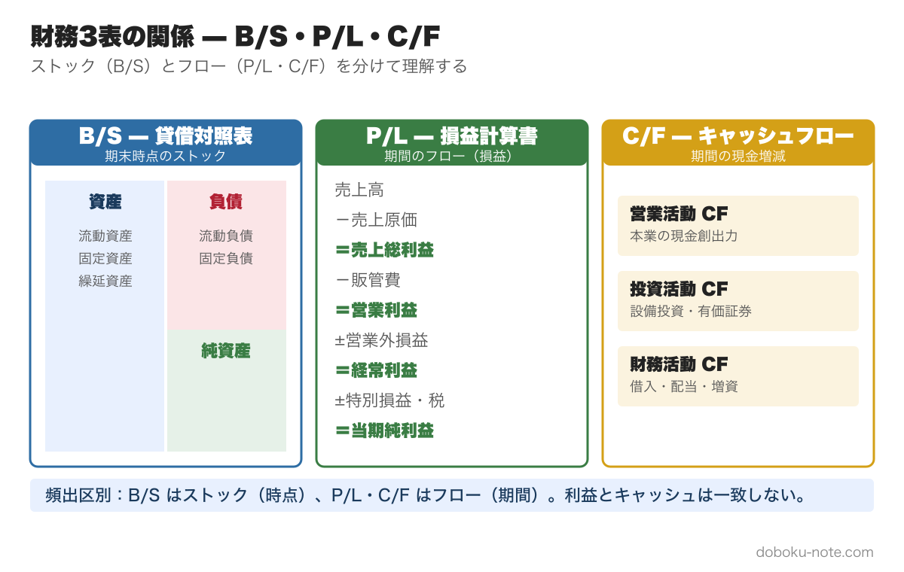
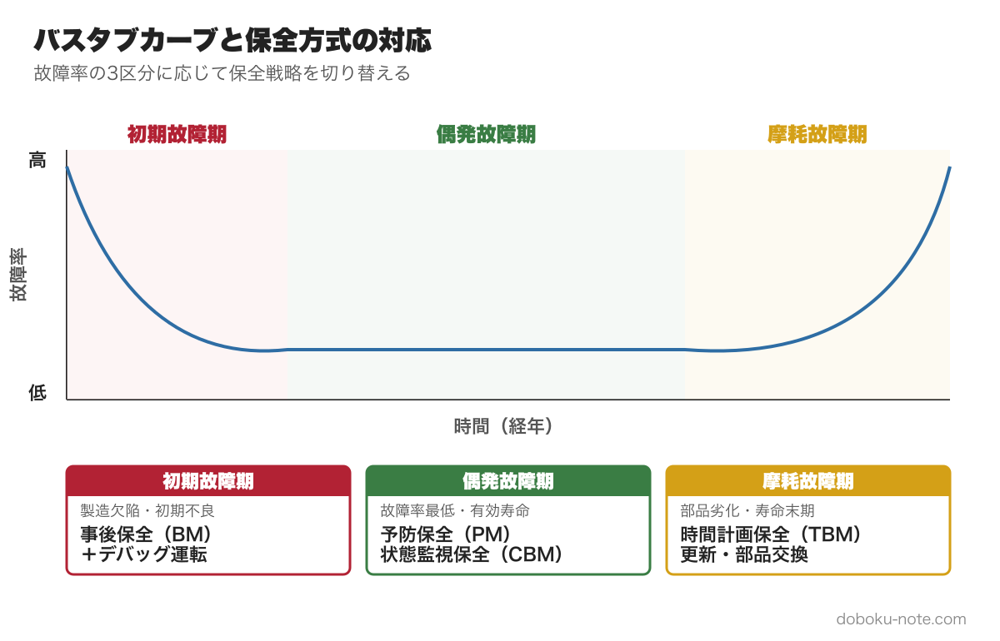
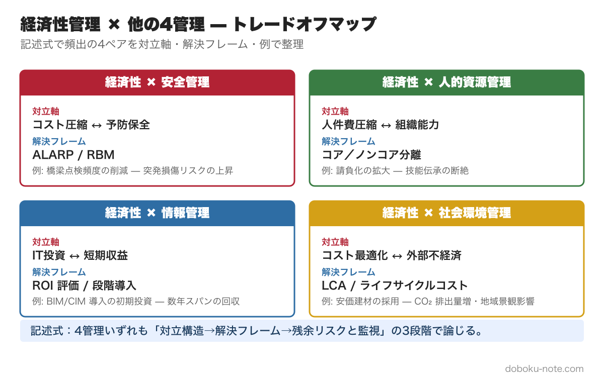

# 経済性管理｜総監キーワード精読ガイド｜択一・記述直結リンク付き

**こんな人のための記事です**

- 経済性管理の学習を始めたが、7章81項目の範囲が広くてどこから手を付ければよいか迷っている
- 択一で投資判断・品質管理・財務諸表の問題を落としがちで、計算問題と定義問題の区別が曖昧
- 記述式で経済性管理を選択肢に入れているが、コスト・品質・工程のトレードオフ論点が整理できていない
- 試験直前に経済性管理の全体像を素早く頭に入れ直したい

**この記事でわかること**

- 全**16,000字超**の精読ガイド（キーワード解説リンク・R3〜R7 出題例込み）
- 経済性管理の7章（81項目）を「優先度: 高／中／低」で仕分けして読む方法
- 択一で繰り返し出る論点と出題パターン（投資判断・品質管理手法・財務諸表・数理的手法）
- 各キーワードの詳細解説ページへの直リンク（クリックで定義・過去問・周辺概念が即確認）

---

キーワード集を読んでも論点が頭に入らない、択一の引っかけパターンが見えない、5管理の範囲が広すぎてどこから手を付ければいいか優先順位がつかない──そんな受験者のために、17年分の過去問680問を分析して5管理を体系化した精読ガイドを、5本セット ¥1,980（単品4本分の値段で5本・21%OFF）でまとめ購入できます。

https://note.com/dobokunote/m/m607bf095b02a

経済性管理は、5管理の中で**項目数が最も多い分野**です（全81項目）。事業企画・[品質管理](https://doboku-note.com/docs/pe-comprehensive-management-quality-control?utm_source=note&utm_medium=referral&utm_campaign=99-economic-management)・工程管理・原価管理・財務会計・設備管理・数理的手法という7大エリアにまたがり、計算問題と定義問題の両方が出題されます。

全81項目を均等に勉強するのは非効率です。**「投資判断・[品質管理](https://doboku-note.com/docs/pe-comprehensive-management-quality-control?utm_source=note&utm_medium=referral&utm_campaign=99-economic-management)・工程管理・財務諸表」の4エリアを最優先し、残りは必要に応じてリンク先で確認する**のが効率的な学習法です。本記事では、択一・記述式の出題視点でポイントを絞り直します。

個々の計算公式の暗記よりも、**各手法が「どの経営課題に対して、どの判断段階で使われるか」という文脈**を押さえることが、択一・記述式の両方で得点に直結します。

---

## 事業企画（優先度: 高）

事業のアイデア発掘から計画策定までの業務です。**投資判断と PFI 法のリスク分担**（NPV／回収期間／ROI）は経済性管理で最も出題頻度が高い論点です。

**フィージビリティスタディと[需要予測](https://doboku-note.com/docs/pe-comprehensive-management-demand-forecasting?utm_source=note&utm_medium=referral&utm_campaign=99-economic-management)**

**フィージビリティスタディ**は、事業の実現可能性を事前調査する業務です。

**4ステップの調査順序**

1. 事業の目的に沿って事業フレーム（規模等）を具体化
2. 市場調査と[需要予測](https://doboku-note.com/docs/pe-comprehensive-management-demand-forecasting?utm_source=note&utm_medium=referral&utm_campaign=99-economic-management)
3. 予備設計で概略の期間・コストを予測
4. 事業の収支と資金調達方法を検討

[需要予測](https://doboku-note.com/docs/pe-comprehensive-management-demand-forecasting?utm_source=note&utm_medium=referral&utm_campaign=99-economic-management)では2つの統計手法が出題されます。

**移動平均法** — 過去の期間データを期間1単位ずつずらして平均値を計算（例：4〜6月、5〜7月）。期間を長くすると変動が小さく見え、直近の変化を遅れて追う傾向。

**指数平滑法** — 前期実績値と前期予測値に重み付けする手法。

> 次期予測 = α × 前期実績値 + (1 − α) × 前期予測値

α（平滑化係数、0≦α≦1）を1に近づけると前期実績値重視、0に近づけると過去データ重視。択一では「α=0.3 のときの予測値計算」が定番です。

> **【出題例: [R4年度 Ⅰ-1-3](https://doboku-note.com/docs/pe-comprehensive-management-r04-primary?utm_source=note&utm_medium=referral&utm_campaign=99-economic-management#1-3)】** 移動平均法・単純指数平滑法による各期の需要量予測値の計算問題（第1〜4期の実績値から第5期予測値を求める） → **正答5：FS₃＝354 が与えられているため、指数平滑法の特性上 FS₂ は実績値340 より大きい値となる。**

**事業投資計画**

投資の時期と回収の時期には時間的ずれがあるため、貨幣の現在価値に換算する必要があります。

**現在価値**（PV：Present Value）**の式**

> PV = M_t / (1 + r)^t  
> （M_t：t 年後の支払い額、r：年間利率）

3手法の使い分けが経済性管理で最頻出の論点です。

**[NPV**（正味現在価値法）**](https://doboku-note.com/docs/pe-comprehensive-management-npv-net-present-value?utm_source=note&utm_medium=referral&utm_campaign=99-economic-management)** — 将来キャッシュフローを現在価値に割り引いて合計し、初期投資と比較。**NPV > 0 なら投資可**。時間価値を考慮できる最も理論的に正確な手法。

**[回収期間法](https://doboku-note.com/docs/pe-comprehensive-management-payback-period-method?utm_source=note&utm_medium=referral&utm_campaign=99-economic-management)** — 毎年の正味現金流入額で投資額を何年で回収できるかを計算。シンプルだが「**回収後のキャッシュフローを考慮しない**」のが最大の弱点。リスク重視の企業に適する。

**ROI**（投資利益率法） — 利益額 ÷ 投資額 × 100[%]。複数年の場合は平均利益額を使用。「**時間価値を考慮しない**」弱点。投資利益率 > 平均借入率なら採算性あり。

3手法の頻出比較：「**NPV ＝ 時間価値考慮・最も理論的／回収期間法 ＝ シンプルだが回収後 CF 無視／ROI ＝ 時間価値無視**」。

> **【出題例: [R3年度 Ⅰ-1-1](https://doboku-note.com/docs/pe-comprehensive-management-r03-primary?utm_source=note&utm_medium=referral&utm_campaign=99-economic-management#1-1)】** 政策評価・投資評価で最も適切なものはどれか。5「回収期間法による投資案の評価では、投資回収後のキャッシュ・フローは考慮されない」 → **正答5：回収期間法の最大の弱点は「回収後 CF を無視」する点。記述式論文でも頻出のキーフレーズ。**

> **【出題例: [R6年度 Ⅰ-1-2](https://doboku-note.com/docs/pe-comprehensive-management-r06-primary?utm_source=note&utm_medium=referral&utm_campaign=99-economic-management#1-2)】** 初期投資 2,000 万円・5 年間で毎年 500 万円収益のプロジェクトに、3 年目年初に追加投資 400 万円を行う場合の年間追加収益最低額を求める計算問題 → **正答3：NPV ベースで 400/1.05² ＝ x ×**（1/1.05³ + 1/1.05⁴ + 1/1.05⁵）**を解くと x ≒ 147 万円。**

**事業評価**

公共政策の効果を事前評価する手法群です。

**費用便益分析** — 効果を**貨幣額**で表示し費用と比較。直接効果（内部経済効果）を対象。

**費用効用分析** — 主観的な満足度（効用）を数量化して評価。すべて貨幣換算できないケースに適用。

行政評価の3指標も択一で問われます。

- **アウトプット指標** — 行政活動を実際にどの程度行ったか（道路整備延長、討論会開催回数等）
- **アウトカム指標** — 成果物によってどれだけ成果が上がったか（渋滞緩和度合い等）
- **インプット指標** — 投入する資源量（予算額が主）

**設計管理**

設計段階の用語6つが定義照合問題として出ます。

- **[信頼性設計](https://doboku-note.com/docs/pe-comprehensive-management-reliability-maintainability-design?utm_source=note&utm_medium=referral&utm_campaign=99-economic-management)** — 与えられた条件下で規定期間中に必要機能を満たす設計
- **[保全性設計](https://doboku-note.com/docs/pe-comprehensive-management-reliability-maintainability-design?utm_source=note&utm_medium=referral&utm_campaign=99-economic-management)** — 故障・異常を素早く検出・診断し短時間で修復できる設計
- **コンカレントエンジニアリング** — 下流工程の担当者を基本設計段階からチームに参画させ、工期短縮を図る手法
- **デザインレビュー** — 製品ライフサイクル全体の設計アウトプットと導出プロセスを品質特性の観点で組織的に審査
- **デザインイン** — メーカーが部品メーカー等と開発段階から共同で開発
- **フロントローディング** — 後工程で発生しそうな問題を初期工程で前倒し集中対応

> **【出題例: [R5年度 Ⅰ-1-3](https://doboku-note.com/docs/pe-comprehensive-management-r05-primary?utm_source=note&utm_medium=referral&utm_campaign=99-economic-management#1-3)】** 設計管理用語（信頼性設計／保全性設計／デザインイン／デザインレビュー／フロントローディング）と説明文の組合せ問題 → **正答2：A＝信頼性設計、B＝保全性設計、D＝デザインレビューの対応が正しい。用語の定義照合は毎年出題されるため精読必須。**

**マーケティングにおける指標**

事業の成果測定に使う3指標。

- **[KGI](https://doboku-note.com/docs/pe-comprehensive-management-key-performance-indicators?utm_source=note&utm_medium=referral&utm_campaign=99-economic-management)**（重要目標達成指標） — 最終ゴールの達成度を定量的に測る指標。例：「売上20%アップ」
- **[KPI](https://doboku-note.com/docs/pe-comprehensive-management-key-performance-indicators?utm_source=note&utm_medium=referral&utm_campaign=99-economic-management)**（重要業績評価指標） — KGI を分解した中間ゴール。部署や担当者別の集客率・売上アップ率等
- **[KSF](https://doboku-note.com/docs/pe-comprehensive-management-key-performance-indicators?utm_source=note&utm_medium=referral&utm_campaign=99-economic-management)**（重要成功要因） — 数値ではなく、事業を成功させるために必要な要因を**言語化**したもの

「[KGI](https://doboku-note.com/docs/pe-comprehensive-management-key-performance-indicators?utm_source=note&utm_medium=referral&utm_campaign=99-economic-management)/[KPI](https://doboku-note.com/docs/pe-comprehensive-management-key-performance-indicators?utm_source=note&utm_medium=referral&utm_campaign=99-economic-management) = 数値化、[KSF](https://doboku-note.com/docs/pe-comprehensive-management-key-performance-indicators?utm_source=note&utm_medium=referral&utm_campaign=99-economic-management) = 言語化」の区別が択一で問われます。

**PFI 法**

**[PFI](https://doboku-note.com/docs/pe-comprehensive-management-pfi?utm_source=note&utm_medium=referral&utm_campaign=99-economic-management)** は **Private Finance Initiative** の略で、公共施設の建設・維持管理・運営を民間の資金・経営能力・技術を活用して行う手法です。

**事業方式の3種類**

- **BTO 方式** — 建設（Build）→ 完成後に所有権移転（Transfer）→ 民間が運営（Operate）
- **BOT 方式** — 建設 → 民間が運営 → 事業終了後に所有権移転
- **コンセッション方式** — 所有権は公共主体、運営権のみ民間に設定

**VFM**（Value For Money） — 一定の支払い（Money）に対して最も価値の高いサービス（Value）を供給する考え方。従来方式と比較して PFI で総事業費をどれだけ削減できるかを示す割合。

**リスク分担の5原則**

1. **分担する者** — リスクの顕在化をより小さな費用で防ぎ得る側、または追加支出を極力小さくし得る側が負担
2. **分担方法** — ①一方が全額／②一定割合で双方／③一定額まで一方・超過分を共担／④閾値方式の4パターン
3. **個別検討** — 選定事業ごとにリスク内容を評価して検討
4. **不可抗力リスク** — 天災等は協定で事前に分担を取り決め
5. **物価・金利・為替・税制変動リスク** — 影響度を勘案して事前協議

> **【出題例: [R3年度 Ⅰ-1-2](https://doboku-note.com/docs/pe-comprehensive-management-r03-primary?utm_source=note&utm_medium=referral&utm_campaign=99-economic-management#1-2)】** PFI 法に関する記述で最も適切なもの。4「コンセッション方式とは、施設の所有権を公共主体が有したまま、施設の運営権が民間事業者に設定される」 → **正答4：コンセッション ＝ 所有権公共・運営権民間。BTO**（建設後すぐ移転）**／BOT**（事業終了後移転）**との3者識別が頻出。**

**プロジェクトマネジメント**

[PMBOK](https://doboku-note.com/docs/pe-comprehensive-management-pmbok?utm_source=note&utm_medium=referral&utm_campaign=99-economic-management)（Project Management Body of Knowledge、米 PMI 作成）が世界標準です。

PMBOK 第7版では、プロジェクトを「**独自のプロダクト・サービス・所産を創造するために実施する有期性のある業務**」と定義しています。

**PMBOK 第7版の8パフォーマンス領域**

1. ステークホルダー
2. チーム
3. 開発アプローチとライフサイクル
4. 計画
5. プロジェクト作業
6. デリバリー
7. 測定
8. 不確かさ

第7版では従来の「プロセス中心」から「**原則中心**（12 原則）」に転換しました。

**WBS**（Work Breakdown Structure） — プロジェクトを「フェーズ」に分割しフェーズごとに成果物を定義。詳細作業内容を**ツリー構造**で階層的に表現したもの。スコープを目に見える形にする手法。

---

## 品質管理（優先度: 最高）

[品質管理](https://doboku-note.com/docs/pe-comprehensive-management-quality-control?utm_source=note&utm_medium=referral&utm_campaign=99-economic-management)（広義）は **品質方針 → 品質計画 → 品質管理**（狭義）**→ [品質保証](https://doboku-note.com/docs/pe-comprehensive-management-quality-assurance?utm_source=note&utm_medium=referral&utm_campaign=99-economic-management) → 品質改善** の活動サイクルです。**QC7つ道具・新QC7つ道具・正規分布**は経済性管理で最も安定した高頻度出題エリアです。

**品質方針と品質計画**

**[品質方針](https://doboku-note.com/docs/pe-comprehensive-management-quality-policy?utm_source=note&utm_medium=referral&utm_campaign=99-economic-management)** — トップマネジメントによって正式に表明された組織の品質に関する全般的な方向付け。

**[品質目標](https://doboku-note.com/docs/pe-comprehensive-management-quality-objectives?utm_source=note&utm_medium=referral&utm_campaign=99-economic-management)** — 品質方針の展開としての目標と、製品やプロジェクト個別の目標の2つ。

**[品質計画](https://doboku-note.com/docs/pe-comprehensive-management-quality-planning?utm_source=note&utm_medium=referral&utm_campaign=99-economic-management)** — 品質目標の設定と達成計画の立案プロセス。組織全体の品質方針を部門ごとに展開し、活動進捗で随時見直す。

**QC7つ道具**（数値データ）

QC7つ道具は主に**数値データ**を扱うことに適した7手法です。

- **層別** — 多数のものを特徴別に層分け
- **パレート図** — 「不適合の8割は2割の特定原因に起因」という法則をヒストグラム（柱状グラフ）で可視化
- **特性要因図** — 魚の骨ダイアグラム。要因によって引き起こされる現象を魚の骨形状で示す
- **ヒストグラム** — データを区間に分け、度数を柱状グラフで表現
- **散布図** — 2種類のデータを横軸・縦軸にプロットし関係性を把握
- **グラフ・管理図** — 品質の安定性評価に管理限界線を持つグラフを使用
- **チェックシート** — 主要ポイントを予め列記し、結果（良/悪、完了/未完了）をチェック

択一の頻出は「**パレート図 ＝ 80/20 法則の可視化**」と「**特性要因図 ＝ 魚の骨**」の用途識別です。

> **【出題例: [R5年度 Ⅰ-1-4](https://doboku-note.com/docs/pe-comprehensive-management-r05-primary?utm_source=note&utm_medium=referral&utm_campaign=99-economic-management#1-4)】** 品質管理で用いられる図やグラフ（パレート図／特性要因図／チェックシート／散布図／ヒストグラム）と用途例の組合せ問題 → **正答1：用途別マッチングは毎年形を変えて出題されるため、各図の主用途を明確に区別して暗記する必要がある。**

**新QC7つ道具**（言語データ）

新QC7つ道具は主に**言語データ**を扱うことに適した7手法です。

- **連関図** — 原因・結果の項目を抽出し因果関係を矢印で表現
- **系統図** — 目的・ゴールへの手段を樹枝状に表現
- **マトリックス図** — 2要素を行・列に配置し関係を表現
- **[過程決定計画図](https://doboku-note.com/docs/pe-comprehensive-management-pdpc-method?utm_source=note&utm_medium=referral&utm_campaign=99-economic-management)** — 対策のステップを表現したフローチャート
- **アローダイアグラム** — 作業を矢印で表した日程計画表
- **親和図** — 言語データをグループ分けし整理・分類
- **マトリックスデータ解析** — 複数データを解析して傾向把握

「QC7つ道具 ＝ 数値データ／新QC7つ道具 ＝ 言語データ」が最重要の択一論点です。

**正規分布と工程能力指数**

**正規分布**は N(μ, σ²) で表現され、平均μを中心とした左右対称形状です。

**μ ± Nσ 範囲のデータ含有率**

- **μ ± σ 範囲**：68.3 %
- **μ ± 2σ 範囲**：95.4 %
- **μ ± 3σ 範囲**：99.7 %

択一では「±σ で何 %」が定番の暗記問題です。

[工程能力指数](https://doboku-note.com/docs/pe-comprehensive-management-process-capability-index?utm_source=note&utm_medium=referral&utm_campaign=99-economic-management)（Cp）は規格限度内に製品を生産できる能力を表す指標です。

> Cp ＝ (公差上限値 − 公差下限値) ÷ (6σ 等の規格限度)

標準偏差σが小さいほど Cp は大きくなり、不良品が少ない状態を示します。**Cp ≥ 1.33 が望ましい**基準値で、計算問題として出題されます。

**検査**

**全数検査** — プラント等の重要施設で不適合品の混入が認められない場合に実施。

**[抜取検査](https://doboku-note.com/docs/pe-comprehensive-management-inspection-methods?utm_source=note&utm_medium=referral&utm_campaign=99-economic-management)** — 量産品でランダムにサンプルを抽出してロット単位で合否判定。「**ロットからのランダム抽出**」が前提条件。

検査方式の性能を表す **OC 曲線**（Operating Characteristic curve） の読み方も出題されます。

> **【出題例: [R3年度 Ⅰ-1-3](https://doboku-note.com/docs/pe-comprehensive-management-r03-primary?utm_source=note&utm_medium=referral&utm_campaign=99-economic-management#1-3)】** 品質管理の統計的手法で最も不適切なもの。1「管理図の管理限界は、製品の規格が定められている場合、規格値に設定すべきである」 → **正答1：管理限界は工程データの平均値±3σ から統計的に設定するもの。製品規格値とは別概念で、両者の混同を狙った頻出引っかけ。**

> **【出題例: [R6年度 Ⅰ-1-4](https://doboku-note.com/docs/pe-comprehensive-management-r06-primary?utm_source=note&utm_medium=referral&utm_campaign=99-economic-management#1-4)】** 検査・合否判定抜取検査に関する記述で最も適切なもの → **正答4：計量値**（連続量）**／サンプルサイズ**（抜取検査の計画要素）**／生産者危険**（合格品を誤って不合格とする確率）**の3者の定義組合せが正確。**

**[品質保証](https://doboku-note.com/docs/pe-comprehensive-management-quality-assurance?utm_source=note&utm_medium=referral&utm_campaign=99-economic-management)**

**品質マネジメントシステム**は国際規格 **ISO 9000 シリーズ** に則って実施されます。

**ISO 9001:2015 の主な改訂点**

- アウトプット ＝ 製品（ハードウェア／ソフトウェア／素材製品の3カテゴリ）+ サービス
- ビジョン・使命・戦略を明示
- あらゆるプロセスで [PDCA サイクル](https://doboku-note.com/docs/pe-comprehensive-management-pdca-cycle?utm_source=note&utm_medium=referral&utm_campaign=99-economic-management) を適用

**[品質保証](https://doboku-note.com/docs/pe-comprehensive-management-quality-assurance?utm_source=note&utm_medium=referral&utm_campaign=99-economic-management)活動** — 企画／開発・設計／生産準備／生産／流通／販売・サービス／廃棄・リサイクルすべての段階に及びます。

**品質改善**

品質の不良は3カテゴリに分類されます。

- 設計品質の不良
- 工程管理問題に起因する不良
- 製品品質の不良

**[品質改善](https://doboku-note.com/docs/pe-comprehensive-management-quality-improvement?utm_source=note&utm_medium=referral&utm_campaign=99-economic-management)** はこれら不良をなくし、より良い品質の製品を生み出す能力を高める活動です。

**消費者保護**

[製品安全](https://doboku-note.com/docs/pe-comprehensive-management-product-safety?utm_source=note&utm_medium=referral&utm_campaign=99-economic-management)（PS）マークが特定製品に表示義務化されています。

- **PSC マーク** — [消費生活用製品安全法](https://doboku-note.com/docs/pe-comprehensive-management-consumer-product-safety-act?utm_source=note&utm_medium=referral&utm_campaign=99-economic-management)
- **PSE マーク** — 電気用品安全法
- **PSTG マーク** — ガス事業法
- **PSPG マーク** — 液化石油ガスの保安の確保及び取引の適正化に関する法律

**顧客満足**（CS）

満足度の高い製品提供に加え、購入後のサービスが重要です。

- **ビフォアサービス** — 見込み客の購買意欲を高めるためのサービス
- **アフターサービス** — メンテナンス・情報提供。次回購入のビフォアサービスでもある

**サービスの4特性**

- **無形性** — 形がなく触れられない
- **同時性** — 顧客との共同作業、提供と消費が同時、元に戻せない
- **変動性** — 季節・曜日・時間帯による需要変動でサービス品質が変わる
- **消滅性** — サービス終了とともに消滅、在庫として持てない

> **【出題例: [R4年度 Ⅰ-1-5](https://doboku-note.com/docs/pe-comprehensive-management-r04-primary?utm_source=note&utm_medium=referral&utm_campaign=99-economic-management#1-5)】** サービス特性で最も不適切なもの。3「サービスは安定した品質で繰り返し提供できる」 → **正答3：サービスは「変動性」があり、提供者・時間帯・状況により品質が変わるため、同一品質での反復提供は困難。**

---

## 工程管理（優先度: 高）

工程管理は、JIS Z 8141 で「生産工程における生産統制」と定義される、経済性管理の中核領域です。

評価尺度は **[PQCDSME](https://doboku-note.com/docs/pe-comprehensive-management-pqcdsme?utm_source=note&utm_medium=referral&utm_campaign=99-economic-management)** — 生産性（P）／品質（Q）／コスト（C）／納期（D）／安全性（S）／意欲（M）／環境（E）の頭文字です。

**総合生産計画**

**総合生産計画** — 生産計画の最初に行われ、**[大日程計画](https://doboku-note.com/docs/pe-comprehensive-management-master-schedule-planning?utm_source=note&utm_medium=referral&utm_campaign=99-economic-management)**とも呼ばれる。[需要予測](https://doboku-note.com/docs/pe-comprehensive-management-demand-forecasting?utm_source=note&utm_medium=referral&utm_campaign=99-economic-management)量と生産能力を合理的に均衡させることが目的です。

均衡させるためには、[需要予測](https://doboku-note.com/docs/pe-comprehensive-management-demand-forecasting?utm_source=note&utm_medium=referral&utm_campaign=99-economic-management)量を満足するために必要な労働力・在庫・残業・外注の各量を求めます。コストの最小化だけでなく、**雇用の安定化や在庫の適正化**も重要な要素です。

需要変動への対応方法は2系統に分かれます。

- **生産能力調整** — 残業・外注・人員変動などで能力側を変える
- **需要平準化** — 需要側を平準化する（価格政策など）

**ジャストインタイム**（JIT）**生産方式**

[JIT（Just-In-Time）生産方式](https://doboku-note.com/docs/pe-comprehensive-management-jit-production?utm_source=note&utm_medium=referral&utm_campaign=99-economic-management) — JIS Z 8141 で「すべての工程が、後工程の要求に合わせて、必要な物を、必要なときに、必要な量だけ生産する生産方式」と定義。中間仕掛品の滞留や工程の遊休を生じさせないことがねらい。

JIT を実現する基盤が **平準化生産**（最終組立工程の生産品種と生産量を平準化した生産方式）です。

**プル型 vs プッシュ型** — JIT は後工程で使った量を前工程から引き取るため**プルシステム**。これに対して、あらかじめ定められたスケジュールに従い生産する方式は**プッシュシステム**です。

**かんばん方式** — JIT の基本ツール。「生産指示かんばん」と「引き取りかんばん」の2種類が存在します。択一では「**かんばん ＝ プル型 ＝ JIT の実装手段**」の対応関係が頻出です。

**サプライチェーンマネジメント**

[SCM（サプライチェーンマネジメント）](https://doboku-note.com/docs/pe-comprehensive-management-supply-chain-management?utm_source=note&utm_medium=referral&utm_campaign=99-economic-management) — 材料供給から生産・流通・販売に至る物・サービスの供給連鎖をネットワークで結び、需要情報を企業間でリアルタイム共有することで業務全体のスピードと効率を高める経営コンセプト。

基本的な考え方は **[TOC**（制約条件の理論：Theory of Constraints）**](https://doboku-note.com/docs/pe-comprehensive-management-theory-of-constraints?utm_source=note&utm_medium=referral&utm_campaign=99-economic-management)** — ボトルネック工程を継続的に改善して全体システムのパフォーマンスを向上させます。

**ブルウィップ効果** — 川下から川上に段階がさかのぼるにつれ、[需要予測](https://doboku-note.com/docs/pe-comprehensive-management-demand-forecasting?utm_source=note&utm_medium=referral&utm_campaign=99-economic-management)量の変動が増幅していく現象。SCM の典型的失敗パターンとして択一に出ます。

SCM 見直しの方向性は4つ — 部素材調達先の多様化／生産拠点の分散化／部品の標準化／サプライチェーンの可視化。

> **【出題例: [R3年度 Ⅰ-1-5](https://doboku-note.com/docs/pe-comprehensive-management-r03-primary?utm_source=note&utm_medium=referral&utm_campaign=99-economic-management#1-5)】** SCM と生産方式に関する記述で最も適切なもの → **正答2：受注後に在庫から出荷するか・組立て出荷するか・設計から行うか**（MTS／ATO／MTO／ETO のデカップリングポイント）**で SCM の形態が変わる。**

**MRP・ERP・CALS**

**MPS**（基準生産計画） — 総合生産計画を最終的に製品アイテム単位に分解。

**MRP**（資材所要量計画） — 必要な部品を必要な時期に必要な量だけ調達・製造する手法。**BOM**（構成部品表）・[リードタイム](https://doboku-note.com/docs/pe-comprehensive-management-lead-time?utm_source=note&utm_medium=referral&utm_campaign=99-economic-management)・手持在庫量・受入確定量が情報源。

**ERP**（統合業務システム） — 受注から納入までの一連業務を処理。MRP を組み込み、会計・販売・人事まで包含。

**CALS**（生産・調達・運用支援統合情報システム） — 原材料調達から設計・開発・生産・運用・保守まで全情報を電子化・一元管理。

**手順計画と標準時間**

**手順計画** — 製品の設計情報から、必要作業・工程順序・作業順序・作業条件を決める活動（JIS Z 8141）。目的は「総作業時間の短縮」「生産方式の標準化」「作業時間の平準化」の3つ。

**標準時間** — 適性を持ち習熟した作業者が、所定条件下で必要な余裕をもち正常な作業ペースで仕事を遂行するために必要な時間。**主体作業時間**（正味時間＋余裕時間）と**準備段取作業時間**（正味時間＋余裕時間）の合計で構成されます。

**[生産の4M](https://doboku-note.com/docs/pe-comprehensive-management-four-m-of-production?utm_source=note&utm_medium=referral&utm_campaign=99-economic-management)** — MAN（人）／MACHINE（機械）／MATERIAL（材料）／METHOD（方法）。手順計画の実現手段の主要素として頻出。

**負荷計画**

**[負荷計画](https://doboku-note.com/docs/pe-comprehensive-management-load-capacity?utm_source=note&utm_medium=referral&utm_campaign=99-economic-management)**（工数計画・余力計画とも） — 生産部門ごとに課す仕事量（生産負荷）を計算し、計画期間全体で各職場に割り付ける活動。**負荷工数と能力工数の調整による納期確保**が目的です。

**労働時間基準の式**

> 負荷工数 ＝ 標準作業時間 × 生産数 ＋ 段取り時間  
> 能力工数 ＝ 就業時間 × （1 − 間接作業率）× 作業者数 × 出勤率

**負荷率** ＝ 負荷工数 ÷ 能力工数 × 100[%]。

**能力調整** — 所要能力 ＞ 保有能力なら残業・外注化、所要能力 ＜ 保有能力なら就業時間短縮・内製化。

**[負荷平準化](https://doboku-note.com/docs/pe-comprehensive-management-load-leveling?utm_source=note&utm_medium=referral&utm_campaign=99-economic-management)** — 山積み・山くずし法。**[リードタイム](https://doboku-note.com/docs/pe-comprehensive-management-lead-time?utm_source=note&utm_medium=referral&utm_campaign=99-economic-management)**（加工時間＋段取り時間＋停滞時間＋移動時間＋作業時間）を安定化させることが計画通りの生産実現に不可欠です。

**工数見積り**

工数見積りには3手法があり、それぞれの特徴の違いが択一の定番論点です。

**[類推見積り](https://doboku-note.com/docs/pe-comprehensive-management-analogous-estimation?utm_source=note&utm_medium=referral&utm_campaign=99-economic-management)** — 過去の類似作業の実績データを使う見積り。簡便だが類似プロジェクトがないと使えない。

**[パラメトリック見積り**（係数見積り）**](https://doboku-note.com/docs/pe-comprehensive-management-parametric-estimation?utm_source=note&utm_medium=referral&utm_campaign=99-economic-management)** — 過去のデータをもとに得られたパラメータ（係数）を使う。

**[三点見積り](https://doboku-note.com/docs/pe-comprehensive-management-three-point-estimation?utm_source=note&utm_medium=referral&utm_campaign=99-economic-management)** — 悲観値（P）・最頻値（M）・楽観値（O）を加重平均する手法。

> 三点見積法 ＝ （P ＋ 4M ＋ O）÷ 6

「**3 点見積りの分母は 6**」「M（最頻値）の係数は 4」が頻出の引っかけです。

**PERTとCPM**

**PERT**（Program Evaluation and Review Technique） — 1950 年代に米海軍がミサイル開発のために開発したスケジューリング手法。所要時間からネットワーク図（アローダイアグラム）を作成。

**[CPM**（Critical Path Method）**](https://doboku-note.com/docs/pe-comprehensive-management-pert-cpm?utm_source=note&utm_medium=referral&utm_campaign=99-economic-management)** — 1950 年代に建設計画用に開発。前進計算で**最早開始日・最早終了日**を、後退計算で**最遅開始日・最遅終了日**を求め、その差から**フロート**（余裕日）を計算します。

**フロート** — プロジェクト終了日を遅らせず当該作業を遅らせられる余裕日。プロジェクト全体の余裕日を**トータルフロート**、2つの作業関係だけで継続作業を遅らせず先行作業を遅らせられる余裕日を**フリーフロート**と呼びます。

**クリティカルパス** — フロートがゼロ以下の作業チェーン。マイナスならスケジュール通り終わらないので必ず改善が必要です。

「**クリティカルパス ＝ フロートゼロの最長経路**」が択一の核心。ネットワーク図からクリティカルパスを特定する計算問題も毎年出ます。

> **【出題例: [R7年度 Ⅰ-1-8](https://doboku-note.com/docs/pe-comprehensive-management-r07-primary?utm_source=note&utm_medium=referral&utm_campaign=99-economic-management#1-8)】** あるプロジェクトのクリティカルパス上にある作業をすべて列挙する問題 → **正答5：A→B→E→F と A→C→F の両クリティカルパス**（各23 日）**を見抜く。クリティカルパスが**複数存在**する場合の見落としが頻出引っかけ。**

**生産統制**

**生産統制** — 日程計画通りに製造工程が運営されているか監視し、遅延があれば対策を講じる進度管理全般。3つの管理活動で構成されます。

- **[現品管理](https://doboku-note.com/docs/pe-comprehensive-management-inventory-control?utm_source=note&utm_medium=referral&utm_campaign=99-economic-management)** — 資材・仕掛品・備品の運搬・移動・停滞・保管の状況を管理。**現品の経済的処理**と**数量・所在の把握**が目的
- **[余力管理](https://doboku-note.com/docs/pe-comprehensive-management-capacity-management?utm_source=note&utm_medium=referral&utm_campaign=99-economic-management)**（工数管理） — 各工程の現在の負荷と現有能力を把握し、再配分で能力と負荷を均衡させる活動。「余力 ＝ 能力 − 負荷」
- **[進捗管理](https://doboku-note.com/docs/pe-comprehensive-management-progress-management?utm_source=note&utm_medium=referral&utm_campaign=99-economic-management)**（進度管理・納期管理） — 仕事の進行状況を把握し、日々の進み具合を調整する活動

3者の使い分けは「**現品 ＝ モノ／余力 ＝ 工数／進捗 ＝ 時間**」と整理すると択一で迷いません。

> **【出題例: [R5年度 Ⅰ-1-8](https://doboku-note.com/docs/pe-comprehensive-management-r05-primary?utm_source=note&utm_medium=referral&utm_campaign=99-economic-management#1-8)】** 現品管理の活動として最も不適切なもの。5「バスタブ曲線を用いた需要予測」 → **正答5：バスタブ曲線は故障率の時間推移を示す指標で、現品管理**（資材・仕掛品の運搬・移動・保管）**とは無関係。「現品管理の対象 ＝ 物の流れ」と覚える。**

**改善活動**

業務を見直して改善する活動として、3つのキーワードが択一に出ます。

- **[5S](https://doboku-note.com/docs/pe-comprehensive-management-five-s?utm_source=note&utm_medium=referral&utm_campaign=99-economic-management)** — 整理・整頓・清掃・清潔・しつけ
- **[ECRS の原則](https://doboku-note.com/docs/pe-comprehensive-management-ecrs-principle?utm_source=note&utm_medium=referral&utm_campaign=99-economic-management)** — Eliminate（排除）／Combine（結合）／Rearrange（順序入れ替え）／Simplify（簡素化）の4原則。改善の優先順位もこの順番
- **3M** — ムリ・ムラ・ムダ。トヨタ生産方式の根本概念

> **【出題例: [R5年度 Ⅰ-1-7](https://doboku-note.com/docs/pe-comprehensive-management-r05-primary?utm_source=note&utm_medium=referral&utm_campaign=99-economic-management#1-7)】** ECRS の原則を用いた改善活動の説明で最も不適切なもの。3「品質許容範囲を狭める」を Simplify（簡素化）とする記述 → **正答3：許容範囲を狭めることは「厳格化」であり「簡素化」とは逆。ECRS は **排除→結合→順序入れ替え→簡素化** の優先順位で進める。**

**開発プロセス5種**

製品・システムの開発手法5種は、それぞれの違いを問う択一の定番です。

- **[ウォーターフォール型](https://doboku-note.com/docs/pe-comprehensive-management-waterfall?utm_source=note&utm_medium=referral&utm_campaign=99-economic-management)** — 要件定義→基本設計→詳細設計→コーディング→テストの順序固定。上流から下流へ一方向
- **V 字型モデル** — ウォーターフォールを折り返し、詳細設計を単体テスト・基本設計を結合テスト・要件定義をシステムテストで検証
- **スパイラル型** — 機能ごとに要件定義→設計→開発→テストを繰り返し、完成度を徐々に上げる。やり直しが最小限
- **[アジャイル型](https://doboku-note.com/docs/pe-comprehensive-management-agile?utm_source=note&utm_medium=referral&utm_campaign=99-economic-management)** — 小さい機能単位で計画→設計→実装→テストを繰り返し、ユーザーフィードバックを取り入れる
- **イテレーティブ型** — 計画→設計→実装→テストを単純に反復する手法

「ウォーターフォール ＝ 順序固定／アジャイル ＝ 短いイテレーション／V字 ＝ 折り返し対応」の3者比較が頻出です。

> **【出題例: [R4年度 Ⅰ-1-7](https://doboku-note.com/docs/pe-comprehensive-management-r04-primary?utm_source=note&utm_medium=referral&utm_campaign=99-economic-management#1-7)】** 開発プロセスの種類に関する記述で最も適切なもの → **正答4：アジャイル型の特徴**（短期間の反復、優先度順の実装、フィードバック重視）**の記述が正確。各手法の本質的な違いを覚える。**

---

## 原価管理（優先度: 高）

**原価管理** — 標準原価を設定し、実際原価との差異を分析して対策を講じ、原価低減を実現する活動です。**原価企画**（仕様決定時）と、**原価維持・原価改善**（仕様決定後）の2系統に分かれます。

**原価企画**

**原価企画** — 新製品開発において、企画段階で製品ライフサイクル全体の目標原価を設定し、全社的活動で目標を達成させる活動。プロセスは5ステップ。

1. 製品コンセプトと目標利益を明確化
2. 目標利益から**目標原価**を逆算
3. 構造ごと・部品ごとに目標原価を割り付ける
4. 設計段階で原価低減の検討と修正を繰り返す
5. 製造移行時に仕様変更対応・改善策検討

**目標原価＝販売価格−目標利益** という逆算思考が原価企画の本質です。

**原価計算の3種類**

原価計算の3分類は択一の定義問題で頻出です。

**[標準原価計算](https://doboku-note.com/docs/pe-comprehensive-management-standard-costing?utm_source=note&utm_medium=referral&utm_campaign=99-economic-management)** — 原価管理・原価低減の基準となる標準原価を設定し、実際原価との差異分析で対策を立案。標準は実際に低減が期待できる範囲で設定します。

**実際原価計算** — 実績ベースで計算。3 ステップで進めます。

1. **費目別原価計算** — 材料費・労務費・経費に分類し、各々を直接費・間接費に細分
2. **部門別原価計算** — 費目別の費用を製造部門費に配賦
3. **製品別原価計算** — 直接材料費・直接労務費・直接経費・製造部門費を製品別に集計

**予定原価計算** — 前年実績などをもとに予定単価・予定消費量を設定して算出。

**活動基準原価計算**（ABC）

**[活動基準原価計算**（ABC：Activity Based Costing）**](https://doboku-note.com/docs/pe-comprehensive-management-activity-abc?utm_source=note&utm_medium=referral&utm_campaign=99-economic-management)** — 活動ごとに発生した原価を正しく振り分ける手法。

**伝統的原価計算の問題** — 多量生産品に間接費が多く配賦され、少量生産品の間接費負担が過小になる。ABC は **少量生産品に製造間接費を多く配賦** する結果になります。金融業・サービス業でも活用されています。

**[コストドライバー](https://doboku-note.com/docs/pe-comprehensive-management-cost-driver?utm_source=note&utm_medium=referral&utm_campaign=99-economic-management)**（配賦基準）には2系統あります。

1. **資源**（リソース）**ドライバー** — 各活動が消費した資源コストを活動ごとに割り当て
2. **活動**（アクティビティ）**ドライバー** — 各製品が消費した活動を製品ごとに割り当て

例：部品数・段取り回数・検査回数・仕様書枚数・開発者数。

> **【出題例: [R6年度 Ⅰ-1-3](https://doboku-note.com/docs/pe-comprehensive-management-r06-primary?utm_source=note&utm_medium=referral&utm_campaign=99-economic-management#1-3)】** 製造間接費 900 万円を 3 プロジェクトに配賦するとき、個別原価計算と ABC で原価が異なる場合の計算 → **正答5：直接労務費**（作業時間）**比率 3:1:1 で X 配賦額 ＝ 900 ×**（3/5）**＝ 540 万円。X の総原価 ＝ 1,300 ＋ 540 ＝ 1,840 万円。配賦基準により原価が変わる ABC の本質。**

**管理会計と損益分岐点**

企業会計は**財務会計**（外部報告）と**管理会計**（内部経営判断）に大別されます。

**[損益分岐点](https://doboku-note.com/docs/pe-comprehensive-management-break-even-point?utm_source=note&utm_medium=referral&utm_campaign=99-economic-management)** — 総収益と総費用が一致する売上高。計算問題が毎年出ます。

> 損益分岐点売上高 ＝ 固定費 ÷（1 − 変動費率）  
> 限界利益 ＝ 売上 − 変動費 ＝ 固定費 ＋ 利益

- **変動費** — 売上高・販売数量に比例（材料費・外注費・販売手数料）
- **固定費** — 売上高に関係なく一定期間で発生（家賃・人件費・リース料・水道光熱費）

固定費が増えるか変動費率が上がると、損益分岐点はグラフの**右側**に移動します（達成しにくくなる）。

> **【出題例: [R7年度 Ⅰ-1-3](https://doboku-note.com/docs/pe-comprehensive-management-r07-primary?utm_source=note&utm_medium=referral&utm_campaign=99-economic-management#1-3)】** 販売価格 1,000 円・変動費 400 円・固定費 384,000 円・予定 800 個での損益分岐点分析 → **正答4：限界利益率 ＝ 600/1,000 ＝ 0.6、損益分岐点売上高 ＝ 384,000/0.6 ＝ 640,000 円。変動費率**（40%）**と限界利益率**（60%）**の混同が頻出引っかけ。**

**マテリアルフローコスト会計**（MFCA）

**MFCA**（Material Flow Cost Accounting） — 製造プロセスでロスとなったマテリアル（原材料・副資材・エネルギー）を**「負の製品コスト」**として算出する会計手法。

経営者に対して**廃棄物削減を動機付ける**点が特徴で、環境会計と原価管理を結びつける手法として近年注目されています。

---

## 財務会計（優先度: 高）

**財務会計** — 株主・債権者・関係官庁などの外部利害関係者に財務情報を提供するための会計。管理会計（内部用）と区別されます。

**企業会計原則の7原則**

財務諸表は**企業会計原則**に基づいて作成され、一般原則は7つです。

1. **真実性の原則** — 真実な報告を提供
2. **正規の簿記の原則** — すべての取引を正確に記帳
3. **資本利益区別の原則** — 資本剰余金と利益剰余金を混同しない
4. **明瞭性の原則** — 利害関係者に明瞭に表示
5. **継続性の原則** — 処理原則・手続を毎期継続適用
6. **保守主義の原則** — 不利な影響に備え健全な処理
7. **単一性の原則** — 異なる目的の財務諸表でも会計記録は一致

**貸借対照表**（B/S）

**[貸借対照表**（B/S：Balance Sheet）**](https://doboku-note.com/docs/pe-comprehensive-management-balance-sheet?utm_source=note&utm_medium=referral&utm_campaign=99-economic-management)** — 一定時点（通常は決算日）の財政状態を表す書類。**借方**（資産）**と貸方**（負債＋純資産）**を一致させる**のが基本構造です。

**借方**（資産） — 流動資産／固定資産（有形固定資産・無形固定資産・投資その他の資産）／繰延資産

**貸方**（負債＋純資産） — 流動負債／固定負債／純資産（株主資本・その他の包括利益累計額・新株予約権）

**[減価償却費](https://doboku-note.com/docs/pe-comprehensive-management-depreciation-residual-value?utm_source=note&utm_medium=referral&utm_campaign=99-economic-management)** — 有形固定資産に含まれ、費用でありながら支出を伴わないため、**その分が内部に留保される**効果が生じます（後述の C/F でも重要）。

**損益計算書**（P/L）

**[損益計算書**（P/L：Profit and Loss Statement）**](https://doboku-note.com/docs/pe-comprehensive-management-income-statement?utm_source=note&utm_medium=referral&utm_campaign=99-economic-management)** — 一定期間（通常 1 年）の経営成績を表します。**5 段階の利益**が階層的に算出されます。

1. **売上総利益**（粗利） ＝ 売上高 − 売上原価
2. **営業利益** ＝ 売上総利益 − 販売費及び一般管理費
3. **経常利益** ＝ 営業利益 ± 営業外損益
4. **税引前当期純利益** ＝ 経常利益 ± 特別損益
5. **当期純利益** ＝ 税引前当期純利益 − 法人税等

「**営業利益 ＝ 本業の儲け／経常利益 ＝ 本業 ＋ 財務活動／純利益 ＝ 最終利益**」の階層関係が択一頻出。

> **【出題例: [R7年度 Ⅰ-1-7](https://doboku-note.com/docs/pe-comprehensive-management-r07-primary?utm_source=note&utm_medium=referral&utm_campaign=99-economic-management#1-7)】** 財務会計に関する記述で最も適切なもの。3「減価償却の定義（取得金額を各年の必要経費として配分する手続）」 → **正答3：減価償却の本質は「取得原価を耐用年数にわたり費用配分する手続」。費用でありながら支出を伴わない**非現金支出費用**として C/F でも重要。**

**キャッシュ・フロー計算書**（C/F）

**[キャッシュ・フロー計算書**（C/F）**](https://doboku-note.com/docs/pe-comprehensive-management-cash-flow-statement?utm_source=note&utm_medium=referral&utm_campaign=99-economic-management)** — 営業活動・投資活動・財務活動の3区分で現金の出入りを記載。

- **営業 CF** — 本業による収入。[減価償却費](https://doboku-note.com/docs/pe-comprehensive-management-depreciation-residual-value?utm_source=note&utm_medium=referral&utm_campaign=99-economic-management)は**非現金支出費用**のため利益に加え戻されて記載
- **投資 CF** — 設備や有価証券の取得・売却による増減。投資が多い製造業では通常マイナス
- **財務 CF** — 借入・返済・社債発行・配当などによる増減

**フリー・キャッシュ・フロー**（FCF） ＝ 営業 CF ＋ 投資 CF。自由に使える現金を示す指標です。

**増減符号の覚え方**

- 売上債権・棚卸資産の **増加** はキャッシュ **減少**（−）
- 購入債務の **増加** はキャッシュ **増加**（＋）
- 固定資産の **増加** はキャッシュ **減少**（−）
- 借入金の **増加** はキャッシュ **増加**（＋）

「**利益が出ていてもキャッシュが回らず倒産する黒字倒産**」は財務管理の核心論点として記述式でも引用できます。

> **【出題例: [R6年度 Ⅰ-1-1](https://doboku-note.com/docs/pe-comprehensive-management-r06-primary?utm_source=note&utm_medium=referral&utm_campaign=99-economic-management#1-1)】** キャッシュ・フロー計算書の3区分（営業／投資／財務）と支出項目の対応問題 → **正答3：営業活動**（税金支出・仕入支出）**／投資活動**（設備取得・株式取得）**／財務活動**（配当支払・社債償還）**の3 分類が正確。「税金 ＝ 営業」「配当 ＝ 財務」が引っかけ。**

---

## 設備管理（優先度: 中）

設備やシステムの故障率は使用時間で変化するため、時期に合わせた管理が必要です。

**バスタブカーブ**

**[バスタブカーブ](https://doboku-note.com/docs/pe-comprehensive-management-bathtub-curve?utm_source=note&utm_medium=referral&utm_campaign=99-economic-management)** — 故障率の時間推移を示す曲線。3 段階で構成されます。

- **初期故障期** — 導入直後、設計・製造のばらつきで故障率が高い
- **偶発故障期** — 安定期。故障率が一定値以下で推移
- **摩耗故障期** — 劣化により再び故障率が増加

「**摩耗故障期で予防保全が最も有効**」が択一の頻出論点です。

**[設備総合効率](https://doboku-note.com/docs/pe-comprehensive-management-overall-equipment-effectiveness?utm_source=note&utm_medium=referral&utm_campaign=99-economic-management)**

**[設備総合効率](https://doboku-note.com/docs/pe-comprehensive-management-overall-equipment-effectiveness?utm_source=note&utm_medium=referral&utm_campaign=99-economic-management)** — JIS Z 8141 で「設備の使用効率の度合いを表す指標」と定義。

> 設備総合効率 ＝ 時間稼働率 × 性能稼働率 × 良品率

向上策は3方向 — 故障時間短縮で**時間稼働率**を上げる／加工数増で**性能稼働率**を上げる／不適合品削減で**良品率**を上げる。

> **【出題例: [R7年度 Ⅰ-1-4](https://doboku-note.com/docs/pe-comprehensive-management-r07-primary?utm_source=note&utm_medium=referral&utm_campaign=99-economic-management#1-4)】** 設備総合効率（OEE）を高めた取組として最も不適切なもの。3「段取作業の作業者数を削減」 → **正答3：作業者数削減は設備の停止時間に影響しないため OEE には反映されない。「設備停止時間 → 時間稼働率」「加工数 → 性能稼働率」「不良率 → 良品率」の対応が核心。**

**設備計画**

**設備計画** — 経営戦略の一環として事業計画に基づき策定。目的別に4分類されます。

1. **取替投資** — 老朽化設備の取り替え
2. **拡張投資** — 生産能力の拡大
3. **製品投資** — 原価引き下げや性能アップ
4. **戦略的投資** — リスク減少投資・厚生投資

経済性手法は**資金回収期間法・原価比較法・投資利益率法**。異なる時点での資金収支を比較するため**等価換算**が必要です。

**設備保全6種類**

JIS Z 8141 で定義される保全活動は、**維持活動**（予防保全・[事後保全](https://doboku-note.com/docs/pe-comprehensive-management-corrective-maintenance?utm_source=note&utm_medium=referral&utm_campaign=99-economic-management)）と**改善活動**（[改良保全](https://doboku-note.com/docs/pe-comprehensive-management-improvement-maintenance?utm_source=note&utm_medium=referral&utm_campaign=99-economic-management)・[保全予防](https://doboku-note.com/docs/pe-comprehensive-management-maintenance-prevention?utm_source=note&utm_medium=referral&utm_campaign=99-economic-management)）に大別されます。

- **[予防保全](https://doboku-note.com/docs/pe-comprehensive-management-preventive-maintenance?utm_source=note&utm_medium=referral&utm_campaign=99-economic-management)** — 故障に至る前に寿命を推定し、故障を未然防止
- **[事後保全](https://doboku-note.com/docs/pe-comprehensive-management-corrective-maintenance?utm_source=note&utm_medium=referral&utm_campaign=99-economic-management)** — 故障発見段階でその故障を取り除く
- **[定期保全](https://doboku-note.com/docs/pe-comprehensive-management-periodic-maintenance?utm_source=note&utm_medium=referral&utm_campaign=99-economic-management)** — 故障記録・保全記録の評価から周期を決め、周期ごとに行う予防保全
- **[予知保全](https://doboku-note.com/docs/pe-comprehensive-management-predictive-maintenance?utm_source=note&utm_medium=referral&utm_campaign=99-economic-management)** — 設備診断技術で劣化傾向を管理し、最適時期に対策を行う予防保全
- **[改良保全](https://doboku-note.com/docs/pe-comprehensive-management-improvement-maintenance?utm_source=note&utm_medium=referral&utm_campaign=99-economic-management)** — 故障が起こりにくい設備への改善・性能向上
- **[保全予防](https://doboku-note.com/docs/pe-comprehensive-management-maintenance-prevention?utm_source=note&utm_medium=referral&utm_campaign=99-economic-management)** — 計画・設計段階から不良・故障の予知・予測と排除対策を織り込む

JIS Z 8115 で定義される追加用語も択一で問われます。

- **日常保全** — 日常的な活動で性能劣化を防止
- **経時保全** — 累積動作時間に達したときの予防保全
- **状態監視保全** — 状態監視に基づく予防保全
- **時間計画保全** — 定められた時間計画に従う予防保全

事後保全は2分類 — **緊急保全**（突発故障時に直ちに行う）と**通常事後保全**（代替機がある設備の故障後対応）。

> **【出題例: [R4年度 Ⅰ-1-4](https://doboku-note.com/docs/pe-comprehensive-management-r04-primary?utm_source=note&utm_medium=referral&utm_campaign=99-economic-management#1-4)】** 設備管理における保全活動の内容と名称の組合せ問題 → **正答4：ア＝予知保全**（劣化傾向を診断技術で管理）**、イ＝保全予防**（計画段階から不良対策織り込み）**、ウ＝改良保全**（性能向上）**の組合せが正しい。6 種の定義照合は毎年出題。**

---

## 計画・管理の数理的手法（優先度: 中）

総合技術監理が必要な業務には俯瞰的判断が求められるため、数理的手法と問題解決手法の知識が必須です。

**シミュレーション**

**シミュレーション** — 不確定要素を含む現実問題をコンピュータでモデル化する手法。2系統あります。

- **連続型シミュレーション** — 微分方程式・差分方程式で表現されるモデル
- **離散型シミュレーション** — 特定イベントの生起によるモデル（待ち行列など）

**[モンテカルロ・シミュレーション](https://doboku-note.com/docs/pe-comprehensive-management-monte-carlo-simulation?utm_source=note&utm_medium=referral&utm_campaign=99-economic-management)** — 業務管理で最も一般的。乱数や物理的にランダムなメカニズムを使った実験で数学的な近似解を求めます。試行回数を増やすほど精度が上がるため**高速コンピュータが必要**で、コストが高いのが欠点。スケジュール予測など中精度で十分な事項に適します。

結果は**作業完了日数とその達成可能性のSカーブ**で示されます。

**最適化手法**

**[線形計画問題](https://doboku-note.com/docs/pe-comprehensive-management-linear-programming?utm_source=note&utm_medium=referral&utm_campaign=99-economic-management)** — 制約条件が線形不等式・等式、目的関数が線形関数の問題。連続変数なら2次元グラフで容易に最適解が求まります。

**整数計画問題** — 生産量が整数値でなければならない問題（テレビ・自動車などの生産計画）。解くのが難しくなります。

**パレート最適** — 他の個人の満足を減じることなしに、どの個人の満足も増加できない状態。**多目的最適化**ではパレート最適を考える必要があり、最良解は意思決定者の選好に依存します。

**階層化意思決定法**（AHP）

**[AHP**（Analytic Hierarchy Process）**](https://doboku-note.com/docs/pe-comprehensive-management-analytic-hierarchy-process?utm_source=note&utm_medium=referral&utm_campaign=99-economic-management)** — 階層構造を使って代替案を定量評価する手法。複数階層の評価要因の**重要度係数**と**評価値**から代替案の総合評価値を算出します。

**重要度係数の制約** — 各階層での合計が 1（W₁ ＋ W₂ ＝ 1、W₁₁ ＋ W₁₂ ＝ 1 など）。

**総合評価値の計算式**（A 案、2 階層 4 要因の例）

> Sa ＝ W₁ × W₁₁ × A₁ ＋ W₁ × W₁₂ × A₂ ＋ W₂ × W₂₁ × A₃ ＋ W₂ × W₂₂ × A₄

代替案について複数の評価基準で**一対比較行列**を作成し、重要度を数値化して最も望ましい代替案を決定。複数人での意思決定でも、重要度係数の統合や評点の相談で適用可能です。

**問題解決手法5種**

総合技術監理に必要な問題解決手法は5種類あり、それぞれの特徴の違いが択一に出ます。

**デルファイ法**（収束アンケート法） — 複数の専門家に同じテーマで何度かアンケートを繰り返し、回答が収束していくことを利用。**匿名性**により特定関係者の影響力を排除できます。通常 3 回のアンケートでまとまることが多いとされます。

**ブレインストーミング法** — 創造性開発のための集団的思考技術。4 ルール — 他人を批判しない／自由奔放を歓迎／質より量／他人のアイデアを発展。出されたアイデアの整理に**特性要因図**（魚の骨ダイアグラム）や**親和図**を使用します。

**過程決定計画図**（PDPC：Process Decision Program Chart） — 危機的状況に陥ったとき、将来起こり得る重要な局面と結果を有向グラフで表し、要所で的確な判断ができるよう準備する手法。

**ゲーム理論** — 意思決定主体が複数存在する状況を数学的に扱う方法論。2 系統あります。

- **非協力ゲーム** — プレイヤー間の話し合いがない、またはあっても拘束力なし
- **協力ゲーム** — プレイヤー間の合意に拘束力がある状態

**VE**（Value Engineering） — 製品・サービスの価値を、機能とコストの関係で把握して価値向上を図る手法。

> 価値 ＝ 機能 ÷ コスト

機能は**使用機能**（効果・性能）と**貴重機能**（魅力機能・デザイン・色彩）に分類。基本ステップは **機能定義 → 機能評価 → 代替案作成** です。

> **【出題例: [R4年度 Ⅰ-1-2](https://doboku-note.com/docs/pe-comprehensive-management-r04-primary?utm_source=note&utm_medium=referral&utm_campaign=99-economic-management#1-2)】** VE に関する記述で最も適切なもの → **正答3：使用機能**（目的に関わる機能）**と魅力機能**（感覚的満足に関わる機能）**の分類が正確。「価値 ＝ 機能 ÷ コスト」と「機能定義 → 機能評価 → 代替案作成」の3ステップが頻出。**

> **【出題例: [R7年度 Ⅰ-1-6](https://doboku-note.com/docs/pe-comprehensive-management-r07-primary?utm_source=note&utm_medium=referral&utm_campaign=99-economic-management#1-6)】** 計画・管理の科学的・数理的手法に関する記述で最も適切なもの → **正答2：ゲーム理論の定義**（複数主体の意思決定）**と分類**（非協力ゲーム／協力ゲーム）**が正確。AHP・モンテカルロ・線形計画と並び、各手法の用途識別が必須。**

---

## 記述式対策まとめ：経済性管理 × 他の4管理 トレードオフ

記述式では「経済性管理の視点から他管理との対立をどう解決するか」が頻出です。4ペアの対立軸・解決フレーム・具体例を一覧で確認しましょう。

---

## このシリーズを体系的に学ぶ

本記事の論点を体系的に押さえたら、残り4管理も同じ視点で読み通すと得点力が一段階上がります。経済性・人的資源・情報・安全・社会環境の精読ガイド5本セットを、単品4本分の値段（¥1,980）でまとめ購入できます。

https://note.com/dobokunote/m/m607bf095b02a

---

## 関連リソース

**doboku-note — 17年分の過去問 + 約700キーワード解説**（無料）
https://doboku-note.com/category/pe-comprehensive-management?utm_source=note&utm_medium=referral&utm_campaign=99-economic-management

- [経済性管理ピラーページ](https://doboku-note.com/docs/pe-comprehensive-management-economic-management-pillar?utm_source=note&utm_medium=referral&utm_campaign=99-economic-management)（関連キーワードの全体マップ）
- 択一式過去問: [R07](https://doboku-note.com/docs/pe-comprehensive-management-r07-primary?utm_source=note&utm_medium=referral&utm_campaign=99-economic-management) / [R06](https://doboku-note.com/docs/pe-comprehensive-management-r06-primary?utm_source=note&utm_medium=referral&utm_campaign=99-economic-management) / [R05](https://doboku-note.com/docs/pe-comprehensive-management-r05-primary?utm_source=note&utm_medium=referral&utm_campaign=99-economic-management)（経済性管理の問題を確認）
- [記述式過去問 R07](https://doboku-note.com/docs/pe-comprehensive-management-r07-secondary?utm_source=note&utm_medium=referral&utm_campaign=99-economic-management)

**マガジン購入で割引**（総監テキスト精読ガイド 5管理セット）
- 経済性管理（本書）＋ 安全管理 ＋ 情報管理 ＋ 人的資源管理 ＋ 社会環境管理 = 単品合計 ¥2,500（¥500 × 5本）
- セット価格 **¥1,980**（単品4本分の値段で5本・21% OFF）
