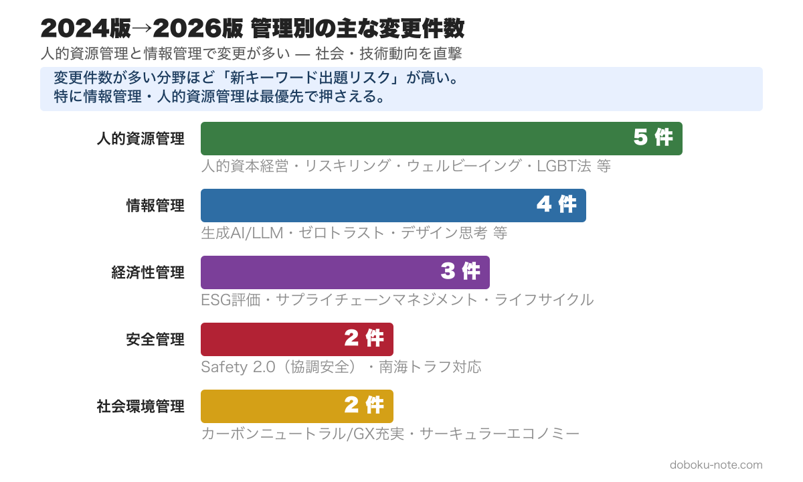
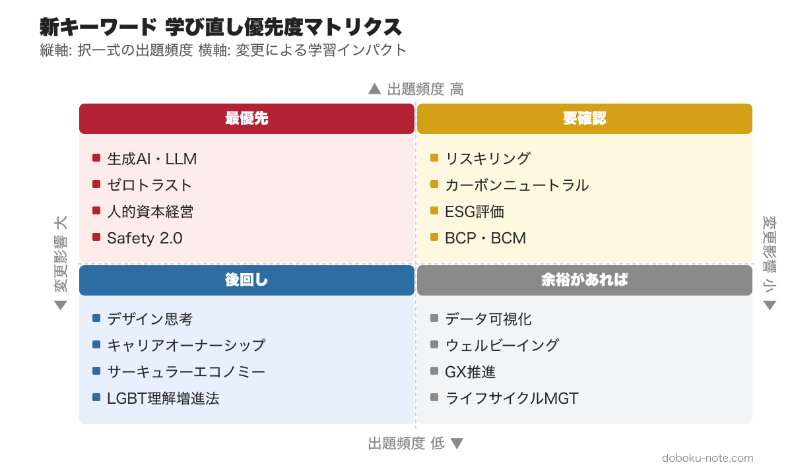

# 【2026年最新】総監キーワード集の変更点と学び直す優先順位｜2024版から何が変わったか徹底解剖

> **この記事でわかること**
> - キーワード集2026の全体構成と位置づけ
> - 2024版からの主な変更点と追加キーワード
> - 新キーワードが出題される可能性のある分野と学習の優先順位

---

文部科学省は2025年11月に『総合技術監理 キーワード集 2026』を公開しました。技術士 総合技術監理部門の択一式試験は、このキーワード集の範囲から出題されます。2024版との変更点を整理し、試験への影響を分析していきます。

変更点を把握しても、キーワード集2026の全項目をどの順で固めるかは別問題です。17年分の過去問680問を出題頻度で分析し、5管理の論点を「優先度: 高・中・低」に仕分け直した精読ガイドなら、新キーワードを含む全体を出る順に押さえられます（5本セット ¥1,980・単品4本分の値段で5本・21%OFF）。

https://note.com/dobokunote/m/m607bf095b02a

## キーワード集2026の概要

キーワード集は、旧『青本』（2004年発行、2017年絶版）に替わるものとして編集されたもので、総監の5つの管理分野の概念と範囲を、主要キーワードの例示によって示しています。

5つの管理分野の構成は従来どおりです。

1. **経済性管理** -- 事業企画、品質管理、工程管理、原価管理・管理会計、財務会計、設備管理、計画・管理の数理的手法
2. **人的資源管理** -- 人の行動と組織、労働関係法と労務管理、人材活用計画、人材開発
3. **情報管理** -- 情報分析と活用、コミュニケーション、知的財産権と情報の保護と活用、ICTの動向、情報セキュリティ
4. **安全管理** -- 安全の概念、リスクマネジメント、労働安全衛生、事故・災害の未然防止、危機管理、システム安全工学
5. **社会環境管理** -- 地球的規模の環境問題、地域環境問題、環境保全の基本原則、組織の社会的責任と環境管理活動

各キーワードの詳細は「利用者自ら参考書・専門書・資料などを通じて調べ把握すること」が前提とされている点は変わりません。

## 2024版からの主な変更点

2026版では、技術と社会の進展を反映したキーワードの追加・更新が行われています。下図のとおり、変更が最も多いのは人的資源管理（5件）と情報管理（4件）で、DX・AIの普及と法制度の整備が直撃した形です。特に注目すべき変更点を分野別に整理していきます。

### 経済性管理

- **[サプライチェーンマネジメント**（SCM）**](https://doboku-note.com/docs/pe-comprehensive-management-supply-chain-management)** や **[BCP・BCM](https://doboku-note.com/docs/pe-comprehensive-management-business-continuity-plan)** が、事業企画の中でより明確に位置づけられました。近年の自然災害やパンデミックを踏まえ、事業継続の観点が経済性管理にも統合されています
- **[ESG・環境評価](https://doboku-note.com/docs/pe-comprehensive-management-esg-environmental-assessment)** が事業企画セクションに追加されました。投資判断におけるESGの視点が総監の経済性管理にも反映されています
- **[ライフサイクルマネジメント](https://doboku-note.com/docs/pe-comprehensive-management-lifecycle-management)** の記載が拡充されています。設備のライフサイクル全体を見据えた管理の重要性が強調されています

> 経済性管理の主要キーワード（品質管理・工程管理・財務会計・設備管理）の詳細は doboku-note でまとめて確認できます → [経済性管理 ピラーページ](https://doboku-note.com/docs/pe-comprehensive-management-economic-management-pillar)

変更点をふまえて経済性管理の全体を体系的に整理したい方はこちら（有料マガジン収録）

https://note.com/dobokunote/n/ndf7ddb3f0a97

### 人的資源管理

- **人的資本経営**・**[人的資本の情報公開](https://doboku-note.com/docs/pe-comprehensive-management-human-capital-disclosure)** が追加されました。2023年の有価証券報告書への人的資本開示義務化を反映したものです
- **[リスキリング](https://doboku-note.com/docs/pe-comprehensive-management-reskilling)** が人材開発セクションに明記されました。DX推進に伴う労働者のスキル転換への対応が求められています
- **[キャリアオーナーシップ](https://doboku-note.com/docs/pe-comprehensive-management-career-ownership)** が追加されました。組織主導のキャリア開発から個人主導への転換が反映されています
- **[心理的安全性](https://doboku-note.com/docs/pe-comprehensive-management-psychological-safety)**・**[ウェルビーイング](https://doboku-note.com/docs/pe-comprehensive-management-wellbeing-org)** が組織文化の項目に追加されました。近年の組織開発トレンドを反映したものです
- **[LGBT理解増進法](https://doboku-note.com/docs/pe-comprehensive-management-lgbt-understanding-act)** が労働関係法に追加されました。2023年施行の法律への対応です

変更点をふまえて人的資源管理の全体を体系的に整理したい方はこちら（有料マガジン収録）

https://note.com/dobokunote/n/nb010cafe207b

### 情報管理

- **[生成AI](https://doboku-note.com/docs/pe-comprehensive-management-generative-ai)**（大規模言語モデル: LLM）が人工知能セクションに追加されました。ChatGPT等の[生成AI](https://doboku-note.com/docs/pe-comprehensive-management-generative-ai)の普及を踏まえ、業務への活用と情報セキュリティ上のリスクの両面が試験範囲に含まれることになりました
- **[データクレンジング](https://doboku-note.com/docs/pe-comprehensive-management-data-cleansing)**・**[データ可視化](https://doboku-note.com/docs/pe-comprehensive-management-data-visualization)** がビッグデータ分析に追加されました。データ活用プロセスの全体像がより詳細に示されています
- **[デザイン思考](https://doboku-note.com/docs/pe-comprehensive-management-design-thinking)** がナレッジマネジメントに追加されました。イノベーション創出の手法として位置づけられています
- **[ゼロトラスト](https://doboku-note.com/docs/pe-comprehensive-management-zero-trust)** が情報セキュリティに追加されました。境界型セキュリティの限界を踏まえた新しいセキュリティモデルが試験範囲に含まれています

> 生成AI・ゼロトラスト・情報セキュリティの体系整理は doboku-note の情報管理ピラーページで確認できます → [情報管理 ピラーページ](https://doboku-note.com/docs/pe-comprehensive-management-information-management-pillar)

変更点をふまえて情報管理の全体を体系的に整理したい方はこちら（有料マガジン収録）

https://note.com/dobokunote/n/n9f48dd4d895a

### 安全管理

- **[Safety2.0**（協調安全）**](https://doboku-note.com/docs/pe-comprehensive-management-safety-2-0)** が安全の概念に追加されました。IoT時代の安全の在り方として、人と機械の協調による安全確保の概念が明記されています
- **南海トラフ地震臨時情報** 関連のガイドラインが危機管理の文脈でより重要になっています

変更点をふまえて安全管理の全体を体系的に整理したい方はこちら（有料マガジン収録）

https://note.com/dobokunote/n/nb68184641be8

### 社会環境管理

- **[カーボンニュートラル](https://doboku-note.com/docs/pe-comprehensive-management-carbon-neutral)**・**[GX**（グリーントランスフォーメーション）**](https://doboku-note.com/docs/pe-comprehensive-management-green-transformation)** の記載が充実しています。2050年[カーボンニュートラル](https://doboku-note.com/docs/pe-comprehensive-management-carbon-neutral)宣言以降の政策動向が反映されています
- **[サーキュラーエコノミー**（循環経済）**](https://doboku-note.com/docs/pe-comprehensive-management-circular-economy)** が、従来の3R（Reduce, Reuse, Recycle）の発展形として位置づけられました

変更点をふまえて社会環境管理の全体を体系的に整理したい方はこちら（有料マガジン収録）

https://note.com/dobokunote/n/n4424bc5ce1c9

## 試験への影響

### 出題が予想される新テーマ

過去の改訂時の傾向から、新規追加キーワードは改訂翌年の試験で出題される可能性が高いです。特に以下の分野に注意しておきましょう。

**出題可能性が高い:**
- [生成AI](https://doboku-note.com/docs/pe-comprehensive-management-generative-ai)・大規模言語モデル（情報管理）-- 社会的関心が極めて高く、業務への影響も大きいため、択一式での出題がほぼ確実です
- [ゼロトラスト](https://doboku-note.com/docs/pe-comprehensive-management-zero-trust)セキュリティ（情報管理）-- 令和7年度の択一式で既に出題済みです。VPNとの違いを問う設問が出されました
- 人的資本経営・[人的資本の情報公開](https://doboku-note.com/docs/pe-comprehensive-management-human-capital-disclosure)（人的資源管理）-- 上場企業への開示義務化という制度面の変更があり、出題されやすい分野です
- [Safety2.0](https://doboku-note.com/docs/pe-comprehensive-management-safety-2-0)・協調安全（安全管理）-- 令和7年度で既に出題されています。Safety1.0との違いを正確に区別できるかが問われます

**出題可能性がある:**
- [リスキリング](https://doboku-note.com/docs/pe-comprehensive-management-reskilling)・[キャリアオーナーシップ](https://doboku-note.com/docs/pe-comprehensive-management-career-ownership)（人的資源管理）
- [ESG投資](https://doboku-note.com/docs/pe-comprehensive-management-esg-investment)・人的資本開示と経済性管理の統合（経済性管理×社会環境管理の横断テーマ）
- [カーボンニュートラル](https://doboku-note.com/docs/pe-comprehensive-management-carbon-neutral)・[GX](https://doboku-note.com/docs/pe-comprehensive-management-green-transformation)（社会環境管理）-- 記述式で5管理の統合テーマとして出題される可能性もあります

### 記述式への影響

記述式では、新キーワードそのものが直接的に問われるよりも、従来のテーマに新しい視点が加わる形で出題される傾向があります。たとえば次のような形です。

- 建設プロジェクトにおけるDX推進（情報管理）と、それに伴う[リスキリング](https://doboku-note.com/docs/pe-comprehensive-management-reskilling)（人的資源管理）・情報セキュリティ（情報管理）のトレードオフ
- [カーボンニュートラル](https://doboku-note.com/docs/pe-comprehensive-management-carbon-neutral)対応（社会環境管理）とコスト増加（経済性管理）のバランス

5管理間のトレードオフを軸にした出題構造は変わらないため、新キーワードを単体で覚えるだけでなく、他の管理分野との関連性を理解しておくことが重要です。

## 学習の優先順位

新キーワードの学習は、「出題頻度」と「変更による学習インパクト」の2軸で優先順位を判断するのが効率的です。下の優先度マトリクスを参考にしてください。

**最優先**（択一式で即出題される可能性）**:**
1. [生成AI](https://doboku-note.com/docs/pe-comprehensive-management-generative-ai)・LLM -- 定義・活用場面・リスク（著作権、ハルシネーション、情報漏洩）
2. [ゼロトラスト](https://doboku-note.com/docs/pe-comprehensive-management-zero-trust) -- 境界型セキュリティとの違い、主要技術（多要素認証、マイクロセグメンテーション）
3. 人的資本経営 -- 定義・開示義務・ISO 30414との関連

**次点**（今後数年で出題される可能性）**:**
4. [Safety2.0](https://doboku-note.com/docs/pe-comprehensive-management-safety-2-0) -- Safety1.0との違い、協調安全の概念
5. [リスキリング](https://doboku-note.com/docs/pe-comprehensive-management-reskilling) -- 定義・DXとの関連・企業の取組事例
6. [カーボンニュートラル](https://doboku-note.com/docs/pe-comprehensive-management-carbon-neutral)・[GX](https://doboku-note.com/docs/pe-comprehensive-management-green-transformation) -- 2050年目標・GX推進法・排出量取引

**記述式対策として:**
7. 上記キーワードが5管理間のトレードオフにどう関わるかを整理

> キーワード集 2026 の 650 以上の全項目は doboku-note で Web 検索できます → [キーワード集 2026 全項目（doboku-note）](https://doboku-note.com/docs/pe-comprehensive-management-keyword-2026)

---

キーワード集は適宜改訂が行われることが明記されており、今後も技術や社会の変化に応じて内容が更新されていきます。最新版を確実に押さえたうえで、キーワード間の関連性と管理間のトレードオフを意識した学習が、合格への近道になります。

キーワード集2026の全文は、[文部科学省のウェブサイト](https://www.mext.go.jp/b_menu/shingi/gijyutu/gijyutu7/toushin/1411203_00007.htm)で公開されています。doboku-noteでは、全キーワードをWeb上で閲覧・検索できる形に変換し、各キーワードの解説ページも整備しています。試験全体の合格戦略については、[合格戦略ページ](https://doboku-note.com/docs/pe-comprehensive-management-exam-passing-strategy)でまとめて確認できます。

---

## 5管理を体系的に仕上げる｜有料マガジン

2026版の変更点を把握したら、次のステップは各管理分野の全体を体系的に固めることです。

**技術士 総監｜5管理 テキスト精読ガイド**（¥1,980）

5管理（経済性管理・人的資源管理・情報管理・安全管理・社会環境管理）を択一・記述に直結する形でまとめた全5本のシリーズです。各記事は doboku-note の解説ページへのリンク付きで、キーワードごとの詳細確認がすぐできます。

- 全13,000〜15,000字 × 5本
- 各管理分野の択一頻出パターンを体系的に整理
- 記述式で使える「5管理トレードオフの型」を収録
- doboku-note の関連キーワードページへ直リンク（スマホで通勤学習に最適）

https://note.com/dobokunote/m/m607bf095b02a

---

## 総監対策をまとめて進めたい方へ

工程（型 → 設問(3) → 予想演習 → フル模範論文）を一気にそろえたい方には、全部入りの「完全パック」が最もお得です。

https://note.com/dobokunote/m/m171222175fac

各マガジンの全体像と「どれから読むか」は、はじめての方向けのロードマップ記事にまとめています。

https://note.com/dobokunote/n/n3d73729e6cc7

## 関連リソース

**doboku-note — キーワード集 2026 全文**（Web 版）** + 650 キーワード解説**（無料）
https://doboku-note.com/category/pe-comprehensive-management

- キーワード集 2026 を Web 上で閲覧・全文検索可能
- 650 以上のキーワード解説ページ
- スマホ対応（通勤中の学習に最適）

**note のおすすめ続編**
- 総監択一式 17 年分 680 問を徹底分析 — 毎年出るテーマと捨ててよい問題（無料）
- 総監択一式 頻出計算問題 5 パターン完全攻略 ¥980 — 毎年 3〜5 問を確実な得点源に

---

<!-- cta:tankan-mokuji -->
総監のほかの無料記事・有料マガジンは「総監もくじ」から一覧できます。

https://note.com/dobokunote/n/n3ed4c77ceed6
