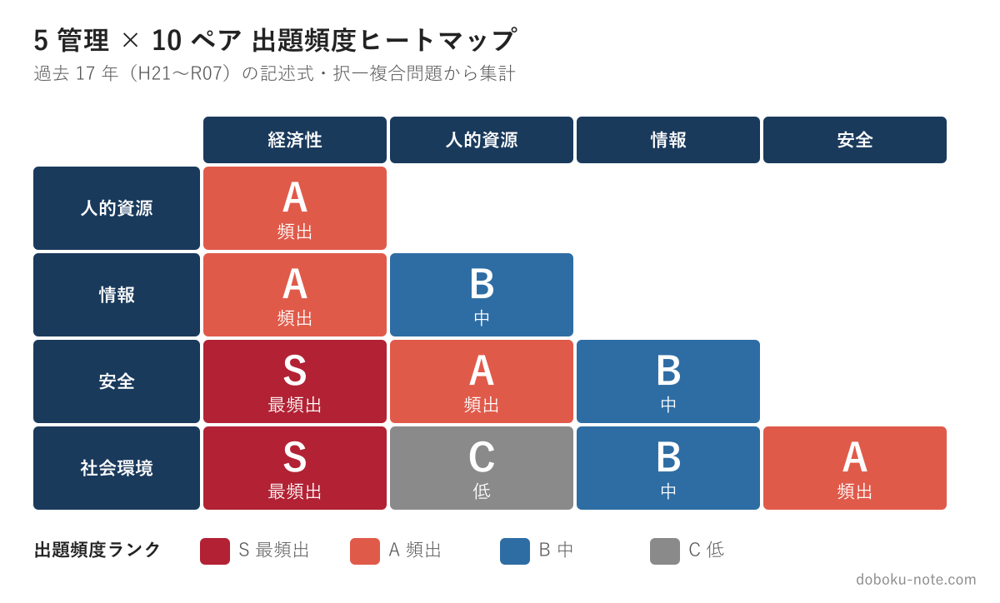
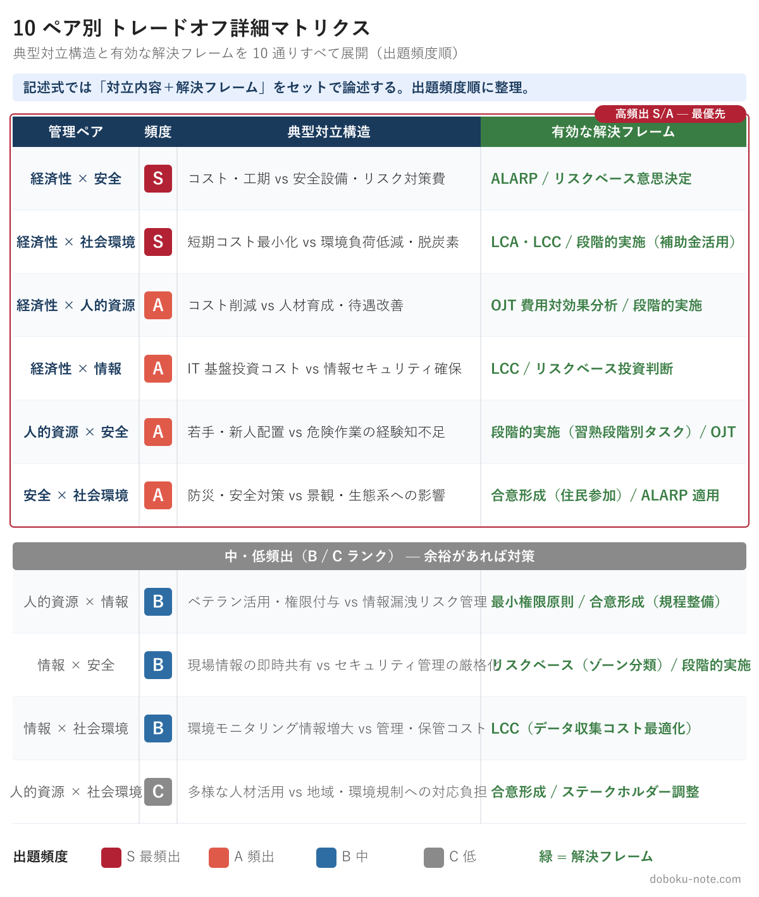
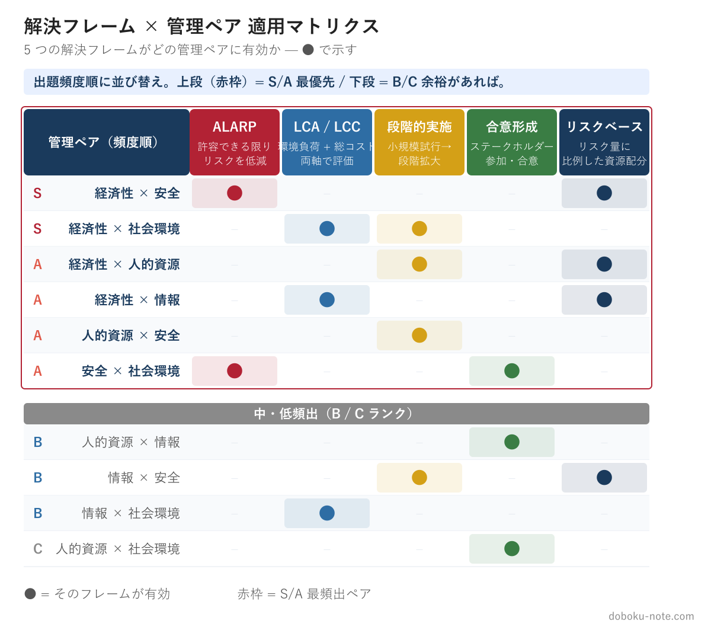

# 総監の合否を分ける「トレードオフ思考」完全ガイド｜5管理間の対立構造を見抜き、論文の核に据える

**この記事で得られるもの**

- 5 管理間トレードオフを「核 vs 核」の対称関係として正しく定義する思考フレーム
- 10 ペア × 6 頻出ペアの全体像と、各ペアの解決策の組み合わせ
- 過去問 2 年分の答案サンプル（添削コメント付き）＋ 試験 1 か月前から始める 3 週間集中ドリル

---

総監試験の合否を分ける最大のポイントは「トレードオフ思考」だと言い切ってよいでしょう。択一式でも記述式でも口頭試験でも、5 つの管理間で発生するトレードオフをどう認識し、どう調整するかが繰り返し問われます。

しかし、一般部門の合格者であっても「トレードオフ」という概念を正確に理解しないまま総監に挑む受験者は少なくありません。

本記事では、定義 → マトリクス全体像 → 解決フレーム → 答案サンプル → 3 週間ドリルの順に、受験対策として必要な内容を 1 本で完結させます。

<!-- cta:pack-top -->
> 本番直前の総仕上げは、出題予想6テーマ×三層骨子で「何が出ても書ける型」を最短装填できる[R8予想問題集（2026最終予想）](https://note.com/dobokunote/m/m6854c7437d4d)が決め手。書き方の型から固めるなら、型・設問(3)の弾薬・R8演習を1セットにした[記述式コアパック](https://note.com/dobokunote/m/m6e7de5e4ea3d)が入口に最適です。

## 1. トレードオフとは何か

### 1.1 定義：5 つの管理間の「核 vs 核」の対称関係

トレードオフとは、一方を改善しようとすると他方が悪化する関係のことです。

総監の文脈では、**5 つの管理**（[経済性管理](https://doboku-note.com/docs/pe-comprehensive-management-economic-management-pillar?utm_source=note&utm_medium=referral&utm_campaign=99-tradeoff-thinking)・[人的資源管理](https://doboku-note.com/docs/pe-comprehensive-management-human-resource-management-pillar?utm_source=note&utm_medium=referral&utm_campaign=99-tradeoff-thinking)・[情報管理](https://doboku-note.com/docs/pe-comprehensive-management-information-management-pillar?utm_source=note&utm_medium=referral&utm_campaign=99-tradeoff-thinking)・[安全管理](https://doboku-note.com/docs/pe-comprehensive-management-safety-management-pillar?utm_source=note&utm_medium=referral&utm_campaign=99-tradeoff-thinking)・[社会環境管理](https://doboku-note.com/docs/pe-comprehensive-management-social-environment-management-pillar?utm_source=note&utm_medium=referral&utm_campaign=99-tradeoff-thinking)）**それぞれの「核となる目標」が同じ局面で対称的に衝突する**構造を指す。

ここで重要なのは、**管理間トレードオフは「解決策の選択肢の対立」ではない**ということ。

たとえば「事後保全 vs 一律予防保全」は、経済性×安全のトレードオフを **解決するための手段の二極化** であり、トレードオフそのものではない。

本当のトレードオフは「経済性管理の核（コスト・工期の最適化）」と「安全管理の核（人命・第三者影響の回避）」の対称関係です。

この区別を誤ると、答案で「経済性 vs 安全」を論じているはずが「保全方式の選択」の議論に滑ってしまい、評価が伸びません。

### 1.2 5 管理の「核となる目標」

5 つの管理のそれぞれが、何を最大化したいかを 1 行で押さえます。

- **経済性管理** — コスト・工期・原価・収益の最適化
- **人的資源管理** — 労働力の確保・育成、労働環境の改善、モラール
- **情報管理** — 情報の機密性・完全性・可用性（CIA）、業務効率化
- **安全管理** — 人命・健康・第三者影響の回避、労働安全
- **社会環境管理** — 環境保全・景観・地域合意・社会受容性

論文では「A 管理は X を核、B 管理は Y を核とし、両者は…で衝突する」と核同士の対称関係を 1 文で宣言してから入る、と作法が決まっています。

### 1.3 なぜトレードオフが総監の本質なのか

一般部門の技術士は、専門技術を深く掘り下げて最適な解決策を提示する能力が求められます。

それに対して総監技術士は、業務全体を俯瞰し、複数の管理分野にまたがる要求事項を総合的に判断・調整する能力が求められます。

この「総合的な判断・調整」こそがトレードオフの処理にほかなりません。5 つの管理すべてを 100% 満たすことは現実には不可能で、限られた資源の中でどの管理を優先し、どこで妥協するかを判断します。それが総監技術士の仕事です。

### 1.4 同一管理内の三すくみとは別物

正確には、青本でも QCD（品質・コスト・工程）や CIA（機密性・完全性・可用性）など **同一管理内の三すくみ** が概念としては存在します。

ただし記述式・択一式で頻繁に問われるのは、こうした管理内の局所的な対立ではなく、**5 管理の垣根を越える対立** です。本記事も以降、この「異なる管理間トレードオフ」を中心に扱います。

## 2. 5 管理間トレードオフマトリクス

### 2.1 出題頻度マトリクス（全体像）

5 つの管理のあらゆる組み合わせ、全 10 通りでトレードオフが発生しえる。下図は、過去 10 年（H27〜R6）の記述式・択一複合問題における各ペアの **出題頻度** をヒートマップで示したもの（**S = 最頻出 / A = 頻出 / B = 中 / C = 低**）。

経済性管理を片側に含むペア 4 本（経済性 × 人的資源・情報・安全・社会環境）がすべて S または A で、これだけで全出題の約 6〜7 割を占めます。

次いで安全 × 社会環境（防災 × 景観）と人的資源 × 安全（労働安全）が頻出。記述式対策では左上から右下に向けて優先度を下げて学習配分すれば効率的です。

### 2.2 なぜ 10 ペア中 6 ペアに収束するのか

理論上は対等な 10 ペアが、実出題では 6 ペアに収束する理由は経済性管理の中心性にあります。

経済性管理は **事業企画・品質・工程・原価・財務・設備** と扱う対象が幅広く、どの管理判断にも必ずコストが跳ね返る。結果、経済性を片側に含む 4 ペアが S/A に集中します。

加えて、近年（令和 2 年度以降）は DX・生成 AI・カーボンニュートラルといった社会テーマの変化により、**情報管理と社会環境管理が主役に格上げ** された。従来「脇役」だったこの 2 管理がトレードオフの一方に立つ設問が急増しています。

頻出 6 ペアの内訳は次のとおりです。

- **経済性 × 安全**（S）— インフラ老朽化、自然災害対応、品質確保
- **経済性 × 社会環境**（S）— 脱炭素、循環型社会、景観保全
- **経済性 × 人的資源**（A）— 担い手不足、2024 年問題、技能伝承
- **経済性 × 情報**（A）— DX 投資、ICT 化、AI 設計支援
- **安全 × 社会環境**（A）— 流域治水、ハード × 環境配慮
- **人的資源 × 安全**（A）— 長時間労働、外国人材、KY 訓練

### 2.3 ペア別 詳細マトリクス（典型対立 + 解決フレーム）

出題頻度だけでなく、**各ペアで何が対立しているのか・どう解決するのか**まで把握することが記述式攻略の鍵です。下図に 10 通りすべての「典型対立構造」と「有効な解決フレーム」を展開しました。

このマトリクスを「暗記する」必要はありません。

重要なのは、**自分の業務経験の中にこの 10 通りのどれが当てはまるかを考えられるようになること**。記述式では、与えられた事例に対してこのマトリクスのどの部分が問われているかを素早く判断し、論述に組み込むことが求められます。

このマトリクスの詳細な解説や過去問出題パターンは、[doboku-note の 5 管理間トレードオフ解説ページ](https://doboku-note.com/docs/pe-comprehensive-management-management-tradeoffs?utm_source=note&utm_medium=referral&utm_campaign=99-tradeoff-thinking)で確認できる。

17 年分の択一式・記述式データをもとに各ペアの頻出パターンを整理しており、本記事と併読すると論点の輪郭が立体的に掴めます。

## 3. トレードオフの具体例 3 選

抽象的な理解だけでは試験に対応できません。実務で発生する具体的なトレードオフを 3 つ示します。

### 例1：土木工事の安全設備（経済性管理 × 安全管理）

建設現場における安全設備の設置は、安全管理の根幹です。しかし、安全設備の充実はそのままコスト増と工期延長につながります。

経済性管理はコスト抑制と工期厳守を要求する一方、安全管理は安全設備の万全な整備を要求します。両者の対立の本質は、**安全性の確保がそのまま経済的負担として跳ね返る点** にあります。

この対立は、あらゆる建設プロジェクトで日常的に発生します。総監技術士として重要なのは、この対立を「仕方のないもの」として受け流すのではなく、明確に認識した上で判断の根拠を示すことです。

### 例2：ベテラン活用と情報漏洩リスク（人的資源管理 × 情報管理）

経験豊富なベテラン技術者に重要な業務を任せたい。

しかし、[アクセス権限](https://doboku-note.com/docs/pe-comprehensive-management-access-control?utm_source=note&utm_medium=referral&utm_campaign=99-tradeoff-thinking)を広く付与すればするほど、[情報漏洩](https://doboku-note.com/docs/pe-comprehensive-management-data-leak-tampering-loss?utm_source=note&utm_medium=referral&utm_campaign=99-tradeoff-thinking)のリスクが高まる。

人的資源管理はベテランの知識・経験を最大限に活用したいと要求する一方、情報管理は情報セキュリティを確保し漏洩リスクを最小化したいと要求するため、人材活用と情報管理の厳格化が真っ向から相反します。

近年の DX 推進やテレワーク普及に伴い、この種のトレードオフは増加傾向にあります。

実例として [令和 4 年度 記述式（DX）](https://doboku-note.com/docs/pe-comprehensive-management-r04-secondary?utm_source=note&utm_medium=referral&utm_campaign=99-tradeoff-thinking)・[令和 3 年度 記述式（データ利活用）](https://doboku-note.com/docs/pe-comprehensive-management-r03-secondary?utm_source=note&utm_medium=referral&utm_campaign=99-tradeoff-thinking) は、この対立構造を直球で問うた典型例です。

### 例3：エネルギーの安定供給と環境負荷（経済性管理 × 社会環境管理）

社会インフラの維持にはエネルギーの安定供給が不可欠だが、化石燃料への依存は環境負荷を増大させます。

経済性管理はエネルギーの安定かつ経済的な供給を要求する一方、社会環境管理は環境負荷の低減と[脱炭素](https://doboku-note.com/docs/pe-comprehensive-management-carbon-neutral?utm_source=note&utm_medium=referral&utm_campaign=99-tradeoff-thinking)を要求します。

両者の対立の本質は、**短期的な経済合理性と長期的な環境保全のあいだ** に横たわります。

このトレードオフは社会全体のスケールで議論されるものだが、総監の記述式では個別のプロジェクトレベルに落とし込んで論じることが求められます。

[令和 6 年度 記述式（カーボンニュートラル）](https://doboku-note.com/docs/pe-comprehensive-management-r06-secondary?utm_source=note&utm_medium=referral&utm_campaign=99-tradeoff-thinking)・[令和 7 年度 記述式（少子高齢化）](https://doboku-note.com/docs/pe-comprehensive-management-r07-secondary?utm_source=note&utm_medium=referral&utm_campaign=99-tradeoff-thinking) はこの対立構造を真正面から問う典型例です。

## 4. トレードオフ改善の考え方

### 4.1 解決策は「単独」ではなく「組み合わせ」で

トレードオフを認識した次のステップは、それをどう「改善」するかです。ここで総監特有の発想が求められます。

総監の答案で評価されるのは、**単独フレームではなく 2〜3 フレームの組み合わせ** で論文の骨格を作ること。たとえば経済性×安全のペアでは、リスクベース判断 → ALARP → 残余リスク監視の三層構造が標準形となります。

このとき、各フレームをただ並べるのではなく、論文の序盤で「本事案では ○○ フレームを軸とし、×× フレームで補強する」と宣言します。読み手（採点者）に論旨の構造を先に伝えられ、評点が伸びやすくなります。

### 4.2 「第三の管理」を持ち込むアプローチ

組み合わせの一つの形として、**対立する 2 つの管理とは別の第三の管理の視点を持ち込み、対立そのものを緩和する** 発想があります。

たとえば、経済性管理と安全管理のトレードオフを考えます。「コストを優先して安全対策を削減する」でも「安全を優先してコスト超過を受け入れる」でもなく、**情報管理を活用** して現場調査を行い、費用対効果の高い安全機器を特定します。

この「第三の管理を持ち込む」発想は、5 管理を俯瞰する総監ならではの解法であり、記述式で高く評価されます。

### 4.3 解決フレーム 5 選

「組み合わせて使う」と言っても、何と何を組み合わせるかが問われる。本節で扱うのは、青本・キーワード集に見出し語として収録され、答案で **名指しすれば加点される試験必修の汎用コアフレーム 5 つ** です。

各フレームについて **適用条件・答案で使う典型フレーズ・減点される NG パターン** を併記します。

#### ① [ALARP](https://doboku-note.com/docs/pe-comprehensive-management-alarp-principle?utm_source=note&utm_medium=referral&utm_campaign=99-tradeoff-thinking)（As Low As Reasonably Practicable）

リスクを「合理的に実行可能な限り」低減する考え方。許容不可領域・ALARP 領域・広義許容領域の 3 段階で整理します。

- **適用条件**: 安全管理と経済性管理の対立。リスクをゼロにできない・許容不能でもない「中間領域」がある場合
- **答案フレーズ例**: 「本事業のリスクは ALARP 領域にあり、追加対策の限界費用と便益を比較した上で、費用対効果が見合う範囲まで低減を図る」
- **NG パターン**: 「ALARP の原則に従い対策する」だけで終わる。**3 領域のどこにあるか・なぜそう判断したか** を述べないと評価されません

#### ② LCA / LCC（[ライフサイクル評価](https://doboku-note.com/docs/pe-comprehensive-management-lifecycle-management?utm_source=note&utm_medium=referral&utm_campaign=99-tradeoff-thinking)）

[LCA（ライフサイクルアセスメント）](https://doboku-note.com/docs/pe-comprehensive-management-lifecycle-assessment?utm_source=note&utm_medium=referral&utm_campaign=99-tradeoff-thinking)（Life Cycle Assessment、環境負荷の一体評価）と LCC（Life Cycle Cost、総コスト評価）を組み合わせます。

**両者を混同しないことが採点上きわめて重要**（LCA = 環境、LCC = コスト）。

- **適用条件**: 経済性管理と社会環境管理の対立。短期コストと長期環境負荷が競合する場合
- **答案フレーズ例**: 「LCC で総保有コストを比較しつつ、LCA で CO2 排出と廃棄影響を定量評価し、両軸で最適解を選定する」
- **NG パターン**: 「LCA でライフサイクルコストを評価する」と書くと **概念混同で減点必至**

#### ③ 段階的実施（Phased Approach）

小規模試行 → 効果検証 → 段階拡大、のサイクルでリスクとコストを抑えます。

- **適用条件**: 経済性管理と人的資源管理・情報管理の対立。新技術導入・大規模変革の意思決定で不確実性が高い場合
- **答案フレーズ例**: 「Phase 1 で限定部署にパイロット導入し、KPI（生産性／インシデント率）を 3 ヶ月測定。閾値達成を確認後、Phase 2 で全社展開する」
- **NG パターン**: 「徐々に進める」「様子を見ながら」だけ。**フェーズ区切りの判定基準** を書かないと一般論扱い

#### ④ [合意形成](https://doboku-note.com/docs/pe-comprehensive-management-consensus-instruments?utm_source=note&utm_medium=referral&utm_campaign=99-tradeoff-thinking)（Consensus Building）

ステークホルダーを早期に巻き込み、納得感のもとで意思決定します。説明責任と透明性が鍵。

- **適用条件**: 人的資源管理・社会環境管理との対立。利害関係者が複数（住民・労組・取引先・行政）で対立しやすい場合
- **答案フレーズ例**: 「住民説明会・労使協議会・パブリックコメントの 3 段階で意見を聴取し、影響評価結果と対策案を併せて公表する」
- **NG パターン**: 「ステークホルダーと話し合う」だけ。**手段**（説明会・協議会・調査）**と段階** を具体化する必要あり

#### ⑤ リスクベース意思決定（Risk-Based Decision Making）

リスク量（発生確率 × 影響度）に比例した資源配分を行います。最頻出の万能フレームで、ALARP・LCC とも組み合わせやすいフレームです。

- **適用条件**: 経済性管理と安全管理・情報管理・社会環境管理の対立すべて。資源制約下での優先順位付けが必要な場合
- **答案フレーズ例**: 「[リスクマトリクス](https://doboku-note.com/docs/pe-comprehensive-management-risk-map-matrix?utm_source=note&utm_medium=referral&utm_campaign=99-tradeoff-thinking)（発生頻度 × 影響度）で重大リスクを 3 件抽出し、対策投資額を 7:2:1 の比率で配分する」
- **NG パターン**: 「重要なリスクから対策する」だけ。**リスク評価の手法**（マトリクス・PRA・[FMEA](https://doboku-note.com/docs/pe-comprehensive-management-fmea?utm_source=note&utm_medium=referral&utm_campaign=99-tradeoff-thinking)）**と配分根拠** を示さないと採点者には届きません

下図は、この 5 つのフレームが 10 の管理ペアに対してどう適用できるかをまとめたもの。

5 つの解決フレームの詳細な使い方や実際の記述例は、[doboku-note の記述式戦略ページ](https://doboku-note.com/docs/pe-comprehensive-management-essay-exam-strategy?utm_source=note&utm_medium=referral&utm_campaign=99-tradeoff-thinking)にまとめています。

答案の骨格として活用してほしいです。

### 4.4 10 ペア × 第三の管理 完全マッピング

記述式で最も評価されるのは「対立する 2 管理を解決するために **第三の管理を持ち込む** 構造」です。10 ペアそれぞれで、最も有効な第三の管理と具体施策キーワードを以下に整理しました。

**S/A ランク**（最頻出 + 頻出）

- 経済性 × 安全（**S**）— 第三：**情報管理** / 施策キーワード: AI による事故予兆検知 / IoT モニタリング / 過去災害データのシミュレーション
- 経済性 × 社会環境（**S**）— 第三：**人的資源管理** / 施策: 環境教育 / グリーンスキル研修 / ESG 視点での意思決定権限委譲
- 経済性 × 人的資源（**A**）— 第三：**情報管理** / 施策: [OJT](https://doboku-note.com/docs/pe-comprehensive-management-ojt-off-jt?utm_source=note&utm_medium=referral&utm_campaign=99-tradeoff-thinking) 効果測定 KPI 可視化 / 教育 ROI 分析 / スキルマップのデータベース化
- 経済性 × 情報（**A**）— 第三：**安全管理** / 施策: ALARP に基づくセキュリティ投資 / リスクベース投資判断 / 損害コスト評価
- 人的資源 × 安全（**A**）— 第三：**経済性管理** / 施策: 安全装備の費用便益分析 / 教育コストの定量評価 / 労災保険コスト最適化
- 安全 × 社会環境（**A**）— 第三：**人的資源管理** / 施策: 防災教育 / 住民参加型ワークショップ / ステークホルダー対話の組織化

**B/C ランク**（中・低頻出）

- 人的資源 × 情報（**B**）— 第三：**安全管理** / 施策: アクセス権限の段階化 / セキュリティ教育 / 心理的安全性の確保
- 情報 × 安全（**B**）— 第三：**経済性管理** / 施策: サイバー保険 / セキュリティ投資 ROI / 損害賠償リスクの定量化
- 情報 × 社会環境（**B**）— 第三：**経済性管理** / 施策: データ収集コストの最適化 / 環境モニタリング投資の段階化 / 規制対応費の予算配分
- 人的資源 × 社会環境（**C**）— 第三：**経済性管理** / 施策: グリーン雇用 / CSR 投資の費用便益 / ESG 評価による採用差別化

**覚え方のコツ**: S/A ランクの 6 ペアでは、**第三の管理に「情報」「人的資源」「経済性」が頻出** する。記述式本番で詰まったら、まずこの 3 つから当てはまるものを探すと突破口が見えます。

### 4.5 改善の 6 ステップ

トレードオフ改善の思考プロセスは、次のステップで整理できます。

1. **対立する 2 つの管理を明確にする** — 「核 vs 核」で何と何が対立しているのかを言語化する
2. **対立の原因を分析する** — なぜ対立が生じているのか、制約条件は何か
3. **解決の方向性を 2〜3 個並べる** — 標準形と制約条件別の派生形を散文で提示する
4. **第三の管理を検討する** — 残り 3 つの管理のうち、この対立を緩和できる視点はないか
5. **解決フレームを名指しする** — ALARP / LCA / LCC / 段階的実施 / 合意形成 / リスクベースのうち、1〜2 個を答案に明示する
6. **[残留リスク](https://doboku-note.com/docs/pe-comprehensive-management-residual-risk?utm_source=note&utm_medium=referral&utm_campaign=99-tradeoff-thinking)を評価する** — 改善策を講じてもなお残るリスクを認識し、監視体制と見直しトリガー（年次レビュー・KPI 閾値超過時の再評価 等）を示す

このステップは、記述式の答案構成にそのまま使えます。

## 5. 記述式での活用 — トレードオフを答案の核に据える

### 5.1 記述式の出題構造

総監の記述式は、以下の構成で出題されます。

1. 事例の提示（建設プロジェクト等の具体的なシナリオ）
2. 5 管理の視点での課題整理
3. 管理間のトレードオフの分析
4. 総合的な対策・提言

見てのとおり、トレードオフの分析は記述式の中核を成します。ここで説得力のある論述ができるかどうかが合否を分けます。

### 5.2 答案へのトレードオフの組み込み方

記述式の答案にトレードオフを組み込む際は、以下の構造が有効です。

**第 1 段階：5 管理の視点で課題を洗い出す**

与えられた事例を 5 つの管理の視点でスキャンし、各管理における課題を列挙します。この段階ではまだトレードオフに踏み込まず、個別の課題を整理します。

**第 2 段階：トレードオフを特定する**

洗い出した課題の中から、異なる管理間で対立関係にあるものを特定します。マトリクスの 10 通りのうち、事例に最も関連するトレードオフを 2〜3 組選びます。

**第 3 段階：第三の管理で解決策を提示する**

選んだトレードオフに対し、「第三の管理で解決する」アプローチを適用します。

具体的な管理技術の名称（PERT、[リスクアセスメント](https://doboku-note.com/docs/pe-comprehensive-management-risk-assessment?utm_source=note&utm_medium=referral&utm_campaign=99-tradeoff-thinking)、[OJT](https://doboku-note.com/docs/pe-comprehensive-management-ojt-off-jt?utm_source=note&utm_medium=referral&utm_campaign=99-tradeoff-thinking) 等）を挙げながら、実現可能な対策を示します。

**第 4 段階：残留リスクと継続的改善**

対策を講じた後にも残るリスクを明示し、モニタリングや改善の方向性を示します。ここまで書けると、答案の完成度は大きく上がります。

### 5.3 よくある失敗

- **トレードオフが同一管理内にとどまっている** — 品質と工程のトレードオフ（いずれも経済性管理）を挙げてしまう。必ず異なる管理間の対立を示します
- **トレードオフを「解決手段の選択」と混同している** — 「事後保全 vs 予防保全」を経済性×安全のトレードオフと書いてしまう。これは解決手段の二極化であって、本来のトレードオフは「核 vs 核」の対称関係
- **トレードオフを認識するだけで終わっている** — 対立を指摘しただけでは不十分。改善策まで踏み込みます
- **解決策が一般論にとどまっている** — 「安全に配慮する」ではなく、具体的な手法（リスクアセスメントの結果に基づく安全機器の選定等）を示します

記述式答案でトレードオフをどう論述するかの実践的なテクニックは、[doboku-note の記述式戦略ページ](https://doboku-note.com/docs/pe-comprehensive-management-essay-exam-strategy?utm_source=note&utm_medium=referral&utm_campaign=99-tradeoff-thinking)で詳解しています。

過去問を使った実践的な対策は [択一式・記述式 過去問一覧](https://doboku-note.com/docs/pe-comprehensive-management-exam-index?utm_source=note&utm_medium=referral&utm_campaign=99-tradeoff-thinking) から取り組めます。

## 6. 答案サンプル 2 本 — どう書けば評価されるのか

> **サンプルの位置づけ**: このサンプルは **「Ⅱ 施策」設問の 1 枚分**（600 字）**を対象としたフレーム** です。5 枚全体の三層構造（Ⅰ 管理対象と前提条件 → Ⅱ 施策 → Ⅲ 将来展望）の設計方法は、[記述式試験の解答戦略（doboku-note）](https://doboku-note.com/docs/pe-comprehensive-management-essay-exam-strategy?utm_source=note&utm_medium=referral&utm_campaign=99-tradeoff-thinking)で詳解しています。論文全体の骨格を先に把握してからサンプルを読むと、「この 1 枚が 5 枚のどこに当たるか」が見えて理解が深まります。

ここまでの理論を「実際の答案でどう書くか」に翻訳します。

過去問 2 年（[令和 2 年度 異常な自然現象 BCP](https://doboku-note.com/docs/pe-comprehensive-management-r02-secondary?utm_source=note&utm_medium=referral&utm_campaign=99-tradeoff-thinking)・[令和 6 年度 カーボンニュートラル](https://doboku-note.com/docs/pe-comprehensive-management-r06-secondary?utm_source=note&utm_medium=referral&utm_campaign=99-tradeoff-thinking)）を題材に、**4 段構造で 600 字 × 1 枚分の答案骨子** を示します。

各サンプルに採点者視点の **添削コメント**（◎ 高評価点 / × 減点リスク）を付けます。

### 6.1 サンプル A：R02 異常な自然現象 BCP（経済性管理 × 安全管理 + 第三：情報管理）

**事業設定**：製造業の生産工場における事業継続計画。豪雨災害により浸水リスクが顕在化。設備保護のための嵩上げ工事は工期 6 ヶ月・投資 1.5 億円が必要。

**第 1 段**（150 字）**対立特定**

本事業では、経済性管理（短期収益・コスト最適化）と安全管理（事業場・第三者影響の回避）が ALARP 領域で衝突する。

具体的には、設備保護のための嵩上げ工事（[リスクアセスメント](https://doboku-note.com/docs/pe-comprehensive-management-risk-assessment?utm_source=note&utm_medium=referral&utm_campaign=99-tradeoff-thinking)結果は浸水確率 30 年 1 回・損害額 5 億円）と、工事中の生産停止 6 ヶ月による機会損失 8 億円が対立する。

**第 2 段**（200 字）**第三の管理＝情報管理の活用**

第三の視点として **情報管理を持ち込む**。

具体施策として、(1) 過去 30 年の気象データと生産設備配置を組み合わせた **浸水シミュレーション** を実施し、被害が集中する重要設備 3 ラインを特定。

(2) 当該 3 ラインのみを優先的に嵩上げする **段階的実施**（Phase 1：工期 2 ヶ月・投資 6,000 万円）に切り替え。(3) IoT センサーで地下水位と降雨量を **リアルタイムモニタリング** し、稼働継続判断を自動化する。

**第 3 段**（150 字）**施策の効果と副次効果**

この施策により、初年度投資を 1.5 億円 → 6,000 万円に圧縮しつつ、浸水損害の 80% を軽減できる見込み。

副次効果として、IoT データは **品質管理**（製造プロセスの環境制御）にも転用可能で、人的資源管理の観点からも、現場作業員の災害判断負荷が軽減される。

**第 4 段**（100 字）**残留リスクと継続改善**

残留リスクとして、**シミュレーション精度の限界**（過去データに含まれない極端事象）が残る。

これに対しては、年 1 回の事業継続計画見直し（[BCP](https://doboku-note.com/docs/pe-comprehensive-management-business-continuity-plan?utm_source=note&utm_medium=referral&utm_campaign=99-tradeoff-thinking) 訓練）と、シミュレーションモデルの定期更新で対応する。

**添削コメント**：

- ◎ **核 vs 核の宣言**：第 1 段冒頭で「経済性の核 vs 安全の核」を明示。読み手に対立構造を先に伝えることで以降の論述が筋を通せます
- ◎ **数値の具体性**：「30 年 1 回・5 億円」「6,000 万円」「80%」など数値で論証することで、ALARP 領域の判断根拠が明確になり高評価
- ◎ **解決フレームの名指し**：「ALARP」「段階的実施」「リアルタイムモニタリング」を明示。**フレーム名を答案に書くことが採点上きわめて重要**
- ◎ **副次効果への言及**：第 3 段で品質管理・人的資源管理への波及を書くことで「総合的視点」の評価が上がります
- × **NG だった書き方**：「災害に備えて嵩上げ工事を検討する」だけでは平凡。**「ALARP 領域で費用対効果を比較した結果」** という判断プロセスを明示するのが総監らしさ

### 6.2 サンプル B：R06 カーボンニュートラル（経済性管理 × 社会環境管理 + 第三：人的資源管理）

**事業設定**：建設会社における 2050 年カーボンニュートラル対応。重機の電動化・水素化を進める必要があるが、現場作業員の操作習熟・整備技能の刷新が課題。

**第 1 段**（150 字）**対立特定**

本事業では、経済性管理（コスト・工期の最適化）と社会環境管理（環境保全・社会受容性）が長期と短期の時間軸で衝突する。

具体的には、[脱炭素](https://doboku-note.com/docs/pe-comprehensive-management-carbon-neutral?utm_source=note&utm_medium=referral&utm_campaign=99-tradeoff-thinking)のための電動・水素重機への転換（CO2 削減 60%）と、初期投資 5 億円・新型重機の燃費／メンテコスト未確定が対立する。

**LCA と LCC の両軸で評価し、移行期の経済性悪化をどう吸収するかが論点**。

**第 2 段**（200 字）**第三の管理＝人的資源管理の活用**

第三の視点として **人的資源管理を持ち込む**。

具体施策として、(1) **環境教育とグリーンスキル研修** を全現場作業員（300 名）に実施。電動・水素重機の特性を理解した作業員自身が、燃費最適化と稼働率改善を主導できる体制を構築。

(2) ESG 視点の意思決定権限を **現場リーダー**（30 名）に委譲し、現場ごとの最適化判断を可能にする。

(3) [合意形成](https://doboku-note.com/docs/pe-comprehensive-management-consensus-instruments?utm_source=note&utm_medium=referral&utm_campaign=99-tradeoff-thinking)として、労使協議会で移行スケジュールと評価制度を共有し、不安を低減する。

**第 3 段**（150 字）**施策の効果と副次効果**

教育投資 1,500 万円で作業員の主体的な省エネ運用を引き出し、電動化導入後 3 年で年間燃費コスト 20% 削減を見込む。

LCC 試算では従来重機との総コストが 8 年で逆転。副次効果として、グリーンスキル人材の採用差別化（**社会環境 × 人的資源**）が進み、若手応募が増加する見込み。

**第 4 段**（100 字）**残留リスクと継続改善**

残留リスクとして、**水素供給インフラの整備遅延**（社外要因）がある。これに対しては、電動・ハイブリッドを並行導入する **段階的実施** と、業界団体経由のロビーイングで対応する。

**添削コメント**：

- ◎ **核 vs 核の宣言**：第 1 段冒頭で「経済性の核 vs 社会環境の核」と時間軸の対称関係を明示。論文全体の方向性が定まります
- ◎ **LCA / LCC の正しい使い分け**：第 1 段で「LCA で CO2、LCC で総コスト」と明示。**この区別を間違えると即減点**
- ◎ **第三の管理が「環境教育」だけで終わっていない**：教育 → 権限委譲 → 合意形成と 3 段階で施策を並べることで論述の厚みが出ます
- ◎ **副次効果での 2 つ目のトレードオフ**：「採用差別化（社会環境 × 人的資源）」と別ペアに言及することで、5 管理の俯瞰力をアピール
- × **NG だった書き方**：「カーボンニュートラルのため電動重機を導入する」だけは小学生レベル。**「LCC 試算で 8 年で逆転」** といった経済合理性の根拠を必ず添えます

### 6.3 答案を書くときの 3 つの鉄則

サンプル A・B から抽出される、トレードオフ答案の鉄則。

1. **核 vs 核の宣言を冒頭に置く** — 「A 管理（核 X）と B 管理（核 Y）が … で衝突する」型の 1 文で対立構造を先に伝える
2. **数値・期間・KPI のいずれかを必ず入れる** — 「3 ヶ月」「5 億円」「20%」「30 名」のような具体数値が論述の説得力を 2 段階上げる
3. **解決フレーム名を 1 答案に最低 2 個書く** — ALARP / LCA / LCC / 段階的実施 / 合意形成 / リスクベースのうち 2 つ以上を **名指し** する

## 7. 残余リスク監視で論文を閉じる定型

総監記述式の論文では、選定した解決策の限界を認め、残余リスクと監視体制を末尾で明示することで論旨が閉じます。これは設問 (3) の「将来展望」や 2,800-3,000 字答案の結びとして、ほぼすべての論文に適用できる定型です。

### 7.1 定型の 3 段階構造

定型の構造は以下の 3 段階を踏みます。

第一段階で「**完全な解消は不可能である**」という総監的前提を提示します。

> 例：「ALARP 原則やリスクベース判断に基づき全体最適を導いたが、依然としてシステム障害や想定外の気象変動といった残余リスクが残る」

第二段階で **残余リスクの監視体制** を具体化します。

> 例：KPI による定期モニタリング、閾値超過時のトリガー設計、センサーや住民協働による早期検知

第三段階で **フィードバック体制** を BCP（事業継続計画）と接続します。

> 例：リスク閾値超過時の計画見直し、組織体制の再設計、対策の段階的アップグレード

### 7.2 200-300 字で書ける標準テンプレ

この 3 段階を 200-300 字の散文で記述するだけで、論文は「監理技術者らしい俯瞰的視点」を獲得します。採点者は「リスクを完全に消そうとせず、残余リスクを認めて監視する姿勢」を高く評価します。

逆に「対策を講じたので問題は解消された」と書き切ると、設問 (3) で求められる将来展望が浅くなり、評点が伸びません。

書き始めの定型は次のとおり。

> 「本施策の実施によりリスクを許容水準まで下げたが、依然としてシステム障害や想定外の気象変動といった残余リスクが残る。そのため、KPI による定期的なモニタリングを実施し、リスク値が閾値を超えた場合には、計画の見直し（フィードバック）を行う体制を構築する。」

この文型を覚えておけば、本番でどんなテーマでも論文を閉じられます。

## 8. 3 週間集中ドリル — 試験前の追い込み学習プラン

トレードオフ思考は、概念を理解しただけでは記述式答案に書けるようになりません。**過去問を題材にした演習を 3 週間で組む** のが最短ルートです。試験 1 ヶ月前を目安に開始してほしいです。

### 8.1 Week 1：トレードオフ抽出（過去問 3 年分）

**目標**：過去問を読んで「どの管理ペアが対立しているか」を 1 分以内に特定できるようになります。

**タスク**：

1. 平日 2 日（30 分 × 2）：[令和 7 年度](https://doboku-note.com/docs/pe-comprehensive-management-r07-secondary?utm_source=note&utm_medium=referral&utm_campaign=99-tradeoff-thinking)・[令和 6 年度](https://doboku-note.com/docs/pe-comprehensive-management-r06-secondary?utm_source=note&utm_medium=referral&utm_campaign=99-tradeoff-thinking)・[令和 5 年度](https://doboku-note.com/docs/pe-comprehensive-management-r05-secondary?utm_source=note&utm_medium=referral&utm_campaign=99-tradeoff-thinking)を読み、設問ごとにトレードオフを抽出して A4 1 枚にメモ
2. 週末 1 日（60 分）：抽出した各トレードオフを「§4.4 マッピング表」と照合し、第三の管理候補を 2 つずつ書き出す

**セルフチェック**：

- [ ] 各設問でトレードオフのペアを 1〜2 組明確に書けたか
- [ ] §4.4 表に当てはめて第三の管理を候補化できたか
- [ ] 「核 vs 核」の対称関係を 1 文で言語化できたか
- [ ] 自分の専門分野の事業に置き換えてイメージできたか

### 8.2 Week 2：600 字 × 1 枚を 3 本書く

**目標**：「対立特定 → 第三の管理 → 具体施策 → 残留リスク」の 4 段構造を 600 字に圧縮する型を体得します。

**タスク**：

1. Week 1 で抽出したトレードオフから 3 つを選ぶ（異なる年度から）
2. 各 1 つにつき、以下の構成で 600 字 × 1 枚を書く（合計 3 本）：
    - 第 1 段（150 字）：事業設定とトレードオフの特定（核 vs 核を冒頭で宣言）
    - 第 2 段（200 字）：第三の管理の視点と具体施策（1〜2 個、解決フレーム明示）
    - 第 3 段（150 字）：施策の効果と並行で発生する副次効果
    - 第 4 段（100 字）：残留リスクと継続的改善
3. §6 の答案サンプル 2 本と自分の答案を見比べ、削れる冗長表現・足りない数値を確認
4. 書いた 1 枚が **論文全体の三層構造**（Ⅰ 管理対象 → Ⅱ 施策 → Ⅲ 将来展望）**のどの層に相当する設問か** を確認し、残りの層をどう書くかの骨子を余白にメモする（三層構造の詳細は [記述式試験の解答戦略](https://doboku-note.com/docs/pe-comprehensive-management-essay-exam-strategy?utm_source=note&utm_medium=referral&utm_campaign=99-tradeoff-thinking) 参照）

**セルフチェック**：

- [ ] 第 1 段で「A 管理（核 X）と B 管理（核 Y）が … で衝突する」型の宣言を書いたか
- [ ] ALARP / LCA / LCC / 段階的実施 / 合意形成 / リスクベースのいずれかを **名指しで** 答案に書いたか
- [ ] 第 2 段の施策に **数値・期間・KPI** のうち少なくとも 1 つを入れたか
- [ ] 残留リスクと「モニタリング方法」をセットで書けたか

### 8.3 Week 3：600 字 × 5 枚（本番想定 3 時間 30 分）

**目標**：試験本番のタイムプレッシャー下でも三層構造とトレードオフ視点を維持します。

**タスク**：

1. 直近の過去問（[令和 7 年度](https://doboku-note.com/docs/pe-comprehensive-management-r07-secondary?utm_source=note&utm_medium=referral&utm_campaign=99-tradeoff-thinking)）を 1 本選び、本番と同じ 3 時間 30 分で 600 字 × 5 枚を書ききる
2. 終了直後に以下のセルフ添削チェック（30 分）

**セルフ添削チェックリスト**：

- [ ] 1 枚目に **5 管理の視点で課題を網羅的に列挙** できたか
- [ ] 2〜3 枚目で **少なくとも 2 組のトレードオフ** を異なる管理間で特定したか
- [ ] 各トレードオフで「**核 vs 核**」の対称関係を冒頭で宣言したか（解決手段の二極化と混同していないか）
- [ ] 各トレードオフで **第三の管理 + 解決フレーム名** を明示したか
- [ ] 4〜5 枚目で **残留リスク・継続改善・PDCA** に触れたか
- [ ] 全体を通じて **同一管理内**（QCD）**に閉じたトレードオフ** を書いていないか
- [ ] 専門用語（ALARP、LCA、LCC、リスクマトリクス等）を **誤用していない** か
- [ ] **三層構造**（Ⅰ→Ⅱ→Ⅲ）**の因果がつながっているか** — Ⅲ の課題・リスクは Ⅱ を進めた結果として自然に出てくるか
- [ ] **Ⅰ の前提条件が Ⅱ の施策と直結しているか** — Ⅰ で書いていない課題を Ⅱ で突然解決していないか
- [ ] **Ⅲ の最大リスクを 1 つに絞れているか** — あれもこれもと並列列挙していないか

**3 週間後**：Week 3 の答案を 1 ヶ月後に再採点して、「自分が当時何を書けていなかったか」を確認します。本番直前に最終チェックすべき自分の弱点が見える化します。

---

トレードオフ思考は、試験対策としてだけでなく、実務における意思決定の質を高めるスキルでもあります。5 つの管理のフレームワークを日常的に意識することで、総監技術士にふさわしい俯瞰的な判断力が身についていきます。

---

## 関連リソース

**doboku-note — 17 年分の過去問 + 650 キーワード解説** （無料）

https://doboku-note.com/category/pe-comprehensive-management?utm_source=note&utm_medium=referral&utm_campaign=99-tradeoff-thinking

- 17 年分の択一式過去問（全問解答解説付き）
- 650 以上のキーワード解説ページ
- 5 管理間トレードオフの解決フレーム（[詳細記事](https://doboku-note.com/docs/pe-comprehensive-management-management-tradeoffs?utm_source=note&utm_medium=referral&utm_campaign=99-tradeoff-thinking)）
- スマホ対応（通勤中の学習に最適）

**あわせて読みたい 無料 note 記事**

トレードオフの「型」を、より具体的な記述式の場面で確認できる無料記事です。

https://note.com/dobokunote/n/nced3f11b7641

https://note.com/dobokunote/n/nc360aaa381b0

https://note.com/dobokunote/n/n60efbccd728b

---

トレードオフの思考フレームを、5管理×他4管理の20セル全網羅で引き出し化したマガジンも公開しています。各セルに起こりうる衝突パターンを複数列挙し、ALARP・RBM・LCC・群マネ等の解決フレームと答案ひな型をセットで収録。

どんなお題でも対立構造と解決策を即座に引き出せる状態を目指せます。

https://note.com/dobokunote/m/m921fbe060575

---

**さらに踏み込みたい人へ — note 有料マガジン**

本記事のフレームを、立場別のフル模範論文やテーマ別の実戦教材に展開したマガジンを note で公開しています。

「型」が実際の答案にどう落ちるかを 3,000 字級のフル模範論文で確認したい方は、立場（ペルソナ）別の 3 シリーズをご覧ください。

https://note.com/dobokunote/m/m32aaa137f22e

https://note.com/dobokunote/m/m32132ecb3033

https://note.com/dobokunote/m/m52186ffd12ca

令和 8 年度の出題候補 6 テーマをフル論述で演習したい方は、R8 予想問題集もあわせてご活用ください。

https://note.com/dobokunote/m/m6854c7437d4d

---

<!-- cta:tankan-mokuji -->
総監のほかの無料記事・有料マガジンは「総監もくじ」から一覧できます。

https://note.com/dobokunote/n/n3ed4c77ceed6