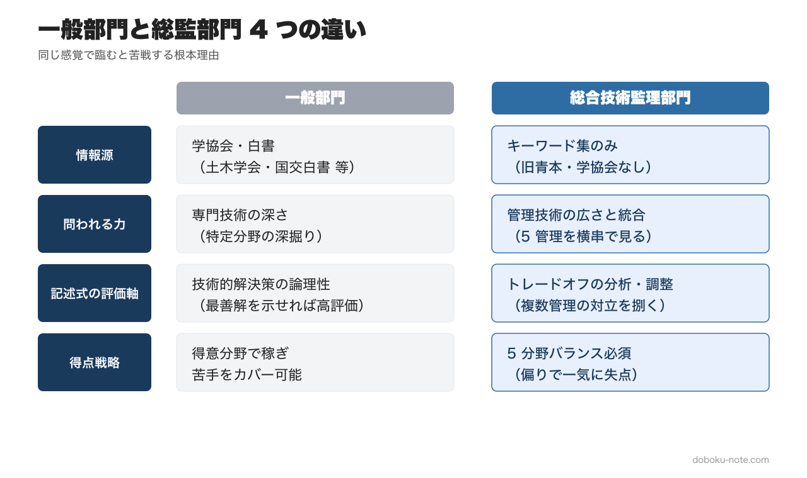
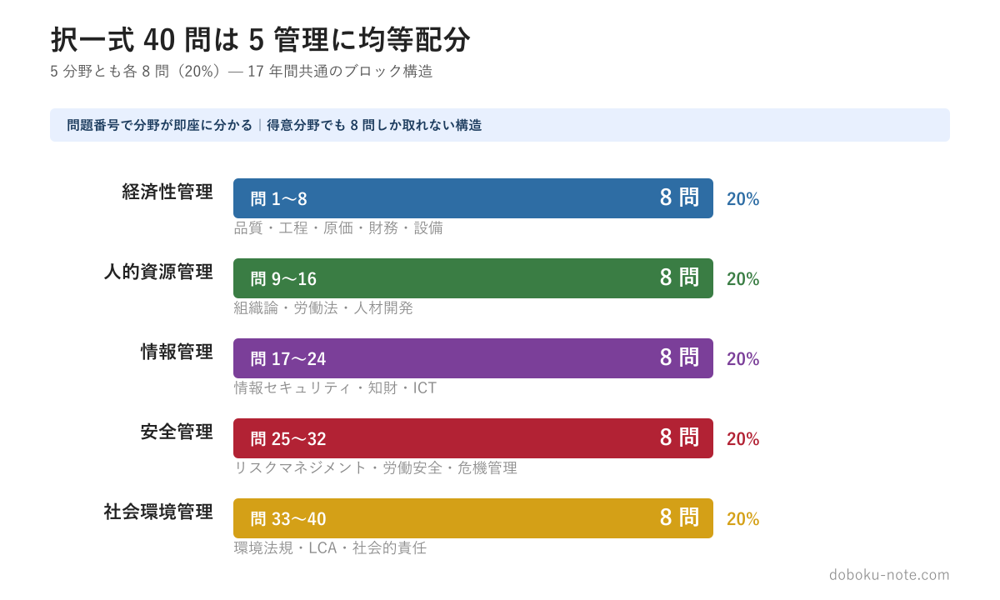
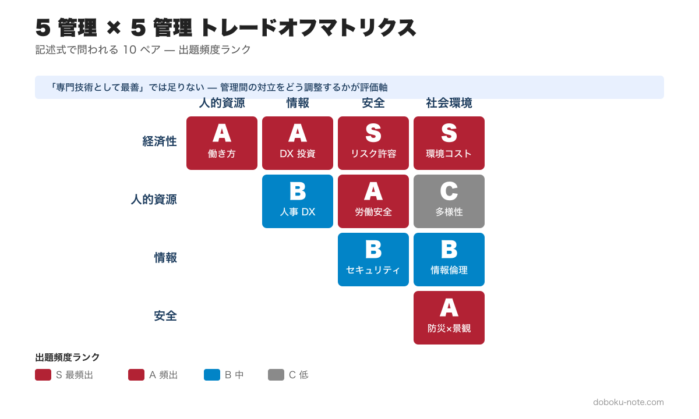

# 【一般部門の合格者が落ちる】総監で通用しない3つの理由｜合格率10%の壁を超える4つの対策

**この記事でわかること**

- 総監部門が一般部門と根本的に異なる3つのポイント
- 「専門技術の深さ」では合格できない理由
- トレードオフ思考を身につけるための具体的な対策

---

技術士の一般部門（建設・機械・電気電子など）に合格し、「次は総監を」と考える受験者は多いと思います。しかし総監の合格率は例年10~15%と一般部門より低く、一般部門の合格者が総監で不合格になるケースは珍しくありません。

一般部門と同じ感覚で臨むと苦戦するのはなぜでしょうか。本記事では、その原因を3つに整理し、対策の方向性を示していきます。

キーワード集を読んでも論点が頭に入らない、択一の引っかけパターンが見えない、5管理の範囲が広すぎてどこから手を付ければいいか優先順位がつかない──そんな受験者のために、17年分の過去問680問を分析して5管理を体系化した精読ガイドを、5本セット ¥1,980（単品4本分の値段で5本・21%OFF）でまとめ購入できます。

https://note.com/dobokunote/m/m607bf095b02a

<!-- cta:pack-top -->
> 本番直前の総仕上げは、出題予想6テーマ×三層骨子で「何が出ても書ける型」を最短装填できるR8予想問題集が決め手。書き方の型から固めるなら、型・設問(3)の弾薬・R8演習を1セットにした記述式コアパックが入口に最適です。

https://note.com/dobokunote/m/m6854c7437d4d

https://note.com/dobokunote/m/m6e7de5e4ea3d

## 理由1: 学協会・白書がない

一般部門には、出題範囲と密接に対応する学協会（土木学会、日本建築学会など）が存在し、学会誌や技術基準が試験対策の柱になります。国土交通白書や環境白書といった公的資料も、記述式の論点整理に直結します。

ところが総監部門には、対応する学協会がありません。白書もありません。唯一の公式情報源は、文部科学省が発行する『総合技術監理 キーワード集』だけです。

このキーワード集は、旧『青本』（2004年発行、2017年絶版）に替わるものとして編集されたもので、5つの管理分野の主要キーワードを例示しています。ただし各キーワードの詳細は「利用者自ら参考書・専門書・資料などを通じて調べ把握すること」が前提とされており、キーワード集だけを読んでも十分な理解には至りません。

つまり、一般部門のように「学会基準を読み込めば得点できる」という戦略が通用しないのです。キーワード集を軸に、関連する法令・ガイドライン・省庁資料を自分で体系的に整理していく必要があります。

> 自分で整理する負荷を下げるため、doboku-note ではキーワード集 2026 の 650+ 全項目を Web で読める形に整備しました → [キーワード集 2026 全項目（doboku-note）](https://doboku-note.com/docs/pe-comprehensive-management-keyword-2026?utm_source=note&utm_medium=referral&utm_campaign=12-general-vs-comprehensive&utm_content=keyword-2026)

## 理由2: 管理技術の広さと統合力が問われる

一般部門では「専門技術の深さ」が問われます。コンクリートの劣化メカニズム、地盤改良の設計手法、河川堤防の安全照査――いずれも特定分野の技術的な深掘りが求められます。

一方、総監では「管理技術の広さと統合力」が問われます。総監の骨格は、次の5つの管理技術です。

- **経済性管理** -- 品質管理・工程管理・原価管理・財務会計・設備管理
- **人的資源管理** -- 組織論・労働関係法・人材開発
- **情報管理** -- 情報セキュリティ・知的財産権・ICT動向
- **安全管理** -- リスクマネジメント・労働安全衛生・危機管理
- **社会環境管理** -- 環境法規・LCA・社会的責任

択一式では、この5分野から **各 8 問ずつ均等に** 出題されます（問 1〜8 が経済性管理、問 9〜16 が人的資源管理、問 17〜24 が情報管理、問 25〜32 が安全管理、問 33〜40 が社会環境管理）。境界的な問題で年度により ±1〜2 問の揺らぎはありますが、ブロック構造は 17 年間ほぼ共通です。

一般部門のように「得意分野で得点を稼いで苦手分野をカバーする」戦略が取りにくい構造になっています。

専門的に正しい解決策であっても、他の管理への影響を考慮していなければ、総監では不十分とみなされます。この「視野の切り替え」が、一般部門の合格者にとって最大の壁になるのです。

> 5 管理それぞれの守備範囲・典型キーワード・過去問頻度は doboku-note の試験概要ページに整理しています → [総合技術監理部門とは（5 管理の構造）](https://doboku-note.com/docs/pe-comprehensive-management-general-overview?utm_source=note&utm_medium=referral&utm_campaign=12-general-vs-comprehensive&utm_content=general-overview)

## 理由3: 記述式でトレードオフの視点がないと評価されない

一般部門の記述式では、課題に対する技術的解決策を論理的に示せば高評価を得られます。しかし総監の記述式（600字×5枚）では、5つの管理間で生じるトレードオフを明示的に分析・調整する能力が問われます。

トレードオフとは、ある管理を改善すると別の管理にマイナスの影響が出るという対立構造のことです。たとえば次のようなものが挙げられます。

- **安全管理を強化するとコストが増大する**（安全管理 vs 経済性管理）
- **ベテランに業務を集中させると情報漏洩リスクが高まる**（人的資源管理 vs 情報管理）
- **環境負荷を低減しようとすると工期が延びる**（社会環境管理 vs 経済性管理）

5つの管理のあらゆる組み合わせ（10通り）でこうした対立が生じえます。記述式では、事例に対して管理間の対立を特定し、俯瞰的に判断して調整策を示すことが求められます。

一般部門の記述に慣れた受験者は、つい「技術的に最善の解決策」だけを書いてしまいがちです。しかしそれでは「他の管理への影響を考慮していない」として、総監の記述式では評価されにくくなってしまいます。

> 10 ペアそれぞれの典型対立と解決フレーム（ALARP・LCA・段階的実施 等）は doboku-note の解説ページにまとめています → [5 管理間トレードオフ 頻出パターンと解決フレーム](https://doboku-note.com/docs/pe-comprehensive-management-management-tradeoffs?utm_source=note&utm_medium=referral&utm_campaign=12-general-vs-comprehensive&utm_content=management-tradeoffs)

## 対策: 5管理の俯瞰的理解とトレードオフマトリクスの活用

総監合格に向けて、具体的には以下の対策が有効です。

**1. キーワード集を3周読む**

1周目は通読して全体像を把握しましょう。2周目はキーワード間の関連性を意識して読みます。3周目は弱点分野を重点的に補強します。5分野すべてにわたる広範な知識が前提となるため、偏りのない学習が重要になります。紙の冊子だけで進めにくい場合は、[Web 化された全項目](https://doboku-note.com/docs/pe-comprehensive-management-keyword-2026?utm_source=note&utm_medium=referral&utm_campaign=12-general-vs-comprehensive&utm_content=keyword-2026)を通勤時間にスマホで眺めるのも有効です。

**2. 5管理間のトレードオフを日常業務で意識する**

自分の日常業務における意思決定を、5管理のフレームワークに当てはめてみてください。「この判断は経済性管理と安全管理のトレードオフではないか」「この対策は人的資源管理にどう影響するか」と問いかけることで、記述式で求められる思考パターンが自然に身についていきます。

**3. トレードオフマトリクスを活用する**

5管理の全組み合わせ（経済性×人的資源、経済性×情報、経済性×安全、経済性×社会環境、人的資源×情報、...）について、典型的な対立構造と調整策を整理したマトリクスを作ってみましょう。自分の業務経験から具体例を書き込んでおくと、記述式の解答の引き出しになります。一からゼロベースで作るのが負担なら、[頻出 10 ペアの解決フレーム集](https://doboku-note.com/docs/pe-comprehensive-management-management-tradeoffs?utm_source=note&utm_medium=referral&utm_campaign=12-general-vs-comprehensive&utm_content=management-tradeoffs)をベースに自分の業務事例を上書きしていく形が効率的です。

**4. 択一式と記述式をバランスよく対策する**

筆記試験は択一式・記述式の合計で60%以上が必要です。択一式だけ、記述式だけに偏った対策ではリスクが高くなります。過去問を5年分以上解き、出題パターンと自分の弱点を把握したうえで、両方を並行して対策していきましょう。doboku-note には[H21〜R07 の 17 年分の択一式過去問](https://doboku-note.com/docs/pe-comprehensive-management-exam-index?utm_source=note&utm_medium=referral&utm_campaign=12-general-vs-comprehensive&utm_content=exam-index)を解説付きで掲載しているので、まずは直近 5 年（R03〜R07）から手を付けるのがおすすめです。

---

総監は、一般部門とは根本的に異なる試験です。「一般部門の延長」ではなく「別の試験」と捉えて準備を始めることが、合格への第一歩になります。

---

## このシリーズを体系的に学ぶ

総監は一般部門の延長ではなく「別の試験」──だからこそ、専門技術の深掘りとは違う「5管理の横断的な論点整理」が必要になります。経済性・人的資源・情報・安全・社会環境の精読ガイド5本セットで、5管理それぞれの頻出論点と択一の引っかけパターンを一気に体系化できます

https://note.com/dobokunote/m/m607bf095b02a

---

## 総監対策をまとめて進めたい方へ

工程（型 → 設問(3) → 予想演習 → フル模範論文）を一気にそろえたい方には、全部入りの「完全パック」が最もお得です。

https://note.com/dobokunote/m/m171222175fac

各マガジンの全体像と「どれから読むか」は、はじめての方向けのロードマップ記事にまとめています。

https://note.com/dobokunote/n/n3d73729e6cc7

## 関連リソース

**doboku-note — 17 年分の過去問 + 650 キーワード解説**（無料）
https://doboku-note.com/category/pe-comprehensive-management

- 17 年分の択一式過去問（全問解答解説付き）
- 650 以上のキーワード解説ページ
- スマホ対応（通勤中の学習に最適）

**note のおすすめ続編**
- 総監の合否を分ける「トレードオフ思考」完全ガイド ¥1,200 — 5 管理 × 10 組み合わせのマトリクスで記述式を攻略
- 総監記述式 論文骨子テンプレート｜テーマ駆動・5 管理横串フレームワーク（A-1）¥1,980 — 5 枚構成の章立て + 主要 5 テーマ × 5 管理マッピング集 + 定型フレーズ集

---

<!-- cta:tankan-mokuji -->
総監のほかの無料記事・有料マガジンは「総監もくじ」から一覧できます。

https://note.com/dobokunote/n/n3ed4c77ceed6
