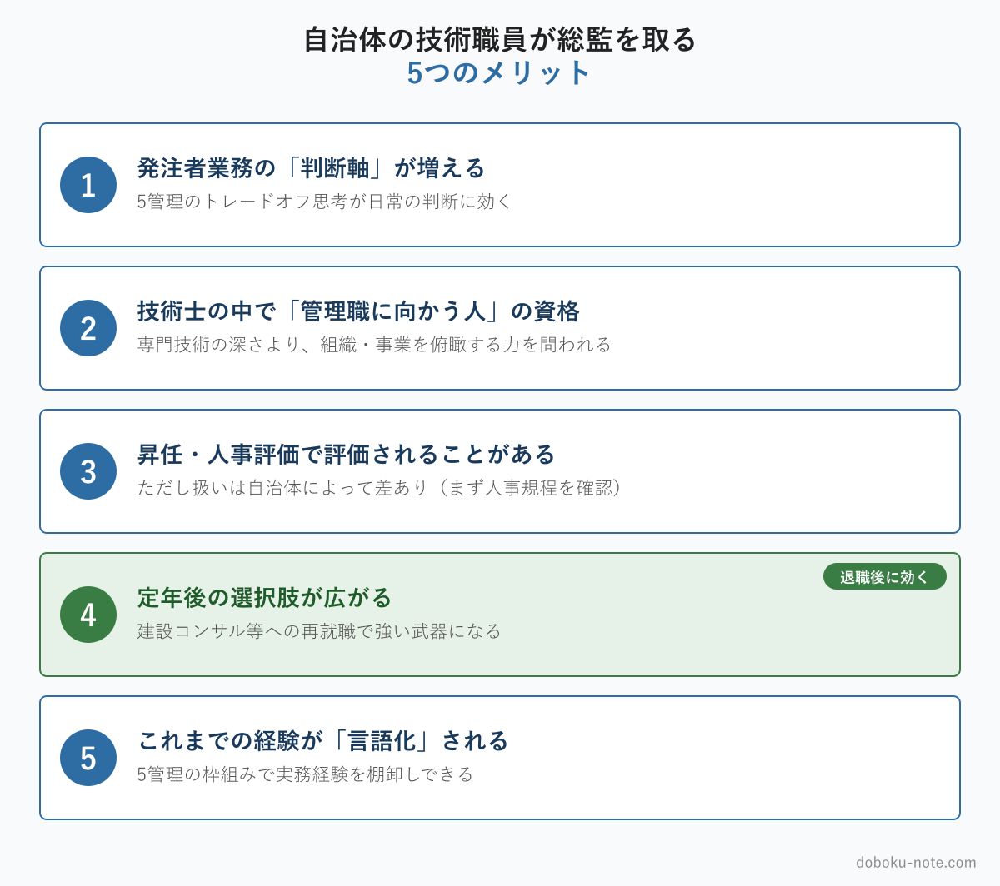

# 【土木系公務員】自治体の技術職員が技術士総監を取る5つのメリット｜発注者の視点から

**こんな人におすすめ**

- 自治体の土木職など、技術士総監に興味はあるが受験を決めていない
- 忙しい公務員がいまさら総監を取って意味があるのか迷っている
- 一般部門（建設部門など）の技術士は持っているが、総監は未受験
- 昇任・定年後を見据えて、取っておくべき資格を考えている

**この記事でわかること**

- 発注者の立場で技術士総監を取ると何が変わるか（5つのメリット）
- 自治体によって差が出る部分と、団体に関係なく残るメリットの切り分け
- 受けてみようと思ったときの、最初の一歩

---

私は地方自治体の土木職として長く発注者業務に携わり、現役の終盤に技術士 総合技術監理部門（総監）を受けました。正直なところ、受験を考え始めた頃は「忙しい自治体の技術職員が、いまさら総監を取って意味があるのか」と何度も迷いました。

この記事は、当時の私と同じように「総監に興味はあるが、受けるかどうか決めていない」自治体の技術職員に向けて書いています。受験を勧誘するつもりはありません。発注者の立場で総監を取った経験から、「こういうメリットがあった」と実感した5つを正直に挙げます。読んだうえで、自分に必要かを判断してもらえればと思います。

<!-- cta:pack-top -->
受験を決めたら、記述式は「実務経験を5管理の言葉に翻訳する型」を装填するだけです。

> 本番直前の総仕上げは、出題予想6テーマ×三層骨子で「何が出ても書ける型」を最短装填できるR8予想問題集が決め手。書き方の型から固めるなら、型・設問(3)の弾薬・R8演習を1セットにした記述式コアパックが入口に最適です。

https://note.com/dobokunote/m/m6854c7437d4d

https://note.com/dobokunote/m/m6e7de5e4ea3d

## メリット1：発注者業務の「判断軸」が増える

自治体の技術職員、とくに発注者の仕事は、純粋な技術判断だけでは回りません。事業の優先順位づけ、限られた予算の配分、住民への説明、工期と安全、環境への配慮──複数の要求が同時に押し寄せ、どれを立ててどれを譲るかを日々判断しています。

総監が扱う5管理（経済性・人的資源・情報・安全・社会環境）と、その間の[トレードオフ](https://doboku-note.com/docs/pe-comprehensive-management-management-tradeoffs?utm_source=note&utm_medium=referral&utm_campaign=93-civil-servant-merits)は、まさにこの「複数の要求の板挟み」を整理する枠組みです。総監の勉強をして実感したのは、これまで経験と勘でこなしてきた発注者の判断に、共通の言葉と型が与えられたということでした。

たとえば、ある道路改良事業で工期短縮（経済性管理）と沿道の安全確保（安全管理）が正面からぶつかったとします。以前の私は「どちらを優先するか」の二択で考えていました。

総監を学んだ後は、交通量データの事前分析（情報管理）や沿道住民との合意形成（社会環境管理）という"第三の管理"を持ち込んで、対立そのものを和らげられないかと考えるようになります。資格そのものより、この判断の引き出しが日常業務で効きます。

## メリット2：技術士の中で「管理職に向かう人」の資格

技術士の一般部門（建設部門など）が専門技術の深さを問うのに対し、総監は組織や事業を俯瞰し、複数の管理を統合する力を問います。

自治体の技術職員は、年次が上がるほど個別の技術より、組織運営・事業マネジメント・対外調整の比重が増えていきます。総監が問う能力は、まさにそのキャリアの方向と重なります。

自治体の技術系管理職に実際に求められるのは、個別工事の技術的な良し悪しよりも、複数事業の優先順位づけ、組織体制づくり、議会や住民への説明といった総合的な判断です。総監の学習範囲は、この管理職の仕事にそのまま重なります。

昇任してから初めてこうした視点を学ぶより、その手前で枠組みを持っておくほうが、立場が変わったときの戸惑いは小さくなります。

## メリット3：昇任・人事評価で評価されることがある（要確認）

技術士、とくに総監は、多くの自治体で人事評価や資格手当の対象になっています。昇任の判断材料のひとつになる団体もあります。

ただし、ここは正直に書きます。資格手当の有無や金額、人事評価への反映の度合いは、自治体によってかなり差があります。「総監を取れば必ず昇進する」とは言えません。受験を検討するなら、まず自分の自治体の人事・給与規程で技術士の扱いを確認してみてください。仮に制度上の見返りが薄くても、以下のメリットは団体に関係なく残ります。

## メリット4：定年後の選択肢が広がる

これは退職した今、最も実感しているメリットです。

自治体を退職した技術職員の再就職先は、建設コンサルタント、建設会社、公益法人、第三者機関などが中心になります。これらの多くで技術士は重視され、とくに建設コンサルタントでは技術士が業務上の重要な要件に関わります。総監まで持っていると、現場の一担当としてではなく、事業を管理する立場での再就職がしやすくなります。

一般部門の技術士だけでも再就職先はありますが、総監があると「5管理を統合してプロジェクト全体を見られる人材」として扱われ、任される役割や処遇の幅が変わってきます。

現役の間は「定年はまだ先」と感じるものですが、総監の学習には数か月かかり、退職直前は引き継ぎなどで慌ただしくなりがちです。退職後の働き方を少しでも視野に入れるなら、時間に余裕のある現役のうちに取っておくと、選択肢が広がります。

## メリット5：これまでの経験が「言語化」される

ベテランの技術職員ほど、多くの判断を経験と勘で──いわば暗黙知で──こなしています。それ自体は強みですが、後進に伝えにくく、自分でもなぜそう判断したのかを説明しにくい。

総監の学習は、5管理という枠組みで自分のこれまでの業務経験を棚卸しする作業でもあります。「あのとき自分は、経済性と安全のトレードオフを、住民合意という社会環境・情報の手当てで乗り切っていたのか」──そんなふうに、過去の経験が言葉になっていきます。言語化された経験は、後進の指導にも、口頭試験にも、退職後の仕事にも効きます。50代からの学び直しとしても、総監は無駄になりません。

## それでも迷うなら — よくある3つの懸念

受験を迷う自治体の技術職員から、よく聞く懸念が3つあります。私自身も同じことを考えました。

**「一般部門に受かってからでないと無理では?」**

総監は、必ずしも建設部門などの一般部門に合格してから受けるものではありません。技術士第二次試験の受験資格（実務経験年数など）を満たせば、総合技術監理部門を受験できます。一般部門と総監を別々の年に受ける人も、総監から受ける人もいます。まずは自分が受験資格を満たすかどうかを確認してみてください。

**「働きながら勉強時間を確保できるか」**

総監の筆記は択一式と記述式です。択一式は過去問演習で出題パターンを掴むのが中心、記述式は答案の「型」を身につける勉強で、ゼロから専門知識を詰め込む試験ではありません。発注者として積んできた実務経験が土台になるぶん、働きながらでも数か月の計画的な学習で射程に入ります。

**「自分の実務経験で記述式が書けるのか」**

むしろ逆です。総監の記述式と口頭試験は、受験者自身の業務経験を題材に5管理の視点で論じる試験です。発注者として事業の優先順位づけや住民対応、安全と予算の板挟みを経験してきた自治体の技術職員は、書く材料を豊富に持っています。足りないのは経験ではなく、それを5管理の言葉に翻訳する型だけです。

## 受けてみようと思ったら、まず何から

ここまで読んで「受けてみようか」と思えたら、いきなり参考書を買う前に、まず試験の中身を眺めてみることをおすすめします。

doboku-note では、総監の択一式過去問17年分と、キーワード集2026の全項目を無料で公開しています。まず過去問を1年分眺めて、「これなら手が届きそうか」を肌で確かめてみてください。試験の全体像と学習の進め方は[総合技術監理部門 合格戦略](https://doboku-note.com/docs/pe-comprehensive-management-exam-passing-strategy?utm_source=note&utm_medium=referral&utm_campaign=93-civil-servant-merits)にまとめています。

https://doboku-note.com

5管理を体系的に短時間で掴む段階に入ったら、note の精読ガイド（5管理を出題視点で優先度順に整理した5本セット）も用意しています。

https://note.com/dobokunote/m/m607bf095b02a

## 総監対策をまとめて進めたい方へ

工程（型 → 設問(3) → 予想演習 → フル模範論文）を一気にそろえたい方には、全部入りの「完全パック」が最もお得です。

https://note.com/dobokunote/m/m171222175fac

各マガジンの全体像と「どれから読むか」は、はじめての方向けのロードマップ記事にまとめています。

https://note.com/dobokunote/n/n3d73729e6cc7

## 関連リソース

**doboku-note — 17年分の過去問 + 700キーワード解説**（無料）

https://doboku-note.com

- 17年分の択一式過去問（全問解答解説つき）
- キーワード集2026の全項目をWeb検索可能
- 700以上のキーワード解説ページ（スマホ対応）

**note のおすすめ記事**

- 【総監択一】自治体の技術職員が総監択一でつまずく3つの盲点｜発注者業務と試験範囲のズレ
- 【一般部門の合格者が落ちる】総監で通用しない3つの理由｜合格率10%の壁を超える4つの対策

---

<!-- cta:tankan-mokuji -->
総監のほかの無料記事・有料マガジンは「総監もくじ」から一覧できます。

https://note.com/dobokunote/n/n3ed4c77ceed6
