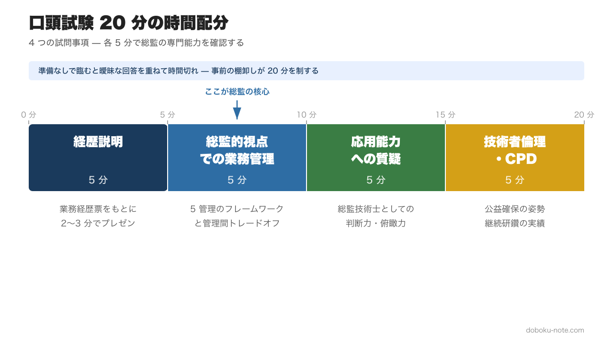
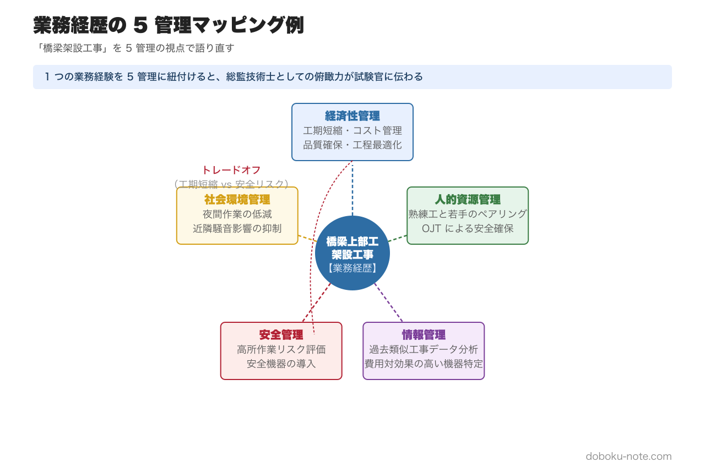

# 総監口頭試験20分で落ちない「業務経歴」の語り方｜5管理で再構成する実演例と想定質問対策

**この記事でわかること**

- 総監口頭試験の構成と一般部門との決定的な違い
- 業務経歴を5つの管理の枠組みで再構成する具体的手順
- 「橋梁工事の工程管理」を総監視点で語る実演例と想定質問への備え方

---

総監部門の口頭試験は、一般部門の合格経験がある方にとっても独特の壁があります。一般部門で通用した「専門技術の深さをアピールする」語り方が、総監ではそのまま使えないからです。

本記事では、筆記試験合格後に控える口頭試験に向けて、業務経歴を5つの管理の視点で語り直す方法を解説します。出願段階から口頭試験を見据えた準備を進めている方にも、筆記合格後にこれから対策を始める方にも役立つ内容としたいと思います。

<!-- cta:pack-top -->
本番直前の総仕上げは、出題予想6テーマ×三層骨子で「何が出ても書ける型」を最短装填できるR8予想問題集が決め手。書き方の型から固めるなら、型・設問(3)の弾薬・R8演習を1セットにした記述式コアパックが入口に最適です。

https://note.com/dobokunote/m/m6854c7437d4d

https://note.com/dobokunote/m/m6e7de5e4ea3d

## 1. 口頭試験の構成 --- 20分間で問われること

総監部門の口頭試験は約20分間で行われます。試問事項は大きく4つに分かれます。

- **経歴説明**（業務内容の詳細） --- 約5分。受験申込時に提出した業務経歴票をもとに、自分の経歴を2〜3分で説明し、試験官からの質問に答えます
- **総監的視点での業務管理** --- 約5分。業務において5つの管理をどのように適用したかを問われます
- **応用能力に関する質疑** --- 約5分。仮想的な場面設定に対し、総監技術士としてどう判断するかを問われます
- **技術者倫理・CPD** --- 約5分。公益確保の姿勢、継続研鑽の実績について問われます

この 20 分は短いようで長い時間です。準備なしで臨めば、曖昧な回答を重ねるうちにあっという間に時間切れになります。逆に、事前の整理ができていれば、試験官に「この人は総監の視点を持っている」と伝わる密度の高い対話になります。

本記事では、口頭試験で落ちないための **(1) 一般部門との違いの把握 → (2) 業務経歴の 5 管理棚卸し → (3) 想定質問の回答フレーム** までを、橋梁工事の実演例とともに整理します。試験全体の位置づけや合格戦略の大枠を先に確認したい方は、doboku-note の [総監合格戦略ページ](https://doboku-note.com/docs/pe-comprehensive-management-exam-passing-strategy) も参照してみてください。

## 2. 一般部門の口頭試験との違い --- なぜ同じ語り方では通用しないのか

一般部門の口頭試験では、主に「コミュニケーション」と「リーダーシップ」の能力が問われます。自分が携わった業務の技術的課題と解決策を具体的に説明し、関係者との調整力や技術者としての判断力を示すことが求められます。

一方、総監部門で問われるのは「総監の専門知識・応用能力」です。具体的には以下の違いがあります。

- **アピールポイント**：専門技術の深さ・独自性 / 5つの管理の統合的な適用力
- **業務の記述視点**：技術的課題と解決策 / 管理技術の視点での課題整理
- **求められる立場**：技術者としての判断 / 管理者・監理者としての俯瞰的判断
- **質問のベース**：経歴票の技術内容 / 経歴票に記載した5管理の適用とトレードオフ

この違いを理解しないまま、一般部門と同じ要領で業務経歴を語ると、試験官から「それは技術的な対応ですが、総監の視点ではどうですか」と切り返されます。これが総監口頭試験で最もよくある失敗パターンです。

試験官が聞きたいのは、あなたが「5つの管理の枠組みで業務を俯瞰できているかどうか」です。

## 3. 業務経歴の語り方 --- 5つの管理で自分の経験を再構成する

### 3.1 まず経験業務を棚卸しする

口頭試験対策の第一歩は、自分の業務経験を「5つの管理」の視点で棚卸しすることです。出願時に業務経歴票を作成した方は、その内容をベースにしてみてください。

手順は次のとおりです。

1. 経歴票に記載した5つの業務を書き出す
2. 各業務について、5つの管理（経済性管理・人的資源管理・情報管理・安全管理・社会環境管理）のどれに該当する取り組みがあったかを整理する
3. 各業務における「最重点管理項目」（最も重要だった管理分野）を1つ特定する
4. 管理間のトレードオフ（異なる2つの管理間の対立・調整）を明確にする

上図は「橋梁上部工の架設工事」という1つの業務を5管理に紐付けた例です。このように、1つの業務から複数の管理分野へのつながりを意識的に描くことで、総監の視点を持った語り口が見えてきます。各管理の守備範囲と典型キーワードは doboku-note の各ピラーページで詳しく確認できます（[経済性管理](https://doboku-note.com/docs/pe-comprehensive-management-economic-management-pillar) / [人的資源管理](https://doboku-note.com/docs/pe-comprehensive-management-human-resource-management-pillar) / [安全管理](https://doboku-note.com/docs/pe-comprehensive-management-safety-management-pillar)）。

ここで重要なのは、5つの管理すべてに無理に記入する必要はないということです。該当しない管理は空欄で構いません。ただし、5つの業務全体を見渡したとき、5分野がバランスよく含まれていることが望ましいです。

### 3.2 キーワード集の用語で語る

棚卸しの際に意識してほしいのが、文部科学省『総合技術監理 キーワード集』の用語を使うことです。

たとえば「若手社員の教育を行った」ではなく「OJTによる人材開発を実施した」と言い換えます。「情報を共有した」ではなく「ナレッジマネジメントの仕組みを構築した」と表現します。

これは単なる言葉遊びではありません。キーワード集の用語を適切に使えることは、総監の体系的な専門知識を持っていることの証明になります。試験官はその使い方から、あなたの理解の深さを見抜きます。

### 3.3 「成長ストーリー」を意識する

業務経歴票の1つ目から5つ目にかけて、総監技術士としての成長の流れが見えることが理想です。

典型的な成長の流れは以下のとおりです。

- **業務1〜2**（キャリア初期） --- 上司の指導のもと業務に取り組み、期限内に成果を仕上げることに注力。経済性管理（品質・工程管理）が中心
- **業務3**（中堅期） --- 主体的に業務に取り組むようになり、情報の収集・整理、新人の育成指導を担当。人的資源管理・情報管理の視点が加わる
- **業務4〜5**（管理者期） --- 大規模プロジェクトの責任者として、工期・予算等の管理要求と安全確保・環境負荷低減のトレードオフを調整。5つの管理を俯瞰して統合する立場

口頭試験の冒頭2〜3分の経歴プレゼンでは、この成長ストーリーが試験官に伝わるように構成しましょう。すべての業務を総監の視点で語る必要はありません。初期のキャリアは一般部門の視点で記しても問題ありませんが、後半の業務で明確に総監の視点を示すことが求められます。

## 4. 具体例: 「橋梁工事の工程管理」を総監の視点で語る

ここで、一般部門的な語り方と総監的な語り方の違いを具体例で示します。

### 一般部門的な語り方（不十分な例）

> 「橋梁上部工の架設において、工期短縮のため施工手順を見直し、仮設設備の配置を最適化しました。その結果、当初計画より2週間の工期短縮を実現しました。」

これは技術的な対応としては正しい表現です。しかし、総監の口頭試験でこれだけでは不十分です。

### 総監的な語り方（改善例）

「橋梁上部工の架設において、**経済性管理**の観点から工期短縮が最重点課題でした。しかし、施工手順の見直しは**安全管理**との間にトレードオフを生じさせます。仮設設備の簡素化は工期短縮に寄与する一方で、高所作業のリスクが増大するからです。

そこで私は、**情報管理**を活用して過去の類似工事データを分析し、費用対効果の高い安全機器を特定しました。さらに**人的資源管理**の観点から、熟練作業員と若手をペアリングする体制を組み、OJTを兼ねた安全確保を実現しました。

結果として、安全実績を維持しながら2週間の工期短縮を達成し、**社会環境管理**の面でも夜間作業の低減により近隣への騒音影響を抑制できました。」

この語り方のポイントは3つあります。

- **5つの管理のうち複数を明示的に言及している** --- 「経済性管理」「安全管理」「情報管理」「人的資源管理」「社会環境管理」のフレームワークが見える
- **トレードオフを具体的に示している** --- 経済性管理（工期短縮）と安全管理（リスク増大）の対立構造が明確
- **第三の管理で解決策を示している** --- 情報管理・人的資源管理という別の管理の視点を持ち込んでトレードオフを改善している

このように、同じ業務経験でも「5管理のフレームワーク」を通して語ることで、総監技術士にふさわしい視点を示すことができます。口頭試験で問われるトレードオフの典型パターン（10 ペア）と解決フレームは、doboku-note の [5 管理間トレードオフ解説ページ](https://doboku-note.com/docs/pe-comprehensive-management-management-tradeoffs) にまとめているので、業務経歴の棚卸しと並行して確認しておくと語りの引き出しが増えます。

## 5. 想定質問と回答の組み立て方

口頭試験で頻出する質問パターンと、回答を組み立てる際のフレームワークを整理します。

### 5.1 頻出質問パターン

**経歴に関する質問:**
- 「この業務で最も重要だった管理分野は何ですか。その理由は。」
- 「この業務で経験したトレードオフを説明してください。」
- 「もう一度同じ業務をするなら、何を改善しますか。」
- 「この業務の経験を、他のプロジェクトにどう活かしましたか。」

**応用能力に関する質問:**
- 「このような状況で、あなたならどう判断しますか。」（仮想シナリオ）
- 「5つの管理のうち、どの管理を最も重視しますか。その理由は。」

**技術者倫理に関する質問:**
- 「公益と組織の利益が対立した場合、どう判断しますか。」
- 「CPD（継続研鑽）として、どのような取り組みをしていますか。」

### 5.2 回答のフレームワーク

質問に対しては、以下の構造で回答を組み立てると、論理的かつ総監的な視点が伝わります。

1. **結論を先に述べる** --- 「最も重要だった管理分野は安全管理です」
2. **理由を5管理の枠組みで説明する** --- 「なぜなら、営業線近接工事では安全確保が他のすべての管理に優先するためです」
3. **トレードオフに言及する** --- 「ただし、安全対策の強化は経済性管理（コスト・工期）との間にトレードオフを生じさせました」
4. **総合的な判断を示す** --- 「そこで、情報管理を活用してリスクの定量的評価を行い、費用対効果の高い対策に絞り込むことで、両立を図りました」

この「結論 → 理由（5管理） → トレードオフ → 総合判断」の4段構成を身につけておけば、想定外の質問にも対応できます。

## 6. 筆記試験の記述式との一貫性

見落とされがちですが、口頭試験では筆記試験の記述式で書いた内容との一貫性も問われます。試験官は受験者の記述式答案を手元に持っており、その内容に基づいて質問することがあります。

注意すべき点は以下のとおりです。

- **記述式で書いたトレードオフの考え方と、口頭試験での発言が矛盾しないこと** --- 記述式で「安全管理を最重視する」と書いておきながら、口頭試験で「コスト最優先」と答えるようでは一貫性がない
- **記述式の解答内容を振り返っておくこと** --- 筆記試験から口頭試験まで数か月空くため、自分が何を書いたか忘れている受験者が少なくない。試験直後に答案の要旨を記録しておくことを強くおすすめします
- **業務経歴票との整合性** --- 記述式で挙げた課題や対策が、自分の業務経歴と矛盾していないか確認する

筆記試験の記述式、業務経歴票、口頭試験での発言 --- この3つが一本の線でつながっていることが、総監技術士としての信頼性を示します。出願の段階から口頭試験を見据えた準備を進めることが、合格への最も確実な道筋です。

口頭試験の対策は、筆記試験合格後に始めるのでは遅いです。出願段階から、自分の業務経歴を5つの管理の視点で整理し、トレードオフを意識して経歴票を作成しておきましょう。その準備が、20分間の口頭試験で自信を持って語るための土台になります。

5つの管理の視点での業務整理や出願書類の書き方については、doboku-noteの「[出願の留意点](https://doboku-note.com/docs/pe-comprehensive-management-exam-application-guide)」で詳しく解説しています。

---

## 関連リソース

**doboku-note — 17 年分の過去問 + 650 キーワード解説**（無料）
https://doboku-note.com/category/pe-comprehensive-management

- 17 年分の択一式過去問（全問解答解説付き）
- 650 以上のキーワード解説ページ
- 出願の留意点（業務経歴票の書き方）
- スマホ対応（通勤中の学習に最適）

**口頭試験対策に役立つ note**
- 総監の合否を分ける「トレードオフ思考」完全ガイド ¥1,200 — 口頭試験で「管理間の矛盾をどう解決したか」を問われた時の引き出し
- 総監記述式 論文骨子テンプレート（A-1）¥1,980 — テーマ駆動・5 管理横串フレームワーク（筆記試験との一貫性を担保する型）

---

<!-- cta:tankan-mokuji -->
総監のほかの無料記事・有料マガジンは「総監もくじ」から一覧できます。

https://note.com/dobokunote/n/n3ed4c77ceed6
