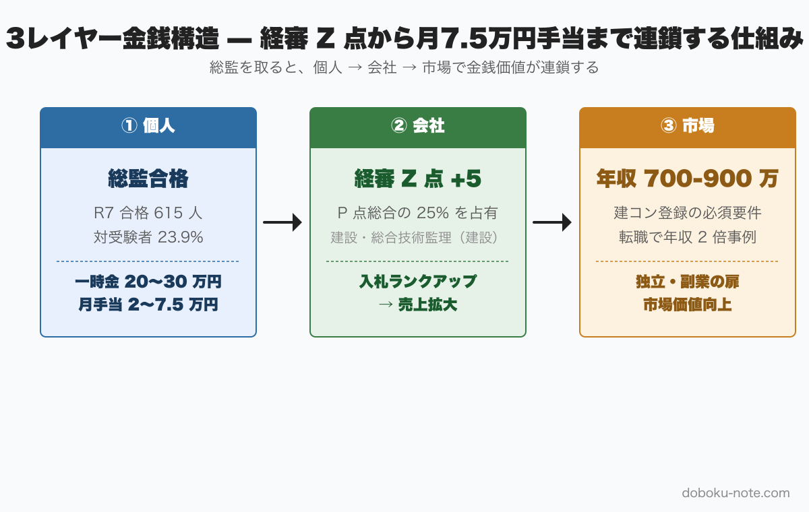
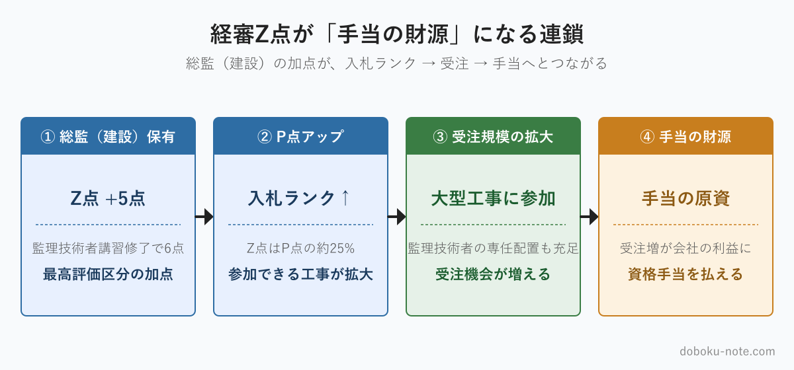

# 【建設コンサル・建設会社の技術者へ】総監を取ると、会社・自分・市場でいくら稼げるか — 2026年最新データで検証する金銭インセンティブ完全マップ

**こんな人におすすめ**

- 建設コンサル・建設会社で一般部門の技術士は持っているが総監は未受験
- 「総監はいいよ」と先輩に言われるが具体額がわからない
- 経審制度を理解して会社内で自分の価値を可視化したい
- 民間技術者にとって総監のリターンを冷静に計算したい

**この記事でわかること**

- 個人手当・会社価値・市場価値の3レイヤーで総監の金銭価値が生まれる構造
- 経審 Z 点 → 入札ランク → 売上 → 個人手当の連鎖（最新2026年制度）
- 建設コンサル/建設会社の手当相場（最大月7.5万円事例まで）
- 公務員ペルソナとは別軸の、民間特有の数値ロジック

---

「総監は取っておいたほうがいい」と、先輩技術士から一度は聞かされたことがあるのではないでしょうか。ただ、その言葉の裏にある数値の根拠は、意外と語られないまま終わることが多い。「なんとなくいい」では、試験勉強の重荷を背負う決断はしにくいものです。

この記事は、建設コンサルタントや建設会社に勤める民間技術者の視点から、総監を取ることの金銭的な価値を3つのレイヤーに分解して検証します。私は2026年7月に技術士総監を受験する立場で、まだ合格体験者ではありません。合格後に語れる話は合格後に書きます。この記事では、受験を決める前に私自身が集めた「数値としての根拠」を、出典を明示しながらまとめます。

https://note.com/dobokunote/m/m6e7de5e4ea3d

## 結論：総監メリットは「3レイヤー金銭構造」で見ると、先輩が言ってた話の裏が見える

総監を持つことの金銭価値は、3つのレイヤーで積み上がっています。

- **レイヤー1：個人への手当**（短期・確実） — 一時金20〜30万円 + 月額資格手当。表面に見える最も直接的なリターン
- **レイヤー2：会社にとっての価値**（中期・構造的） — 経審 Z 点の加点 → 入札ランクの上昇 → 受注可能工事の拡大 → 手当の財源が生まれる連鎖
- **レイヤー3：市場価値**（長期・潜在的） — 転職・独立・副業での処遇。技術士平均年収 615〜667万円（企業規模別では最大752万円）、建設コンサル求人ボリュームゾーン 600〜850万円

よく聞く「総監はいい」という言葉の実態は、レイヤー1の手当単体の話ではなく、レイヤー2の会社価値がレイヤー1の手当を支えているという構造にあります。月7.5万円の手当が実在できる理由は、その総監技術士が会社に対してそれ以上のリターンをもたらしているからです。

## レイヤー1：個人への金銭インセンティブ（短期・確実）

### 1-1. 合格一時金の相場

建設コンサル業界では、技術士（総監含む）合格時の一時金として20〜30万円を支給する企業が複数確認されています。ジョブハウス建設の調査によれば、企業規模・業種によって幅があるものの、建設コンサルタントでは20〜30万円が目安とされています。

一時金は「もらって終わり」の性質ですが、受験にかかった参考書代・模試代・通信講座費用を補填する財源になる点で、受験コストの実質的な回収手段でもあります。

### 1-2. 月額資格手当の比較

月額手当は企業によって大きく異なります。以下は複数の調査をもとにした業界別の目安です。

- **製造業・建設業の一部**（小規模）：月1万円未満〜1万円程度（出典：ジョブハウス建設）
- **建設コンサル 中堅**：月1〜2万円（出典：やりがい事典＝建設コンサル転職メディア）
- **建設コンサル 大手**：月2〜5万円（出典：ジョブハウス建設）
- **最大事例**（特定の建設コンサル）：月7.5万円・年90万円増（出典：やりがい事典）

「月7.5万円」は市場の上限値であり、多くの企業がこの水準というわけではありません。ただ実在する数値であることは確認されています（やりがい事典「技術士（建設部門）資格保有者の年収や資格手当」より）。

### 1-3. 総監独立加算の事例

企業によっては、一般部門と総監を別ポイントで管理しているケースがあります。「一般部門取得で月2万円 → 総監追加取得で月3万円（+1万円）」という段階加算型の設計は、複数の中堅建設コンサルで見られる構造です。

つまり、すでに一般部門の技術士手当をもらっている状態でも、総監を追加取得することで差分の手当が発生します。

### 1-4. 個人手当だけ見ると「微妙」に見える理由

正直に書くと、月1〜3万円という手当水準を見て「それだけか」と感じる人も多いはずです。総監の勉強に費やす時間を時給換算すれば、手当の回収期間は数年単位になりえます。

この感覚は間違っていません。個人手当単体のROIだけで総監を判断するなら、「割に合わない」という結論が出る場合もある。ただ、その見方はレイヤー1しか見ていません。次のレイヤーで「なぜ会社は月7.5万円も払えるのか」という問いに答えます。

## レイヤー2：会社にとっての価値（手当の源泉）

### 2-1. 経審（経営事項審査）とは

公共工事の入札に参加したい建設会社・建設コンサルタントは、発注者から経営事項審査（経審）を受ける必要があります。経審によって算出された総合評定値（P点）が、入札参加資格のランクを決めます。ランクが上がれば参加できる工事の規模が広がり、受注機会が増えます。

### 2-2. Z 点は P 点の約25%を占める

P 点は複数の評点から構成されますが、そのうち **技術力評点**（Z 点）**は P 点の約25%** を占めます（経審の計算式では Z の係数は0.25）。

Z 点は「技術職員数評点 × 0.8 + 元請完成工事高評点 × 0.2」で算出されます。このうち技術職員数評点の部分で、保有資格ごとに点数が加算される仕組みになっています。

### 2-3. 「建設・総合技術監理（建設）」が Z 点の加点対象

行政書士法人みそらの公開資料（経審 Z 点で加算される資格一覧）によれば、技術士「建設・総合技術監理（建設）」は **5点**（監理技術者講習修了で6点） の加点対象として明記されています。これは他の1級技術者資格と同水準の最高評価区分にあたります。

建設部門だけの技術士がすでに加点対象になっているのに加え、総監（建設）を別途持つことで、複数の加点組み合わせが可能になる場合もあります（1技術職員につき2業種まで加点可）。

### 2-4. 監理技術者配置 → 入札参加資格 → 受注の連鎖

大型公共工事には監理技術者の専任配置が義務付けられています。技術士（総監含む）を持つ技術者が監理技術者として名義を立てられれば、それ自体が入札参加の要件を満たします。経審 Z 点の加点だけでなく、「その案件に入れるかどうか」という入口の問題としても技術士の有無が効いてきます。

### 2-5. 建設コンサルタント登録の技術管理者要件

建設コンサルタントが国土交通省の登録を受けるには、登録部門ごとに「技術管理者」を置く必要があります。国土交通省の規定によれば、技術管理者は**原則として対応する選択科目で技術士法による第二次試験に合格した技術士**であることが要件です（実務経験による認定制度も存在しますが、技術士が本則）。

建設コンサルタントとして21部門すべてに登録するような大手ほど、技術管理者となれる技術士の頭数は死活問題になります。

### 2-6. なぜ会社は月7.5万円も払えるのか

1人の総監技術士が経審 Z 点を押し上げ、入札ランクが1段上がった場合、受注できる工事の上限金額が数千万円単位で広がります。建設コンサルタントであれば、監理技術者として大型案件に入れる人材が1人増えるだけで、年間数千万〜数億円の売上貢献が発生しうる。

その視点から見れば、月7.5万円（年90万円）の手当は「人件費」ではなく「投資対効果の一部を還元している」構造です。個人にとって「割に合うかどうか」と、会社にとって「手当を払う根拠があるかどうか」は、そもそも計算のスケールが異なります。

## レイヤー3：市場価値（独立・転職・副業）

### 3-1. 技術士の平均年収

厚生労働省の賃金構造基本統計調査をもとにした複数の集計（資格広場、SAT 等）によれば、技術士の平均年収は **615〜667万円** とされています。全国の給与所得者全体の平均年収（436万円前後）と比較すると、180〜230万円のプレミアムがある水準です。

企業規模別では、1,000人以上の大企業で平均752万円、100〜999人規模で669万円、10〜99人の小規模で606万円（厚労省賃金構造基本統計）。規模格差は実数比でおよそ100:89:81、小規模は大企業の約8割という水準です。

### 3-2. 建設コンサル転職市場の求人レンジ

JAC リクルートメントの調査（2024〜2025年版）によれば、建設コンサルタント分野の転職年収のボリュームゾーンは **600〜850万円** で、実績平均は約735万円とされています。技術士資格を「必須」または「優遇」条件として掲げる求人では、一般的に50〜150万円程度の年収アップが見込まれると言及されています。

「年収2倍」のような事例は確認できないわけではありませんが、それは40代後半以降のシニア層が大手から中堅へ、あるいは独立系へ移る特殊な場合に限られます。過度に期待を煽るつもりはなく、600〜850万円のレンジに収まるのが転職市場の現実的な数値です。

### 3-3. 独立・副業への扉

技術士法では、技術士は「科学技術に関する高等の専門的応用能力を必要とする事項」について業務を行う専門家とされています。独立した技術士は、コンサルティング業務・第三者評価・研究開発補助・技術指導などで対価を得られます。

総監を持つことで、プロジェクト全体の管理・監理という付加価値の高いポジションに立てるため、単価設定の根拠が強くなります。副業・フリーランスとしての案件獲得においても、「5管理を統合できる人材」という訴求は、一般部門のみの技術士との差別化になります。独立・副業の具体的な収入実態については別記事で扱います。

## 希少性が金銭価値を裏付ける — 令和7年度最新データ

金銭価値の裏側には、希少性という要素があります。文部科学省が公表した令和7年度技術士第二次試験の結果から確認できる数値を整理します。

- **総合技術監理部門**（二次）：受験申込 3,157名 / 受験者 2,575名 / 合格 584名
- 対受験者合格率：**22.7%**（全部門平均の 11.4% より高い）

合格率だけ見ると「取りやすい」と誤解されますが、受験者プールがすでに他部門の技術士合格者に限定されています。一般部門の二次試験に受かった人の中から、さらに総監の二次に挑む二段ロケット構造です。「入り口の難易度」を含めて考えれば、総監保有者は全技術者の中で相当上位の層になります。

全二次合格者 2,752名（文部科学省 令和7年度 技術士第二次試験 統計）のうち総監合格者は584名で、**全体の21.2%** を占めます。希少すぎて市場に出回らないほどではなく、かつ多すぎて陳腐化するほどでもない——希少性と汎用性のバランスが、安定した金銭価値の維持につながっています。

## 受験中の運営者が見た景色

この記事は、私が2026年7月の技術士総監二次試験に向けて受験準備をする中で集めたデータをもとにしています。合格体験者ではなく、現在進行形の受験者です。

この立場から言えることがあります。「総監はいい」という先輩の言葉は間違っていませんでした。ただ、その言葉の根拠を数値で確かめることで、「なんとなくいい気がする」が「構造的に説明できる」に変わりました。

受験するかどうかを迷っている民間技術者には、一つ具体的なアクションをすすめます。**自分が勤める会社の経審 Z 点での技術士の扱いを、人事または管理部門に聞いてみてください**。会社にとって自分が「何点の人材」になるかがわかると、手当の水準や交渉の余地が見えてきます。

doboku-note では総監択一過去問17年分とキーワード集2026全項目を無料公開しています。試験の中身を肌で確かめてから受験を判断したい方は、まず過去問1年分を眺めてみてください。[総合技術監理部門 合格戦略](https://doboku-note.com/docs/pe-comprehensive-management-exam-passing-strategy?utm_source=note&utm_medium=referral&utm_campaign=94-private-engineer-money)に試験の全体像と学習の進め方をまとめています。

また、[5管理のトレードオフ](https://doboku-note.com/docs/pe-comprehensive-management-management-tradeoffs?utm_source=note&utm_medium=referral&utm_campaign=94-private-engineer-money)の概念を先に知っておくと、択一問題の見え方が大きく変わります。

17年分の過去問とキーワード集2026全項目を無料公開しています。試験範囲の感触を肌で確かめてください。

https://doboku-note.com

5管理を体系的に短時間で掴む段階に入ったら、note の精読ガイド（5管理を出題視点で優先度順に整理した5本セット）も用意しています。

https://note.com/dobokunote/m/m607bf095b02a

## まとめ：総監を「個人手当」だけで判断しない

本記事の内容を3レイヤーで再整理します。

**レイヤー1**（個人手当）：一時金20〜30万円 + 月額1〜7.5万円（企業・規模による）。表面の金額だけ見ると「微妙」に見えることがある。

**レイヤー2**（会社価値）：経審 Z 点への加点 → 入札ランク上昇 → 受注規模拡大 → 手当の財源が生まれる。建設コンサルタント登録の技術管理者要件を満たす人材としての希少価値も加わる。「会社の入札枠を広げる人材になる」が民間技術者における総監の正しい評価軸です。

**レイヤー3**（市場価値）：技術士平均年収 615〜752万円（企業規模別）、建設コンサル転職ボリュームゾーン 600〜850万円。独立・副業への道を開く最上位資格としての機能も持つ。

「総監はいいよ」と言った先輩は、おそらくこの3つすべてを経験から知っていたのだと思います。経験が語る感覚論ではなく、数値で追いかけた今、その言葉の意味が具体的になりました。受験を迷っている民間技術者の判断材料に、この記事がなれば幸いです。

## 関連リソース

**doboku-note — 17年分の過去問 + 650キーワード解説**（無料）

https://doboku-note.com

- 17年分の択一式過去問（全問解答解説つき）
- キーワード集2026の全項目をWeb検索可能
- 650以上のキーワード解説ページ（スマホ対応）

**サイトの深掘り解説**（無料・doboku-note）

[民間建設技術者が総監を取るメリット（経審・受注・キャリア）](https://doboku-note.com/docs/pe-comprehensive-management-private-engineer-comprehensive-merit?utm_source=note&utm_medium=referral&utm_campaign=94-private-engineer-money&utm_content=private-engineer-merit)

**note のおすすめ記事**

- 【一般部門の合格者が落ちる】総監で通用しない3つの理由｜合格率10%の壁を超える4つの対策
- 自治体の技術職員が技術士総監を取る5つのメリット｜発注者の視点から

---

<!-- cta:tankan-mokuji -->
総監のほかの無料記事・有料マガジンは「総監もくじ」から一覧できます。

https://note.com/dobokunote/n/n3ed4c77ceed6
