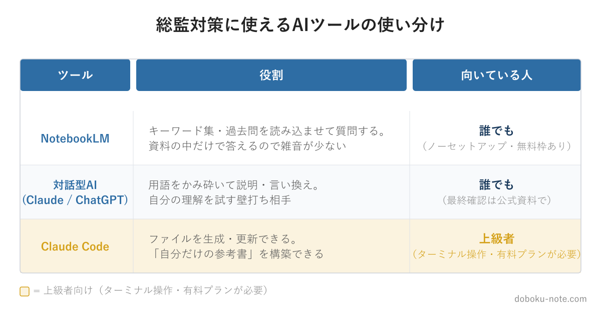
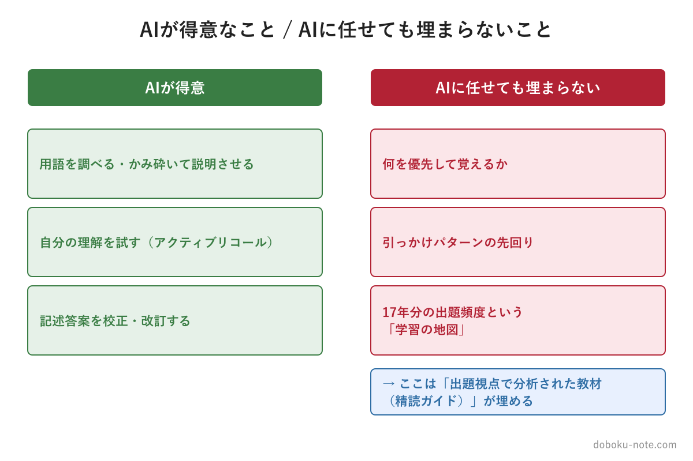

# 【技術士総監】AIで勉強を効率化する｜NotebookLM・Claude Code の使い分けと「AI任せの限界」

**こんな人におすすめ**

- 総監の膨大な範囲を、限られた時間でこなす方法を探している
- AIツールを勉強に使いたいが、何をどう使えばいいか分からない
- NotebookLM や生成AIを試したが、勉強の成果につながっていない
- AIに任せきりで本当に合格できるのか不安

**この記事でわかること**

- 総監対策で NotebookLM・対話型AI・Claude Code をどう使い分けるか
- 「自分だけの参考書」をAIで作る具体的な方法
- AIに任せても埋まらない穴と、その埋め方

---

総監の対策は「量」との戦いです。キーワード集2026は650項目を超え、択一の過去問は17年分。関係する白書まで含めると、目を通すべき資料は膨大です。働きながら、あるいは退職後の限られた時間でこれをこなすには、効率化の道具が要ります。

その道具として、いまや AI ツールは無視できません。実際、私も doboku-note の教材づくりで AI を日常的に使っています。

ただし、AI は使いどころを間違えると時間を溶かすだけになり、任せきりにすると思わぬ穴が残ります。

この記事では、総監対策に使える AI を3種類に整理し、それぞれの使いどころと、AI では埋まらない部分を正直に書きます。

<!-- cta:pack-top -->
> 本番直前の総仕上げは、出題予想6テーマ×三層骨子で「何が出ても書ける型」を最短装填できるR8予想問題集が決め手。書き方の型から固めるなら、型・設問(3)の弾薬・R8演習を1セットにした記述式コアパックが入口に最適です。

https://note.com/dobokunote/m/m6854c7437d4d

https://note.com/dobokunote/m/m6e7de5e4ea3d

## 1. NotebookLM — 誰でも使える主役

最初に勧めたいのが NotebookLM です。Google が提供する、ノーセットアップのWebアプリで、無料の範囲でも十分使えます。

NotebookLM の最大の特徴は、**自分が与えた資料だけを根拠に答える**ことです。一般的な生成AIは広いネット知識から答えるため、もっともらしい誤り（ハルシネーション）が混じります。NotebookLM は「読み込ませた資料の中」で答えるため、試験範囲外の雑音が入りにくいのです。

総監での使い方はこうです。キーワード集2026のテキスト、択一の過去問、関係する白書のPDFを読み込ませます。そのうえで、「この用語をかみ砕いて説明して」「過去問のこの選択肢はなぜ誤りなのか」「この2つの用語の違いは」と質問します。資料の該当箇所を示しながら答えてくれるので、自分で分厚い資料を何度も行き来する手間が減ります。

たとえば、択一を解いていて「信頼性設計と保全性設計の違い」が曖昧だったとします。従来なら、キーワード集の該当ページを探し、過去問の解説を別途めくり、と資料を行き来していました。NotebookLM なら、読み込ませた資料に対して「この2つの違いを、過去問でどう問われたかも含めて説明して」と一度聞けば、両方を突き合わせた答えが返ってきます。

1つの疑問の調べ物が、数分から数十秒になります。この積み重ねが、限られた勉強時間では効いてきます。

ターミナルもプログラミングの知識も要りません。総監受験者のほとんどにとって、AI活用の入口はここで十分です。

## 2. 対話型AI（Claude・ChatGPT など）— 理解を試す補助

NotebookLM が「与えた資料の中で答える」のに対し、Claude や ChatGPT などの対話型AIは、一般的な知識から柔軟に説明してくれます。これは補助的に使うと効きます。

おすすめは、覚えたい用語を**自分の言葉で説明してみて、AIに誤りを指摘してもらう**使い方です。「リスクアセスメントとは、危険を洗い出して評価することだと思うが合っているか」と投げると、抜けている観点や誤解を返してくれます。これは、ただ読むより記憶に残る「アクティブリコール」と呼ばれる学習法を、相手なしで実践する方法です。

ただし注意点があります。対話型AIは一般知識で答えるため、総監特有の定義や、キーワード集が想定する文脈と微妙にずれることがあります。理解の壁打ちには使えますが、**最終的な正誤の確認は、公式のキーワード集や過去問の解答解説で**行ってください。

## 3.【上級者向け】Claude Code で「自分だけの参考書」を作る

ここからは、ターミナルの操作に抵抗がない人向けの一歩踏み込んだ方法です。総監受験者の多くは1と2で十分なので、「自分には縁がない」と感じたら読み飛ばして構いません。

Claude Code は、AI がファイルを読み書きし、複数の作業を続けて実行できるツールです。NotebookLM が「読んで質問する」専用なのに対し、Claude Code は**ファイルを生成・更新できる**点が決定的に違います。これにより、本当の意味で「自分だけの参考書」を構築できます。

たとえば、こういう使い方ができます。

- 過去問のテキストを入れたフォルダを横断的に分析させ、「5管理別 頻出論点リスト」を1枚のファイルに書き出す
- 自分が書いた記述式の答案を読み込ませ、総監の採点視点で校正させて、改訂版を別ファイルとして保存する。元の答案も残るので、自分の上達が後から見える
- 苦手論点ノートや学習進捗表をファイルで管理し、更新を続ける

とくに有効なのが、記述式の答案づくりです。記述対策では「書く→直す」の反復が欠かせませんが、紙やバラバラのファイルでやると、過去の答案がどこにあるか分からなくなります。Claude Code に答案ファイルを渡し、改訂のたびに版を分けて保存させると、初稿から仕上げまでの変化が一覧で残ります。自分の弱点がどこにあるのかが、履歴から見えてきます。

競合のAI学習系コンテンツが掲げる「自分だけの参考書を作ろう」という考え方を、最も体現できるのが Claude Code です。

ただし、正直に書いておきます。Claude Code はCLI（ターミナル）のツールで、導入には多少の慣れと、有料プランが要ります。ここでセットアップの手順までは扱いません。重要なのは「総監の学習にこう使える」という発想であり、ツールの導入に深入りすると、それはもう総監対策ではなくなるからです。興味があれば、まず1と2を試し、物足りなくなってから検討すれば十分です。

## はじめ方 — どの順で試すか

AIツールは便利ですが、あれもこれもと手を広げると、ツールを触ること自体が目的化します。順番を決めておきます。

1. **まず NotebookLM** — キーワード集と直近の過去問を読み込ませ、分からない用語・選択肢をその場で質問する習慣をつける。ここだけでも調べ物の速度は大きく変わります
2. **次に対話型AIで理解を試す** — 覚えたつもりの用語を自分の言葉で説明し、AIに穴を指摘してもらう。インプットから、アウトプットの確認へ進みます
3. **物足りなければ Claude Code** — ファイルベースで「自分だけの参考書」を作りたくなったら検討する。1と2で十分なら、無理に進む必要はありません

そして、どのツールを使うにせよ、出発点に「学習の地図」を置くことを忘れないでください。なぜ地図が要るのかを、次の節で説明します。

## 4. AIに任せても埋まらない穴

ここまでAIの活用法を書いてきましたが、最後に正直な限界を書きます。**AIは「質問に答える」のは得意ですが、「何を優先して質問すべきか」は教えてくれません。**

総監択一で安定して点を取るには、「どの論点が出題頻度が高いか」「どこが引っかけられやすいか」を知っている必要があります。しかし、これは17年分の過去問を出題視点で分析して初めて見えてくるものです。

AIに「総監で何が頻出ですか」と聞いても、AIは出題実績を体系的に持っているわけではないため、答えはぼんやりします。

つまり、AIは「調べる・説明させる・反復する」道具としては優秀ですが、**学習の地図——何を、どの順で、どこに注意して覚えるか——は別に用意する必要がある**のです。地図がないままAIに質問を重ねても、出ない論点に時間を使ってしまいます。

doboku-note の精読ガイドは、まさにこの地図にあたります。17年分の択一過去問680問を分析し、5管理それぞれの論点を「優先度: 高・中・低」で仕分け、択一の引っかけパターンまで明示しています。**精読ガイドで地図を掴み、その地図に沿って NotebookLM や Claude Code で深掘り・反復する**——この組み合わせが、AI時代の総監対策として最も効率的だと考えています。

https://note.com/dobokunote/m/m607bf095b02a

## 総監対策をまとめて進めたい方へ

工程（型 → 設問(3) → 予想演習 → フル模範論文）を一気にそろえたい方には、全部入りの「完全パック」が最もお得です。

https://note.com/dobokunote/m/m171222175fac

各マガジンの全体像と「どれから読むか」は、はじめての方向けのロードマップ記事にまとめています。

https://note.com/dobokunote/n/n3d73729e6cc7

## 関連リソース

**doboku-note — 17年分の過去問 + 700キーワード解説**（無料）

https://doboku-note.com

- 17年分の択一式過去問（全問解答解説つき）
- キーワード集2026の全項目をWeb検索可能
- 700以上のキーワード解説ページ（スマホ対応）

**note のおすすめ記事**

- 【総監択一】キーワード集を1周したのに点が取れない3つの理由｜5管理を「出題視点」で読み直す
- 【学習優先順位がわかる】総監択一式17年分680問を徹底分析（無料）

---

<!-- cta:tankan-mokuji -->
総監のほかの無料記事・有料マガジンは「総監もくじ」から一覧できます。

https://note.com/dobokunote/n/n3ed4c77ceed6
