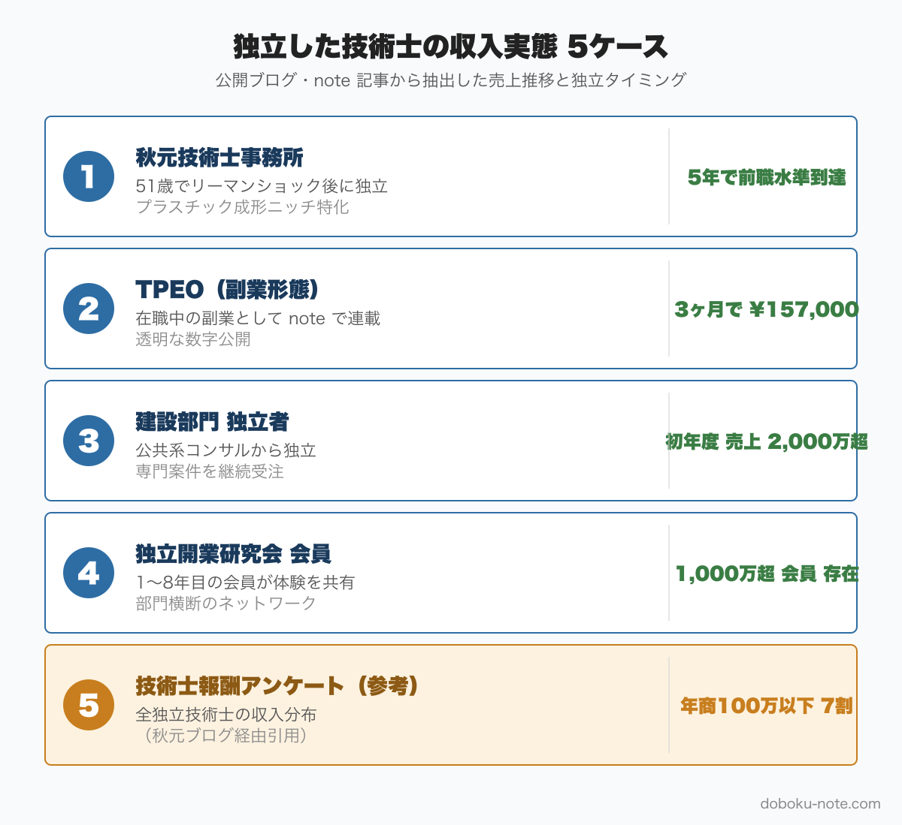

# 総監を取って独立した技術士の収入実態 — 公開情報から見える5つのリアルケース

**こんな人におすすめ**

- 総監を取って独立・開業を視野に入れているが、実際の収入が分からない
- 50代・60代で「定年後どう食っていくか」を真剣に考え始めた
- 副業から始めて段階的に独立したい
- 独立技術者の年間固定費・案件単価のリアルが知りたい

**この記事でわかること**

- 独立した技術士の収入推移（公開ブログ・note 記事 5 事例）
- 開業初期費用と 1 年目の固定費構造
- 食えるパターン vs 食えないパターンの 3 つの分岐点
- 副業から段階移行する現実的なロードマップ

---

技術士総監を取ったあとの選択肢として、独立・開業という道がある。ただし「実際どのくらい稼げるのか」「最初の数年間をどうやって乗り越えるのか」といった肝心の数字が、あまり表に出てこない。

この記事では、ブログ・note・業界団体レポートなど公開されている情報を整理して、独立した技術士の収入実態を可能な限り数字ベースで把握することを目指す。創作した「Aさんの事例」は一切使わない。確認できた公開情報の範囲で書く。

私自身は総監に合格しているが、独立経験はない。以下はあくまで他者が公開した情報の整理であることを最初に断っておく。

https://note.com/dobokunote/m/m6e7de5e4ea3d

## 結論：独立技術者の収入は二極化、初年度が勝負

公開されている統計と事例を組み合わせると、まず押さえておくべき数字がある。

技術士報酬アンケート（2013年）によると、個人事業として独立した技術士のうち**年間売上100万円以下が約7割、300万円超はわずか3%**という結果が出ている（秋元技術士事務所ブログより）。技術士資格を取っていても「開業しているだけ」「名刺に肩書が増えただけ」の状態では、ほとんど売上が立たないという厳しい現実が数字に表れている。

一方で、「稼げている1%」に入った人たちの事例を公開情報で追うと、いくつかの共通項が見えてくる。

- **ニッチな専門分野への徹底した特化**（「日本でこの人」というポジションを取る）
- **継続的な情報発信によるインバウンドの構築**（ブログ・学会・雑誌・note）
- **5年の助走期間**（サラリーマン水準に戻るまでにかかる時間の目安）

二極化の構造はシンプルで、この3つを実践しているかどうかで収入が大きく分かれる傾向がある。

## 公開されている独立事例 5 つ

### 事例1：秋元技術士事務所（プラスチック加工分野）

最も詳細な公開情報を持つ事例の一つ。秋元英郎氏は**51歳・リーマンショック後という最悪のタイミングで独立開業**し、プラスチック成形加工の専門コンサルタントとして事業を立ち上げた。

「苦労話、失敗談」と題したブログ記事（https://ce-akimoto.com/archives/145）では、以下のことが具体的に語られている。

- 独立当初は収入が極めて不安定で、サラリーマン時代の年収水準に戻るまでに**5年かかった**
- プラスチック分野をさらに細分化した3つのニッチ領域に絞り込み、「この領域では日本でトップ」というポジションを確立した
- 日本技術士会の専門委員会活動、業界誌への執筆、セミナー講演を組み合わせることで「探してもらえる状態」を作った

「独立技術士は何故稼げるのか」（https://ce-akimoto.com/archives/1949）では、稼げる技術士の条件として「ポジショニング（専門分野の絞り込み）」と「情報発信によるインバウンドマーケティング」の組み合わせを挙げている。課題を持った潜在顧客が自分を検索して見つけてもらえる状態を作ることが、稼げる技術士と稼げない技術士を分ける最大の違いとのことだ。

現在は「プラスチック博士」として業界内で認知されており、コンサル案件・講演・著作を組み合わせた複線型の収益構造を持つ。

**取得部門**：非公開（機械系または化学系と推測されるが公開情報では未確認）
**独立タイミング**：51歳（リーマンショック後）
**専門分野**：プラスチック成形加工（国内トップクラスのニッチ特化）
**初年度の状況**：売上が安定せず、サラリーマン水準への回帰に5年を要した
**現在**：講演・コンサル・著作を組み合わせた複線型収益

### 事例2：TPEO（副業で技術士事務所）

現在進行形で副業状況を公開しているnoteアカウント。本業（企業勤め）を継続しながら、技術士登録後に副業として技術士事務所を開設した。

「技術士としての副業状況について #1」（https://note.com/tpeo/n/n577c3c5f1835）では、技術士登録の手続きと会社からの副業許可取得のプロセスが記録されている。「本業で自己研鑽しにくい部分を副業でカバーしたい」「将来的には企業コンサルタントとして独立するための下地作り」という動機が書かれており、段階的な独立移行を想定した動き方だ。

「#4 実際の状況（3か月）」（https://note.com/tpeo/n/nab5ed846ff79）では、副業開始3ヶ月時点の数字が公開されている。

- スポットコンサル5回で**収入157,000円**
- 技術士関連セミナー6回参加
- GX検定（ベーシック・アドバンス）合格

「少なくとも年間20万円以上は稼がないと青色申告登録の意味がない」「65万円控除まで使えるくらいを目標にしたい」という現実的な目標設定が記録されている。

完全独立までの事例ではないが、副業段階の数字が可視化されている点で貴重だ。副業技術士として3ヶ月で157,000円という数字は、「始めれば即収入」ではなく「土台作りに時間がかかる」という実態を示している。

**取得部門**：非公開（環境系・機械系と推測されるが公開情報では未確認）
**独立タイミング**：副業段階（本業継続中）
**専門分野**：スポットコンサル中心（詳細非公開）
**初年度**（副業3ヶ月）：157,000円
**戦略**：副業で土台を作り、段階的に独立移行を目指す

### 事例3：新規開業技術士支援研究会（複数参加者の体験談ストック）

公益社団法人 新規開業技術士支援研究会（https://www.cea.jp/kaigyou/）は、独立開業した技術士の情報交換と相互支援を目的とした組織だ。開業1年目から8年目以上の参加者が在籍しており、体験談やノウハウが蓄積されている。

公開情報から直接的な年収数字を確認することはできなかったが、研究会の存在自体が「独立後の数年間に特有の課題」が多いことを示唆している。研究会が運営されている事実は、「独立技術士の相互支援ニーズが実際にある」ことの証左でもある。

### 事例4：建設コンサルタント技術者の独立事例（技術士人材センター調査）

建設コンサルタント・技術士人材センターが公開している「建設コンサルタントの技術士が独立して稼げるのか」（https://jinzai.mo4c.com/info/dokuritu/）では、建設部門の技術士が独立した場合の実態が整理されている。

同記事で挙げられているケースとして、「元請けで10年・下請けで5年の経験を積んだ技術士が独立した初年度に売上2,000万円超えを達成した」という事例が紹介されている。

ただし、これは建設コンサルタント業界特有の構造（業務委託での下請受注が可能、元請けとの人脈が重要）を前提とした事例だ。同記事でも「元請けでの実務経験と技術士資格、一人前の実力の3点がそろっていれば独立しても稼げる」と整理されており、裏を返せばこの3点がそろっていない状態での独立は厳しいということでもある。

建設部門以外の独立については「技術士が独立して食べていく方法【建設部門以外】」（https://jinzai.mo4c.com/info/gijyutusi-dokuritu/）に別途まとめられており、分野によって独立の難易度と収入の天井が大きく異なることが指摘されている。

**特徴**：建設コンサルタント業界の経験者であれば、独立初年度でも比較的大きな売上を立てられるケースがある
**条件**：元請けでの10年以上の経験 + 技術士 + 人脈

### 事例5：技術士独立開業研究会（コミュニティ型の支援）

「技術士独立開業研究会」（https://gijyutsusha-kenkyusha.com/）は、「1,000万円/年以上稼げる技術コンサルタントをできるだけ多く輩出する」ことを目的とした研究会だ。すでにそれ以上に稼げている会員もいるという。

1,000万円を目標とした会が成立していること自体が、「到達可能な水準として1,000万円を掲げている人たちがいる」ことを意味する。ただし、それが一般的な独立技術士の平均像ではなく、特定の努力と戦略を続けた人たちの到達点であることは、前述の統計（7割が100万円以下）と合わせて読む必要がある。

## 独立の現実コスト — 開業 1 年目の構造

事例を読む前に、独立開業の「固定的なコスト構造」を把握しておく必要がある。収入の多寡より先に、「いくら持ち出しがあるか」を把握しないと、独立のリアルは見えない。

### 初期費用：150〜200万円が目安

複数の情報源が「150万円前後」という数字で一致している。主な内訳は以下のとおり。

- 高性能ノートPC・モニター：15〜30万円
- プリンター・スキャナー：5〜10万円
- 事務机・椅子・書棚：10〜20万円
- ホームページ制作：10〜30万円
- 名刺・会社案内等：3〜5万円
- 予備資金（3〜6ヶ月分の生活費）：最低100万円

在宅事務所ならオフィス賃料は不要だが、代わりに自宅の一室を業務用に整備する費用がかかる。共有オフィスやコワーキングスペースを使う場合は月2〜5万円の追加固定費となる。

### 年間固定費の構造

独立後に毎年発生する固定費の主なものは以下のとおり。

- **技術士会費**：公益社団法人 日本技術士会の正会員費（年間数万円）
- **損害賠償保険**（技術士賠償責任保険）：日本技術士会経由で加入可能。案件の規模や補償額によるが年間数万〜十数万円
- **通信費**：モバイル回線・固定回線合計で月1〜2万円
- **ホームページ維持費**：月数千円〜1万円
- **事務用品・書籍・セミナー参加費**：年間10〜20万円
- **社会保険**（国民健康保険＋国民年金）：前年の収入によって変動。独立後しばらくは低い収入ベースで設定されていた保険料がのちに高く修正される点に注意

年間固定費の合計は、在宅かつ共有オフィスなし・出張ほぼなしの最小構成でも**年間50〜80万円**程度は見込む必要がある。

### 案件単価の相場（公開情報ベース）

独立技術士が扱う仕事の単価感について、ビーバーズ「技術士として独立開業するには？」（https://beavers.co.jp/blog/4628/）や技術士独立開業研究会の情報をもとに整理すると、おおむね以下のレンジになる。

- **コンサル・技術顧問**（時間単価）：1〜3万円/時
- **研修講師・セミナー講演**（1回あたり）：5〜20万円
- **技術文書執筆・査読**（文字単価）：5〜20円/字
- **鑑定・評価・調査**（案件単価）：30〜100万円
- **建設コンサルタント下請業務**（案件単価）：規模による、100万〜数千万円

### 損益分岐点の目安

年間固定費50〜80万円に生活費（年間300〜400万円）を加えると、最低限の損益分岐点は年間**350〜480万円**程度になる。「独立を継続できる水準」として一般的に挙げられる**500〜800万円**という数字は、この損益分岐点に安全マージンを足した数字と考えると分かりやすい。

## 食えるパターン vs 食えないパターン — 3 つの分岐点

事例を並べると、「食えた人」と「食えなかった人」の分岐点が3つに絞られてくる。

### 分岐点1：ニッチ特化の徹底度

「食えている」独立技術士の共通項として、秋元技術士事務所のブログが最も端的に整理している。

食える：「○○分野なら日本でこの人」というポジションを作り、競合がほぼいない領域に立つ。秋元氏の場合は「プラスチック成形加工」をさらに絞った3つのニッチ。

食えない：「技術士（総監・建設部門）持ってます、何でも対応します」という状態。資格の広さが武器にならず、逆に専門性が見えにくくなる。

「総監を持っているから広く監理業務を受けられる」という発想は、独立においては逆効果になりやすい。総監の強みは「複数の管理を統合して俯瞰できる」ことだが、それを独立後の集客に直結させるには、特定の業種・規模・課題タイプに絞った文脈で総監の価値を語れる必要がある。

### 分岐点2：継続的な情報発信の有無

食える：ブログ・note・学会発表・業界誌・SNSを通じて「見つけてもらえる状態」を作り、インバウンドで案件が来る。

食えない：名刺交換と人脈頼みの営業のみ。知人の仕事が切れると収入が途絶える。

独立技術士が採用も店舗も広告も使えない中で案件を獲得し続けるためには、「潜在顧客が課題を持って検索したときに自分のコンテンツに辿り着く」状態を作ることが最も再現性が高い。

秋元氏はこれを「インバウンドマーケティング」と呼んでいる。情報発信の量と継続性が、3〜5年後の案件獲得の土台になる。

### 分岐点3：5年の助走期間を耐える資金計画

食える：副業期間2〜3年で土台を作り、ある程度の顧客と実績が積み上がったタイミングで独立する。独立後も5年間は収入の変動を受け入れられるだけの資金計画を持っている。

食えない：「勢いで独立する」「定年退職を機にそのまま独立する」など、土台なしで独立し、1〜2年で資金ショートして廃業または再就職となる。

秋元氏の「サラリーマン水準に戻るまで5年」という数字は、「優秀な人が戦略的に取り組んでも5年かかる」という意味合いで読むべきだろう。勢いだけで独立した場合の5年は、さらに過酷になる。

## 副業から段階移行する現実的ロードマップ

5事例と分岐点を踏まえた上で、段階的な独立移行のロードマップを整理する。これはTPEOが取っているアプローチに近い。

### ステップ1（在職中・1〜2年目）：発信と最初の案件

- 総監取得後、速やかに技術士登録
- 副業許可の取得（会社の就業規則確認）
- ブログ・note・SNSで専門領域の情報発信を開始
- スポットコンサル（ビザスク等のプラットフォーム活用）で初案件を受ける
- **目標**：副業収入年間20〜50万円、発信記事・投稿50本以上

### ステップ2（在職中・2〜3年目）：副業収入の安定化

- 専門分野を1〜2つに絞り込み、発信の軸を決める
- 定期的な顧問契約または研修登壇で安定収入の芽を作る
- **目標**：副業収入月5〜15万円（年間60〜180万円）、繰り返し依頼してくれる顧客5社

### ステップ3（独立準備・6ヶ月〜1年）：独立後の固定費をカバーできるか確認

- 副業段階での月収が、独立後の固定費＋生活費の一部（月10〜15万円が目安）を超えているかを確認
- 取引先候補5〜10社を明確にする
- 技術士事務所の開設準備（屋号・青色申告・損害賠償保険）
- **目標**：独立後1年目の収入見込み350〜480万円（損益分岐点）を根拠ある数字で立てられること

### ステップ4（独立後・1〜5年目）：損益分岐点超えからサラリーマン水準へ

- 独立後1〜2年目：年商350〜480万円（損益分岐点超え）
- 独立後3〜4年目：年商500〜700万円（安定ライン）
- 独立後5年目以降：年商800万円超（サラリーマン時代の水準）

「5年かかる」という秋元氏の言葉は、このロードマップ全体を通じて読むと腑に落ちる。ステップ1〜3の副業期間2〜3年に、独立後の回収期間2〜3年を加えると、副業開始から数えて5〜6年でようやくサラリーマン水準が見えてくる計算だ。

## 受験中の運営者が見ている景色

私は元自治体の技術職員で、総監に合格している。独立・開業は選択肢の一つとして視野にあるが、現時点ではまだ「どう生かすか」を模索している段階だ。

この記事を書くために公開情報を読み込んで改めて気づいたのは、稼いでいる独立技術士の多くが「数字を透明にして発信している」という共通点を持つことだ。秋元氏の「サラリーマン水準に戻るまで5年」という告白、TPEOの「3ヶ月で157,000円」という記録、どちらも隠せばいくらでも隠せた数字だ。

それを出しているのは、透明な発信そのものが信頼になり、顧客獲得に繋がるという実感があるからではないかと思う。資格より発信、というのが私がこれらの事例から読み取ったキーメッセージだ。

この記事は総監の独立特化だが、立場が異なる方向けに以下の記事も別途書いている。

- 民間建設技術者の総監メリット（会社員として総監を持つ意義）
- 総監受験は投資としてペイするか — 2026年最新数値で計算するコスト vs リターン（同マガジンの別記事）

## まとめ：独立は "総監を持っているか" より "発信し続けたか" で決まる

5事例と統計を並べると、独立技術士の収入二極化の構造は明確だ。

- 技術士の独立成功率は低い（稼いでいる技術士は独立者のうちごく少数）
- 稼げている人に共通するのは、ニッチ特化 + 継続的な情報発信 + 5年の助走
- 資格の種類（総監か一般部門か）そのものが決定要因ではない

総監が独立において有利な点があるとすれば、「5管理の枠組みで自分の専門領域を体系的に整理して発信できること」「発注者・管理職・中小企業経営者など多様なクライアント層に対して価値を説明しやすいこと」だろう。ただしそれも、発信し続けていなければ機能しない。

独立を視野に入れているなら、まず「自分の専門分野は何か」「その分野で日本で5本指に入れるか」を問い直すことが最初の一歩になる。

---

独立を考える前に、まず受験をクリアする必要があります。doboku-note では総監択一過去問 17 年分とキーワード集 2026 全項目を無料公開しています。

https://doboku-note.com

5管理を体系的に短時間で掴む段階に入ったら、note の精読ガイド（5管理を出題視点で優先度順に整理した5本セット）も用意しています。

https://note.com/dobokunote/m/m607bf095b02a

## 関連リソース

**doboku-note — 17年分の過去問 + 650キーワード解説**（無料）

https://doboku-note.com

- 17年分の択一式過去問（全問解答解説つき）
- キーワード集2026の全項目をWeb検索可能
- 650以上のキーワード解説ページ（スマホ対応）

**サイトの深掘り解説**（無料・doboku-note）

[民間建設技術者が総監を取るメリット（経審・受注・キャリア）](https://doboku-note.com/docs/pe-comprehensive-management-private-engineer-comprehensive-merit?utm_source=note&utm_medium=referral&utm_campaign=96-independence-income&utm_content=private-engineer-merit)

**note のおすすめ記事**

- 【建設コンサル・建設会社の技術者へ】総監を取ると、会社・自分・市場でいくら稼げるか
- 総監受験は「投資」としてペイするか — 2026年最新数値で計算するコスト vs リターン
- 自治体の技術職員が技術士総監を取る5つのメリット｜発注者の視点から

**外部の独立事例リソース**

- 秋元技術士事務所「技術士事務所開業の苦労話、失敗談」https://ce-akimoto.com/archives/145
- 秋元技術士事務所「独立技術士は何故稼げるのか」https://ce-akimoto.com/archives/1949
- 新規開業技術士支援研究会 https://www.cea.jp/kaigyou/
- TPEO「副業で技術士事務所」連載 https://note.com/tpeo
- ビーバーズ「技術士として独立開業するには？」https://beavers.co.jp/blog/4628/
- 建設コンサルタント・技術士人材センター「建設コンサルタントの技術士が独立して稼げるのか」https://jinzai.mo4c.com/info/dokuritu/
- 技術士独立開業研究会 https://gijyutsusha-kenkyusha.com/

---

<!-- cta:tankan-mokuji -->
総監のほかの無料記事・有料マガジンは「総監もくじ」から一覧できます。

https://note.com/dobokunote/n/n3ed4c77ceed6
