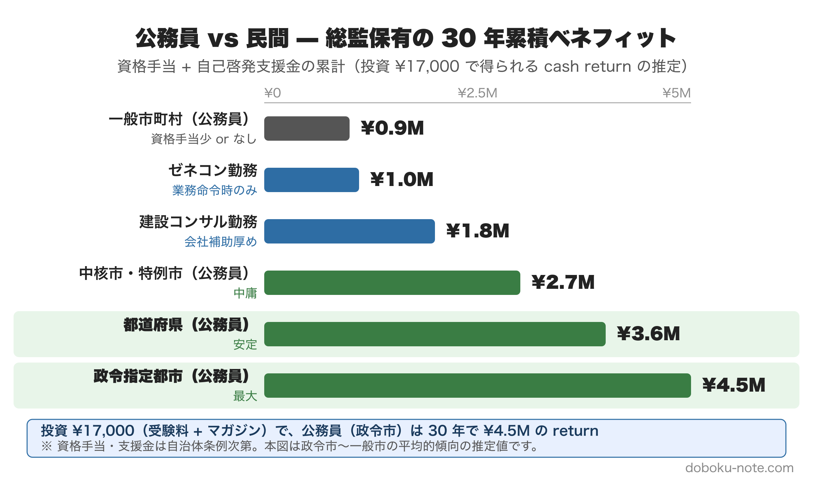

# 地方自治体土木職が総監を取るコスト計算 — 受験料補助・自己啓発支援・課長級昇進加点を織り込む

**この記事でわかること**

- 公務員特有の「補助制度」と「機会費用低減効果」が、総監受験のコスト構造をどう変えるか
- ゼネコン・建設コンサル勤務との **30 年累積ベネフィット比較**（推定 ¥0.9M 〜 ¥4.5M）
- 公務員に固有の「**隠れベネフィット**」（資格手当・自己啓発支援金・課長級昇進加点・転職市場価値）
- 公務員が総監を **取るべきか / 何代で取るべきか** の Decision Framework
- 自治体 道路担当向けの推奨マガジン

---

> **図の見方**: 投資 ¥17,000（受験料 ¥14,000 + マガジン ¥3,000 想定）に対する 30 年累積の cash return（資格手当 + 自己啓発支援金）。政令指定都市勤務の公務員は **¥4.5M の return** が期待でき、これは民間ゼネコン勤務（¥1.0M）の **約 4.5 倍**。自治体規模が小さいほど return は減りますが、機会費用も低いのでネット価値は依然高い。

---

> 📖 **母記事**: 「[総監 6 回受験 vs スクール vs ¥2,480 マガジン](../総監受験コスト比較/article.md)」では受験料・スクール価格の正面比較を公開しています。本記事はその **公務員向け派生版** です。

私自身、地方自治体土木職（発注者）出身です。「総監を取れ」と上司に言われたわけではなく、自分のキャリア設計の一環として 2026 年 7 月の総監二次試験を受けます。検討の過程で気づいたのは、**公務員のコスト構造は民間勤務とまったく違う** ということです。

民間（ゼネコン・建コン）向けの受験戦略をそのまま公務員に適用すると、**「補助制度を使い損ねる」「機会費用を過大評価する」「30 年累積の手当を見落とす」** という 3 つの誤算が起きます。

<!-- cta:pack-top -->
> 本番直前の総仕上げは、出題予想6テーマ×三層骨子で「何が出ても書ける型」を最短装填できるR8予想問題集が決め手。書き方の型から固めるなら、型・設問(3)の弾薬・R8演習を1セットにした記述式コアパックが入口に最適です。

https://note.com/dobokunote/m/m6854c7437d4d

https://note.com/dobokunote/m/m6e7de5e4ea3d

## 1. 公務員の総監受験コストは、こう違う

### 受験料補助・自己啓発支援制度（自治体差大）

地方自治体には自己啓発支援制度があり、技術士受験料が補助対象になる場合があります:

- **自己啓発助成金**：受験料の 50-100% / 上限 ¥10-30k / 中規模以上の自治体に多い
- **資格取得奨励金**：合格時のみ ¥20-50k 一時金 / 県・政令市レベル
- **研修費補助**：スクール代の 30-50% / 制度ありの自治体は約 30%

**注**: 上記は一般的な傾向で、実際は所属自治体の人事規程を確認してください。「全額補助」が出る自治体はレアですが、「一部補助」は **約半数の自治体で存在** します（運営者の経験ベース）。

### 試験地遠征費（公務員も自費）

技術士二次試験の試験地は東京・大阪・福岡など限定。地方在住者の遠征費は以下:

- 試験地まで往復: ¥10,000〜40,000
- 試験前日の宿泊: ¥10,000〜20,000

**公務員でも「自己研鑽の出張」は通常出張扱いにならない** ため、自費負担です。この点では民間と差がない。

### 機会費用（時給換算）

公務員と民間の **時給差** が機会費用を分けます:

- 地方自治体（中堅、年収 ¥500-700M）：¥2,500-3,500 / ¥1,000-1,400k
- ゼネコン中堅（年収 ¥700-1,000M）：¥3,500-5,000 / ¥1,400-2,000k
- 建コン中堅（年収 ¥600-900M）：¥3,000-4,500 / ¥1,200-1,800k

公務員は **機会費用が民間より 30-40% 低い**。「金で時間を買う」発想（スクール受講）の合理性も民間より下がります。

### 残業・休日勤務の制約

公務員は労働基準法と人事規程で勤務時間が比較的明確で、**夜間・休日に学習時間を確保しやすい** のはメリット。一方で:

- **災害対応・議会対応の繁忙期** は学習時間がほぼ取れない
- **異動サイクル**（2-3 年） で業務内容が変わると業務経歴書の柱を作りにくい
- 受験期と人事異動が重なると経歴書再構築のコスト発生

## 2. 公務員特有の「隠れベネフィット」

民間勤務者には見えづらい、公務員固有の **30 年累積で効くベネフィット** があります。

### 資格手当（月額・年額）

- **政令指定都市**：¥10,000-15,000 / ¥120-180k / ¥3.6-5.4M
- **都道府県**：¥8,000-12,000 / ¥96-144k / ¥2.9-4.3M
- **中核市・特例市**：¥5,000-10,000 / ¥60-120k / ¥1.8-3.6M
- **一般市町村**：¥0-5,000 / ¥0-60k / ¥0-1.8M

**民間との大きな違い**: 民間（ゼネコン・建コン）は **「業務命令時のみ」の手当か無支給** のケースが多く、月額固定手当は稀。**自治体は「資格保有者全員に支給」のケースが大半** なので、累積で大差がつきます。

### 自己啓発支援金

合格後の祝い金（一時金 ¥20-50k）や、年度ごとの自己啓発支援（¥30-50k）が出る自治体もあります。30 年累計で **¥0.9-1.5M** 程度になることも。

### 課長級昇進への加点

「総監必須」を明文化している自治体は少ないですが、**実質的な加点要素** として機能します:

- 技術系課長ポストの候補者選定で「技術士保有者」が優先される傾向
- 総監は「5 管理」が公務員業務（特に管理職）と直結するため評価が高い
- 課長昇進が 2-3 年早まると、生涯年収で **¥3-5M の差**

### 民間転職時の市場価値

公務員 → 民間（建コン・ゼネコン）の転職時、**「公務員 + 総監」は強力な組合せ**:

- 発注者経験 × 5 管理視点は民間にない希少性
- 転職時の年収アップ幅が +¥1-2M / 年（運営者周辺の事例ベース）
- 50 代で独立コンサルになる場合の必須資格

### 業務実用性

これは数値化できないベネフィットですが、5 管理は **発注者業務**（特に管理職）**と直結**:

- 経済性管理 → 予算編成・コスト管理
- 人的資源管理 → 課内マネジメント・OJT
- 情報管理 → 公文書管理・住民周知
- 安全管理 → 現場安全・住民安全
- 社会環境管理 → 環境影響評価・住民合意形成

総監を取った瞬間から **日常業務で使える** のは民間にない大きな価値です。

## 3. 公務員 vs 民間勤務のコスト構造

母記事 「[総監 6 回受験 vs スクール vs ¥2,480 マガジン](../総監受験コスト比較/article.md)」で示した「**マガジン路線 ¥16,480**」を公務員ベースで再評価すると:

- **受験料**：¥14,000 / ¥14,000 / ¥14,000
- **マガジン 1 冊**：¥2,480 / ¥2,480 / ¥2,480
- **自治体補助**：-¥10,000 (推定) / ¥0 / ¥0
- 現金支出計：**¥6,480** / **¥16,480** / **¥16,480**
- 機会費用（400h × 時給）：¥1,000k / ¥1,000k / ¥1,400k
- 総コスト：**¥1,006k** / **¥1,016k** / **¥1,416k**
- 30 年累積ベネフィット（手当 + 支援）：**¥4,500k** / **¥900k** / **¥1,000k**
- 30 年 net 価値：**+¥3,494k** / **-¥116k** / **-¥416k**

**読み方の注意**: 「機会費用」は学習時間を時給換算した数字で、実際の cash out flow ではありません。財務的に純粋な現金収支は「現金支出 vs 累積ベネフィット」で比較すべきです。

**現金収支ベース** の 30 年 net 価値:

- 公務員（政令市・補助あり）: ¥4,500k - ¥6,480 = **+¥4.49M**
- 公務員（一般市・補助なし）: ¥900k - ¥16,480 = **+¥0.88M**
- ゼネコン勤務: ¥1,000k - ¥16,480 = **+¥0.98M**

機会費用を加味してもなお、**公務員**（政令市・補助あり）**の net 価値は +¥3.5M で圧倒的**。これが「公務員は総監を取った方がいい」と言われる経済的根拠です。

## 4. Decision Framework（公務員特化）

### Q1. あなたの自治体に受験料補助 / 資格手当はありますか?

- **両方 Yes** → 経済的にきわめて有利。受験コストの大半が自治体負担、合格後手当で投資回収可能
- **片方のみ Yes** → 中庸。マガジン路線で投資抑制が合理的
- **両方 No** → 民間と同じコスト構造。**業務実用性 + 転職市場価値** で判断

> 💡 **行動**: 人事課に「自己啓発助成金 / 資格取得奨励金 / 資格手当」の有無を確認。多くの自治体は明文化されているが認知されていないケースが多い。

### Q2. 現在の年齢層は?

- **30 代前半** → **ベスト**。業務経験 10 年で経歴書を書きやすく、活用期間が最長
- **30 代後半-40 代** → 機会費用最大。早めの取得で活用期間が長く取れる
- **50 代** → 「最後の挑戦」と「管理職への布石」を兼ねる。退職後の独立コンサル準備としても有効

### Q3. 課長級昇進を狙っていますか?

- **Yes** → 総監保有は加点要素。**生涯年収で +¥3-5M** の効果
- **No** → 資格手当 + 業務実用性 + 転職保険の 3 軸で判断

### Q4. 将来的に民間転職 / 独立を考えていますか?

- **Yes** → 総監は必須に近い。「**発注者 + 総監**」は希少な組合せ
- **No** → 業務実用性で判断、ただし「保険」としての価値はある

### Q5. 自治体の異動サイクルは?

- **3 年以下** → 経歴書の柱を作りにくい。1 つの業務に集中する 5 年スパンで受験計画を立てる
- **5 年以上** → 業務経歴書を書きやすい。受験タイミングを業務サイクルに合わせる

## 5. 公務員向けマガジン推薦

doboku-note の総監向けマガジンの中で、**最も公務員**（特に自治体 道路担当）**に合うのは「自治体 道路担当 R3-R7 + R8 予想セット」¥2,480** です:

- 過去 5 年（R3-R7） + R8 予想の **自治体 道路担当ペルソナ** で書いた模範論文 6 本
- 「発注者視点での 5 管理」を一貫してテーマ化
- ¥2,480 で自治体補助制度を使えば **実質負担ゼロ** のケースも

> 🔗 [自治体 道路担当マガジン（doboku-note）](https://doboku-note.com/links)

### まず無料の試読で品質確認

購入前に、無料の白書R7 完全対応集（34,000 字）で内容を確認してください:

> 🔗 [白書R7 完全対応集を読む（無料）](https://note.com/dobokunote/n/n60efbccd728b)

## まとめ — 公務員総監受験は「経済的に最も合理的な選択肢」のひとつ

公務員（特に地方自治体土木職）の総監受験は、民間勤務よりも **経済合理性が高い** ケースが多いです:

1. **受験コスト**: 補助制度ありなら大半が自治体負担、現金支出 ¥6-17k 程度
2. **機会費用**: 民間より 30-40% 低い時給ベース
3. **資格手当**: 30 年累積で **¥1.8-5.4M**（政令市 〜 中核市）
4. **昇進加点**: 課長昇進 2-3 年早期で生涯年収 **+¥3-5M**
5. **転職保険**: 「発注者 + 総監」は希少。民間転職時 **年収 +¥1-2M / 年**
6. **業務実用性**: 5 管理は発注者業務（特に管理職）と直結

**唯一のリスクは「補助制度がない自治体」のケース** ですが、その場合でも マガジン路線（¥2,480-14,880）で投資を抑制すれば、機会費用が低い分、十分に回収可能です。

「資格手当がない → 取る価値なし」と短絡しないでください。**業務実用性 + 転職保険** の 2 軸だけでも投資回収は十分可能です。

---

## 出典・参考資料

- 母記事: [総監 6 回受験 vs スクール vs ¥2,480 マガジン](../総監受験コスト比較/article.md)
- [技術士第二次試験 統計情報（IPEJ 公式）](https://www.engineer.or.jp/c_topics/010/010868.html)
- doboku-note 内部リファレンス:
  - `docs/reference/pe-cem-pass-rate-history.md` — 合格率 12 年データ
  - `docs/reference/pe-cem-school-prices.md` — スクール価格データ

> ⚠️ 自治体の補助制度・資格手当は所属自治体の人事規程によります。本記事の数字は一般的な傾向を示すもので、運営者の経験 + 公開情報からの推定値です。正確な金額は所属自治体の人事課に確認してください。

---

<!-- cta:tankan-mokuji -->
総監のほかの無料記事・有料マガジンは「総監もくじ」から一覧できます。

https://note.com/dobokunote/n/n3ed4c77ceed6
