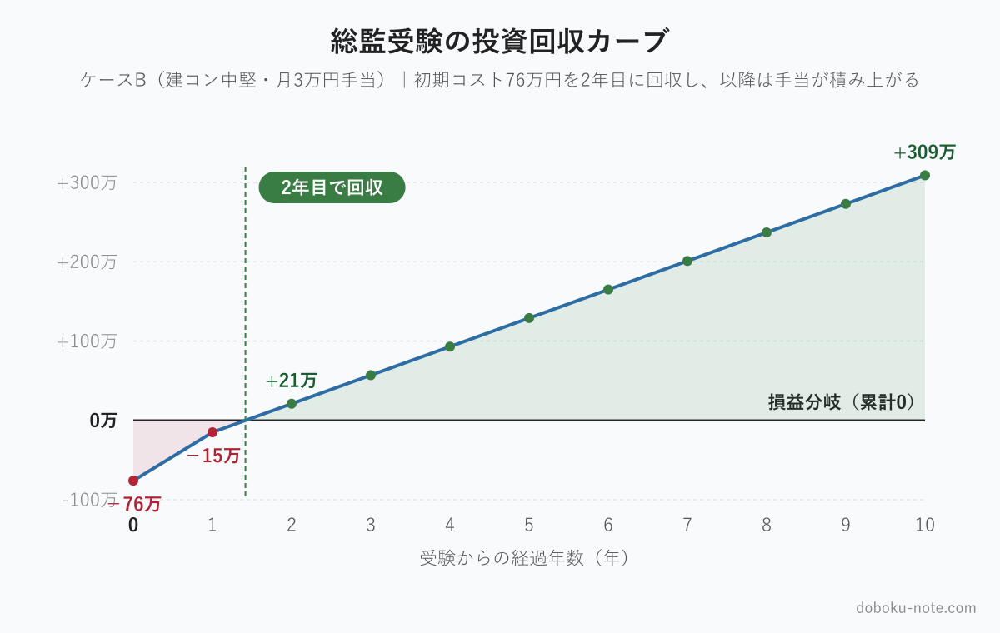
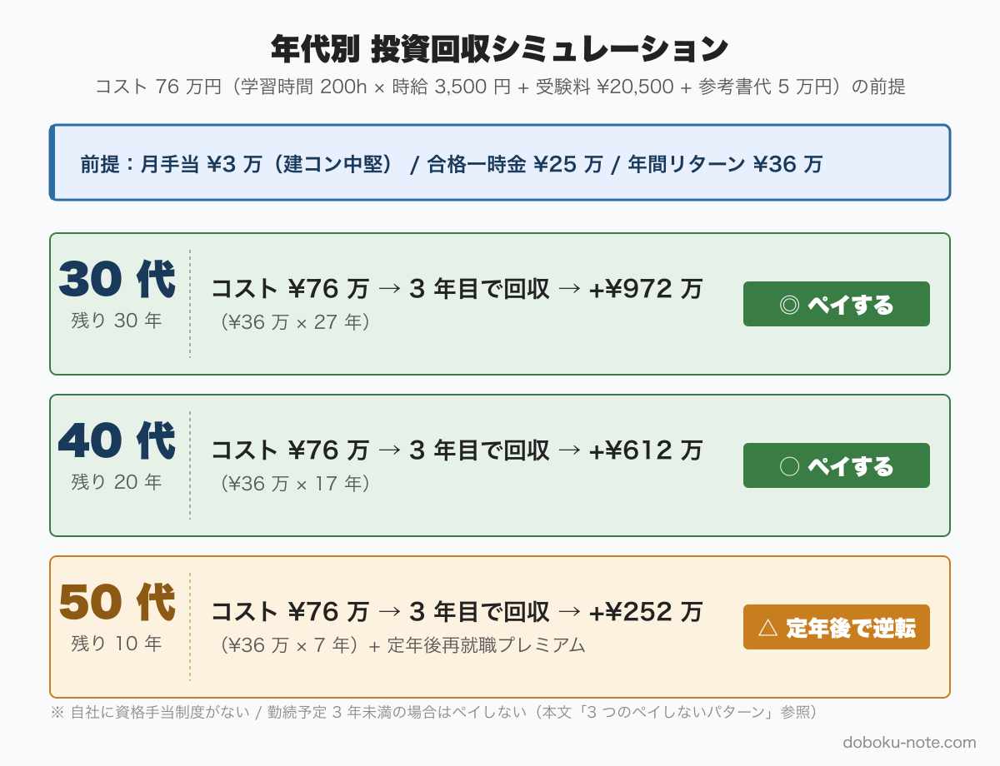

# 総監受験は「投資」としてペイするか — 2026年最新数値で計算するコスト vs リターン完全シート

**こんな人におすすめ**

- 総監を取るか迷っている、受験コストに見合うか分からない
- 「総監はいいよ」と言われるが、自分にとっての具体的なリターンを計算したい
- 受験する時間を別のことに使った方がいいか天秤にかけたい
- 30代・40代・50代で受験タイミングの判断材料が欲しい

**この記事でわかること**

- 総監受験のコスト（学習時間 × 機会費用 + 受験料）の現実
- リターン（手当 + 賞与 + 市場価値）を 5 年・10 年スパンで計算する手順
- 30代・40代・50代別の回収シミュレーション
- ペイしない3パターン（投資対象外のケース）

---

「総監を取ろうか迷っている」という相談を受けるたびに、話が同じところで止まります。「コストに見合うか分からない」という壁です。

「いいよ、取っておいて損はない」と言う人の話は聞こえる。でも自分のケースで数字が出てこない。だから決断できない。

この記事はその壁を壊すために書きました。コストもリターンも、式を立てて電卓で確かめられる形にします。

私は2026年7月に総監を受験した運営者ですが、合格発表前のため「合格後に◯◯だった」という断定はできません。ここで示す数字とシミュレーションは、複数の公開データを積み上げた推計です。自分のケースに当てはめるときは、自社の規程と実際の手当額を確認しながら使ってください。



<!-- cta:pack-top -->
> 本番直前の総仕上げは、出題予想6テーマ×三層骨子で「何が出ても書ける型」を最短装填できるR8予想問題集が決め手。書き方の型から固めるなら、型・設問(3)の弾薬・R8演習を1セットにした記述式コアパックが入口に最適です。

https://note.com/dobokunote/m/m6854c7437d4d

https://note.com/dobokunote/m/m6e7de5e4ea3d


## 結論：2年で回収できる投資、ただし条件がある

先に結論を示します。

建設コンサルタント勤務で30〜40代、月額資格手当が3万円前後の環境なら、**学習コストは2年で回収でき、以降は純粋なプラスが積み上がり続けます**。

10年スパンで見ると、月3〜5万円の手当環境（建設コンサル中堅以上）であれば、手当だけで300〜500万円のリターンが見込めます。さらに転職・独立・定年後再就職の文脈での市場価値向上を加えると投資対効果は相当に高い計算です。

ただし、これには条件があります。

1. 所属先に資格手当制度がある
2. 総監の手当額が一般部門より上積みされている
3. 受験時点から定年まで10年以上ある

この3つが揃わないと、計算の前提が崩れます。「ペイしない3パターン」は後の節で詳しく扱います。

## コスト側：勉強時間 × 機会費用 + 受験費用

投資の「分母」を先に正確に押さえます。

### 標準学習時間の相場

複数の合格体験記と受験講座の情報を照合すると、総監の学習時間は以下の幅に収まるようです。

- **短期ケース**（一般部門合格後 1〜2 年以内に受験）：100〜150 時間
- **標準ケース**（実務経験豊富、過去問中心）：150〜250 時間
- **長期ケース**（一般部門から年数が空いた、記述式を丁寧に作り込む）：300〜400 時間

総監の特徴として、択一式と記述式の合計点で合否が決まる構造があります。択一で高得点を取れれば記述式が多少崩れても合格できる場合があるため、択一重視の学習戦略を取ると学習時間は圧縮できます。

**本記事では標準ケースとして 200 時間で計算します**。過去問演習と教本の読み込みが中心で、社会人が週末と平日夜を組み合わせて4〜5か月で積み上げられる量です。

### 受験料（2026年度）

2026年度から技術士第二次試験の受験手数料が改定されました。日本技術士会の公告によれば、**2026年度の第二次試験受験手数料は 20,500 円**（非課税）です。2025年度以前は 11,000 円でしたが、32年ぶりの値上げとなりました。

本記事ではこの 20,500 円を使います（2025年度以前に受験する方は 11,000 円で読み替えてください）。

### 機会費用の計算

学習時間の最大のコストは「その時間に他のことができた」という機会費用です。

時給換算のシンプルな方法で計算します。

```
時給 = 年収 ÷ 年間労働時間

例：年収 700 万円 ÷ 2,000 時間 = 時給 3,500 円
200 時間 × 3,500 円 = 700,000 円（70 万円相当）
```

年収別に並べると以下のようになります。

- **年収 500 万円**：時給換算 2,500 円 → 200 時間の機会費用 50 万円
- **年収 700 万円**：時給換算 3,500 円 → 200 時間の機会費用 70 万円
- **年収 900 万円**：時給換算 4,500 円 → 200 時間の機会費用 90 万円

これは「その時間を残業に充てれば稼げた」という意味ではなく、「その時間を副業・自己研鑽・家族との時間に充てる選択肢があった」という機会の損失として捉えるものです。

### その他の費用

- **参考書・教材費**：3〜5 万円（青本 + 過去問集 + 択一対策本の組み合わせ）
- **模擬論文添削・講座費**：受けない場合は 0 円、受ける場合は 1〜3 万円程度
- **定性的な隠れコスト**：週末の学習時間に生じる家族や趣味への影響。これは金額化できないため、各自が自分の状況に合わせて重みをつけてください

### 総コスト合計

標準ケース（年収 700 万円）での合計は以下のとおりです。

```
機会費用（200 時間）：70 万円
受験料             ：2.05 万円（2026年度）
参考書・教材        ：4 万円（中間値）
------------------------------------
合計               ：約 76 万円
```

年収が異なる場合は上の表の「200 時間の機会費用」欄を差し替えて計算してください。

## リターン側：手当 + 一時金 + 市場価値

次に「分子」を積み上げます。

### 月額資格手当

ジョブハウス建設ややりがい事典などの調査によれば、技術士の月額資格手当の相場は業種・企業規模によって大きく差があります。

- **製造業・ゼネコン**（一般ケース）：月 1〜2 万円
- **建設コンサルタント中堅**：月 2〜3 万円（JR東海コンサルタンツは月 2 万円、ニュージェックは月 3 万円が公表値として知られる）
- **建設コンサルタント大手・資格評価の高い企業**：月 4〜7.5 万円（最大事例で月 7.5 万円の報告もある）

総監は多くの企業で「一般部門 + αの上積み」として扱われます。一般部門が月 2 万円の企業なら、総監は月 3〜5 万円に設定されている場合があります。ただし、企業によっては「技術士」として一律扱いで総監の上乗せがないケースもあります。受験前に自社の給与規程を確認してください。

### 合格一時金（合格祝い金）

建設コンサルタントを中心に、合格時に一時金を支給する企業が多くあります。相場は 10〜30 万円で、建設コンサルタント系では 20〜30 万円の例が報告されています。

### 年間リターンの試算

3 つのケースで試算します。初年度は一時金 + 手当 12 か月分、2 年目以降は手当のみです。

**ケースA：製造業・月 1 万円手当**

```
初年度：合格一時金 20 万 + 手当 12 万 = 32 万円
2年目以降：手当 12 万円 / 年
```

**ケースB：建設コンサル中堅・月 3 万円手当**

```
初年度：合格一時金 25 万 + 手当 36 万 = 61 万円
2年目以降：手当 36 万円 / 年
```

**ケースC：建設コンサル大手・月 5 万円手当**

```
初年度：合格一時金 30 万 + 手当 60 万 = 90 万円
2年目以降：手当 60 万円 / 年
```

### 可視化できないリターン

数値に表れないリターンも、実際の判断には効きます。

- **転職時の年収プレミアム**：建設コンサルタント業界では技術士が採用基準に直結するため、転職時の交渉力が変わります。転職サイト系の調査では技術士（建設部門）保有者の求人数が非保有者より多い傾向が報告されています
- **独立・フリーランスへの道**：技術士は建設業法上の監理技術者要件や、建設コンサルタントの登録基準に関わります。独立を視野に入れているなら、総監は業務の幅を広げる資格です
- **社内昇進・管理職登用への効果**：自社の人事制度によりますが、技術職の管理職ポストに技術士要件が設定されている企業も存在します

## 回収シミュレーション：年代別の計算シート

初期コスト 76 万円（年収 700 万円の標準ケース）を前提に、年代別で回収を試算します。ケースB（建設コンサル中堅・月 3 万円手当）を基準にします。

### 30代の場合（残り勤続年数 30 年）

```
初年度末累計：-76 万 + 61 万 = -15 万円（まだ未回収）
2年目末：-15 万 + 36 万 = +21 万円 → 2年目で完全回収
30年累計：61 万 + 36 万 × 29 年 = 61 万 + 1,044 万 = 1,105 万円
コスト 76 万円との差引：+1,029 万円
```

30代で取得した場合、2年目に回収が完了し、以降 29 年間にわたって手当が積み上がります。手当だけで 1,000 万円超の純利益が見込めます。

### 40代の場合（残り勤続年数 20 年）

```
初年度末累計：-76 万 + 61 万 = -15 万円
2年目末：+21 万円 → 2年目で完全回収
20年累計：61 万 + 36 万 × 19 年 = 61 万 + 684 万 = 745 万円
コスト差引：+669 万円
```

2 年で回収、以降 18 年分の手当が積み上がります。総合的には 40 代でも十分ペイする計算です。

### 50代の場合（残り勤続年数 10 年）

```
初年度末累計：-15 万円
2年目末：+21 万円 → 2年目で完全回収
10年累計：61 万 + 36 万 × 9 年 = 61 万 + 324 万 = 385 万円
コスト差引：+309 万円
```

10 年でも 3 倍超のリターンが計算上は出ます。さらに 50 代の総監取得で重要なのは、定年後の再就職市場での価値です。建設コンサルタントで嘱託・顧問として再雇用される場合や、公益法人・第三者機関に再就職する場合、総監の保有が処遇に影響することがあります。

### 年代 × 手当ランク別グリッド



コスト76万円（年収700万円、標準ケース）を前提とした回収年数と10年・20年・30年後の累計リターン一覧です。

**30代**（残り勤続30年）

- ケースA（年12万円）：約5年で回収、累計380万円
- ケースB（年36万円）：約2年で回収、累計1,105万円
- ケースC（年60万円）：初年度で回収、累計1,830万円

**40代**（残り勤続20年）

- ケースA（年12万円）：約5年で回収、累計260万円
- ケースB（年36万円）：約2年で回収、累計745万円
- ケースC（年60万円）：初年度で回収、累計1,230万円

**50代**（残り勤続10年）

- ケースA（年12万円）：約5年で回収、累計140万円
- ケースB（年36万円）：約2年で回収、累計385万円
- ケースC（年60万円）：初年度で回収、累計630万円

注: 累計は一時金 + 年手当 × 在職年数のグロス値（コスト 76 万円を含まない）。

ケースA × 50代では、累計プラスが140万円とコスト76万円に対する余裕が小さくなります。月の手当が小さい・残り勤続が10年程度の場合は、「手当だけでペイする」軸ではなく、定年後の再就職プレミアムや業務範囲拡大などの非金銭価値も含めて判断する必要があります。

## ペイしない3パターン — 投資対象外のケース

上の試算は、資格手当制度があることを前提にしています。以下のパターンでは、この前提が崩れます。

### パターン1：資格手当制度がない、かつ転職予定もない

自社に技術士の資格手当が設定されていない場合、手当によるリターンはゼロになります。一時金もなければ、直接的なキャッシュインカムは得られません。この場合、投資回収の根拠は「転職時のプレミアム」「業務範囲の拡大」「独立の選択肢」といった定性的なものだけになります。これらをどう評価するかは個人の判断です。

ただし、注意点があります。「今の会社には制度がない」と言っても、制度改定で後からできることがあります。また転職先の選択肢に資格手当の充実した企業が加われば、その時点から回収が始まります。

### パターン2：勤続予定が2年未満

ケースBで回収完了が 2 年目なので、定年・退職・転職などで 2 年以内に現職を離れる場合は手当による回収が完了しません。ただし転職先でも手当が出る環境なら回収は継続されます。

### パターン3：役職定年・嘱託で給与に資格手当が反映されない

50 代で役職定年に入り、給与テーブルが変わって資格手当が付かなくなるケースがあります。自社の人事規程で「嘱託・再雇用後の資格手当の扱い」を確認してから判断してください。

### 逆に「計算では負け」でも取る価値があるケース

上の 3 パターンに当てはまるとしても、取る意味が消えるわけではありません。

- **定年後の再就職市場**：建設コンサルタントや公益法人への再就職で、総監の有無が業務内容と処遇を分けることがあります。定年後 5〜10 年の活動期間を加算すれば、回収の計算式が変わります
- **業務範囲の拡大と自分の満足感**：発注者業務・管理職業務の判断軸が増えることは、金額化できませんが実際に機能します
- **経験の言語化・後進指導**：これは「投資判断」の埒外の話です。数字を超えた部分として切り分けて考えてください

## 受験中の運営者が計算してみた結果

私は自治体の土木技術職員として働いた後、退職して 2026 年 7 月に総監を受験しました。受験時点では公務員ではありません。

私のケースを上の枠組みに当てはめると、手当による回収パターンは該当しません。退職後のフリーランス・建設コンサルとしての活動を見据えた、「市場価値の担保」と「定年後選択肢の拡張」が主な動機です。

私の計算はこうでした。

```
機会費用：約 60 万円（退職後の学習なので時給換算は参考値）
受験料：2.05 万円
教材費：3 万円
合計：65 万円程度

期待リターン：建設コンサル再就職時の処遇改善（月 2〜3 万円の可能性）
              + 独立後の業務範囲（建設コンサルタント登録関連）
              + 定性的満足感
```

「手当で計算すると 2〜3 年で回収できる可能性があるが、確定ではない」という状態で受験を決めました。

民間建設技術者の方で、もう少し具体的な判断材料が必要な方は、別記事「民間建設技術者の総監メリット」にまとめています。勤務先の業種・役職・年齢別に「取るべき理由と取らなくていい理由」を整理しています。

---

受験コストの大半は学習時間です。doboku-note では[総合技術監理部門 合格戦略](https://doboku-note.com/docs/pe-comprehensive-management-exam-passing-strategy?utm_source=note&utm_medium=referral&utm_campaign=95-roi-calculator)と総監択一過去問 17 年分、[キーワード集 2026 全項目](https://doboku-note.com/docs/pe-comprehensive-management-keyword-2026?utm_source=note&utm_medium=referral&utm_campaign=95-roi-calculator)を無料公開しています。まず 1 年分眺めて、「これなら手が届きそうか」を肌で確かめてください。

https://doboku-note.com

5管理を体系的に短時間で掴む段階に入ったら、note の精読ガイド（5管理を出題視点で優先度順に整理した5本セット）も用意しています。

https://note.com/dobokunote/m/m607bf095b02a

## まとめ：投資判断は「手当の有無」と「残り勤続年数」の2軸で決まる

ここまでの計算を整理します。

**2 軸のマトリクス**

- **残り勤続 10 年以上 × 手当あり**：計算上ほぼペイする
- **残り勤続 10 年以上 × 手当なし**：転職・独立の意図があればペイする可能性あり
- **残り勤続 10 年未満 × 手当あり**：定年後再就職を加算すれば検討余地あり
- **残り勤続 10 年未満 × 手当なし**：定性的価値が主な根拠になる

**受験前に確認すべき 3 つのこと**

1. 自社の給与規程で「技術士」「総監」の手当額を確認する
2. 定年後の再就職先候補で技術士がどう評価されるかを調べる
3. 200 時間の学習時間を、今の生活で確保できるか検討する

この 3 つが揃って初めて「自分のケースの計算」ができます。

総監受験は「いい資格だから取る」ではなく、「自分の状況で投資回収できるか計算してから決める」資格です。その計算を、この記事の式を使って電卓で確かめてみてください。

## 関連リソース

**doboku-note — 17年分の過去問 + 650キーワード解説**（無料）

https://doboku-note.com

- 17年分の択一式過去問（全問解答解説つき）
- キーワード集2026の全項目をWeb検索可能
- 650以上のキーワード解説ページ（スマホ対応）

**サイトの深掘り解説**（無料・doboku-note）

[民間建設技術者が総監を取るメリット（経審・受注・キャリア）](https://doboku-note.com/docs/pe-comprehensive-management-private-engineer-comprehensive-merit?utm_source=note&utm_medium=referral&utm_campaign=95-roi-calculator&utm_content=private-engineer-merit)

**note のおすすめ記事**

- 【建設コンサル・建設会社の技術者へ】総監を取ると、会社・自分・市場でいくら稼げるか
- 自治体の技術職員が技術士総監を取る5つのメリット｜発注者の視点から
- 【一般部門の合格者が落ちる】総監で通用しない3つの理由

---

<!-- cta:tankan-mokuji -->
総監のほかの無料記事・有料マガジンは「総監もくじ」から一覧できます。

https://note.com/dobokunote/n/n3ed4c77ceed6
