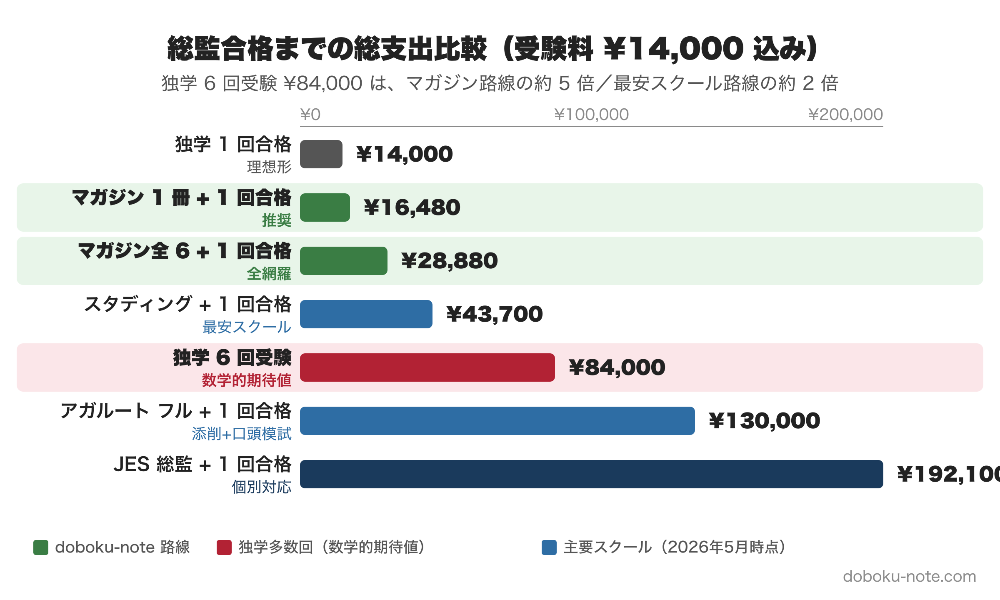

# 総監 6 回受験 vs スクール vs ¥2,480 マガジン｜公式統計と主要スクール価格で算出した "本当のコスト"

**この記事でわかること**

- IPEJ（公益社団法人 日本技術士会）公式統計から見る **合格までの平均受験回数の "数学的期待値"**（と、その期待値が過大評価になる理由）
- 主要スクール 5 社（アガルート / SAT / スタディング / 新技術開発センター / JES）の **総監コース価格 2026 年最新版**
- 「独学 6 回受験」「スクール 1 回合格」「マガジン 1 回合格」の **3 シナリオ正面比較**
- 受験料以外の "隠れコスト"（時間・機会費用）の試算
- あなた自身のケースで判断するための **Decision Framework**

---

> **図の見方**: 受験料 ¥14,000 込みの総支出を 7 パスで比較。**緑のバー**が doboku-note マガジン路線、**赤のバー**が独学 6 回受験（数学的期待値）、**青のバー**が主要スクール 5 社。マガジン路線は独学 6 回の約 5 分の 1、最高級スクールの約 12 分の 1 の費用で「効率化の選択肢」を提供します。

---

「総監は難しいから、何回か落ちるかもしれない」と漠然と考えている方は多いと思います。私自身、2026 年 7 月に総監二次試験を受けるにあたって「最悪何回受けることになるか、いくらかかるか」を真剣に試算しました。その過程で気づいたのは、**スクール受講料の見積もりが間違っていると、コスト比較が逆転する** という事実です。

この記事では、IPEJ 公式統計と主要スクールの公表価格をもとに、感覚論ではなくデータで判断する材料を提供します。

<!-- cta:pack-top -->
> 本番直前の総仕上げは、出題予想6テーマ×三層骨子で「何が出ても書ける型」を最短装填できるR8予想問題集が決め手。書き方の型から固めるなら、型・設問(3)の弾薬・R8演習を1セットにした記述式コアパックが入口に最適です。

https://note.com/dobokunote/m/m6854c7437d4d

https://note.com/dobokunote/m/m6e7de5e4ea3d

## 1. 公式データで見る総監の合格率

IPEJ が公表している「[技術士第二次試験結果一覧表](https://www.engineer.or.jp/c_topics/010/010868.html)」（S33-R7）から、総合技術監理部門単独の合格率を集計しました。

- **H26 (2014)**：3,206 / 562 / 17.5%
- **H27 (2015)**：3,293 / 664 / 20.2%
- **H28 (2016)**：3,147 / 473 / 15.0%
- **H29 (2017)**：3,343 / 326 / 9.8%
- **H30 (2018)**：3,279 / 209 / **6.4%** ← 制度改革初年度の異常値
- **R元 (2019)**：3,180 / 490 / 15.4%
- **R2 (2020)**：2,582 / 325 / 12.6%
- **R3 (2021)**：2,742 / 398 / 14.5%
- **R4 (2022)**：2,735 / 501 / 18.3%
- **R5 (2023)**：2,618 / 543 / 20.7%
- **R6 (2024)**：2,521 / 382 / 15.2%
- **R7 (2025)**：2,575 / 584 / **22.7%**
- 加重平均：**35,221** / **5,457** / **15.5%**

**直近 3 年**（R5-R7）**の平均は 19.5%**。12 年加重平均は **15.5%**。本記事では保守的に 15.5% を基準にします。

> **算出方法**: IPEJ 公表 PDF は「全体（21 部門）」と「総監を除いた 20 部門」を併記しています。総監単独 = 全体 − 20 部門 で算出。R6 の詳細部門別 PDF（受験者 2,521 / 合格者 382 / 合格率 15.2%）と完全一致するため、計算は検証済みです。

## 2. "数学的期待値" のワナ

合格率 15.5% で **毎回独立試行**（同じ実力で受け続ける） と仮定すると、合格までの期待受験回数は:

$$E = \frac{1}{0.155} \approx 6.5\ 回$$

しかしこれは **明らかに過大評価** です:

1. **学習効果でスキルは上がる** — 2 回目以降は合格確率が高くなる
2. **連敗者は途中で諦める** — 6 回受け続ける人は少ない（survivor bias）
3. **同年度の受験者層は均質ではない** — 初受験 + 多数回受験者の混合

業界の体感としては **「3〜5 回**（3〜5 年）**」** とされていますが、IPEJ は cohort 統計（同じ受験者が何回目で受かったか）を公表していないため、正確な数字は不明です。

本記事では **「最悪ケース 6 回受験」を基準** にコスト計算します。最悪ケースを基準にする理由は、**意思決定における下振れリスクを可視化する** ためです。

## 3. シナリオ A: 独学で複数回受験するコスト

技術士第二次試験の受験料は **¥14,000 / 回**（令和 7 年度公表、IPEJ）。

- **1 回**：¥14,000
- **3 回**：¥42,000
- 6 回（数学的期待値）：**¥84,000**
- **10 回**：¥140,000

ここまでは「受験料だけ」の話。実際には次のような費用がサイクルごとに上乗せされます:

- 過去問・参考書購入: ¥15,000〜25,000 / 回
- 模試・添削（任意）: ¥10,000〜30,000 / 回
- 試験会場までの交通・宿泊（地方在住の場合）: ¥10,000〜40,000 / 回

これを合算すると **1 サイクルあたり ¥49,000〜109,000**。6 回繰り返すと **¥294,000〜654,000** が "見えるコスト" として計上されます。

## 4. シナリオ B: 主要スクール 5 社の総監コース価格（2026 年 5 月時点）

各社公式サイトから抽出した最新価格を整理しました。**価格はキャンペーン・改定で変動するため、購入検討時に各社公式サイトで再確認してください。**

- **スタディング**：二次合格コース 総監（講座+テキスト） / **¥29,700** / オンライン
- **スタディング**：二次合格コース 総監（添削・質問付） / ¥69,300（キャンペーン後 ~¥58,300） / オンライン
- **新技術開発センター**：二次試験 総監コース / **¥59,400** / 通信
- **アガルート**：二次合格カリキュラム 総監（ライト） / **¥63,800** / オンライン
- **アガルート**：二次合格カリキュラム 総監（フル） / **¥107,800〜151,800** / オンライン + 添削 + 口頭模試
- **SAT**：技術士総監講座 / **¥141,680** / 動画 + 教材 + サポート
- 日本技術サービス（JES）：総監コース A+B / **¥178,100** / Zoom セミナー + 添削

**範囲: ¥29,700 〜 ¥178,100**  
**中央値**（5 社の代表プラン）**: 約 ¥100,000**

> **アガルートの合格特典**: 受講年内に合格すれば全額返金または ¥30,000 のお祝い金。再受講で 20% OFF、他校乗換で 10% OFF。

## 5. シナリオ C: doboku-note マガジン

私が運営する doboku-note の総監向け note マガジンの価格:

- **5管理 テキスト精読ガイド**：**¥2,480**（5 本セット） / 経済性・人的・情報・安全・社会環境 の精読
- **総監記述式 模範論文｜建設コンサル 河川・砂防**：**¥2,480**（5 本セット） / 属性別の模範論文
- **総監記述式 模範論文｜ゼネコン**：**¥2,480**（5 本セット） / 属性別の模範論文
- **総監記述式 模範論文｜自治体 道路担当**：**¥2,480**（6 本セット） / R3-R7 + R8 予想セット
- **R8 予想問題集 6 テーマ**：**¥2,480**（6 本セット） / 自治体 道路担当フル模範論文
- **解答テンプレ集 3D マトリクス**：**¥2,980** / 300 セルの汎用テンプレート

**全 6 マガジン合計: 約 ¥14,880**

加えて **無料で読める白書R7 完全対応集**（34,000 字） があるので、購入前にコンテンツの品質を確認できます。

> 無料の試読: 「[白書R7 完全対応集](https://note.com/dobokunote/n/n60efbccd728b)」

## 6. 3 シナリオの正面比較

「合格までの総支出（受験料込み）」で比較すると:

- **独学 1 回合格**：¥14,000 / ¥0 / **¥14,000**
- **独学 6 回受験**（数学的期待値）：¥84,000 / ¥0 / **¥84,000**
- **スタディング + 1 回合格**：¥14,000 / ¥29,700 / **¥43,700**
- **新技術開発 + 1 回合格**：¥14,000 / ¥59,400 / **¥73,400**
- **アガルート ライト + 1 回合格**：¥14,000 / ¥63,800 / **¥77,800**
- **アガルート フル + 1 回合格**：¥14,000 / ¥107,800-151,800 / ¥121,800-165,800
- **SAT + 1 回合格**：¥14,000 / ¥141,680 / **¥155,680**
- **JES + 1 回合格**：¥14,000 / ¥178,100 / **¥192,100**
- マガジン 1 冊 + 1 回合格：¥14,000 / ¥2,480 / **¥16,480**
- マガジン全 6 + 1 回合格：¥14,000 / ¥14,880 / **¥28,880**

### 注目ポイント

1. **マガジン 1 冊**（¥16,480）**は独学 6 回受験**（¥84,000）**の約 5 分の 1**。受験料の "保険" として極めて安い
2. **スタディング**（¥43,700）**も独学 6 回**（¥84,000）**より安い**。スクールが必ずしも高額とは限らない
3. **アガルート フル以上**（¥122k〜）**は独学 6 回より高い**。スクール検討は「自分の自学力で何回受験を圧縮できるか」次第
4. **マガジン全 6**（¥28,880）**でも最安スクール**（¥43,700）**より安い** — 全網羅自学路線が金額的には最強

## 7. 隠れコスト: 機会費用

受験料・教材費だけでは語れないコストがあります:

### 学習時間

総監二次の準備時間は **300〜500 時間 / サイクル** が一般的（[私自身の 4 フェーズ学習法](https://note.com/dobokunote/n/n6f9854578518) では 12 月開始で約 400 時間想定）。

時給 ¥3,000 換算で **¥900,000〜¥1,500,000 / サイクル**。6 回繰り返すと **¥5.4M〜9M** の機会費用。

### キャリア機会の損失

総監を取れば:

- 業務範囲が拡大（PMP/PM 系業務、5 管理での品質保証）
- 昇進・転職市場での評価向上
- 年収アップ事例（業界平均 +¥500k〜1M / 年）

合格が 5 年遅れれば、年収アップが 5 年分機会損失。**¥2.5M〜5M の累積差** になりうる。

### 心理的負担

- 不合格通知の精神的ダメージ
- 業務経歴書再作成の労力（毎年）
- 家族・上司への申し開き

これらを数値化するのは難しいですが、**「6 回受験ルート」は財務 + 機会費用で実質 1,000 万円超のプロジェクト** になる可能性があります。

## 8. Decision Framework: あなたのケースで判断する

以下の質問で自分のタイプを判定してください:

### Q1. 過去 1 部門の PE は独学で取得しましたか?

- **Yes** → 自学に慣れているので、マガジン中心 + 必要に応じてスクール添削
- **No** → スクールの添削・口頭模試を活用する方が合格確率が上がる可能性

### Q2. 試験日（7 月中旬）まで 6 ヶ月以上ありますか?

- **Yes** → 自学路線で十分間に合う（マガジン + 過去問演習）
- **No** → スクールの効率的カリキュラムで圧縮するのが現実的

### Q3. 経済的に ¥150,000 のスクール代を即決できますか?

- **Yes** → スクール検討。1 回で合格すれば独学 6 回より安い
- **No** → マガジン（¥2,480〜¥14,880）から始めるのがリスク最小

### Q4. 添削や口頭模試が必要ですか?

- **Yes** → アガルート フル / SAT / JES などフルサポート系
- **No** → スタディング基本 or マガジン

### 推奨組合せ

- **PE 既取得 + 時間あり + 経済合理性重視**：**マガジン全 6 + 過去問独学** / ¥28,880
- **PE 既取得 + 時間少ない + 短期合格狙い**：マガジン + スタディング添削プラン / ¥72,000
- **初受験 + 添削必要 + 経済的余裕あり**：アガルート フル or SAT / ¥122,000〜156,000
- **通学希望 + 個別指導重視**：JES or 通学型スクール / ¥178,000〜250,000

## 9. doboku-note の位置付け

私自身は 2026 年 7 月に総監二次試験を受験する受験者であり、発注者（地方自治体土木職）出身者です。マガジンは「自分が実際に試験勉強で使っている思考フレーム + 過去問分析」を商品化したもので、以下を約束しません:

- ❌ **「1 年で必ず合格」とは約束しません**（合格は本人の努力次第）
- ❌ **「スクールより必ず良い」とは言いません**（添削・口頭模試は別の価値）
- ✅ **「効率化の選択肢の一つ」として** スクールの約 1/10 価格で提供
- ✅ **無料の白書R7 対応集**（34,000 字） で品質を確認してから判断していただけます

### まず無料の白書R7 完全対応集（34,000 字）で品質確認

> [白書R7 完全対応集を読む](https://note.com/dobokunote/n/n60efbccd728b)

### 5 管理を頻出順に整理した精読ガイド（¥2,480）

doboku-note の総監向けマガジンの中で **最も汎用性が高いのは「5 管理 テキスト精読ガイド」** です。択一・記述に直結する 5 管理の論点を 5 本に集約しています。

> [マガジン一覧（doboku-note 公式リンクハブ）](https://doboku-note.com/links)

---

## まとめ

- **数学的期待値**：1 / 15.5% = **6.5 回**（過大評価、現実は 3〜5 回）
- **独学 6 回の受験料**：**¥84,000**
- 最安スクール（スタディング基本）：**¥29,700**（受験料込み ¥43,700）
- **中央値スクール**：約 **¥100,000**（受験料込み ¥114,000）
- **マガジン 1 冊**：**¥2,480**（受験料込み ¥16,480）
- **マガジン全 6**：**¥14,880**（受験料込み ¥28,880）
- 隠れコスト（時間 × 6 回）：**¥5.4M〜9M** の機会費用

**最もリスクの低い意思決定は「無料の白書R7 完全対応集を読んで品質確認 → マガジンで自学路線スタート → 必要に応じてスクール添削を追加」** という段階的アプローチです。

数学的期待値の 6.5 回は確かに過大評価ですが、3〜4 回受験コースに陥った場合の総コスト（受験料 + 教材 + 時間）は確実に ¥200,000 を超えます。それを **¥2,480 のマガジン 1 冊** で防げる可能性があるなら、まず試してみる価値はあります。

---

## 派生記事 — あなたの persona で読みたい場合

本記事は **汎用版** ですが、属性別に最適なコスト構造は大きく違います。ご自身の状況に合わせて以下をご参照ください:

- 📖 [**地方自治体土木職**（公務員）**向け版**](../総監コスト公務員版/article.md) — 受験料補助 + 自己啓発支援 + 課長級昇進加点 + 30 年累積 ¥4.5M ベネフィット試算

> ゼネコン勤務向け / 建設コンサル勤務向け / 年代別（30 代・40 代・50 代）の派生記事は順次公開予定。

---

## 出典・参考資料

- [技術士第二次試験 統計情報（IPEJ 公式）](https://www.engineer.or.jp/c_topics/010/010868.html)
- [技術士第二次試験結果一覧表 S33-R7（PDF）](https://www.engineer.or.jp/c_topics/010/attached/attach_10868_1.pdf)
- [令和6年度 技術士第二次試験統計（部門別詳細 PDF）](https://www.engineer.or.jp/c_topics/001/attached/attach_1013_2.pdf)
- [アガルート 技術士第二次試験合格カリキュラム](https://www.agaroot.jp/gijyutsu/2cr/)
- [SAT 技術士試験対策講座](https://www.sat-co.info/ec/gijutsusi)
- [スタディング 技術士二次試験合格コース 2026 年度対応](https://studying.jp/engineer/itempage/course-2026.html)
- [新技術開発センター 技術士試験対策](https://pe.techno-con.co.jp/)
- [日本技術サービス（JES）総合技術監理部門コース](https://ejes.jp/course_sogo)

> 価格データは 2026 年 5 月 27 日時点で取得。各社の最新キャンペーン・改定は購入時に公式サイトでご確認ください。doboku-note の社内 SSoT は `docs/reference/pe-cem-school-prices.md` および `docs/reference/pe-cem-pass-rate-history.md` で管理しています。

---

<!-- cta:tankan-mokuji -->
総監のほかの無料記事・有料マガジンは「総監もくじ」から一覧できます。

https://note.com/dobokunote/n/n3ed4c77ceed6
