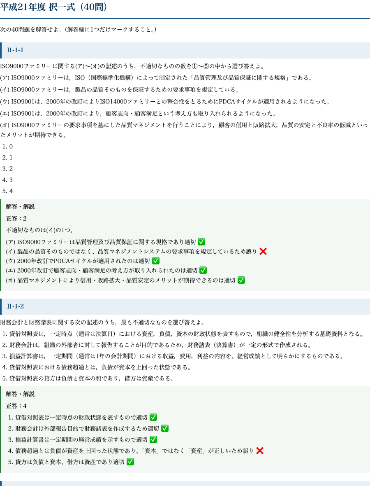

# 技術士 総合技術監理部門｜択一 過去問PDF 平成（平成21〜30年度 全400問・全選択肢解説）

**こんな人のための記事です**

- 総合技術監理部門の択一式を、令和分だけでなく平成の蓄積まで踏み込んで対策したい
- 5つの管理（経済性・人的資源・情報・安全・社会環境）の頻出論点を10年分で網羅したい
- 正答番号だけでなく、各選択肢がなぜ正しい/誤りなのかを根拠から理解したい

**この記事でわかること**

- 平成21〜30年度の択一 全400問を、5つの管理を横断しながら1冊で通しで回せます
- 管理の原則そのものを問う平成期の良問で、令和の応用問題を解くための土台を固められます
- A4印刷用なので、電波もアプリも要らず、通勤・昼休み・直前期に紙で高速に反復できます

総監の択一式は、5つの管理にまたがる基礎概念が繰り返し問われます。平成期の過去問は、**管理の原則そのものを問う良問が多く、令和の応用問題を解くための土台**になります。令和分と合わせて10年超を回すことで、初見の肢にも対応できる地力がつきます。

この教材は、**平成21年度から平成30年度までの10年分・全400問**を1問残らず収録し、各選択肢に正誤の理由を付けたA4印刷用PDFです。5管理のどこに属する論点かを意識しながら回せるよう再編集しています。

## 収録内容

- **平成21〜30年度の択一式 全400問**（各年度40問・5管理を横断）
- **全問・全選択肢に正誤の理由を明記**（正しい肢がなぜ正しいか、誤りの肢がどこで誤るか）
- 個数問題・組合せ問題も、選択肢ごとに適否の根拠を提示
- A4・通しページ番号つきの印刷用PDF、出典・著作権・免責を明記
- 管理の原則を問う平成期の良問で、5管理の基礎を固められる構成

## 中身サンプル

実際の紙面はこの品質です（平成21年度の冒頭）。

たとえば品質マネジメントに関する個数問題は、次のように各記述の適否を判定します。

> **Ⅱ-1-1　ISO9000ファミリーに関する(ア)〜(オ)の記述のうち、不適切なものの数を選べ。**

> 記述(イ)　ISO9000ファミリーは、製品の品質そのものを保証するための要求事項を規定している。

**正答：2**（不適切なものは1つ）

不適切なのは(イ)です。ISO9000ファミリーが規定するのは「製品の品質そのもの」ではなく、それを生み出す**品質マネジメントシステムの要求事項**です。(ア)の規格の位置づけ、(ウ)2000年改訂でのPDCA適用、(エ)顧客志向の導入、(オ)導入メリットはいずれも適切で、誤りは(イ)の1つだけなので「不適切なものの数＝1」に対応する選択肢が正答になります。

このように、個数問題では各記述を一つずつ管理の原則に照らして適否判定できることが要求されます。全400問がこの粒度で解説されています。

## PDF のダウンロードと使い方

ここから先で、全400問・全選択肢解説のA4印刷用PDF（この記事の末尾に添付）をダウンロードできます。以下は、平成分を令和分と組み合わせて仕上げる回し方です。

**まず令和分で傾向を掴み、平成分で厚みを出す**

直近の傾向は令和分でつかむのが効率的です。そのうえで平成分を回すと、同じ論点が別の角度で問われていることに気づき、理解が立体的になります。令和分（別冊）と本書を往復すると、5管理の頻出論点をほぼ取り切れます。

**個数問題・組合せ問題を得点源にする**

平成期に多い個数問題・組合せ問題は、各記述を独立に適否判定できれば確実に取れます。誤った記述の「どこが原則から外れているか」を解説で押さえ、判定の型を身につけます。

**直前期は印のついた肢を高速反復**

直前期は印のついた記述だけを高速で回します。紙のPDFなので移動時間でも回せます。択一の底上げは記述式の余裕にも直結します。

新しい問題集より、この400問を全肢判定できる状態にするほうが、合格に直結します。

## 出典・免責

本教材は、公益社団法人 日本技術士会が実施する技術士第二次試験（総合技術監理部門）の択一式過去問題を出典としています。問題文の著作権は出典元に帰属します。解答・解説および複数年度の編集・再構成は著者（doboku-note）によるものです。

本教材は正確を期して作成していますが、内容を保証するものではありません。法令・基準・ガイドラインは改正されることがあるため、受験にあたっては必ず最新の一次情報をご確認ください。

---

<!-- cta:tankan-mokuji -->
総監のほかの無料記事・有料マガジンは「総監もくじ」から一覧できます。

https://note.com/dobokunote/n/n3ed4c77ceed6
