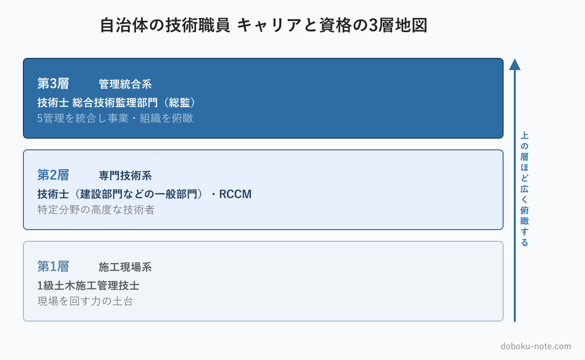

# 【自治体の技術職員】キャリアと資格の地図｜1級土木施工管理技士・技術士・総監・RCCMの位置づけ

**こんな人におすすめ**

- 自治体の土木職で、次に取る資格を考えている
- 技術士・RCCM・総監の違いと位置づけが整理できていない
- 総監が自分のキャリアのどこに来るのか知りたい
- 限られた時間で、どの資格から取るべきか迷っている

**この記事でわかること**

- 自治体の技術職員が関わる主要資格の全体像（3層モデル）
- 技術士・RCCM・総監それぞれの位置づけと違い
- 総監をキャリアのどこに置くか

---

自治体の土木職として働いていると、関わりうる資格がいくつも出てきます。1級土木施工管理技士、技術士、RCCM、総合技術監理部門……。研修の案内、昇任の話、先輩の名刺など、別々の場面でばらばらに名前を聞くため、「自分のキャリアの中でどれを、どの順で取ればいいのか」が整理しにくいものです。

資格は、時間とお金と労力を使って取るものです。やみくもに挑むより、全体の地図を持ってから順番を決めたほうが、限られた時間を無駄にしません。この記事は、自治体の技術職員が関わる主要資格を1枚の地図として整理し、その中で技術士 総合技術監理部門（総監）がどこに位置づくのかを示します。

<!-- cta:pack-top -->
総監まで取ると決めたら、直前期は記述式の答案づくりが本丸になります。

> 本番直前の総仕上げは、出題予想6テーマ×三層骨子で「何が出ても書ける型」を最短装填できるR8予想問題集が決め手。書き方の型から固めるなら、型・設問(3)の弾薬・R8演習を1セットにした記述式コアパックが入口に最適です。

https://note.com/dobokunote/m/m6854c7437d4d

https://note.com/dobokunote/m/m6e7de5e4ea3d

## 自治体技術職員の資格は「3層」で整理できる

資格を「何を示す資格か」という役割で分けると、大きく3つの層になります。

- **第1層：施工・現場系** — 1級土木施工管理技士
- **第2層：専門技術系** — 技術士（建設部門などの一般部門）、RCCM
- **第3層：管理統合系** — 技術士 総合技術監理部門（総監）

下の層が土台になり、上の層ほど「広く俯瞰する力」を示します。第1層が「現場を回せる」、第2層が「専門を究めた」、第3層が「全体を統合できる」——という積み上がりです。順に見ていきます。

## 第1層：施工・現場系 — 1級土木施工管理技士

工事の施工管理を担う国家資格です。施工計画、工程管理、品質管理、安全管理といった現場運営の知識が問われます。

発注者である自治体の技術職員にとっても、この資格は工事の監督・検査の土台になります。施工者が何をどう管理しているかを理解していなければ、適切な監督はできません。多くの自治体技術職員が、キャリアの早い段階でこの資格を取得します。

第1層は「現場を回す力」の証明です。資格地図では、ここがキャリアの出発点になります。

## 第2層：専門技術系 — 技術士（一般部門）とRCCM

この層は「特定分野の高度な技術者」であることを示します。代表的なのが技術士の一般部門とRCCMです。

**技術士**（建設部門などの一般部門） — 科学技術分野の高度な専門技術者を国が認定する資格です。二次試験は難関として知られますが、そのぶん分野を問わず通用する強い資格で、自治体でも高く評価されます。発注者として設計の妥当性を判断したり、技術的な根拠を持って住民や議会に説明したりする場面で、この資格の裏づけが効きます。

**RCCM** — 建設コンサルタント業務に関わる技術者の資格です。建設コンサルタント業界で重視される一方、性格としては技術士より建設コンサルタント業務に寄った資格と言えます。

自治体の技術職員にとっては、汎用的に効く技術士（一般部門）がまず軸になります。RCCMは、退職後に建設コンサルタントへ進む可能性を重く見るなら、選択肢に入ってきます。両方を必ず取る必要はなく、自分の進む方向に合わせて選べばよい層です。

## 第3層：管理統合系 — 技術士 総監

第3層は「専門技術の深さ」の上に立つ層で、複数の管理を統合し、事業や組織を俯瞰する力を示します。これが技術士 総合技術監理部門（総監）です。

総監は技術士の最上位の区分にあたります。経済性・人的資源・情報・安全・社会環境の5つの管理と、その間で必ず生じるトレードオフを、総合的に判断する力を問います。

第2層までが「何ができる技術者か」を示すのに対し、第3層は「複数の要求がぶつかったとき、全体を見て調整できるか」を示します。

たとえば、コストを抑えたいが安全も確保したい、工期を守りたいが住民の理解も得たい——こうした板挟みをどうさばくか。これが総監の問う力であり、自治体の発注者業務そのものでもあります。

## 自治体技術職員の標準的なルート

3層を踏まえると、自治体の技術職員のキャリアと資格の標準的な並びはこうなります。

1級土木施工管理技士（現場の土台）→ 技術士・建設部門など（専門技術の証明）→ 総監（管理統合の証明）。

若手のうちに第1層、中堅で第2層、というのが多くの人のたどる順序です。RCCMは、このルートの第2層に並ぶ選択肢で、建設コンサルタントへの転身を視野に入れる場合に検討します。

すべてを取る必要はありませんが、第1層→第2層→第3層という「下から積む」順序は崩さないほうが、学習はスムーズです。専門技術の土台がないまま管理統合だけを学んでも、実感が伴わず、知識が身につきにくいからです。

## 総監をキャリアのどこに置くか

総監は、第1層・第2層を踏まえたうえで、「これから組織や事業をまとめる役割が増える」段階、あるいは「定年後を見据え始めた」段階に取るのが自然です。

専門技術をひたすら深める段階では、まだ第2層で十分です。しかし、担当が一つの工事から複数事業の調整に移り、後輩の指導や、議会・住民への説明といった仕事が増えてきたら、それは第3層＝総監の領域に足を踏み入れたサインです。

資格地図を眺めて、自分が今どの層にいて、次にどの層へ向かうのかを確かめてみてください。総監は「いつかは」と漠然と考えるものではなく、立場の変化に合わせて取るものです。

なお、3層すべてを取り切らなければならないわけではありません。第1層と第2層で十分に活躍している技術職員も大勢いますし、それで何の問題もありません。

総監を考えるべきなのは、資格をもう一つ増やしたいときではなく、「自分の仕事が、専門技術そのものより、技術を含めた全体の調整に移ってきた」と感じたときです。

資格の数を競うのではなく、自分の役割の変化に資格を合わせる。これが資格地図の正しい使い方です。地図はあくまで地図であり、すべての道を歩く必要はありません。自分が今いる場所と、これから向かう場所が見えていれば、それで十分です。

## 受けてみようと思ったら

総監に関心が向いてきたら、まず試験の中身を眺めてみることをおすすめします。doboku-note では総監の択一式過去問17年分と[キーワード集2026の全項目](https://doboku-note.com/docs/pe-comprehensive-management-keyword-2026?utm_source=note&utm_medium=referral&utm_campaign=95-civil-servant-qualifications)を無料で公開しています。学習の進め方は[総合技術監理部門 合格戦略](https://doboku-note.com/docs/pe-comprehensive-management-exam-passing-strategy?utm_source=note&utm_medium=referral&utm_campaign=95-civil-servant-qualifications)にまとめています。

https://doboku-note.com

5管理を体系的に短時間で掴む段階に入ったら、note の精読ガイド（5管理を出題視点で優先度順に整理した5本セット）も用意しています。

https://note.com/dobokunote/m/m607bf095b02a

## 総監対策をまとめて進めたい方へ

工程（型 → 設問(3) → 予想演習 → フル模範論文）を一気にそろえたい方には、全部入りの「完全パック」が最もお得です。

https://note.com/dobokunote/m/m171222175fac

各マガジンの全体像と「どれから読むか」は、はじめての方向けのロードマップ記事にまとめています。

https://note.com/dobokunote/n/n3d73729e6cc7

## 関連リソース

**doboku-note — 17年分の過去問 + 700キーワード解説**（無料）

https://doboku-note.com

- 17年分の択一式過去問（全問解答解説つき）
- キーワード集2026の全項目をWeb検索可能
- 700以上のキーワード解説ページ（スマホ対応）

**note のおすすめ記事**

- 【土木系公務員】自治体の技術職員が技術士総監を取る5つのメリット｜発注者の視点から
- 【公務員技術者】定年後を見据えた資格戦略｜技術士総監が再就職・OB活動でどう効くか

---

<!-- cta:tankan-mokuji -->
総監のほかの無料記事・有料マガジンは「総監もくじ」から一覧できます。

https://note.com/dobokunote/n/n3ed4c77ceed6
