# 総監択一式 頻出計算問題 6パターン完全攻略｜毎年3〜5問を確実な得点源にする解法集

**この記事でわかること**
- 択一式で毎年出題される計算問題の6つの解法パターン
- 各パターンの公式・解法手順と、実際の過去問による演習
- 計算問題を「確実な得点源」にするための攻略法

---

計算問題は、総監択一式40問のうち毎年3~5問が出題されます。知識問題と異なり、解法パターンを押さえれば確実に正答できるため、合格者の多くが「落とさない問題」として重視しています。

H21〜R07（17 年分・520 問）の過去問を分類すると、毎年必ず出題される **6 つの計算パターン** が浮かび上がります。

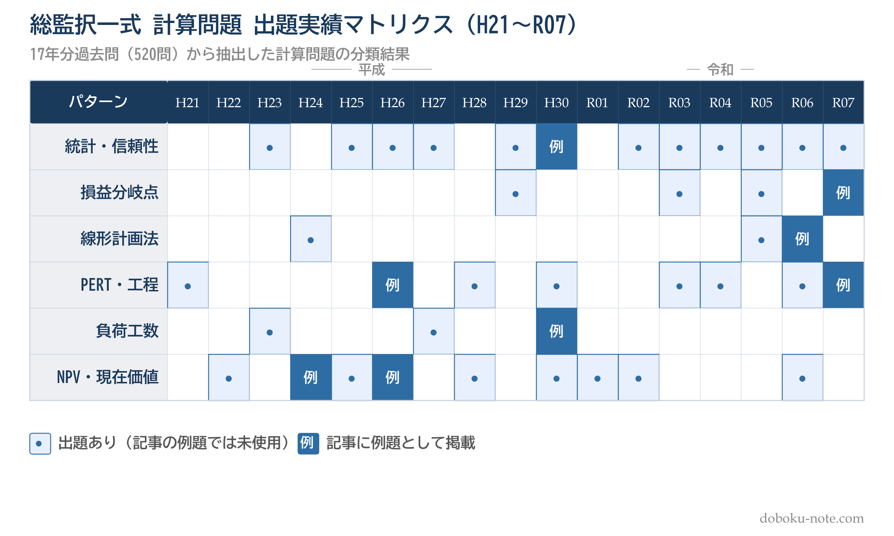

いずれのパターンも 17 年中 8〜12 年で出題されており、この 6 つを押さえれば計算問題のほぼ全てをカバーできます。本記事では各パターンに対し、**公式 → 解法手順 → 過去問演習 → よくある誤答パターン**の 4 段で整理し、**着手しやすい順** に並べて解説します。パターン 1 から順に読み進めれば、易しいパターンで基礎を固めながら段階的に難しいパターンへ移行でき、計算問題を「考える前に手が動く」レベルまで定着します。

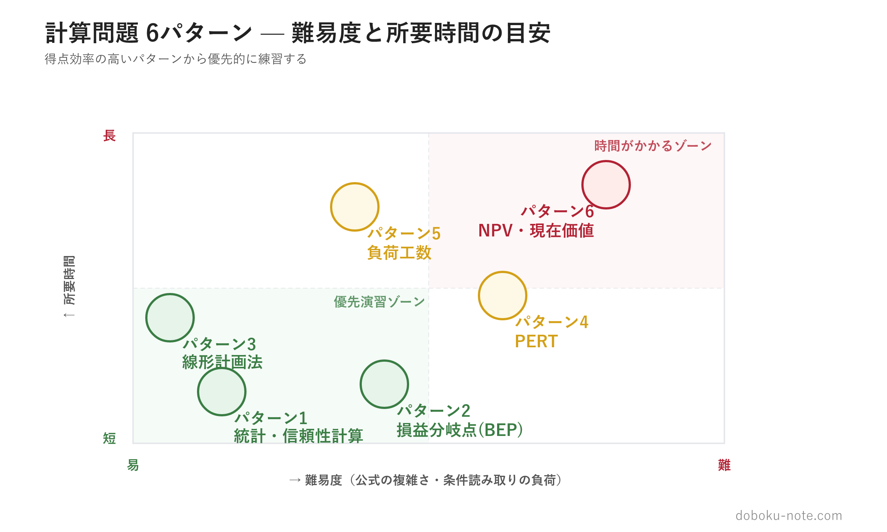

パターン 1（統計・信頼性計算）・パターン 2（BEP）は公式当てはめで即答できるため、本記事の冒頭から自然に易しいパターンから演習できます。最頻出のパターン 6（NPV）は条件の読み取りに時間がかかるため、基本を固めてから取り組みましょう。計算問題全体の出題分野・試験戦略については、[総合技術監理部門 合格戦略](https://doboku-note.com/docs/pe-comprehensive-management-exam-passing-strategy?utm_source=note&utm_medium=referral&utm_campaign=calc-problems-6patterns) も参考にしてください。

## パターン 1: 統計・信頼性計算

**出題実績: 17 年中 12 年**（H23〜R07 のほぼ毎年）

このパターンは「公式当てはめで即答できる短時間問題」の代表格で、毎年いずれかのサブ分類が必ず出題されます。**4 つのサブ分類**を順に押さえれば、本番で素早く 1 問確保できます。

### 1-A. 工程能力指数（Cp・Cpk）

製造工程が規格を満たす能力を定量的に評価する指標。正規分布の性質と合わせて出題されます。

**基本公式**

Cp = (規格上限 - 規格下限) / (6 x 標準偏差)

Cpk = min{(規格上限 - 平均値) / (3 x 標準偏差), (平均値 - 規格下限) / (3 x 標準偏差)}

**正規分布との関係**

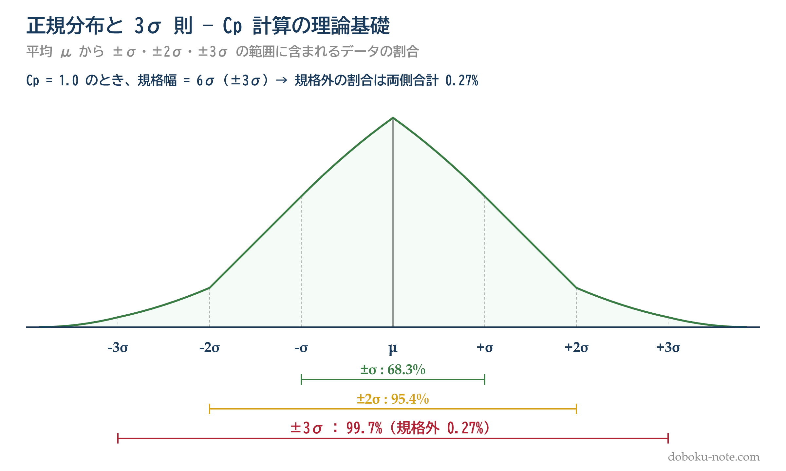

- Cp = 1.0 のとき、規格幅 = 6シグマ → 規格外の割合は約0.27%（両側合計）
- Cp = 1.33 のとき、規格幅 = 8シグマ → 規格外の割合は約0.006%
- 3シグマルール: 平均値から3シグマの範囲に全体の約99.73%が含まれる

公式の詳しい導出と関連例題は doboku-note の[工程能力指数（Cp・Cpk）キーワードページ](https://doboku-note.com/docs/pe-comprehensive-management-process-capability-index?utm_source=note&utm_medium=referral&utm_campaign=calc-problems-6patterns)を参照してください。

**過去問演習: 平成30年度 I-1-1**（選択肢3）

問題の選択肢: 寸法規格が50+/-0.3mmである部品の寸法が平均50mm、標準偏差0.1mmの正規分布に従うとき、寸法規格を満たさない部品の全体に占める割合は1%以下である。

**解法**

規格幅 = 50.3 - 49.7 = 0.6mm
Cp = 0.6 / (6 x 0.1) = 1.0

Cp = 1.0 は規格幅が6シグマに等しいことを意味します。正規分布において、平均値から3シグマの範囲には約99.73%のデータが含まれます。つまり規格外の割合は約0.27%で、1%以下です。

**この選択肢は正しい**（正答）**です。**

**得点のコツ**: 「3シグマ = 99.73%」という数値を暗記しておけば、工程能力指数の問題は即座に判断できます。Cp = 1.0、Cp = 1.33、Cp = 1.67 の3段階を覚えておきましょう。

### 1-B. 信頼度計算（並列・直列・フォールトツリー）

複数の要素から構成されるシステムの信頼度を計算する問題です。H23・H25・H27・H29・R02・R03・R05・R06 など 17 年中 8 年以上で出題されている最頻出サブ分類です。

**基本公式**

- 直列接続（全要素が正常で動作）: R_直列 = R1 × R2 × ... × Rn
- 並列接続（1 つでも正常で動作）: R_並列 = 1 - (1 - R1)(1 - R2)...(1 - Rn)
- フォールトツリー: AND ゲート = 確率の積、OR ゲート = 1 - (1-P1)(1-P2)...

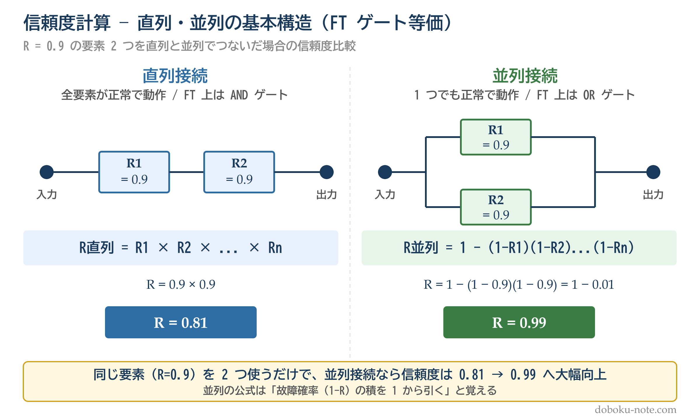

**典型出題: 信頼度 R=0.9 の要素 2 つを並列接続したシステムの信頼度**

R_並列 = 1 - (1 - 0.9)² = 1 - 0.01 = **0.99**

**得点のコツ**: 「**並列は故障確率の積を 1 から引く**」と覚えておけば、直感的に解けます。OR ゲートの確率を単純加算（0.05 + 0.10 = 0.15）するのは典型的な誤答パターンで、正しくは 1 - (1-0.05)(1-0.10) = 0.145 です。R07 出題の MTBF/MTTR もこの公式系の延長です。

直列・並列の信頼度ブロック図と FT（フォールトツリー）の構造は doboku-note の[フォールトツリー分析 (FTA) キーワードページ](https://doboku-note.com/docs/pe-comprehensive-management-fta?utm_source=note&utm_medium=referral&utm_campaign=calc-problems-6patterns)・[並列冗長構成キーワードページ](https://doboku-note.com/docs/pe-comprehensive-management-parallel-system?utm_source=note&utm_medium=referral&utm_campaign=calc-problems-6patterns)で図解しています。

### 1-C. 労働災害統計（度数率・強度率・年千人率）

労働災害の発生率を 3 種の指標で評価する問題。H23・H26・H30・R04・R07 など 17 年中 5 年で出題され、安全管理分野で確実に得点できるサブ分類です。

**基本公式**

- 度数率 = 死傷者数 / 延べ実労働時間 × **1,000,000**（百万時間あたり）
- 強度率 = 労働損失日数 / 延べ実労働時間 × **1,000**（千時間あたり）
- 年千人率 = 死傷者数 / 平均従業員数 × **1,000**（千人あたり）
- 労働損失日数（一時労働不能の場合）= 実休業日数 × 300 / 365

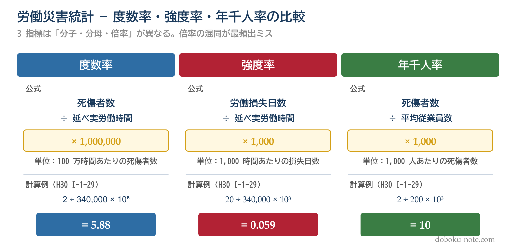

**典型出題: 従業員 200 名・年間労働時間 1,700h・死傷者 2 名・損失日数 20 日**

- 延べ実労働時間 = 200 × 1,700 = 340,000 時間
- 度数率 = 2 / 340,000 × 1,000,000 ≒ 5.88
- 強度率 = 20 / 340,000 × 1,000 ≒ 0.059
- 年千人率 = 2 / 200 × 1,000 = 10

**得点のコツ**: **倍率の混同**（×1,000 と ×1,000,000）が最頻出ミス。「**度数=百万、強度=千、千人=千**」とリズムで覚えます。また、損失日数は実休業日数そのままではなく **× 300/365** で年換算する点も頻出の引っかけです。

3 指標の定義・計算例・全産業平均との比較は doboku-note の[労働災害統計（度数率・強度率・年千人率）キーワードページ](https://doboku-note.com/docs/pe-comprehensive-management-accident-statistics?utm_source=note&utm_medium=referral&utm_campaign=calc-problems-6patterns)で詳しく解説しています。

### 1-D. MTBF・MTTR（信頼性指標）

設備・システムの故障間隔を表す指標。R02・R04・R07 で出題されており、近年（令和期）の出題が増えているサブ分類です。

**基本公式**

- MTBF（平均故障間動作時間）= 稼働時間 / 故障件数
- MTTR（平均修復時間）= 停止時間 / 故障件数
- 稼働時間 = 総時間 × 稼働率
- 停止時間 = 総時間 × (1 − 稼働率)

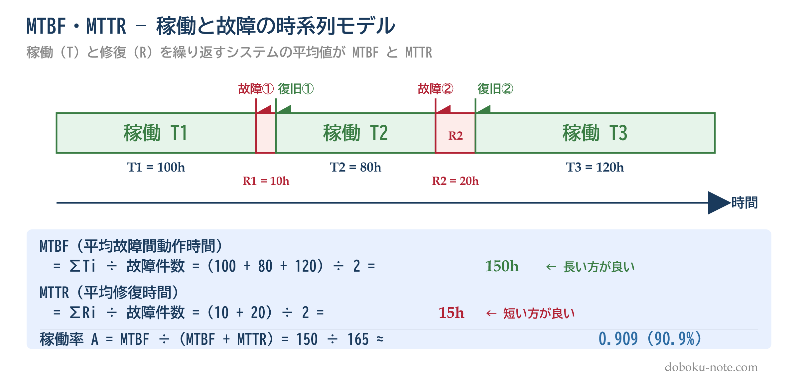

**典型出題: 総稼働 1,093,800h・故障 987 件の機種 A の MTBF**

MTBF = 1,093,800 / 987 ≒ **1,108 時間**（カタログ値 1,000h を上回る）

**得点のコツ**: MTBF と MTTR を取り違えるのが典型ミス。「**B=Between=故障間隔**（長い方が良い）」「**R=Repair=修復時間**（短い方が良い）」と覚えると混同しません。「総稼働時間」と「実稼働時間（稼働率を乗じた値）」の使い分けも頻出ポイントです。

設備信頼性の全体像とバスタブカーブ（初期故障期・偶発故障期・摩耗故障期）は doboku-note の[設備信頼性キーワードページ](https://doboku-note.com/docs/pe-comprehensive-management-equipment-reliability?utm_source=note&utm_medium=referral&utm_campaign=calc-problems-6patterns)・[バスタブカーブキーワードページ](https://doboku-note.com/docs/pe-comprehensive-management-bathtub-curve?utm_source=note&utm_medium=referral&utm_campaign=calc-problems-6patterns)で図解しています。

---

これら 4 サブ分類は、いずれも**公式 1〜2 個を覚えれば即答**できる「落としてはいけない」問題群です。類題は doboku-note の[平成30年度 択一式過去問](https://doboku-note.com/docs/pe-comprehensive-management-h30-primary?utm_source=note&utm_medium=referral&utm_campaign=calc-problems-6patterns)・[令和7年度 択一式過去問](https://doboku-note.com/docs/pe-comprehensive-management-r07-primary?utm_source=note&utm_medium=referral&utm_campaign=calc-problems-6patterns)などに収録されています。

## パターン 2: 損益分岐点（BEP）

**出題実績: 17年中4年**（H29・R03・R05・R07）

損益分岐点（Break-Even Point）は、売上高と総費用が等しくなる点のことで、利益がゼロになる売上高・売上数量を求める分析手法です。

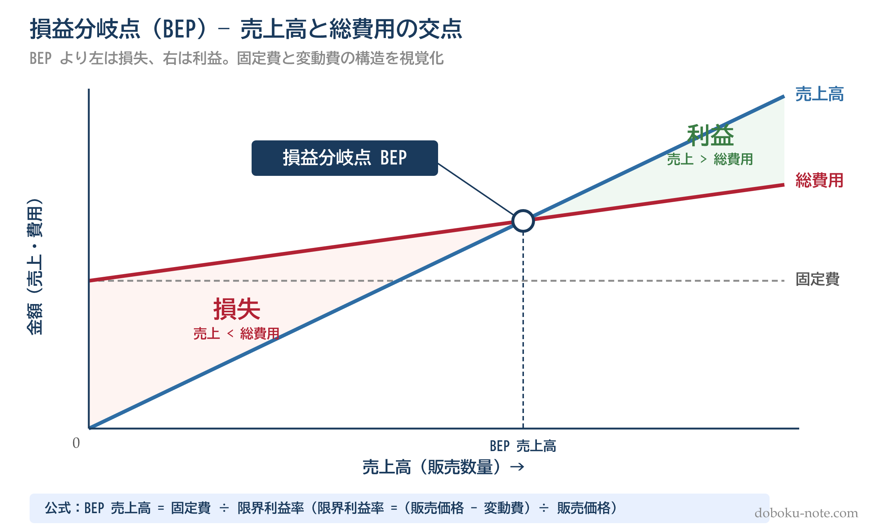

**基本公式**

限界利益 = 販売価格 - 変動費（1個あたり）
限界利益率 = 限界利益 / 販売価格
変動費率 = 変動費 / 販売価格 = 1 - 限界利益率
損益分岐点売上高 = 固定費 / 限界利益率
目標利益達成売上高 = (固定費 + 目標利益) / 限界利益率

公式の導出と CVP 分析の応用は doboku-note の[損益分岐点（BEP）キーワードページ](https://doboku-note.com/docs/pe-comprehensive-management-break-even-point?utm_source=note&utm_medium=referral&utm_campaign=calc-problems-6patterns)で詳しく解説しています。

**過去問演習: 令和7年度 I-1-3**

問題: 企業Xが次期に販売する製品Yの条件は以下の通り。

- 販売価格: 1,000円/個
- 変動費: 400円/個
- 固定費: 384,000円
- 予定売上数量: 800個

この条件での損益分岐点の分析に関する記述のうち、最も適切なものは?

選択肢:
1. 売上数量が800個のときの利益は416,000円
2. 1個当たりの限界利益は520円
3. 変動費率は60%
4. 損益分岐点売上高は640,000円
5. 次期に利益150,000円を獲得するために必要な売上高は1,335,000円

**解法**

限界利益 = 1,000 - 400 = 600円/個
限界利益率 = 600 / 1,000 = 0.6（60%）
損益分岐点売上高 = 384,000 / 0.6 = 640,000円

各選択肢を検証していきます。
1. 利益 = (1,000 x 800) - (400 x 800) - 384,000 = 96,000円（416,000円ではない）
2. 限界利益 = 600円（520円ではない）
3. 変動費率 = 400 / 1,000 = 40%（60%は限界利益率であり混同）
4. 損益分岐点売上高 = 640,000円 --- 正しい
5. 必要売上高 = (384,000 + 150,000) / 0.6 = 890,000円（1,335,000円ではない）

**正答: (4)**

**得点のコツ**: 変動費率と限界利益率は補数の関係（合計100%）にあります。選択肢でこの2つを入れ替えた引っかけが頻出するので、必ず公式に当てはめて検算しましょう。

この問題の詳細解説は doboku-note の[令和7年度 択一式過去問](https://doboku-note.com/docs/pe-comprehensive-management-r07-primary?utm_source=note&utm_medium=referral&utm_campaign=calc-problems-6patterns)で確認できます。

## パターン 3: 線形計画法

**出題実績: 17年中3年**（H24・R05・R06）

線形計画法（Linear Programming）は、複数の制約条件下で目的関数（利益の最大化・費用の最小化）を最適化する手法です。2変数の問題では選択肢の代入比較で解くのが実践的ですが、グラフィカルに「実行可能領域の頂点」を見れば最適解の構造が直観的に分かります。

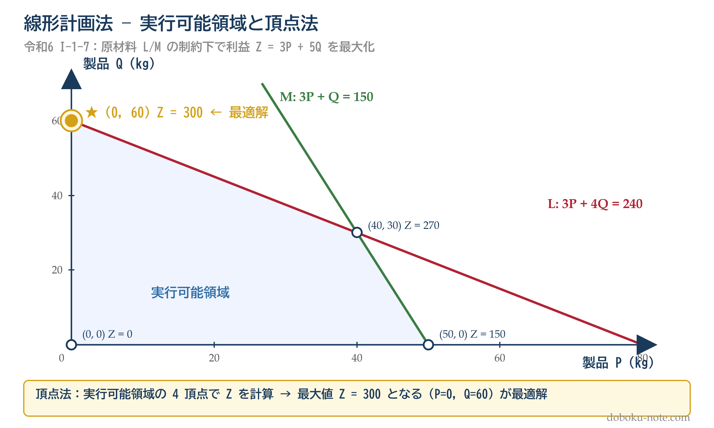

実行可能領域・目的関数の図解・グラフ解法は doboku-note の[線形計画法キーワードページ](https://doboku-note.com/docs/pe-comprehensive-management-linear-programming?utm_source=note&utm_medium=referral&utm_campaign=calc-problems-6patterns)で詳しく解説しています。

**基本概念**

- 決定変数: 求めたい量（生産数量 x, y など）
- 制約条件: 資源の上限（原材料・機械時間など）と非負条件
- 目的関数: 最大化（利益）または最小化（費用）したい量
- 最適解: すべての制約を満たす領域（実行可能領域）の頂点で達成される

**解法の手順**

1. 決定変数を設定します（x, y）
2. 制約条件を不等式で表します
3. 明らかに制約違反の選択肢を除外します
4. 残りの選択肢で目的関数の値を計算し、最大値（または最小値）を選びます

**過去問演習: 令和6年度 I-1-7**

問題: ある工場では、製品P・Qを2種類の原材料L・Mを用いて生産している。

- 製品P: 1kgあたり原材料L 3kg・原材料M 3kg必要、利益 3万円/kg
- 製品Q: 1kgあたり原材料L 4kg・原材料M 1kg必要、利益 5万円/kg
- 制約: 原材料L は最大240kg、原材料M は最大150kg使用可能

利益を最大にするP（x kg）とQ（y kg）の組合せはどれか。

選択肢:
1. x=0、y=60
2. x=10、y=50
3. x=30、y=50
4. x=40、y=30
5. x=50、y=0

**解法**

まず制約条件に違反する選択肢を除外します。
- 選択肢3: L = 3×30 + 4×50 = 90 + 200 = 290 > 240 → 制約違反、除外

残りの選択肢で目的関数 Z = 3x + 5y を評価します。

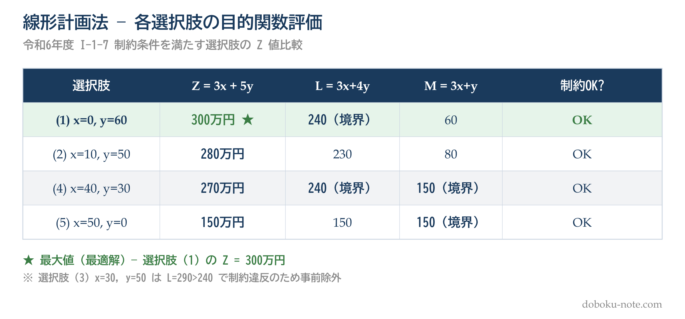

最大は選択肢1の300万円。

**正答: (1) x=0、y=60**

**得点のコツ**: まず制約条件に違反する選択肢を除外し、残りの選択肢に目的関数を代入して比較すると短時間で解けます。グラフを描かなくても選択肢代入法で対応できます。

線形計画法の詳細は doboku-note の[線形計画法](https://doboku-note.com/docs/pe-comprehensive-management-linear-programming?utm_source=note&utm_medium=referral&utm_campaign=calc-problems-6patterns)キーワードページで確認できます。

## パターン 4: PERT・クリティカルパス

**出題実績: 17年中8年**（H21・H26・H28・H30・R03・R04・R06・R07）

PERT（Program Evaluation and Review Technique）は、プロジェクトの各作業の依存関係と所要時間から、最短完了時間とクリティカルパスを求める手法です。

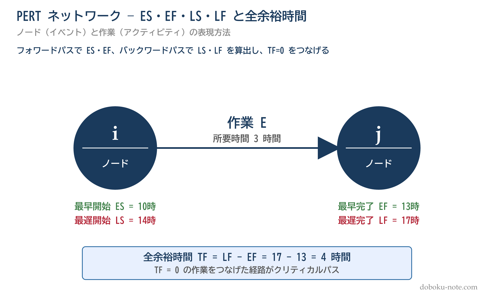

**基本概念**

- 最早開始時刻（ES）: その作業を最も早く開始できる時刻
- 最早終了時刻（EF）: EF = ES + 所要時間
- 最遅終了時刻（LF）: その作業を最も遅くても終わらせなければならない時刻
- 最遅開始時刻（LS）: LS = LF - 所要時間
- トータルフロート（TF）: TF = LF - EF（余裕時間）
- クリティカルパス: TF = 0 の作業をつなげた経路（最長経路）

PERT/CPM の理論と実例は doboku-note の[PERT・クリティカルパスキーワードページ](https://doboku-note.com/docs/pe-comprehensive-management-pert-cpm?utm_source=note&utm_medium=referral&utm_campaign=calc-problems-6patterns)で詳しく解説しています。

**解法の手順**

1. フォワードパス: 開始から終了に向かって、各作業のES・EFを求めます
2. バックワードパス: 終了から開始に向かって、各作業のLF・LSを求めます
3. TF = LF - EF で各作業の余裕時間を算出します
4. TF = 0 の作業を結んだ経路がクリティカルパスになります

**過去問演習1: 平成26年度 I-1-4**（基本型）

問題: あるプロジェクトの各作業の所要時間と先行作業が以下の通り。

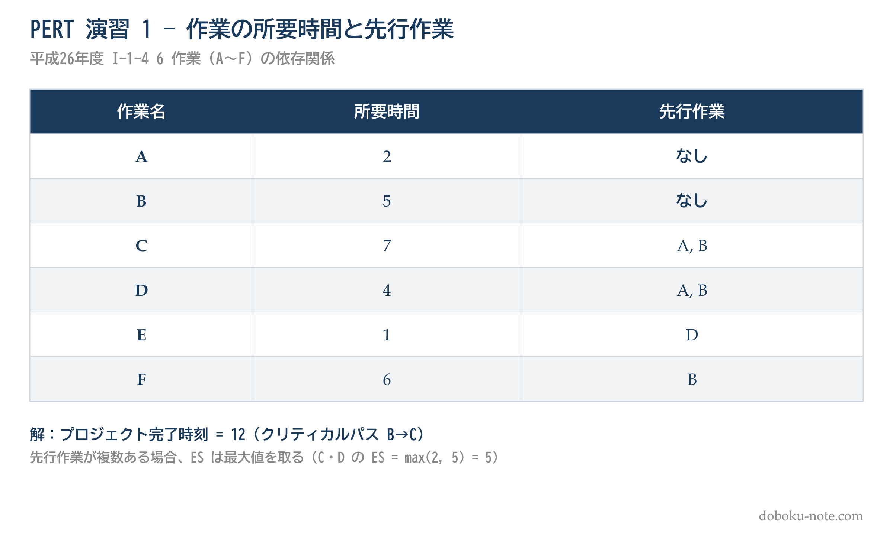

**解法**

フォワードパス:
- A: ES=0, EF=2
- B: ES=0, EF=5
- C: ES=max(2, 5)=5, EF=12
- D: ES=max(2, 5)=5, EF=9
- E: ES=9, EF=10
- F: ES=5, EF=11

プロジェクト完了時刻=12。クリティカルパスはB→C（合計12）となります。

各選択肢を検証します。
1. 作業Aはクリティカルパス上にある → 誤り（B→Cが最長）
2. 作業Bの最遅終了時刻は6 → 誤り（LF=5: 12-7=5）
3. 作業Dの最早終了時刻は9 → 正しい（EF=5+4=9）
4. 作業Eの最早開始時刻は11 → 誤り（ES=9）
5. 作業Fのトータルフロートは2 → 誤り（TF=12-11=1）

**正答: (3)**

**得点のコツ**: 先行作業が複数ある場合、ESはその中の最大値をとります。ここを間違えると全体の計算がずれてしまうので注意してください。

**過去問演習2: 令和7年度 Ⅰ-1-8**（複数クリティカルパス型）

問題: あるプロジェクトの各作業の所要日数と先行作業が以下の通り。クリティカルパス上にある作業をすべて列挙したものとして最も適切なものはどれか。

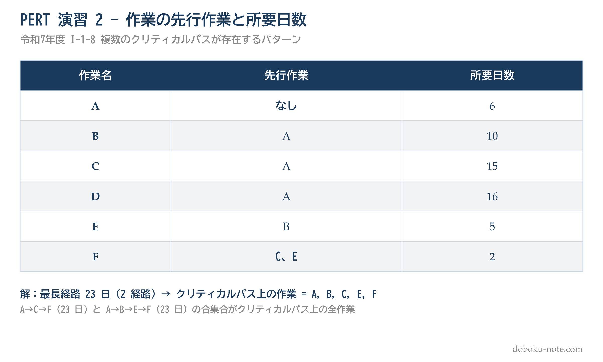

選択肢:
1. A
2. A、D
3. A、C、F
4. A、B、E、F
5. A、B、C、E、F

**解法**

全経路の所要日数を計算します:
- A→D: 6+16 = 22日
- A→C→F: 6+15+2 = 23日
- A→B→E→F: 6+10+5+2 = 23日

最長経路（23日）は2つあります。クリティカルパス上の作業はその合集合 = A, B, C, E, F。

**正答: (5)**

**得点のコツ**: 最長経路が複数ある場合、それら「すべて」に含まれる作業の合集合がクリティカルパス上の作業になります。選択肢3・4のように一方のパスのみ列挙した選択肢は不正解です。

PERT の類題も doboku-note の[令和7年度 択一式過去問](https://doboku-note.com/docs/pe-comprehensive-management-r07-primary?utm_source=note&utm_medium=referral&utm_campaign=calc-problems-6patterns)・[平成26年度 択一式過去問](https://doboku-note.com/docs/pe-comprehensive-management-h26-primary?utm_source=note&utm_medium=referral&utm_campaign=calc-problems-6patterns)に収録されています。

## パターン 5: 負荷工数・残業時間の計算

**出題実績: 17年中3年**（H23・H27・H30）

負荷と能力のバランスを計算し、必要な残業時間を見積もる問題です。条件が多いですが、整理すれば四則演算で解けます。能力工数（できる量）を負荷工数（やるべき量）が超えた分が、そのまま残業時間として発生します。

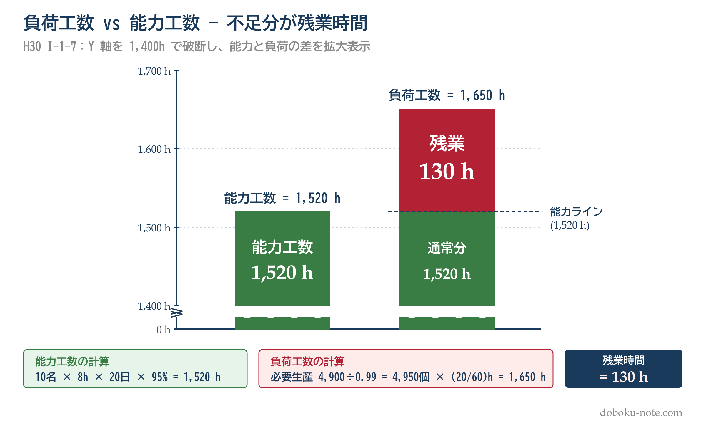

**基本概念**

能力工数 = 作業者数 x 1日の就業時間 x 就業日数 x 出勤率
負荷工数 = 必要生産数 x 1個あたりの標準時間
必要生産数 = 計画良品数 / 良品率
総残業時間 = 負荷工数 - 能力工数

負荷と能力のバランス調整・山積み山崩しの考え方は doboku-note の[負荷工数（負荷・能力管理）キーワードページ](https://doboku-note.com/docs/pe-comprehensive-management-load-capacity?utm_source=note&utm_medium=referral&utm_campaign=calc-problems-6patterns)で詳しく解説しています。

**過去問演習: 平成30年度 I-1-7**

問題: ある職場での来月の工数計算。以下の条件での総残業時間は?

条件:
- 作業者数: 10名
- 定時での1日あたり就業時間: 8時間
- 就業日数: 20日
- 作業者の平均出勤率: 95%
- 1人の作業者が1個を生産するための標準時間: 20分
- 来月の適合品の生産計画量: 4,900個
- 生産数量に対する適合品の数量の比率: 99%

選択肢: (1) 34時間 (2) 50時間 (3) 114時間 (4) 130時間 (5) 136時間

**解法**

能力工数 = 10名 x 8時間 x 20日 x 0.95 = 1,520時間

必要生産数 = 4,900 / 0.99 = 4,949.5 → 4,950個（端数切り上げ）

負荷工数 = 4,950 x (20/60) = 4,950 x 0.3333 = 1,650時間

総残業時間 = 1,650 - 1,520 = 130時間

**正答: (4) 130時間**

**得点のコツ**: 「分」を「時間」に換算する際のミス（20分 = 0.3333時間）と、良品率による必要生産数の割り戻し（計画良品数/良品率）がポイントです。条件を表に整理してから計算に入ると、見落としを防げます。

この問題の詳細解説は doboku-note の[平成30年度 択一式過去問](https://doboku-note.com/docs/pe-comprehensive-management-h30-primary?utm_source=note&utm_medium=referral&utm_campaign=calc-problems-6patterns)で確認できます。

## パターン 6: NPV・現在価値計算

**出題実績: 17年中9年**（H22・H24・H25・H26・H28・H30・R01・R02・R06）**※全パターン中最頻出**

現在価値（PV）とは、将来のキャッシュフローを現在の価値に割り引いた金額のことです。NPV（正味現在価値）は、投資の経済性を評価する基本指標として、全パターン中最も出題頻度が高い計算問題です。難易度と所要時間が最も高いため、パターン 1〜5 で基本を固めた後に取り組みます。

**基本公式**

将来時点tでのキャッシュフローCの現在価値:

PV = C / (1 + r)^t

- r: 割引率（年利率）
- t: 年数

毎年一定額Aが得られる場合の現在価値（年金現価係数を使用）:

PV = A x {1 - 1/(1+r)^n} / r

NPV の理論的背景・割引率の決め方・年金現価係数の使い方は doboku-note の[NPV（正味現在価値）キーワードページ](https://doboku-note.com/docs/pe-comprehensive-management-npv-net-present-value?utm_source=note&utm_medium=referral&utm_campaign=calc-problems-6patterns)・[割引率キーワードページ](https://doboku-note.com/docs/pe-comprehensive-management-discount-rate?utm_source=note&utm_medium=referral&utm_campaign=calc-problems-6patterns)で詳しく解説しています。

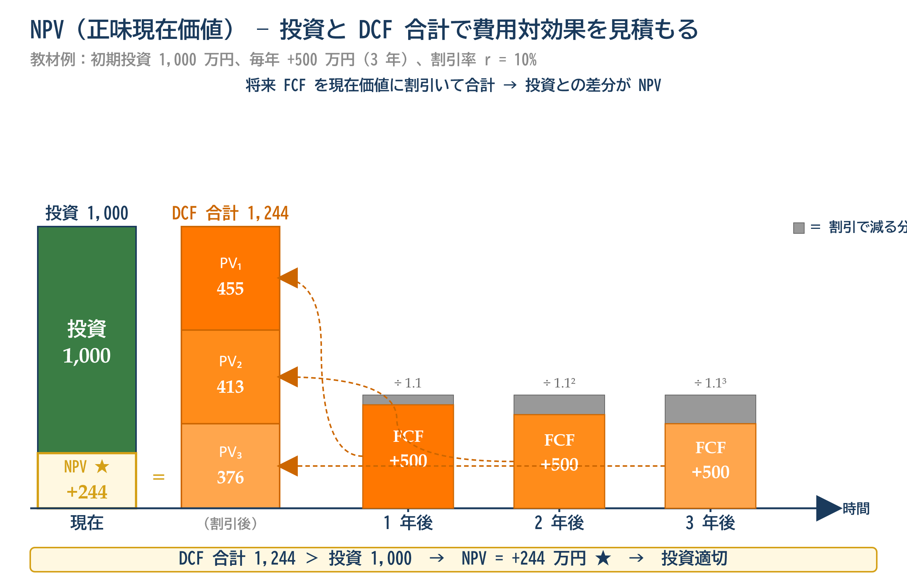

**解法の手順**

1. 各時点のキャッシュフロー（投資額・利益・残存価値）を整理します
2. すべてのキャッシュフローを「プロジェクト開始時点」の現在価値に換算します
3. 現在価値の合計を比較します（NPV > 0 なら投資は有利）

**過去問演習1: 平成26年度 I-1-3**（買取り vs レンタル比較型）

問題: ある会社が機械を買取りかレンタルかで検討している。

条件:
- 考慮する期間: 3年
- 年利率: 10%
- 買取りの場合: 1年目の初めに1,000万円支払い、3年目の末に200万円で引き取ってもらえる
- レンタルの場合: 3年間、毎年の初めに均等に支払う

買取りによる現在価値に最も近くなる毎年のレンタル費用は?

選択肢: (1) 242万円 (2) 267万円 (3) 293万円 (4) 311万円 (5) 342万円

**解法**

まず買取りの現在価値を求めます。

3年目末の引取価格の現在価値:
K = 200 / (1.1)^3 = 200 / 1.331 = 150.26万円

買取りの正味現在価値:
P1 = 1,000 - 150.26 = 849.74万円

次にレンタルの現在価値を求めます。レンタルは毎年初め（期首）に支払うため、以下のようになります。
P2 = R + R/1.1 + R/(1.1)^2 = R x (1 + 0.9091 + 0.8264) = R x 2.7355

P1 = P2 とおくと:
R = 849.74 / 2.7355 = 311万円

**正答: (4) 311万円**

**得点のコツ**: 「年初支払い」か「年末支払い」かで現在価値の計算が変わります。問題文の条件を正確に読み取ることが最重要です。

**過去問演習2: 平成24年度 Ⅱ-1-7**（中間追加投資型）

問題: あるプロジェクトを行うか行わないかが検討されている。計画期間は8年で，初期投資1,200万円のほか，4年経過後に追加投資500万円が必要である。毎年300万円の利益が見込まれる。割引率（年利率）は6%。このプロジェクトの計画期間全体のNPVはいくらか（プロジェクト開始時点での評価）。なお，初期投資・追加投資は年初払い，利益は年末払い。

選択肢: (1) 163万円 (2) 245万円 (3) 267万円 (4) 379万円 (5) 700万円

**解法**

8年間の利益の現在価値（年金現価）:
= 300 x {1 - 1/(1.06)^8} / 0.06 ≈ 300 x 6.210 ≈ 1,863万円

追加投資の現在価値（4年経過後の年初 = 4年末と同タイミング）:
= 500 / (1.06)^4 ≈ 500 / 1.262 ≈ 396万円

NPV = 1,863 - 1,200 - 396 ≈ 267万円

**正答: (3) 267万円**

**得点のコツ**: 「4年経過後の年初」とは「4年末」と同じタイミングです。中間追加投資がある問題では、追加投資の時点を数直線で整理してから計算に入ることでミスを防げます。

類題は doboku-note の[平成26年度 択一式過去問](https://doboku-note.com/docs/pe-comprehensive-management-h26-primary?utm_source=note&utm_medium=referral&utm_campaign=calc-problems-6patterns)・[平成24年度 択一式過去問](https://doboku-note.com/docs/pe-comprehensive-management-h24-primary?utm_source=note&utm_medium=referral&utm_campaign=calc-problems-6patterns)に解説付きで掲載しています。経済性管理の全体像は [経済性管理ピラー](https://doboku-note.com/docs/pe-comprehensive-management-economic-management-pillar?utm_source=note&utm_medium=referral&utm_campaign=calc-problems-6patterns) でまとめて確認できます。

## まとめ: 計算問題の攻略法

6つのパターンに共通する攻略法は以下の3点です。

1. **公式を正確に覚える** --- 応用力よりも基本公式の正確な記憶が重要です。試験本番で「公式がうろ覚え」では計算に入れません

2. **単位を揃える** --- 「分」と「時間」、「円」と「万円」、「年初」と「年末」。単位の不一致が計算ミスの最大原因になります

3. **選択肢から逆算する** --- 5択であることを活かしましょう。計算結果が選択肢のどれに最も近いかで判断できるため、端数処理に神経質になりすぎる必要はありません

計算問題はパターンが決まっているため、各パターン3~5問を演習すれば十分に対応できます。doboku-note には17年分の択一式過去問を全問解答解説付きで収録しているので、計算問題だけを横断的に演習する使い方もできます。まずは[試験インデックス](https://doboku-note.com/docs/pe-comprehensive-management-exam-index?utm_source=note&utm_medium=referral&utm_campaign=calc-problems-6patterns)から該当年度を選んで演習を始めてみましょう。

---

## 関連リソース

**doboku-note — 17 年分の過去問 + 650 キーワード解説**（無料）
https://doboku-note.com/category/pe-comprehensive-management?utm_source=note&utm_medium=referral&utm_campaign=calc-problems-6patterns

- 17 年分の択一式過去問（全問解答解説付き、計算問題だけを横断演習する使い方も可）
- 650 以上のキーワード解説ページ
- スマホ対応（通勤中の学習に最適）

**姉妹 note 記事**（無料）

択一式 17 年分 680 問の出題分野・頻出テーマ分析。計算問題と知識問題の比率や分野別の重みづけが分かります。

https://note.com/dobokunote/n/n3bcb87efddad

記述式 17 年分の出題傾向を 3 期に区分。第 3 期 R03〜R07 に学習を集中させる根拠を解説しています。

https://note.com/dobokunote/n/nc360aaa381b0

学習スケジュール全体の組み立て方。試験前 6-7 ヶ月を 4 フェーズに分けて合格ラインに届く設計を公開しています。

https://note.com/dobokunote/n/n6f9854578518

<!-- cta:tankan-mokuji -->
総監のほかの無料記事・有料マガジンは「総監もくじ」から一覧できます。

https://note.com/dobokunote/n/n3ed4c77ceed6
