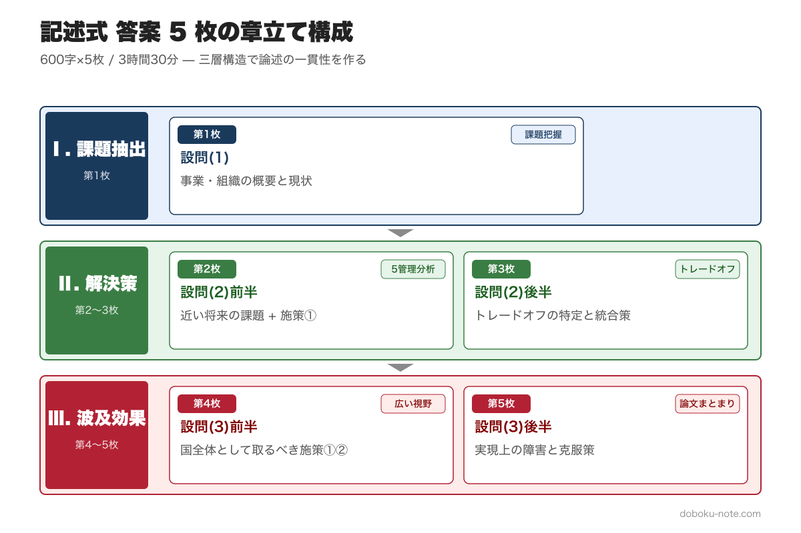
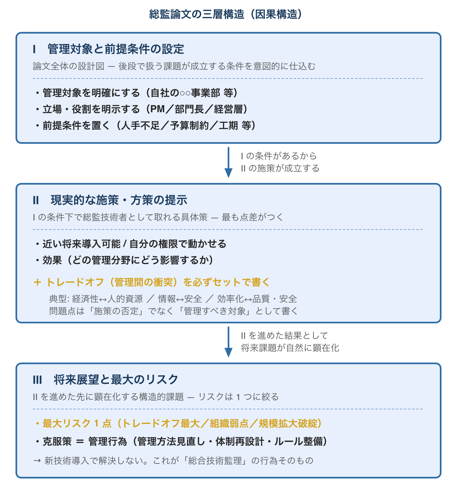
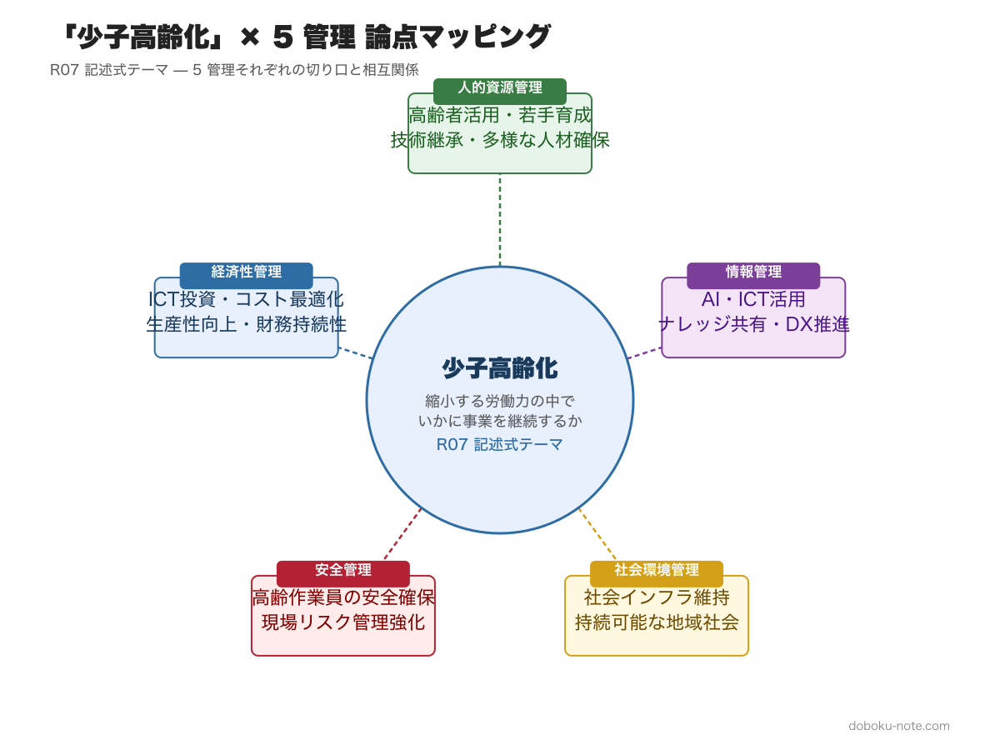

# 総監記述式で差がつく「5管理統合」の書き方｜令和7年度「少子高齢化」を題材に合格答案の構造を解剖

**この記事でわかること**

- 記述式の出題パターンと、試験が本当に問うていること
- 「5管理の羅列」で不合格になる理由と、合格答案との構造的な違い
- 令和7年度「少子高齢化」を題材にした答案構成の実例

---

<!-- cta:pack-top -->
本番直前の総仕上げは、出題予想6テーマ×三層骨子で「何が出ても書ける型」を最短装填できるR8予想問題集が決め手。書き方の型から固めるなら、型・設問(3)の弾薬・R8演習を1セットにした記述式コアパックが入口に最適です。

https://note.com/dobokunote/m/m6854c7437d4d

https://note.com/dobokunote/m/m6e7de5e4ea3d

## 記述式は何を問うているのか

総合技術監理部門の記述式試験は、600字詰めの答案用紙5枚に論文を書く試験です。3時間30分という長丁場ですが、時間が足りないと感じる受験者が大半です。

出題パターンは毎年ほぼ共通しています。長文の「前文」で社会課題が提示され、受験者は自身の業務経験をもとに、以下の3段構成で論述を求められます。

- 設問(1): 自分の事業・組織の概要と、テーマに関する現状
- 設問(2): 近い将来に想定される課題と施策（5つの管理の視点から）
- 設問(3): より広い視野での施策提案と実現上の障害・克服策

一見すると自由度が高いように見えますが、評価基準は明確に示されています。「考察における視点の広さ、記述の明確さと論理的なつながり、論文全体のまとまり」の3点です。

ここで「視点の広さ」とは、5つの管理（経済性・人的資源・情報・安全・社会環境）を横断的に捉える力を指します。単に各管理を列挙するだけでは「広い視点」とは評価されません。

## ありがちな失敗 --- 「管理の羅列」

不合格答案に共通するのが、5つの管理を順番に書き並べるだけの構成です。

たとえば、「少子高齢化」がテーマだった場合に、こう書いてしまいがちです。

- 経済性管理: コスト削減のためにICTを導入する
- 人的資源管理: 高齢者の再雇用制度を整備する
- 情報管理: ナレッジの共有システムを構築する
- 安全管理: 高齢作業員向けに安全装備を充実させる
- 社会環境管理: 環境負荷の少ない工法を採用する

個々の施策はもっともらしく見えます。しかし、これは「5つの管理について1つずつ何か書いた」だけであり、管理間の関係性が見えません。

試験が求めているのは**統合**です。ある管理で最適な施策を実行すると、別の管理にどのような影響が出るのか。そのトレードオフをどう判断し、全体最適を実現するのか。この思考プロセスが答案に表れていなければ、合格点には届きません。

## 合格答案の構造

合格答案は「問題把握 → 5 管理での分析 → トレードオフ特定 → 統合的解決策」の 4 層構造になっています。下図は、総監論文の典型的な因果構造（Ⅰ 管理対象と前提条件 → Ⅱ 施策 → Ⅲ 将来展望）を示したもので、本記事の 4 層構造はこの三層構造を答案レベルに展開したものに対応します。

**第1層: 問題の本質を把握する**

前文から抽出すべきは、テーマ、設定条件、要求事項、評価項目の4要素です。テーマの表面だけを捉えるのではなく、問題文が示す構造的な課題を読み解いてみてください。

ここに試験時間の約60分を充てます。いきなり書き始めないことが鉄則です。

**第2層: 5つの管理で多角的に分析する**

自分の業務経験を題材に、テーマに関連する事象を5つの管理の視点から分析します。このとき、全管理を均等に書く必要はありません。テーマとの関連が深い管理に重点を置き、薄い管理は他との関係性で言及する程度で構いません。

**第3層: トレードオフを特定する**

5管理で分析すると、必ず管理間の対立が見えてきます。たとえば、人的資源管理として高齢者の活用を推進すれば、安全管理上のリスクが増大します。経済性管理としてICT投資を行えば、情報管理上のセキュリティ課題が生じます。

このトレードオフの特定が、合格答案と不合格答案を分ける最大のポイントです。管理間の10ペアそれぞれに典型的な対立パターンと解決フレームがあります。全パターンの整理は doboku-note の「[5 管理間トレードオフ 頻出パターンと解決フレーム](https://doboku-note.com/docs/pe-comprehensive-management-management-tradeoffs)」を参照してください。

**第4層: 統合的な解決策を提示する**

トレードオフに対して、第三の管理の視点から解決策を導きます。たとえば、人的資源管理と安全管理の対立を、情報管理（IoTセンサーによる現場監視）で緩和するといった提案がこれにあたります。

この「ある管理間の対立を別の管理で解決する」構造こそが、総監の記述式が求める **統合的な視点** です。

より詳しい解答工程の解説は、doboku-noteの「[記述式試験の解答戦略](https://doboku-note.com/docs/pe-comprehensive-management-essay-exam-strategy)」で 5 ステップに分解して整理しています。

---

【ここからマガジン限定】

ここから先は、令和 7 年度「少子高齢化」を題材に **設問(2) の答案構成例**（トレードオフ明示 + 統合的克服策） を具体的に解析していきます。

---

## 具体例: R07「少子高齢化」での答案構成

令和7年度の記述式は「少子高齢化」がテーマでした。前文には、出生数が70万人を下回ったこと、高齢化率が29.3%に達していること、生産年齢人口が平成7年のピークから約1,400万人減少していることなどが示されました。

設問は、(1)自分の事業での少子高齢化への対応状況、(2)近い将来に想定される課題と施策2つ、(3)我が国として取るべき施策2つ、という構成です。

この問題で合格水準の答案を構成するための思考プロセスを示します。問題全文と採点基準の詳細は doboku-note の「[令和7年度 記述式過去問](https://doboku-note.com/docs/pe-comprehensive-management-r07-secondary)」で確認できます。

**前文分析のポイント**

「少子高齢化」は漠然としたテーマですが、前文をよく読むと焦点が絞られています。「労働生産性の向上」「多様な労働力の確保」が急務であるという記述から、本問の本質は「縮小する労働力の中でいかに事業を継続するか」という問いだとわかります。

**設問(2)の答案構成例 --- 施策1**

課題: 熟練技術者の退職に伴う技術継承の困難化

施策: AIを活用した技術ナレッジ管理システムの構築

ここでトレードオフを明示します。

- 経済性管理の視点: システム開発・運用に相当の投資が必要
- 情報管理の視点: 暗黙知のデジタル化により技術情報の体系的な蓄積が可能になる一方、情報漏洩リスクも増大する
- 人的資源管理の視点: ベテランの知識をシステムに移行することで、若手の学習効率が向上する一方、OJTの機会が減少し実践的な判断力の育成が遅れる懸念がある

克服策: 情報管理上のセキュリティ対策（アクセス権限管理、暗号化）を前提としたうえで、システム学習とOJTのハイブリッド型育成プログラムを設計します。これにより、人的資源管理と情報管理のトレードオフを経済性管理の視点（投資対効果の最適化）から統合的に管理します。人的資源管理の論点（技術継承・多様な人材確保・高齢者活用の施策体系）の詳細は doboku-note の「[人的資源管理 ピラーページ](https://doboku-note.com/docs/pe-comprehensive-management-human-resource-management-pillar)」を参照してください。

このように、施策の「良い面」だけでなく「別の管理への負の影響」を書き、さらに「その対立をどう解消するか」まで踏み込むことが、合格答案の要件です。

## 答案を書く前に確認すべきこと

論文骨子を作成したら、執筆に入る前に以下を自己点検しましょう。試験本番では25分程度をこの確認に充てたいところです。

- テーマに対する問いに正面から答えているか
- 5つの管理のうち、少なくとも設問で求められた数の管理分野が含まれているか
- トレードオフへの言及があるか
- 設問(1)→(2)→(3)を通じた一貫性があるか
- 具体的な方策とその根拠が述べられているか

総監の記述式は「書く力」の試験ではありません。「工程管理の力」の試験です。限られた時間の中で、分析・構成・確認・執筆の各工程を適切に管理できるかどうかが問われています。

過去問の前文分析や骨子構成の詳細は、doboku-noteの「[記述式試験の解答戦略](https://doboku-note.com/docs/pe-comprehensive-management-essay-exam-strategy)」にまとめています。平成30年度「働き方改革」の分析サンプルも掲載しているので、演習の参考にしてみてください。

---

## 関連リソース

**doboku-note — 17 年分の過去問 + 650 キーワード解説**（無料）
https://doboku-note.com/category/pe-comprehensive-management

- 17 年分の論文過去問（解答骨子の詳細解析付き）
- 650 以上のキーワード解説ページ
- スマホ対応（通勤中の学習に最適）

**さらに深掘りする note**
- 総監記述式 論文骨子テンプレート｜テーマ駆動・5 管理横串フレームワーク（A-1）¥1,980 — 5 枚構成の章立て + 主要 5 テーマ × 5 管理マッピング集 + 定型フレーズ集
- 総監の合否を分ける「トレードオフ思考」完全ガイド ¥1,200 — 5 管理 × 10 組み合わせのマトリクス（B-2 商品）

---

<!-- cta:tankan-mokuji -->
総監のほかの無料記事・有料マガジンは「総監もくじ」から一覧できます。

https://note.com/dobokunote/n/n3ed4c77ceed6
