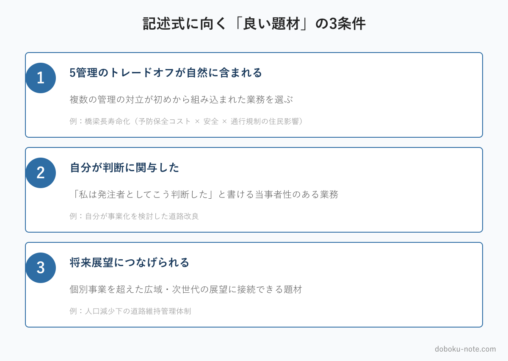

# 【総監記述式】自治体 道路担当が記述式の「お題」をどう選ぶか｜題材選びで答案は半分決まる

**こんな人におすすめ**

- 自治体の道路担当として総監記述式の対策をしている
- 与えられたテーマに、自分のどの業務を当てればよいか迷う
- 書き始めてから「この題材では書きにくい」と気づくことが多い
- 本番で題材選びに時間を取られたくない

**この記事でわかること**

- 記述式は「題材選び」で出来の半分が決まる理由
- 記述式に向く「良い題材」の3条件
- テーマ別に「持ち題材」を用意しておく方法

---

総監の記述式対策というと、答案の書き方や5管理の知識に目が向きがちです。しかし、本番で答案の出来を大きく左右するのは、書き方の前段にある「題材選び」です。

総監の記述式は、前文で抽象的なテーマ（少子高齢化、カーボンニュートラル、防災など）が与えられ、受験者はそれを自分の業務経験に引きつけて書きます。このとき、どの業務を題材に選ぶかで、書きやすさが段違いに変わります。

この記事は、自治体の道路担当に向けて、題材選びの考え方を整理します。

<!-- cta:pack-top -->
> 本番直前の総仕上げは、出題予想6テーマ×三層骨子で「何が出ても書ける型」を最短装填できるR8予想問題集が決め手。書き方の型から固めるなら、型・設問(3)の弾薬・R8演習を1セットにした記述式コアパックが入口に最適です。

https://note.com/dobokunote/m/m6854c7437d4d

https://note.com/dobokunote/m/m6e7de5e4ea3d

## 記述式は「題材選び」で半分決まる

同じテーマでも、選ぶ題材次第で答案の難易度はまったく変わります。

トレードオフが豊かに含まれる業務を題材にすれば、第2層（施策）は自然に書けます。自分が判断に関わった業務を選べば、当事者としての具体性が出ます。

逆に、トレードオフの乏しい業務や、伝聞でしか知らない業務を選ぶと、何を書いても薄くなります。施策を絞り出すのに苦労し、字数は埋まっても評価されない答案になりがちです。

本番で「書き始めてから題材を選び間違えたと気づく」のは、最も避けたい事態です。3時間半の試験中に題材を選び直す余裕はありません。

だからこそ、題材選びの基準を事前に持ち、いくつかの題材を準備しておくことが、記述式対策の核心になります。書く技術を磨く前に、何を書くかを決めておくのです。

## 自治体 道路担当は「題材の宝庫」

その点で、自治体の道路担当は恵まれた立場にあります。道路担当の業務は、記述式の題材になりうるものの宝庫だからです。

道路の維持管理（橋梁やトンネル、舗装の長寿命化）、バイパスや道路の新設、災害復旧、交通安全対策、無電柱化、自転車通行空間の整備——どれも、複数の管理がぶつかり合い、住民・予算・安全が複雑に絡む業務です。さらに、道路は誰もが日常的に使うインフラであるため、住民の関心が高く、社会環境管理の論点が自然に立ち上がります。題材そのものに困ることは、まずありません。

問題は「豊富にあるからこそ、どれを選ぶか」です。次の3条件で絞り込みます。

## 記述式に向く「良い題材」の3条件

**条件1：5管理のトレードオフが自然に含まれる**

良い題材には、複数の管理の対立が初めから組み込まれています。たとえば橋梁の長寿命化は、「予防保全にかかるコスト（経済性）」と「事後保全に回した場合の安全リスク（安全）」と「補修工事中の通行規制による住民への影響（社会環境）」が、何もしなくても絡み合っています。

こうした題材を選べば、第2層のトレードオフ分析が自然に展開できます。逆に、対立の乏しい業務を選ぶと、トレードオフを無理にひねり出すことになり、答案が不自然になります。

**条件2：自分が判断に関与した**

題材は、自分が当事者として判断に関わった業務を選びます。「私は発注者としてこう判断した」と書ける業務でなければ、答案に当事者性が出ません。

上司の判断を見ていただけ、他課の事業を伝え聞いただけ——そうした業務は、知識としては書けても、総監が評価する「自らの管理経験に基づく論述」にはなりにくいのです。

役職が高くなくても構いません。担当者として調査・検討・調整に関わった経験があれば、それは立派な題材になります。

**条件3：将来展望につなげられる**

第3層の将来展望で、個別事業を超えた広がり——地域全体の道路ネットワーク、次世代への施設の引き継ぎ、人口減少下での維持管理体制など——に接続できる題材を選びます。目の前の工事で完結してしまう題材は、第3層が書きにくくなります。「この事業の経験は、より広い課題にどうつながるか」を一言で言えるかどうかが、目安になります。

## 避けたほうがよい題材

3条件の裏返しとして、避けたほうがよい題材もはっきりします。

一つは、トレードオフの乏しい単純な業務です。たとえば「区画線を引き直した」「標識を1本更新した」といった作業は、それ自体に管理間の対立が薄く、総監の答案には展開しにくい。施策を無理にひねり出すことになり、答案が痩せます。

もう一つは、自分が関与していない大規模事業です。話題性のある大きな事業を題材にしたくなりますが、自分が判断に関わっていなければ、答案は伝聞の域を出ません。総監は事業の規模ではなく、受験者自身の管理経験を見ています。小さくても自分が判断した業務のほうが、大きくても他人事の業務より、はるかに良い題材になります。「派手な題材」ではなく「自分が語れる題材」を選んでください。

## テーマ別に「持ち題材」を用意しておく

本番では、与えられたテーマに対して、手持ちの題材を素早く当てる必要があります。そのために、主要テーマごとに「このテーマならこの題材」という対応を、事前に何通りか用意しておきます。

道路担当であれば、たとえば次のような対応が考えられます。

- **少子高齢化・担い手不足のテーマ** → 道路の維持管理を担う体制の縮小、点検・補修の効率化
- **カーボンニュートラル・環境のテーマ** → 道路分野の環境対策、舗装のリサイクル、道路緑化
- **防災・国土強靭化のテーマ** → 災害復旧の経験、道路の防災機能の強化、緊急輸送道路の確保
- **インフラ老朽化のテーマ** → 橋梁・トンネルの長寿命化、予防保全への転換

このように、テーマと道路担当の題材の相性をあらかじめ整理し、それぞれの題材で「どの管理がトレードオフになるか」まで一度書き出しておけば、本番で題材選びに迷う時間がなくなります。準備した題材がそのまま出るとは限りませんが、考え方の引き出しがあれば、初見のテーマにも落ち着いて対応できます。

## 道路担当の模範論文で「題材の活かし方」を見る

良い題材を選んでも、それを答案にどう展開するかは別の技術です。完成した答案で「選んだ題材がどう料理されているか」を見ると、自分の題材の活かし方が具体的に見えてきます。

note のマガジン「総監記述式 模範論文｜自治体 道路担当」は、道路担当（発注者）の立場で、橋梁長寿命化やバイパス整備などの題材を使って書いた過去5年分のフル模範論文と、R8予想問題への解答を収録しています。

本記事の3条件を満たす題材が、実際の答案でどう三層構造に展開されるかを確認できます。

https://note.com/dobokunote/m/m52186ffd12ca

## 総監対策をまとめて進めたい方へ

工程（型 → 設問(3) → 予想演習 → フル模範論文）を一気にそろえたい方には、全部入りの「完全パック」が最もお得です。

https://note.com/dobokunote/m/m171222175fac

各マガジンの全体像と「どれから読むか」は、はじめての方向けのロードマップ記事にまとめています。

https://note.com/dobokunote/n/n3d73729e6cc7

## 関連リソース

**doboku-note — 17年分の過去問 + 700キーワード解説**（無料）

https://doboku-note.com

- 17年分の記述式・択一式過去問（解答解説つき）
- キーワード集2026の全項目をWeb検索可能
- 700以上のキーワード解説ページ（スマホ対応）

---

テーマを選んだ後、5管理のトレードオフをどう論じるかは下記マガジンで体系的に整理しています。道路担当が直面する「経済性×安全」「社会環境×経済性」など、発注者に多い組み合わせを含む20セル全網羅です。

https://note.com/dobokunote/m/m921fbe060575

---

**note のおすすめ記事**

- 【総監記述式】発注者（自治体）の立場で記述式をどう組み立てるか｜三層構造と陥りやすい罠
- 【総監対策】発注者の日常を5管理に翻訳する｜「自分の仕事」で総監を腹落ちさせる

---

<!-- cta:tankan-mokuji -->
総監のほかの無料記事・有料マガジンは「総監もくじ」から一覧できます。

https://note.com/dobokunote/n/n3ed4c77ceed6
