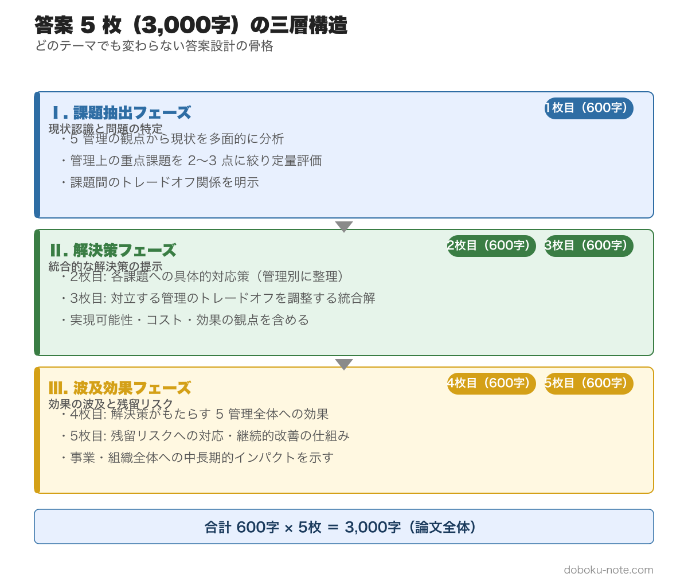
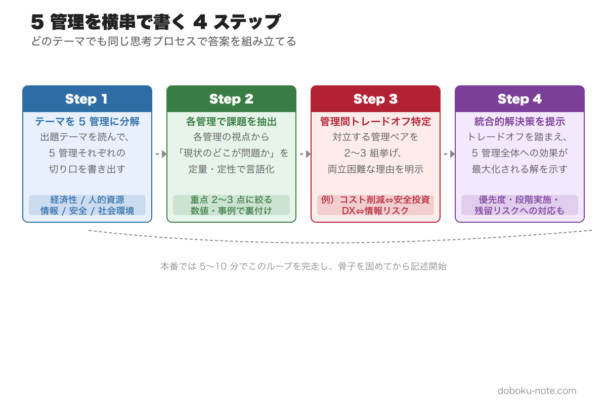
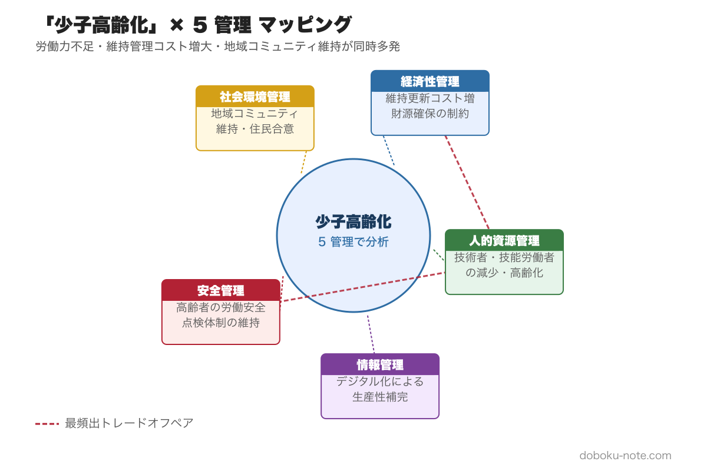
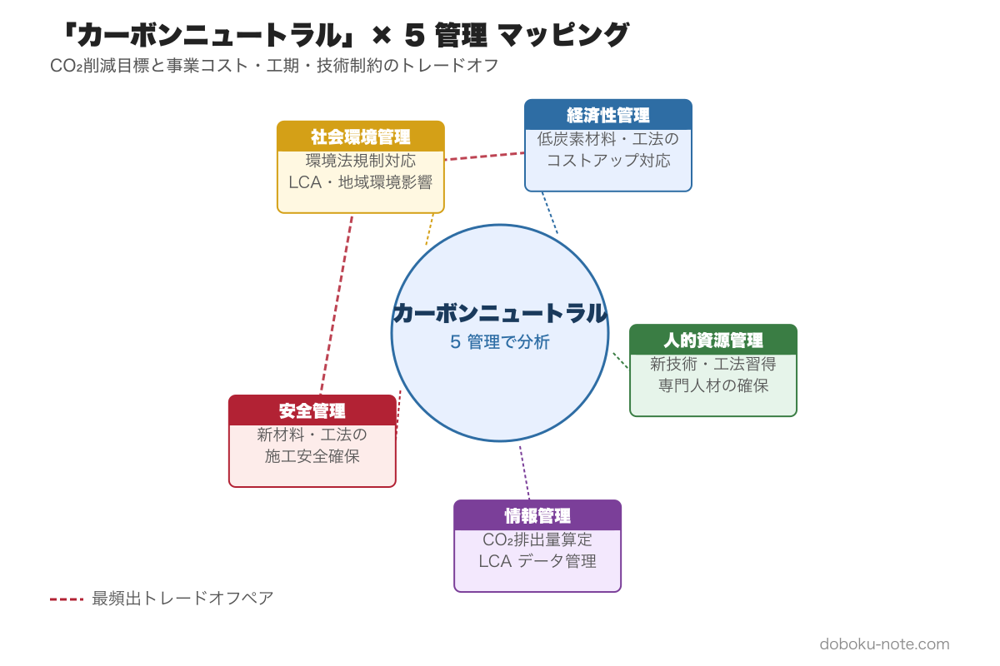
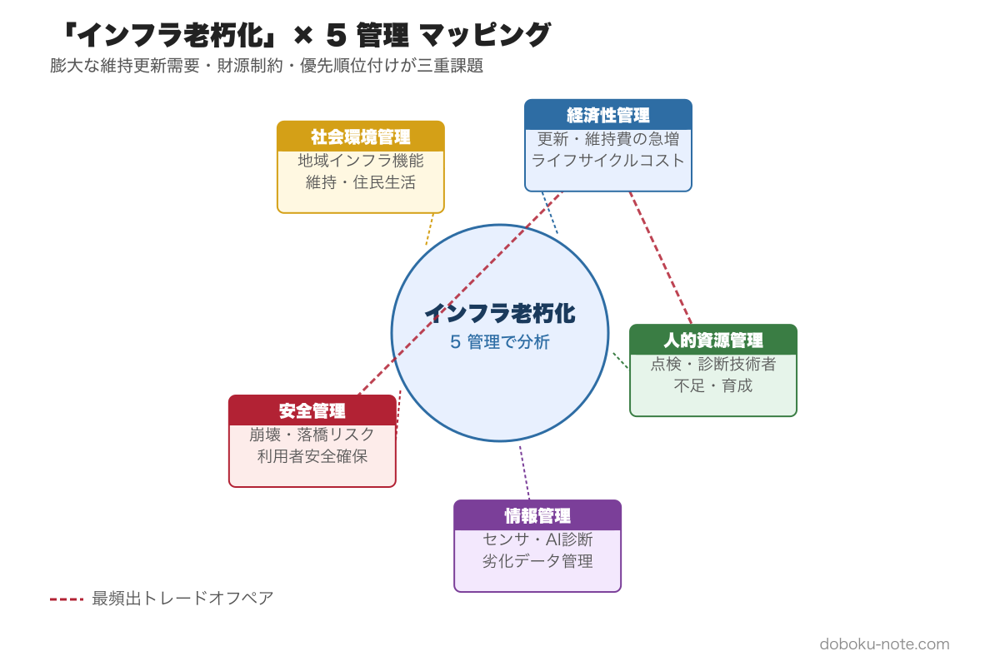
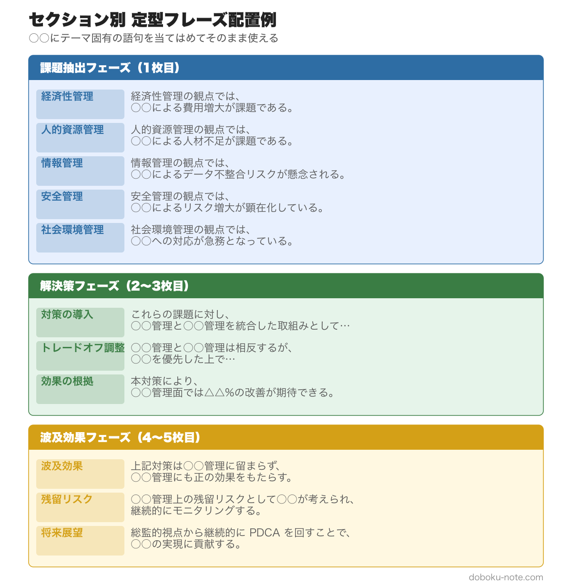

# 総監記述式 5枚構成 論文骨子テンプレート｜どんなテーマでも 5 管理を横串で書く完全フレームワーク

> **この記事でわかること**
> - 総監記述式で「テーマが変わっても同じ骨組みが使える」理由
> - 600字×5枚を「課題抽出・解決策・波及効果」の三層で埋める普遍テンプレート
> - 5 管理を横串で展開する 4 ステップとその定型フレーズ集
> - 少子高齢化 / DX / 働き方改革 / カーボンニュートラル / インフラ老朽化の 5 テーマ × 5 管理マッピング
> - 合格後に追加予定の「建設部門 × 専門別 業務事例集（Phase 2）」の予告

---

総監記述式の骨組みは、テーマが何であっても変わりません。出題テーマは毎年大きく振れますが、採点軸は常に「5 管理を横串で分析し、トレードオフを調整して全体最適を示す」という 1 点です。

本記事は、[記述式試験の解答戦略（三層構造と時間配分）](https://doboku-note.com/docs/pe-comprehensive-management-essay-exam-strategy) と [5 管理間トレードオフ 頻出パターン](https://doboku-note.com/docs/pe-comprehensive-management-management-tradeoffs) を接続し、**どんなテーマでも再現できる骨組み** を提供します。骨子と定型フレーズを習得すれば、初見テーマでも骨子作成が 30 分で完成するレベルまで持っていけます。

## 1. 総監記述式の本質 — テーマは変わってもフレームは変わらない

### 過去 17 年のテーマ推移

H21〜R07 の 17 年分を振り返ると、出題テーマは年ごとに大きく振れています。

- インフラ老朽化と維持管理の優先順位（H27、R06 等）
- 自然災害・気候変動への適応（R02、R04 等）
- 少子高齢化と技術者不足（H28、R03 等）
- DX・情報技術の導入（R05、R07 等）
- 働き方改革・多様な人材活用（R03、R05 等）
- カーボンニュートラル・環境負荷低減（R04、R06 等）

テーマは文脈依存で、受験者は試験当日まで何が出るか分かりません。しかし採点基準は変わりません。**「5 管理すべての視点から課題を抽出し、管理間トレードオフを特定して、統合的解決策を提示する」** ことが毎年一貫して問われます。

### なぜ「テーマ独立の骨組み」が最強か

テーマを絞って対策する（例:「安全管理系テーマ専用の骨組みを作る」）アプローチは、出題テーマが外れた瞬間に機能しません。これまで注力してきたテーマと異なる問いに直面したとき、新しい骨組みをゼロから構築する余力は試験本番にはありません。

一方、**5 管理を横串で展開する普遍フレーム** を習得しておけば、テーマが何であれ同じ手順で骨子を完成させられます。「テーマが変わる」のは起点の情報が変わるだけで、骨組みそのものは変わりません。

この「テーマ非依存の骨組み」を習得することが、本記事の唯一のゴールです。

## 2. 普遍テンプレート — 600字×5枚 三層構造

総監記述式の答案用紙は 600 字×5 枚（計 3,000 字）。この 5 枚を **三層構造（Ⅰ. 課題抽出 / Ⅱ. 解決策 / Ⅲ. 波及効果）** で割り当てると、書く前に全体像が見えます。

| 枚 | 三層 | 役割 | 書くべきコア |
|---|---|---|---|
| 1 枚目 | Ⅰ 課題抽出 | テーマ特定と前提整理 | テーマ・対象業務・総監観点の必要性 |
| 2 枚目 | Ⅰ 課題抽出 | 5 管理視点の課題抽出 | 5 管理別の課題 + トレードオフの宣言 |
| 3 枚目 | Ⅱ 解決策 | 重点管理の定量評価 | リスク定量化 + 優先順位根拠 |
| 4 枚目 | Ⅱ 解決策 | トレードオフ解決フレーム適用 | ALARP / LCA / HFACS 等の適用 |
| 5 枚目 | Ⅲ 波及効果 | 実行計画と残余リスク監視 | 時間軸計画 + PDCA 体制 |

### 三層構造の原則

**Ⅰ 課題抽出（1〜2 枚目）**: テーマを 5 管理に分解し、それぞれの課題を列挙する。最終行でトレードオフの構造を明示的に宣言する。「個別最適の積み上げでは解決しない」という認識を示す。

**Ⅱ 解決策（3〜4 枚目）**: 重点管理（テーマで決まる）の課題を定量評価したうえで、管理間トレードオフを解決するフレームを適用する。定量化根拠（リスクマトリクス・B/C 分析・LCA 等）が説得力の核となる。

**Ⅲ 波及効果（5 枚目）**: 解決策を実行した場合の時間軸（短期・中期・長期）と PDCA 体制を示す。「継続的調整プロセスそのものが総監の観点」であることを明示する。

この三層は、設問が何を聞いてきても同じ順序で展開できます。テーマが変わるのは「1〜2 枚目で拾う課題のラベル」だけです。

## 3. 5 管理を横串で書く 4 ステップ

三層構造を埋める手順を、4 つのステップに落とし込みます。試験前の練習でこの 4 ステップを繰り返すことで、本番での骨子作成が 30 分で完了するようになります。

### Step 1: テーマを 5 管理に分解する

前文を読んで「このテーマは 5 管理のうちどの管理が主役になるか」を即座に判断します。次に残り 4 管理への波及を書き出します。

- 主役管理（1〜2 個）: テーマと直接結びつく管理
- 脇役管理（3〜4 個）: 主役を強化または阻む方向に絡む管理

重み付けはテーマで変わりますが、5 管理すべてを書くことは変わりません。

### Step 2: 各管理での課題を抽出する

5 管理それぞれで「このテーマが生む課題は何か」を 1〜2 文で書き出します。2 枚目の素材になります。

課題は「現状 vs 理想のギャップ」で表現すると明確になります。例:「人的資源管理の観点では、熟練技術者の退職により現場判断能力の継承が遅延している（理想：技術伝承 3 年サイクル / 現状：後継者が未確定）」。

### Step 3: 管理間トレードオフを 2〜3 ペア特定する

Step 2 で書き出した課題間の対立を特定します。「A を改善すると B が悪化する」という対立構造を 2〜3 ペア選びます。

頻出ペアは [5 管理間トレードオフ 頻出パターン](https://doboku-note.com/docs/pe-comprehensive-management-management-tradeoffs) に詳述していますが、論文では全ペアを網羅する必要はなく、テーマに即した 2〜3 ペアを深掘りする方が評価されます。

### Step 4: 統合的解決策を提示する

トレードオフを解消する解決フレームを選び、具体的な調整メカニズムを記述します。解決フレームの選び方は 4 章の各テーママッピングを参照してください。

解決策は「個別最適の積み上げ」ではなく「管理間の調整プロセス」として書くことが、総監らしさの核心です。

## 4. 主要 5 テーマ × 5 管理 マッピング集

過去 17 年の出題を分析すると、大きく 5 つのテーマに分類できます。各テーマで「5 管理をどう論じるか」の論点・トレードオフ・重み付けを整理します。

### 4.1 少子高齢化

**出題傾向**: 過去 17 年で 5 回以上出題（H28、R03 等）。最近では「技術者不足」「現場の高齢化」「技術伝承」という形で記述式に登場。人的資源管理が主役。

**5 管理の論点**

- **人的資源管理（主役）**: 熟練技術者の大量退職と後継者不足。暗黙知の形式知化、OJT 体制の整備、多様な担い手（女性・外国人材）の受入が論点。
- **経済性管理**: 人材育成・採用コストの増大。省力化・自動化投資（BIM/CIM 等）と採用コストの B/C 比較。
- **情報管理**: 技術データの属人化と継承困難。データ標準化・ナレッジマネジメントシステム導入が解決策。
- **安全管理**: 若手・未経験者比率の上昇による安全水準の低下。OJT 体制の整備と安全ルール再設計。→ [安全管理ピラー](https://doboku-note.com/docs/pe-comprehensive-management-safety-management-pillar)
- **社会環境管理**: インフラ維持を担う人員不足が社会サービス水準に与える影響。国民への説明責任と合意形成。

**最頻出トレードオフペア**

1. 人的資源 × 経済性: 採用・育成コストの増大 vs 短期利益確保
2. 人的資源 × 安全: 熟練技術者不足による安全水準の低下 vs 即戦力確保の困難
3. 情報管理 × 人的資源: 知識の形式知化（時間・コスト）vs 業務継続

**重み付け推奨**: 人的資源管理を最も厚く（3 枚目の定量評価含む）、経済性管理・情報管理でトレードオフを展開。

### 4.2 DX・デジタル化

**出題傾向**: 過去 17 年で 4 回以上出題（R05、R07 等）。AI・IoT・BIM/CIM・生成 AI など技術語が変化しながら継続出題。情報管理が主役。

**5 管理の論点**

- **情報管理（主役）**: システム導入・データ標準化・セキュリティ対策。AI 活用による業務効率化と情報漏洩リスクのバランス。
- **経済性管理**: 初期投資コストと中長期の効率化便益の B/C 評価。ベンダーロックインリスク。
- **人的資源管理**: DX 人材不足とデジタルデバイド（ベテラン技術者の抵抗）。リスキリング・研修計画。→ [人的資源管理ピラー](https://doboku-note.com/docs/pe-comprehensive-management-human-resource-management-pillar)
- **安全管理**: ICT 機器・センサーの障害時フォールバック体制。サイバー攻撃への備え。
- **社会環境管理**: デジタル化で漏洩した個人情報・地理情報の社会的影響。プライバシー保護との両立。

**最頻出トレードオフペア**

1. 情報管理 × 経済性: システム投資コスト vs 導入効果の不確実性
2. 情報管理 × 安全: 自動化・AI 依存 vs フェイルセーフ体制の維持
3. 人的資源 × 情報管理: ベテランの暗黙知 vs データ化・システム化の限界

**重み付け推奨**: 情報管理を最も厚く、経済性管理でのB/C分析と人的資源管理でのリスキリング計画を組み合わせる。

### 4.3 働き方改革

**出題傾向**: 過去 17 年で 4 回以上出題（R03、R05 等）。2024 年問題（時間外労働規制）が直近の記述式に直結。人的資源管理が主役。

**5 管理の論点**

- **人的資源管理（主役）**: 時間外労働の削減と生産性維持の両立。多様な働き方（テレワーク・週休 2 日）の導入と現場管理の変革。→ [人的資源管理ピラー](https://doboku-note.com/docs/pe-comprehensive-management-human-resource-management-pillar)
- **経済性管理**: 人員増加・自動化投資による固定費上昇。工程短縮 vs コスト増のトレードオフ。
- **情報管理**: 遠隔管理・電子申請・ICT 施工の導入で移動・書類コストを削減。
- **安全管理**: 疲労蓄積の解消による安全水準の向上 vs 工期逼迫による無理な施工。
- **社会環境管理**: 工期延長が及ぼす社会インフラ整備への影響。工事騒音・振動の発生時間帯調整。

**最頻出トレードオフペア**

1. 人的資源 × 経済性: 時間外削減（人件費・生産量）vs 工期・コストの増大
2. 安全管理 × 経済性: 疲労解消による安全向上 vs 工程短縮プレッシャー
3. 人的資源 × 情報管理: テレワーク・ICT 施工の導入コスト・習熟コスト vs 効率化便益

**重み付け推奨**: 人的資源管理を厚く（OJT・週休 2 日導入の段階計画）、情報管理でDX解決策を組み合わせる。

### 4.4 カーボンニュートラル

**出題傾向**: 過去 17 年で 3〜4 回出題（R04、R06 等）。2050 年カーボンニュートラル目標と建設業の関係（資材・施工・維持管理）が論点。社会環境管理が主役。

**5 管理の論点**

- **社会環境管理（主役）**: LCA（ライフサイクルアセスメント）による CO2 排出量の定量評価。外部不経済（炭素コスト）の内部化。→ [社会環境管理ピラー](https://doboku-note.com/docs/pe-comprehensive-management-social-environment-management-pillar)
- **経済性管理**: 低炭素材料・再生可能エネルギー導入の初期コスト vs 長期便益（CO2 削減・炭素クレジット）。
- **情報管理**: CO2 排出量のデータ収集・可視化・報告（ESG 情報開示）。データ標準化の課題。
- **人的資源管理**: カーボンニュートラル対応の知識・スキルを持つ技術者の育成。専門人材不足。
- **安全管理**: 新材料・新工法の施工時リスク（水素・アンモニア等の危険物取扱）。

**最頻出トレードオフペア**

1. 社会環境 × 経済性: 低炭素化投資コスト vs 短期コスト削減の両立
2. 社会環境 × 安全管理: 環境負荷低減のための新技術 vs 新技術導入時の安全リスク
3. 情報管理 × 経済性: 排出量データの収集・開示コスト vs 開示義務化への対応必要性

**重み付け推奨**: 社会環境管理を最も厚く（LCA 定量評価を 3 枚目で展開）、経済性管理でのB/C分析と組み合わせる。

### 4.5 インフラ老朽化

**出題傾向**: 過去 17 年で最頻出テーマ（H27、R04、R06 等）。維持管理・更新の優先順位づけが核心。安全管理と経済性管理の両方が主役級。

**5 管理の論点**

- **安全管理（主役）**: 老朽化による構造物の崩落・劣化リスク。点検・診断・補修の優先順位づけ。ALARP 原則の適用。→ [安全管理ピラー](https://doboku-note.com/docs/pe-comprehensive-management-safety-management-pillar)
- **経済性管理（主役）**: 膨大な老朽化ストックに対し限られた予算をどう配分するか。予防保全 vs 事後保全のライフサイクルコスト比較。
- **情報管理**: 点検データの標準化・デジタル化（台帳管理・AI 点検）。属人化された診断知識の継承。→ [情報管理ピラー](https://doboku-note.com/docs/pe-comprehensive-management-information-management-pillar)
- **人的資源管理**: 点検・診断の熟練技術者不足。ドローン・AI 点検による省力化とその限界。
- **社会環境管理**: 劣化したインフラが地域住民・物流に与える影響。通行止め・迂回の社会的費用。

**最頻出トレードオフペア**

1. 安全管理 × 経済性: 安全最優先の全面更新 vs 予算制約下での優先順位づけ
2. 安全管理 × 社会環境: 早期通行止め（安全確保）vs 社会サービス継続（住民・物流への影響）
3. 経済性 × 情報管理: データ収集・AI 活用の初期コスト vs 長期の維持管理効率化

**重み付け推奨**: 安全管理と経済性管理の両方を厚く扱い、3 枚目ではリスクマトリクスによる優先順位づけを中心に据える。

## 5. 定型フレーズ集（テーマ非依存）

以下のフレーズは○○の部分をテーマ・管理・数値に差し替えることで、どのテーマでも使えます。

### 1 枚目：テーマ特定と前提条件の整理

- 本問のテーマは○○であり、○○・○○という設定条件のもとで、総合技術監理の観点から分析と提言が求められている。
- 私が担当した○○（事業規模：○億円、期間：○年、関係者：○○）を題材として、以下に論じる。
- 本業務では○○管理が優先度の高い管理目標となるが、○○管理・○○管理とのトレードオフが不可避であり、全体最適解の導出が論点となる。

### 2 枚目：5 管理視点の課題抽出

- ○○管理の観点では、○○に起因する○○という課題がある。理想状態は○○だが、現状は○○という乖離がある。
- ○○管理の観点では、○○が制約となり、○○という問題が生じる。
- これらの課題は相互に独立ではなく、特に○○×○○の 2 軸で顕著なトレードオフを構成する。個別最適の積み上げでは解決せず、統合的調整が必要である。

### 3 枚目：重点管理の定量評価

- 本リスクは発生確率○○／年、被害想定○○億円であり、期待損失（PML）は年○○百万円と試算される。
- リスクマトリクス上では「影響度○○／発生確率○○」の象限に位置し、○○対策と○○対策の併用が合理的である。
- ライフサイクルコスト（LCC）の観点では、予防保全を採用した場合の 30 年コストは○○億円、事後保全では○○億円であり、前者が○○億円有利である。
- なお、○○の水準を完全にゼロにすることは現実的でなく、残余リスクの継続監視体制を併せて設計する必要がある。

### 4 枚目：トレードオフ解決フレーム適用

- ○○×○○のトレードオフに対しては、○○原則を適用する。○○を判断閾値として段階的対応を行う。
- ○○との衝突に対しては○○階層を適用し、まず○○を 2 案検討したうえで、回避不能な場合に○○・○○・○○の順で対策を積み上げる。
- いずれのフレームも単独では十分でなく、定量評価（3 枚目）と合意形成プロセスを併走させて初めて機能する。

### 5 枚目：実行計画と残余リスク監視

- 短期（1 年以内）では○○の緊急対策を実施し、中期（3 年）で○○の体系的整備、長期（5〜10 年）で○○の抜本更新を計画する。
- 実施にあたっては PDCA サイクルを年次で回し、KPI として○○指標・○○指標の 2 軸で進捗を測定する。
- 残余リスクについては、モニタリング体制（点検頻度・閾値・報告ルート）を事前に設計し、閾値超過時の意思決定権者と対応手順を文書化する。
- 以上の実行計画により、○○と○○との調和を保ちつつ、全体最適を継続的に確保する。総合技術監理の観点はこの継続的調整プロセスそのものに宿る。

## 6. テンプレの使い方

> **学習フェーズ別の練習方法**
>
> 1. 本テンプレを印刷またはノートに転記し、5 枚分の見出しを先に書く
> 2. 4 章のテーママッピングを見ながら、過去問 1 題の骨子を 15 分で埋める練習を週 2 回繰り返す
> 3. 骨子が安定したら、4 ステップと定型フレーズを自分の業務経歴に合わせてカスタマイズする
> 4. 3 題分の骨子が溜まったら、1 題を選んで 3,000 字フル執筆し、時間配分を検証する

### テーマ別の重点管理の決め方

前文を読んで「主役管理」を特定するコツは、設問冒頭のキーワードです。

- 「少子高齢化」「技術者不足」「技術伝承」→ 人的資源管理が主役
- 「AI」「DX」「情報システム」「デジタル」→ 情報管理が主役
- 「働き方改革」「残業規制」「多様な働き方」→ 人的資源管理が主役
- 「カーボンニュートラル」「CO2」「環境負荷」→ 社会環境管理が主役
- 「老朽化」「維持管理」「点検」「更新」→ 安全管理と経済性管理が主役

主役管理を特定したら、3 枚目の定量評価を「その管理に適した指標」で構成します。残り 4 管理はトレードオフの構造として 2・4 枚目に展開します。

### 繰り返すと何が起きるか

最初の 1〜2 回は、骨子を埋めるのに 60〜90 分かかります。しかし 5 回繰り返すと、テーマを見た瞬間に「主役管理はこれ、トレードオフはこの 2 ペア」という判断が瞬時にできるようになります。

骨子さえ完成していれば、あとは定型フレーズの○○部分を自分の業務事例に差し替えるだけです。この状態になれば、本番での骨子作成は 30 分以内で完了します。

## 7. Phase 2 予告

本テンプレは「テーマ × 5 管理 × 普遍フレーム」の組み合わせを提供するものです。ただし、実際の答案では「普遍フレームを自分の業務事例でどう肉付けするか」が評価の分かれ目になります。

**Phase 2 では「建設部門 × 専門別（道路・河川・コンクリート・トンネル等）の業務事例集」を別商品として展開する予定です**（運営者の総監合格を踏まえて順次リリース）。

この Phase 2 事例集 + 本テンプレの組み合わせにより、「自分の業務スペックをどの箇所に当てはめるか」まで具体化できるようになります。専門分野別の肉付け方法は、汎用テンプレだけでは補いきれない部分です。

リリース完成までの間は、4 章のテーママッピングを参考に、自分の業務経験から最も近い事例をあてはめる練習を重ねてください。[キーワード集 2026 全項目（doboku-note）](https://doboku-note.com/docs/pe-comprehensive-management-keyword-2026) でテーマ別キーワードを確認しながら骨子を肉付けすると、専門用語の適切な使い方も身につきます。

---

## 関連リソース

**doboku-note — 17 年分の過去問 + 650 キーワード解説（無料）**
https://doboku-note.com/category/pe-comprehensive-management

- 17 年分の論文過去問（骨子分析付き）
- 650 以上のキーワード解説ページ（ALARP・HFACS・LCA 等）
- スマホ対応（通勤中の学習に最適）

**note のおすすめ続編**
- 総監の合否を分ける「トレードオフ思考」完全ガイド（B-2） ¥1,200 — 5 管理 × 10 ペアのマトリクスで記述式を攻略
- 総監記述式 解答全文再現 R07（A-2 として Phase 2 で投入予定）

**著者プロフィール**
土木技術者として 1 級土木施工管理技士・建設部門の技術士に合格後、2026 年に総合技術監理部門に挑戦。学習過程で蓄積した 700 キーワードの解説と 17 年分の過去問分析を doboku-note にて無料公開しています。
