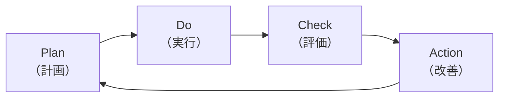
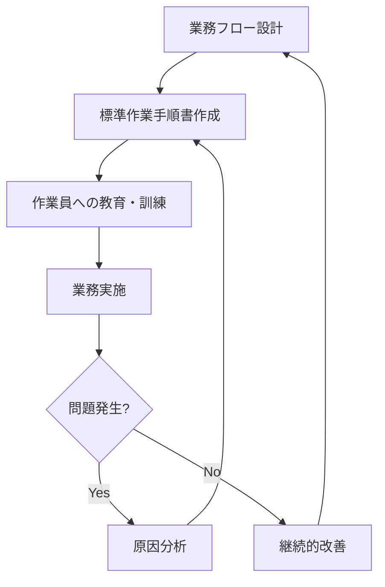
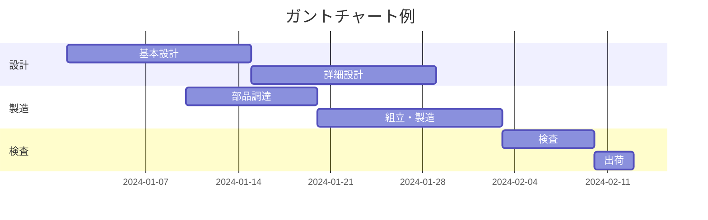
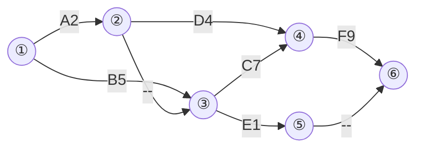

# 第1章 経済性管理

経済性は、技術士にとって欠かせない判断基準となりますので、経済性管理は重要な知識分野である点は間違いありません。経済性管理で扱う内容はとても広いですが、この章では、事業企画、品質管理、工程管理、原価管理、財務会計、設備管理、計画・管理の数理的手法に分けて説明を行います。

---

## 1. 事業企画

事業企画は、具体的な事業のアイデアを発掘し、事業計画を練り上げる業務をいいますが、そのために用いられる手法として次のものがあります。

### (1) フィージビリティスタディ

**フィージビリティスタディ**は、事業やプロジェクトの実現可能性がどの程度の確かさかを事前に調査する業務ですが、フィージビリティスタディで実施する調査の内容には次のようなものがあります。

1. 事業の目的に沿って事業規模などの事業のフレームを具体化する
2. **市場調査**を行い、事業化した場合における需要予測をする
3. 予備的な設計によって、事業に要する概略の期間やコストを予測する
4. 事業の収支や資金の調達方法を検討する

販売の機会損失をなくし、不良在庫が発生しないようにするために予測が適切に行われなければなりません。需要予測のモデルとして、次のような統計的な予測方法があります。

#### (a) 移動平均法

**移動平均法**は、指定された過去の期間の需要実績データを平均することによって需要を予測する手法です。移動平均法では、期間を1単位ずつずらして均値を計算していきます。例えば、「4月〜6月」、「5月〜7月」などの期間の均値をそれぞれ計算します。移動平均法で移動平均を計算する期間を短くすると、需要変動が小さくなるため、季節変動などの需要差が見えにくくなります。逆に、移動平均を計算する期間を長くすると、需要変動の動きが外れるため、直近の変化をとらえるのが遅くなりますので、需要の変化を追う結果になります。

#### (b) 指数平滑法

**指数平滑法**は、需要予測を行うのに、前期の実績値と前期の予測値に基づけて次期の予測をする方法です。これを式で表すと次のようになります。なお、αは平滑化係数（0≦α≦1）といいます。

```
ある期間の需要 = α×前期実績値 + (1−α)前期予測値
              = 前期予測値 + α(前期実績値 − 前期予測値)
```

この式を見るとわかるとおり、αを1に近づけると前期の実績値重視の予測になります。

フィージビリティの結果は、事業化の意思決定をする人や組織、資金を提供する組織において重要な判断材料となります。

### (2) 事業投資計画

企業が投資を行う場合には、**事業投資計画**を策定し、その事業の事業投資額などを決定する必要があります。しかし、投資を行う時期と回収を行う時期には時間差がありますので、それぞれの貨幣価値が違います。具体的には、今日の支払い額は明日の支払い額よりも価値が高いという考え方になります。その考えをベースにして、将来のキャッシュ・フローを現在の価値に換算する手法が現在価値法になります。**現在価値（PV：Present Value）**の計算は次の式を用いて行います。

$$PV = \frac{M_t}{(1+r)^t}$$

- $M_t$：今からt年後の支払い額
- $r$：年間利率（**割引率**）

#### (a) 正味現在価値法〔NPV（Net Present Value）法〕

**正味現在価値法**は、投資費用と将来獲得できる現金流入額を比較して、その差額である正味現在価値（V）がプラスであれば、投資を行うと判断する手法です。初期投資額をI、利子率をr、現金が流入すると期待できる期間をn年、t年後の正味現金流入額をCt とすると、正味現在価値（V）は次の式で表されます。

$$V = \frac{C_1}{1+r} + \frac{C_2}{(1+r)^2} + \frac{C_3}{(1+r)^3} + \cdots + \frac{C_n}{(1+r)^n} - I$$

#### (b) 回収期間法

**回収期間法**とは、毎年の正味現金流入額によって、投資額が何年で回収できるかを計算する手法で、年間の回収金額が決定できれば、簡単に計算できます。結果は回収年数で出ますので、その年数が短いほど投資効果が高いと判断します。この場合にも、金利（r）を考慮して、n年後の元利合計（S）を計算する必要があります。元利合計（S）を、現在の資金額（I）と均等資金年額（M）を使った式で表すと次のようになります。

$$S = I(1+r)^n = M + M(1+r) + M(1+r)^2 + \cdots + M(1+r)^{n-1}$$

この式から、均等資金年額（M）を求める式は、次のようになります。

$$M = I \frac{r(1+r)^n}{(1+r)^n - 1}$$

#### (c) 投資利益率法（ROI：Return on Investment）

**投資利益率法**とは、投資によって得られる利益額が投下した資本に対してどれだけの率になっているかを見るもので、下記の式で表せます。

$$投資利益率(ROI) = \frac{利益額}{投資額} \times 100 [\%]$$

複数年の利益を考える場合には、平均利益額を計算して利益として扱います。

$$平均利益額 = \frac{1年目の利益額 + \cdots + n年目の利益額}{n}$$

投資利益率 ＞ 平均借入率　となれば、採算性のある投資であるといえます。

### (3) 事業評価

**事業評価**とは、個別事業等を対象にして、費用に見合った効果が得られるのかどうかなどを、事前に評価するものです。必要に応じて、事業実施中や終了時などに検証を行う場合もあります。

#### (a) 費用便益分析

**費用便益分析**は、公共政策の効果を貨幣額で表示し、それを投入した費用と比較して評価する分析手法で、直接的効果（内部経済効果）を対象とします。

#### (b) 費用効用分析

効用とは、満足の度合いを数量的に表したもので、効用関数は効用を置き換える数学モデルですが、**費用効用分析**は、主観的な満足の度合いを指標にしますので、すべての対象で貨幣価値などに換算できるわけではありません。

#### (c) アウトプット指標

**アウトプット指標**とは、行政活動の成果を評価する指標で、具体的な活動を実際にどの程度行ったかを示す指標のことです。具体的には、道路延長距離や討論会の開催回数などの数値で表します。

#### (d) アウトカム指標

**アウトカム指標**は、成果物によってどれだけ成果が上がったかを示す指標で、具体的には、渋滞がどの程度緩和されたかなどで示します。対象については、貨幣価値や数値だけではなく、効率などの指標でも表します。

#### (e) インプット指標

**インプット指標**は、投入するヒト、モノ、金、情報などの資源量を表す指標で、主に予算額が用いられます。

### (4) 設計管理

設計管理にはさまざまな手法が用いられますので、そういった用語を次に示します。

1. **信頼性設計**  
   信頼性設計とは、与えられた条件下で、規定の期間中、必要とされる機能を満たすようにすることを目的とした設計をいいます。

2. **保全性設計**  
   保全性設計とは、故障や異常を素早く検出・診断して、短時間で修復できるよう顧慮した設計をいいます。

3. **コンカレントエンジニアリング**  
   コンカレントエンジニアリングとは、下流の業務担当者（詳細設計などの実施部隊）を基本設計段階からチームに参画させて、工期の短縮を図る手法をいいます。

4. **デザインレビュー**  
   デザインレビューとは、製品の生産から廃棄に至るまでのライフサイクルの設計計画のアウトプットと導出プロセスに対して、品質特性の観点から、妥当性や問題点の抽出を行う組織的な審査をいいます。

5. **デザインイン**  
   デザインインとは、メーカーが取引先の部品メーカーなどと製品の開発段階から共同して開発していく手法をいいます。

6. **フロントローディング**  
   フロントローディングとは、初期の工程のうちに、後工程で発生しそうな問題の検討や改善に前倒しで集中的に取り組み、品質の向上や工期の短縮を図る手法をいいます。

### (5) マーケティングにおける指標

マーケティングやビジネスにおいては、さまざまな指標が使われています。

#### ① 重要目標達成指標（KGI）

**重要目標達成指標（KGI：Key Goal Indicator）**は、企業などが最終的に目指すゴールについて、達成度合いを定量的に測る指標です。具体的には、事業として「売上20%アップ」などの指標を設定して、その達成度を測るなどに用います。

#### ② 重要業績評価指標（KPI）

**重要業績評価指標（KPI：Key Performance Indicator）**は、上記に示したKGIが最終的なゴールを表すのに対して、中間ゴールや最終的な目標を小さな指標に分解して、目指す指標をいいます。具体的には、部署や担当者別に訪問率や売上アップ率、購買単価低減率などの目標を設定し、最終的に望む成果の達成を目指すための指標などになります。

#### ③ 重要成功要因（KSF）

**重要成功要因（KSF：Key Success Factor）**は、上記のKGIやKPIが数値化して測れるような指標であるのに対して、事業を成功させるために必要な要因を言語化したものです。KSFを洗い出す際には、最終的に目指すゴールであるKGIを決めることから始めます。具体的には、売上アップ○%の達成に何をすべきか検討して、「新規顧客獲得のスピードアップを図る」というようなKSFを設定するなど、数値目標を達成するために必要な要因を識別します。

### (6) 民間資金等の活用による公共施設等の整備等の促進に関する法律（PFI法）

**PFI（Private Finance Initiative）**とは、公共施設等の建設、維持管理、運営等を民間の資金、経営能力および技術的能力を活用して行う手法です。PFI方式として、次のようなものがあります。

#### A BTO方式

**BTO方式**とは、民間事業者の資金で建設（Build）し、完成後に所有権を移転（Transfer）し、民間事業者が維持管理（Operate）する方式です。

#### B BOT方式

**BOT方式**は、民間事業者の資金で建設（Build）し、民間事業者が維持管理（Operate）し、事業終了後に所有権を移転（Transfer）する方式です。

#### C コンセッション方式

**コンセッション方式**は、施設の所有権を公共主体が有したまま、施設の運営権が民間事業者に設定される方式です。

PFI法の目的は、第1条に「民間の資金、経営能力及び技術的能力を活用した公共施設等の整備等の促進を図るための措置を講ずること等により、効率的かつ効果的に社会資本を整備するとともに、国民に対する低廉かつ良好なサービスの提供を確保し、もって国民経済の健全な発展に寄与すること。」と示されています。

対象とされる施設は公共施設等となっていますが、具体的には第2条に次のような施設が示されています。

1. 道路、鉄道、港湾、空港、河川、公園、水道、下水道、工業用水道その他の公共施設
2. 庁舎、宿舎その他の公用施設
3. 教育文化施設、スポーツ施設、集会施設、廃棄物処理施設、医療施設、社会福祉施設、更生保護施設、駐車場、地下街その他の公益的施設及び賃貸宅
4. 情報通信施設、熱供給施設、新エネルギー施設、リサイクル施設（廃棄物処理施設を除く。）、観光施設及び研究施設
5. 船舶、航空機その他の輸送施設及び人工衛星（これらの施設の運行に必要な施設を含む。）

また、VFMは、PFIにおいて、税金をどのようにすれば最も効果的に使えるかという概念であり、**VFM（Value For Money）**という考えに基づいています。PFI事業においてVFMは、一定のサービスに対してのLCCの評価を行い、その対比で判断します。

#### (a) リスク分担の概要

リスク分担とは、事業において発生するリスク（不確実な事象）を、公共と民間のどちらが担うかを決めることです。VFMにおいてPFIは、PPPという「官民連携」の1つのフォームとして認識されており、PFIの在り方について次のように整理することができます。

**リスクの種類**：

1. 設計・建設リスク
2. 需要リスク
3. 運営・維持管理リスク

#### (b) リスク分担の考え方

リスク分担の考え方として、リスクは一般的に最もよくコントロールできる主体がリスクを負担するという考え方があります。また、リスクのコントロールができない主体にリスクを押しつけることは、それに対応するためのコスト（リスクプレミアム）が無駄に大きくなるため、適切ではありません。

#### (c) リスク分担の検討

リスク分担の検討においては次のような順序で行います。

1. リスク一覧の作成
2. リスクの洗い出し・リスク発生の可能性の検討
3. 費用負担者の検討
4. 契約条項での対処

### (7) プロジェクトマネジメント

プロジェクトについていえば、PMI（Project Management Institute）という、アメリカのPMI（Project Management）という組織がプロジェクトマネジメントの国際的な標準化を行っており、PMBOK（Project Management Body of Knowledge）という、プロジェクトマネジメントの標準的な知識体系をまとめたものがあります。PMBOKでは、プロジェクトマネジメントを7つの原則で定義しており、プロジェクトに必要な8つのパフォーマンスドメイン（知識エリア）が定義されています。

PMBOKが定義する**8つのパフォーマンスドメイン**：

1. ステークホルダー
2. チーム
3. 開発アプローチとライフサイクル
4. 計画
5. プロジェクト作業
6. 不確かさ
7. デリバリー
8. 測定

プロジェクトマネジメントにおいては、PMBOKを採用して「プロジェクト全体像」の中での目的日程の明確化を行い、目的を設定することが重要です。また、プロジェクトマネジメントにおいて「目標」と「目的」の区別を理解することが重要です。

プロジェクトマネジメントでは、プロジェクトのスコープを定義するために使われる**WBS（Work Breakdown Structure）**「図解図」を用います。WBSは、プロジェクトに必要な作業を管理可能な単位まで分割したものです。

---

## 2. 品質管理

**品質管理（動態）**（英語）は、概念（英語）、品質管理、目標管理、原価管理などすべての管理分野に共通して用いられており、そのことが品質管理をすることによってプロジェクトのスコープを達成できるかどうかに大きく関わります。

### (1) 品質管理手法・品質管理手順

**品質管理手順**は、プロジェクト目標を達成するために日々の業務の品質管理を実施することであり、そのために取り組むQCチームとして組織されます。品質管理の目標として、QCが参加して品質管理を進めていく中に、品質管理スタッフは次の活動を行います。

#### (a) QCとQC活動

プロジェクトQC活動では、QC活動として取り組むのに、プロジェクトマネージャーとして品質管理の方針を決定し、QC活動を推進します。また、品質管理の施策として具体的な改善活動を計画し、実施することが求められます。

### (2) 目程管理

**目程管理**は、プロジェクトの目的達成のために日程、コスト、品質を管理することです。目程管理の手法としては以下のものがあります。

**目程管理手法**：

1. バーチャート（ガントチャート）  
   バーチャートとは、各作業の日程を横棒で表し、それを日程に沿って並べた図で、日程計画と実績を同時に確認することができます。

2. マイルストーン  
   マイルストーンとは、プロジェクトの目標達成に向けた重要な節目となる地点や目標を指し、それを日程計画と実績で確認することができます。

### (3) 品質管理

**品質管理**は、プロジェクト目標を達成するために、JIS Z 8141で「顧客が要求する品質の製品・サービスを経済的に作り出すための手段の体系」と定義されています。品質管理はプロジェクトのスコープを達成し、プロジェクト目標を達成するために取り組むQCチームとして組織されます。

#### QC7つの道具

1. **パレート図** — 不良品の発生原因を多い順に並べた棒グラフと、それの累積比率を折れ線グラフで表した図で、重要な問題を明確にするために利用します。

2. **特性要因図（魚の骨図）** — 品質問題の特性（結果）に対する要因（原因）を体系的に整理した図で、品質問題の原因分析に使用します。

3. **ヒストグラム** — 横軸に測定値の区間、縦軸に度数（頻度）をとった棒グラフで、データの分布状況や中心、ばらつきを把握します。

4. **管理図** — データの時系列変化を折れ線グラフで表し、管理限界線を設けて異常を検知する図です。

5. **散布図** — 2つのデータの相関関係を点の分布で表した図です。

6. **チェックシート** — 事前に確認項目を列挙した記録票で、漏れなく確認するために使用します。

7. **層別** — データをある特性によって分類・整理することです。

#### フロー管理図（管理図）

正規分布において、平均 μ、標準偏差 σ に対して：

- μ±1σ の範囲に全体の **68.3%** が含まれる
- μ±2σ の範囲に全体の **95.4%** が含まれる
- μ±3σ の範囲に全体の **99.7%** が含まれる

```svg
<svg width="400" height="220" xmlns="http://www.w3.org/2000/svg">
  <rect width="400" height="220" fill="white" stroke="#ccc"/>
  <text x="200" y="18" text-anchor="middle" font-size="13" font-weight="bold">正規分布図</text>
  <!-- Axes -->
  <line x1="40" y1="180" x2="370" y2="180" stroke="black" stroke-width="1.5"/>
  <line x1="205" y1="25" x2="205" y2="180" stroke="black" stroke-width="1" stroke-dasharray="4,3"/>
  <!-- Normal curve approximation using polyline -->
  <polyline points="40,178 70,175 100,162 130,135 160,98 180,70 200,42 205,30 210,42 230,70 250,98 280,135 310,162 340,175 370,178"
    fill="none" stroke="#2255aa" stroke-width="2.5"/>
  <!-- ±1σ shading -->
  <rect x="160" y="70" width="90" height="110" fill="#aaccff" opacity="0.4"/>
  <!-- ±2σ shading -->
  <rect x="120" y="98" width="170" height="82" fill="#aaccff" opacity="0.2"/>
  <!-- ±3σ shading -->
  <rect x="80" y="135" width="250" height="45" fill="#aaccff" opacity="0.1"/>
  <!-- Labels -->
  <text x="205" y="195" text-anchor="middle" font-size="11">μ</text>
  <text x="160" y="195" text-anchor="middle" font-size="11">-σ</text>
  <text x="250" y="195" text-anchor="middle" font-size="11">+σ</text>
  <text x="120" y="195" text-anchor="middle" font-size="11">-2σ</text>
  <text x="290" y="195" text-anchor="middle" font-size="11">+2σ</text>
  <text x="80" y="195" text-anchor="middle" font-size="11">-3σ</text>
  <text x="330" y="195" text-anchor="middle" font-size="11">+3σ</text>
  <!-- Percentage labels -->
  <text x="205" y="115" text-anchor="middle" font-size="10" fill="#003399">68.3%</text>
  <text x="205" y="148" text-anchor="middle" font-size="10" fill="#0055aa">95.4%</text>
  <text x="205" y="168" text-anchor="middle" font-size="10" fill="#0077cc">99.7%</text>
</svg>
```

### (4) 品質管理

**ISO 9000**シリーズは、品質マネジメントシステムの国際規格であり、その中にはISO 9001シリーズがあります。ISO 9000シリーズには、品質管理システムの基準、品質管理の推進方法、品質マネジメントのツールなどが定義されています。

#### PDCAサイクル

**PDCAサイクル**とは、プロジェクト管理において、プロジェクト目標を達成するための品質管理の手法の一つであり、Plan（計画）→ Do（実行）→ Check（評価）→ Action（改善）の4段階を繰り返すサイクルです。



ISO 9001：2015では、プロセスのアプローチとともに、PDCAサイクルの概念とリスクに基づく考え方が取り入れられています。

### (5) 品質改善

**品質改善**は、品質管理において、品質管理の施策として品質の改善を図ることであり、品質問題の解決に向けた取り組みです。

### (6) 顧客要望管理

**顧客要望管理**は、顧客の要求事項を収集・分析し、それをプロジェクトの目標に反映させる活動です。顧客の要求事項を満たすために、次のような活動が求められます。

- 品質基準の設定
- プロセスの改善
- 製品やサービスの評価・改善

### (7) 顧客満足（CS）

**顧客満足（CS：Customer Satisfaction）**は、顧客の要求事項に対して製品やサービスがどれだけ満足しているかを評価する指標です。

1. 顧客情報
2. 顧客満足度の評価
3. 顧客フィードバックの収集

---

## 3. 工程管理

**工程管理**は、製品の生産プロセスを管理することであり、工程管理の目標として、品質（Quality）、コスト（Cost）、納期（Delivery）、安全（Safety）、生産性（Productivity）、環境（Environment）の観点から管理することが求められます。工程管理の指標としては、POQDSME などが使われます。

- P：生産性（Productivity）
- O：品質（Quality）
- Q：品質（Quality）
- D：納期（Delivery）
- S：安全（Safety）
- M：モラール（Morale）
- E：環境（Environment）

### (1) 標準時間・作業標準

**標準時間**は、正常な作業条件の下で一定の作業を行うために必要な時間であり、作業の能率を評価する基準となります。JIS Z 8141では、標準時間は次のように定義されています。

作業の標準時間 = 正味時間 × (1 + 余裕率)

**作業標準**は、作業の手順、方法、条件などを規定したものです。JIS Z 8141では、標準作業手順書として記述され、作業員が安全かつ効率的に作業を行うための指針となります。

### (2) 業務条例

**業務条例**は、業務の標準化を図るための規定であり、JIS Z 8141（生産管理用語）を活用して業務の標準化を推進します。



### (3) ERP・BOM・MRP

#### ERP（Enterprise Resource Planning）

**ERP（Enterprise Resource Planning）**には、生産管理、調達管理、販売管理、会計管理などの各業務システムを統合的に管理する情報システムです。ERPにより、各部門のデータをリアルタイムで共有することができます。

#### BOM（Bill of Material）

**BOM（Bill of Material）**は、製品を構成する部品の一覧表であり、製品の製造に必要な部品、数量、構造などを定義したものです。

#### MRP（Material Requirements Planning）

**MRP（Material Requirements Planning）**は、生産計画に基づいて、製品の生産に必要な部品や資材の調達計画を立てるシステムです。MRPは次の3つの情報を元に計算を行います。

1. **図表書（MPS：Master Product Schedule）**は、製品の生産計画を示す計画書であり、どの製品をいつ・どれだけ生産するかを示します。
2. 部品構成表（BOM）
3. 在庫情報

### (4) 手順書・管理図

**手順書**は、JIS Z 8141で、作業の手順、方法、条件などを規定したものと定義されています。

**管理図**は、JIS Z 8141で、生産プロセスの状態を把握するために使われる図であり、工程の安定性を確認するための統計的手法です。

### (5) 管理図

**管理図**は、JIS Z 8141で「規定された管理限界内に工程が管理されているかを確認するための図」と定義されており、次の3つの線で構成されます。

```svg
<svg width="420" height="200" xmlns="http://www.w3.org/2000/svg">
  <rect width="420" height="200" fill="white" stroke="#ccc"/>
  <text x="210" y="18" text-anchor="middle" font-size="13" font-weight="bold">管理図（管理限界線）</text>
  <!-- Axes -->
  <line x1="50" y1="160" x2="400" y2="160" stroke="black" stroke-width="1.5"/>
  <line x1="50" y1="20" x2="50" y2="165" stroke="black" stroke-width="1.5"/>
  <!-- UCL -->
  <line x1="50" y1="50" x2="400" y2="50" stroke="red" stroke-width="1.5" stroke-dasharray="6,3"/>
  <text x="405" y="54" font-size="11" fill="red">UCL</text>
  <!-- CL -->
  <line x1="50" y1="100" x2="400" y2="100" stroke="blue" stroke-width="1.5"/>
  <text x="405" y="104" font-size="11" fill="blue">CL</text>
  <!-- LCL -->
  <line x1="50" y1="148" x2="400" y2="148" stroke="red" stroke-width="1.5" stroke-dasharray="6,3"/>
  <text x="405" y="152" font-size="11" fill="red">LCL</text>
  <!-- Data points -->
  <polyline points="70,105 100,90 130,110 160,95 190,80 220,108 250,98 280,115 310,88 340,102 370,95"
    fill="none" stroke="#333" stroke-width="1.5"/>
  <circle cx="70" cy="105" r="3" fill="#333"/>
  <circle cx="100" cy="90" r="3" fill="#333"/>
  <circle cx="130" cy="110" r="3" fill="#333"/>
  <circle cx="160" cy="95" r="3" fill="#333"/>
  <circle cx="190" cy="80" r="3" fill="#333"/>
  <circle cx="220" cy="108" r="3" fill="#333"/>
  <circle cx="250" cy="98" r="3" fill="#333"/>
  <circle cx="280" cy="115" r="3" fill="#333"/>
  <circle cx="310" cy="88" r="3" fill="#333"/>
  <circle cx="340" cy="102" r="3" fill="#333"/>
  <circle cx="370" cy="95" r="3" fill="#333"/>
  <!-- Axis labels -->
  <text x="225" y="178" text-anchor="middle" font-size="11">サンプル番号</text>
  <text x="22" y="100" text-anchor="middle" font-size="11" transform="rotate(-90,22,100)">測定値</text>
</svg>
```

管理図の3つの線：
- **UCL（Upper Control Limit）**：上方管理限界
- **CL（Center Line）**：中心線（平均値）
- **LCL（Lower Control Limit）**：下方管理限界

### (6) 工程管理手法

#### (a) 順位配置（ガントチャート）

工程を管理するためのツールとして最もよく使われるものの一つです。



#### (b) ネットワーク図（アロー・ダイアグラム）

ネットワーク図は、プロジェクトの作業間の依存関係を示す図であり、作業の開始・終了時刻、クリティカルパスなどを把握するために使用します。

### (7) PERT

**PERT（Program Evaluation and Review Technique）**は、1950年代にアメリカで開発されたプロジェクトマネジメント手法であり、各作業の完了に必要な時間を確率的に評価し、プロジェクト全体の完了時間を見積もる手法です。

PERTでは、各作業の所要時間を3点見積りで設定します：

- **楽観時間（O）**：最も楽観的な場合の所要時間
- **最頻時間（M）**：最も可能性が高い場合の所要時間
- **悲観時間（P）**：最も悲観的な場合の所要時間

期待時間（te）の計算式：

$$t_e = \frac{P + 4M + O}{6}$$

PERT図を用いて、プロジェクトの作業を整理し、各作業のスケジュール管理を行います。

| 作業 | 所要期間（日） | 先行作業 |
|------|-------------|--------|
| A | 2 | なし |
| B | 5 | なし |
| C | 7 | A, B |
| D | 4 | A, B |
| E | 1 | なし |
| F | 9 | C |



### (8) CPM

**CPM（Critical Path Method）**は、1950年代に開発されたプロジェクトマネジメント手法であり、プロジェクトのネットワーク図から最長経路（クリティカルパス）を求め、プロジェクト全体の所要時間を見積もる手法です。

CPMでは、各作業について次の4つの時刻が管理されます：

- **最早開始時刻（EST）**：最も早く作業を開始できる時刻
- **最早終了時刻（EFT）**：最も早く作業を終了できる時刻
- **最遅開始時刻（LST）**：プロジェクト全体の遅延なしに最も遅く開始できる時刻
- **最遅終了時刻（LFT）**：プロジェクト全体の遅延なしに最も遅く終了できる時刻

**フロート（余裕時間）**は、作業を遅らせることができる最大時間であり、フロートがゼロの作業がクリティカルパス上の作業となります。

クリティカルパス上の作業はフロートがなく、1日でも遅れるとプロジェクト全体の遅延につながります。

```svg
<svg width="500" height="200" xmlns="http://www.w3.org/2000/svg">
  <rect width="500" height="200" fill="white" stroke="#ccc"/>
  <text x="250" y="18" text-anchor="middle" font-size="13" font-weight="bold">クリティカルパス（CPM例）</text>
  <!-- Nodes -->
  <circle cx="60" cy="100" r="20" fill="#eef" stroke="#336" stroke-width="2"/>
  <text x="60" y="105" text-anchor="middle" font-size="12" font-weight="bold">①</text>
  <circle cx="170" cy="60" r="20" fill="#eef" stroke="#336" stroke-width="2"/>
  <text x="170" y="65" text-anchor="middle" font-size="12" font-weight="bold">②</text>
  <circle cx="170" cy="140" r="20" fill="#eef" stroke="#336" stroke-width="2"/>
  <text x="170" y="145" text-anchor="middle" font-size="12" font-weight="bold">③</text>
  <circle cx="300" cy="100" r="20" fill="#eef" stroke="#336" stroke-width="2"/>
  <text x="300" y="105" text-anchor="middle" font-size="12" font-weight="bold">④</text>
  <circle cx="420" cy="100" r="20" fill="#fee" stroke="#c33" stroke-width="2.5"/>
  <text x="420" y="105" text-anchor="middle" font-size="12" font-weight="bold">⑤</text>
  <!-- Arrows -->
  <line x1="80" y1="92" x2="150" y2="68" stroke="#c33" stroke-width="2.5" marker-end="url(#arr)"/>
  <line x1="80" y1="108" x2="150" y2="132" stroke="#336" stroke-width="1.5" marker-end="url(#arr2)"/>
  <line x1="190" y1="60" x2="280" y2="90" stroke="#c33" stroke-width="2.5" marker-end="url(#arr)"/>
  <line x1="190" y1="140" x2="280" y2="110" stroke="#336" stroke-width="1.5" marker-end="url(#arr2)"/>
  <line x1="320" y1="100" x2="400" y2="100" stroke="#c33" stroke-width="2.5" marker-end="url(#arr)"/>
  <!-- Labels -->
  <text x="108" y="68" font-size="11" fill="#c33">A(3)</text>
  <text x="108" y="132" font-size="11" fill="#336">B(8)</text>
  <text x="228" y="68" font-size="11" fill="#c33">C(5)</text>
  <text x="228" y="132" font-size="11" fill="#336">D(4)</text>
  <text x="355" y="93" font-size="11" fill="#c33">F(9)</text>
  <!-- Arrow markers -->
  <defs>
    <marker id="arr" markerWidth="8" markerHeight="8" refX="6" refY="3" orient="auto">
      <path d="M0,0 L0,6 L8,3 z" fill="#c33"/>
    </marker>
    <marker id="arr2" markerWidth="8" markerHeight="8" refX="6" refY="3" orient="auto">
      <path d="M0,0 L0,6 L8,3 z" fill="#336"/>
    </marker>
  </defs>
  <text x="310" y="185" text-anchor="middle" font-size="11" fill="#c33">━━ クリティカルパス</text>
</svg>
```

### (9) 作業管理

**作業管理**は、JIS Z 8141で、製造工程における各作業の進捗を管理することと定義されています。作業管理は次のように分類されます。

#### (a) 稼動率

稼動率は、JIS Z 8141で「設備や作業者が実際に稼動している時間の割合」と定義されています。

$$稼動率 = \frac{稼動時間}{計画時間} \times 100 [\%]$$

#### (b) 流動数図

**流動数図**は、JIS Z 8141で、一定期間中の投入量と産出量の累積を図示したものです。流動数図を用いることで、工程内の仕掛品数量や工程の流れの状態を視覚的に確認することができます。

### (10) 在庫管理

**在庫管理**は、SS：適正在庫を維持しながら、製造や販売に必要な部品・製品を適切に管理することです。

1. 安全在庫
2. 発注点管理

**ECRS の原則**は、工程を改善する際の手順を表す指針：

1. **Eliminate（排除）**：なくすことができない工程かを確認する
2. **Combine（結合）**：他の工程と統合化を図る
3. **Rearrange（再配置）**：順序や場所を入れ替えることで効率化を図る
4. **Simplify（単純化）**：簡単な作業手順に変換する

### (11) 製造プロセス

製造プロセスの最適化には以下のような手法があります。

#### (a) バリューチェーン分析

バリューチェーン分析は、企業活動を一連の価値を生み出す活動として捉え、各活動における価値の連鎖を分析する手法です。バリューチェーン分析により、製品・サービスの提供に関わる各活動の強みや弱みを明確にし、競争優位の源泉を特定できます。

#### (b) バリューストリーム・マッピング

バリューストリーム・マッピングは、製品・サービスの流れを価値の観点から視覚化する手法で、リーン生産方式のツールとして活用されます。

---

## 4. 財務管理

**財務管理**は、企業の財務状況を管理し、財務目標を達成するための活動です。財務管理には、財務諸表の作成・分析、資金調達、投資計画、リスク管理などが含まれます。

### (1) 財務諸表

**財務諸表**は、企業の財務状況を示す書類の総称であり、次のようなものがあります。

1. 損益計算書（P/L）
2. 貸借対照表（B/S）
3. キャッシュフロー計算書（C/F）

#### 損益分岐点

**損益分岐点**は、売上高と費用が等しくなる点であり、利益がゼロになる売上高を示します。

```svg
<svg width="380" height="260" xmlns="http://www.w3.org/2000/svg">
  <rect width="380" height="260" fill="white" stroke="#ccc"/>
  <text x="190" y="20" text-anchor="middle" font-size="13" font-weight="bold">損益分岐点図</text>
  <!-- Axes -->
  <line x1="50" y1="220" x2="350" y2="220" stroke="black" stroke-width="1.5"/>
  <line x1="50" y1="20" x2="50" y2="225" stroke="black" stroke-width="1.5"/>
  <text x="355" y="224" font-size="11">売上高</text>
  <text x="10" y="130" font-size="11" transform="rotate(-90,20,130)">金額</text>
  <!-- Fixed cost line -->
  <line x1="50" y1="160" x2="340" y2="160" stroke="orange" stroke-width="1.5" stroke-dasharray="5,3"/>
  <text x="343" y="158" font-size="10" fill="orange">固定費</text>
  <!-- Total cost line -->
  <line x1="50" y1="160" x2="340" y2="80" stroke="blue" stroke-width="2"/>
  <text x="300" y="72" font-size="10" fill="blue">総費用</text>
  <!-- Revenue line -->
  <line x1="50" y1="220" x2="340" y2="60" stroke="green" stroke-width="2"/>
  <text x="300" y="52" font-size="10" fill="green">売上高</text>
  <!-- Breakeven point -->
  <circle cx="175" cy="138" r="5" fill="red"/>
  <text x="178" y="128" font-size="11" fill="red">損益分岐点</text>
  <!-- Vertical dashed at BEP -->
  <line x1="175" y1="138" x2="175" y2="220" stroke="red" stroke-width="1" stroke-dasharray="4,3"/>
  <text x="165" y="235" font-size="10" fill="red">BEP</text>
  <!-- Labels for profit/loss areas -->
  <text x="230" y="180" font-size="10" fill="green">利益</text>
  <text x="90" y="190" font-size="10" fill="red">損失</text>
</svg>
```

$$損益分岐点売上高 = \frac{固定費}{1 - 変動費率} = \frac{固定費}{限界利益率}$$

### (2) 貸借対照表（B/S）

**貸借対照表（B/S：Balance Sheet）**は、一定時点における企業の財政状態を示す財務諸表です。

```svg
<svg width="400" height="220" xmlns="http://www.w3.org/2000/svg">
  <rect width="400" height="220" fill="white" stroke="#ccc"/>
  <text x="200" y="18" text-anchor="middle" font-size="13" font-weight="bold">貸借対照表（B/S）の構造</text>
  <!-- Left side - Assets -->
  <rect x="20" y="30" width="170" height="50" fill="#ddf" stroke="#336" stroke-width="1.5"/>
  <text x="105" y="60" text-anchor="middle" font-size="12">①流動資産</text>
  <rect x="20" y="82" width="170" height="50" fill="#ddf" stroke="#336" stroke-width="1.5"/>
  <text x="105" y="112" text-anchor="middle" font-size="12">②固定資産</text>
  <rect x="20" y="134" width="170" height="40" fill="#ddf" stroke="#336" stroke-width="1.5"/>
  <text x="105" y="159" text-anchor="middle" font-size="12">③繰延資産</text>
  <text x="105" y="190" text-anchor="middle" font-size="12" font-weight="bold">資産の部</text>
  <!-- Right side - Liabilities & Equity -->
  <rect x="210" y="30" width="170" height="50" fill="#fdd" stroke="#633" stroke-width="1.5"/>
  <text x="295" y="60" text-anchor="middle" font-size="12">①流動負債</text>
  <rect x="210" y="82" width="170" height="30" fill="#fdd" stroke="#633" stroke-width="1.5"/>
  <text x="295" y="102" text-anchor="middle" font-size="12">②固定負債</text>
  <rect x="210" y="114" width="170" height="60" fill="#dfd" stroke="#363" stroke-width="1.5"/>
  <text x="295" y="149" text-anchor="middle" font-size="12">③純資産（自己資本）</text>
  <text x="295" y="190" text-anchor="middle" font-size="12" font-weight="bold">負債・純資産の部</text>
</svg>
```

貸借対照表の構成：

**（左側）資産の部**：
- ①流動資産
- ②固定資産
- ③繰延資産

**（右側）負債・純資産の部**：
- ①流動負債
- ②固定負債
- ③純資産（自己資本）

貸借対照表の主な関係式：
1. 資産合計 = 負債合計 + 純資産合計
2. 自己資本比率 = (純資産 ÷ 総資産) × 100（%）

### (3) 損益計算書（P/L）

**損益計算書（P/L：Profit and Loss statement）**は、一定期間における企業の経営成績（収益・費用・利益）を示す財務諸表です。

損益計算書の主な項目（図1.9参照）：

| 区分 | 項目 |
|------|------|
| 1年間の売上高 | 売上高 |
| 売上総利益 | 売上高 − 売上原価 |
| 営業利益 | 売上総利益 − 販売費及び一般管理費 |
| 経常利益 | 営業利益 ± 営業外損益 |
| 税引前当期純利益 | 経常利益 ± 特別損益 |
| 当期純利益 | 税引前当期純利益 − 法人税等 |

### (4) キャッシュフロー計算書（C/F）

**キャッシュフロー計算書（C/F：Cash Flow statement）**は、一定期間における企業の現金及び現金同等物の増減を示す財務諸表です。キャッシュフロー計算書の3つの区分：

- 営業キャッシュフロー（Operating C/F）
- 投資キャッシュフロー（Investing C/F）
- 財務キャッシュフロー（Financing C/F）

---

## 5. 財務分析

**財務分析**は、財務諸表を利用して、企業の財務状態や経営成績を評価・分析することです。

### (1) 財務指標

#### 流動比率

流動比率とは、企業の短期的な支払い能力を評価する指標です。

$$流動比率 = \frac{流動資産}{流動負債} \times 100 [\%]$$

### (2) 貸借比率

$$貸借比率 = \frac{借入金}{自己資本} \times 100 [\%]$$

### (3) 活動性指標

**棚卸資産回転率**：

$$棚卸資産回転率 = \frac{売上高}{棚卸資産平均}$$

### (4) 収益性指標

#### ABC（Activity Based Costing）

**ABC（Activity Based Costing：活動基準原価計算）**は、費用を活動（アクティビティ）に基づいて配賦する原価計算の手法です。

**バスタブカーブ（浴槽曲線）**は、製品のライフサイクルにおける故障率の変化を示す曲線です。

```svg
<svg width="420" height="200" xmlns="http://www.w3.org/2000/svg">
  <rect width="420" height="200" fill="white" stroke="#ccc"/>
  <text x="210" y="18" text-anchor="middle" font-size="13" font-weight="bold">バスタブカーブ（故障率曲線）</text>
  <!-- Axes -->
  <line x1="50" y1="160" x2="390" y2="160" stroke="black" stroke-width="1.5"/>
  <line x1="50" y1="25" x2="50" y2="165" stroke="black" stroke-width="1.5"/>
  <text x="395" y="164" font-size="11">時間</text>
  <text x="15" y="95" font-size="11" transform="rotate(-90,20,95)">故障率</text>
  <!-- Bathtub curve -->
  <path d="M50,60 C80,150 100,155 130,155 C190,155 220,155 260,155 C300,155 340,100 380,50"
    fill="none" stroke="#2255aa" stroke-width="2.5"/>
  <!-- Period labels -->
  <text x="90" y="178" text-anchor="middle" font-size="10">初期故障期</text>
  <text x="195" y="178" text-anchor="middle" font-size="10">偶発故障期</text>
  <text x="330" y="178" text-anchor="middle" font-size="10">摩耗故障期</text>
  <!-- Vertical dividers -->
  <line x1="140" y1="150" x2="140" y2="165" stroke="#888" stroke-width="1" stroke-dasharray="3,2"/>
  <line x1="275" y1="150" x2="275" y2="165" stroke="#888" stroke-width="1" stroke-dasharray="3,2"/>
</svg>
```

---

## 6. 計画・管理の数理的手法

### (1) 確率手法

確率論に基づく各種の手法が計画・管理に活用されます。代表的なものを以下に示します。

**確率分布の種類**（図表参照）：

| 分類 | 確率分布 | 使用例 |
|------|---------|--------|
| 離散型 | 二項分布 | 不良品数の分布 |
| 離散型 | ポアソン分布 | 単位時間当たりの事象発生数 |
| 連続型 | 正規分布 | 製品寸法のばらつき |
| 連続型 | 指数分布 | 機器の寿命分布 |

### (2) 確率手法

確率手法はリスク分析や意思決定に活用されます。

確率の基本法則：
- 加法定理：$P(A \cup B) = P(A) + P(B) - P(A \cap B)$
- 乗法定理（独立）：$P(A \cap B) = P(A) \times P(B)$
- 条件付き確率：$P(A|B) = \frac{P(A \cap B)}{P(B)}$

### (3) 階層化意思決定法（AHP）

**階層化意思決定法（AHP：Analytic Hierarchy Process）**は、問題の目標と評価基準、代替案を階層構造で整理し、各要素間の一対比較により重みを算出して最適案を選択する手法です。

AHPの手順：
1. 問題の階層構造を定義する（目標 → 評価基準 → 代替案）
2. 各レベルの要素間で一対比較を行う
3. 固有ベクトル法などで重みを計算する
4. 整合性（CI：Consistency Index）を確認する
5. 最終的に代替案の総合評価値を計算し、最適案を選択する

$W_{11} + W_{12} = 1$, $W_{21} + W_{22} = 1$ の条件の下、各代替案（$A_1$, $A_2$, $B_1$, $B_2$, $C_1$, $C_2$, $C_3$, $C_4$）の重みを求めます。

総合評価値（$S_a$）は以下の式で表されます：

$$S_a = W_1 W_{11} A_1 + W_1 W_{12} A_2 + W_{20} A_1 + W_{21} A_2 A_4$$

（AHP：階層化意思決定）

```svg
<svg width="500" height="300" xmlns="http://www.w3.org/2000/svg">
  <rect width="500" height="300" fill="white" stroke="#ccc"/>
  <text x="250" y="18" text-anchor="middle" font-size="13" font-weight="bold">図1.15 AHP 階層構造図</text>
  <!-- 最終目標 -->
  <rect x="195" y="28" width="110" height="32" rx="6" fill="#cce" stroke="#336" stroke-width="1.5"/>
  <text x="250" y="48" text-anchor="middle" font-size="12">最終目標</text>
  <!-- 評価基準 A,B,C -->
  <rect x="60" y="95" width="70" height="28" rx="4" fill="#ddf" stroke="#336"/>
  <text x="95" y="113" text-anchor="middle" font-size="11">A 基準</text>
  <rect x="215" y="95" width="70" height="28" rx="4" fill="#ddf" stroke="#336"/>
  <text x="250" y="113" text-anchor="middle" font-size="11">B 基準</text>
  <rect x="370" y="95" width="70" height="28" rx="4" fill="#ddf" stroke="#336"/>
  <text x="405" y="113" text-anchor="middle" font-size="11">C 基準</text>
  <!-- Lines from goal to criteria -->
  <line x1="250" y1="60" x2="95" y2="95" stroke="#336" stroke-width="1.2"/>
  <line x1="250" y1="60" x2="250" y2="95" stroke="#336" stroke-width="1.2"/>
  <line x1="250" y1="60" x2="405" y2="95" stroke="#336" stroke-width="1.2"/>
  <!-- Weights W1, W2, W3 -->
  <text x="155" y="82" font-size="10" fill="#006">W₁</text>
  <text x="245" y="82" font-size="10" fill="#006">W₂</text>
  <text x="322" y="82" font-size="10" fill="#006">W₃</text>
  <!-- Sub-criteria A1,A2 / B1,B2 / C1,C2,C3,C4 -->
  <rect x="35" y="160" width="45" height="25" rx="3" fill="#eef" stroke="#336"/>
  <text x="57" y="176" text-anchor="middle" font-size="10">A₁</text>
  <rect x="90" y="160" width="45" height="25" rx="3" fill="#eef" stroke="#336"/>
  <text x="112" y="176" text-anchor="middle" font-size="10">A₂</text>
  <rect x="190" y="160" width="45" height="25" rx="3" fill="#eef" stroke="#336"/>
  <text x="212" y="176" text-anchor="middle" font-size="10">B₁</text>
  <rect x="245" y="160" width="45" height="25" rx="3" fill="#eef" stroke="#336"/>
  <text x="267" y="176" text-anchor="middle" font-size="10">B₂</text>
  <rect x="320" y="160" width="38" height="25" rx="3" fill="#eef" stroke="#336"/>
  <text x="339" y="176" text-anchor="middle" font-size="10">C₁</text>
  <rect x="363" y="160" width="38" height="25" rx="3" fill="#eef" stroke="#336"/>
  <text x="382" y="176" text-anchor="middle" font-size="10">C₂</text>
  <rect x="406" y="160" width="38" height="25" rx="3" fill="#eef" stroke="#336"/>
  <text x="425" y="176" text-anchor="middle" font-size="10">C₃</text>
  <rect x="449" y="160" width="38" height="25" rx="3" fill="#eef" stroke="#336"/>
  <text x="468" y="176" text-anchor="middle" font-size="10">C₄</text>
  <!-- Lines criteria to sub -->
  <line x1="95" y1="123" x2="57" y2="160" stroke="#336" stroke-width="1"/>
  <line x1="95" y1="123" x2="112" y2="160" stroke="#336" stroke-width="1"/>
  <line x1="250" y1="123" x2="212" y2="160" stroke="#336" stroke-width="1"/>
  <line x1="250" y1="123" x2="267" y2="160" stroke="#336" stroke-width="1"/>
  <line x1="405" y1="123" x2="339" y2="160" stroke="#336" stroke-width="1"/>
  <line x1="405" y1="123" x2="382" y2="160" stroke="#336" stroke-width="1"/>
  <line x1="405" y1="123" x2="425" y2="160" stroke="#336" stroke-width="1"/>
  <line x1="405" y1="123" x2="468" y2="160" stroke="#336" stroke-width="1"/>
  <!-- W weights -->
  <text x="57" y="145" font-size="9" fill="#006">W₁₁</text>
  <text x="100" y="145" font-size="9" fill="#006">W₁₂</text>
  <text x="208" y="145" font-size="9" fill="#006">W₂₁</text>
  <text x="257" y="145" font-size="9" fill="#006">W₂₂</text>
  <!-- 選択肢（代替案）-->
  <rect x="130" y="230" width="60" height="28" rx="4" fill="#ffe" stroke="#660"/>
  <text x="160" y="248" text-anchor="middle" font-size="11">選択肢1</text>
  <rect x="210" y="230" width="60" height="28" rx="4" fill="#ffe" stroke="#660"/>
  <text x="240" y="248" text-anchor="middle" font-size="11">選択肢2</text>
  <rect x="290" y="230" width="60" height="28" rx="4" fill="#ffe" stroke="#660"/>
  <text x="320" y="248" text-anchor="middle" font-size="11">選択肢3</text>
  <!-- Lines from sub to alternatives -->
  <line x1="57" y1="185" x2="160" y2="230" stroke="#999" stroke-width="0.8" stroke-dasharray="3,2"/>
  <line x1="112" y1="185" x2="160" y2="230" stroke="#999" stroke-width="0.8" stroke-dasharray="3,2"/>
  <line x1="212" y1="185" x2="240" y2="230" stroke="#999" stroke-width="0.8" stroke-dasharray="3,2"/>
  <line x1="267" y1="185" x2="240" y2="230" stroke="#999" stroke-width="0.8" stroke-dasharray="3,2"/>
  <line x1="382" y1="185" x2="320" y2="230" stroke="#999" stroke-width="0.8" stroke-dasharray="3,2"/>
  <!-- Level labels -->
  <text x="5" y="50" font-size="10" fill="#555">第1層\n（目標）</text>
  <text x="5" y="115" font-size="10" fill="#555">第2層\n（基準）</text>
  <text x="5" y="178" font-size="10" fill="#555">第3層</text>
  <text x="5" y="250" font-size="10" fill="#555">第4層\n（代替案）</text>
</svg>
```

### (4) 同期化発展手法

**同期化発展手法**は、各種の発展段階を同期化させながら進める手法です。プロジェクトにおいて同期化を図ることで、各工程間のムダを省き、効率的に目標を達成することができます。

**PDPC（Process Decision Program Chart）**は、問題解決や計画の推進にあたって、予想される事態の変化をあらかじめ洗い出し、それに対応した施策を計画図の中に組み込んでいく手法です。

```svg
<svg width="460" height="240" xmlns="http://www.w3.org/2000/svg">
  <rect width="460" height="240" fill="white" stroke="#ccc"/>
  <text x="230" y="18" text-anchor="middle" font-size="13" font-weight="bold">図1.18 PDPC（Process Decision Program Chart）</text>
  <!-- スタート -->
  <ellipse cx="230" cy="45" rx="45" ry="17" fill="#cce" stroke="#336" stroke-width="1.5"/>
  <text x="230" y="50" text-anchor="middle" font-size="12">スタート</text>
  <!-- Step 1 -->
  <rect x="155" y="80" width="150" height="28" rx="4" fill="#def" stroke="#336" stroke-width="1.5"/>
  <text x="230" y="98" text-anchor="middle" font-size="11">目標の設定</text>
  <!-- Arrow down -->
  <line x1="230" y1="62" x2="230" y2="80" stroke="#336" stroke-width="1.5" marker-end="url(#arPDPC)"/>
  <line x1="230" y1="108" x2="230" y2="120" stroke="#336" stroke-width="1.5" marker-end="url(#arPDPC)"/>
  <!-- Step 2 -->
  <rect x="155" y="120" width="150" height="28" rx="4" fill="#def" stroke="#336" stroke-width="1.5"/>
  <text x="230" y="138" text-anchor="middle" font-size="11">計画の立案</text>
  <line x1="230" y1="148" x2="230" y2="162" stroke="#336" stroke-width="1.5" marker-end="url(#arPDPC)"/>
  <!-- Step 3 -->
  <rect x="155" y="162" width="150" height="28" rx="4" fill="#def" stroke="#336" stroke-width="1.5"/>
  <text x="230" y="180" text-anchor="middle" font-size="11">実施・確認</text>
  <line x1="230" y1="190" x2="230" y2="204" stroke="#336" stroke-width="1.5" marker-end="url(#arPDPC)"/>
  <!-- End -->
  <ellipse cx="230" cy="218" rx="45" ry="17" fill="#cce" stroke="#336" stroke-width="1.5"/>
  <text x="230" y="223" text-anchor="middle" font-size="12">目標達成</text>
  <!-- Contingency branches -->
  <line x1="305" y1="134" x2="360" y2="134" stroke="#c55" stroke-width="1.2" stroke-dasharray="4,2"/>
  <rect x="360" y="122" width="80" height="25" rx="3" fill="#fee" stroke="#c55"/>
  <text x="400" y="138" text-anchor="middle" font-size="10" fill="#c55">問題発生時</text>
  <line x1="155" y1="134" x2="100" y2="134" stroke="#c55" stroke-width="1.2" stroke-dasharray="4,2"/>
  <rect x="25" y="122" width="75" height="25" rx="3" fill="#fee" stroke="#c55"/>
  <text x="62" y="138" text-anchor="middle" font-size="10" fill="#c55">代替手段A</text>
  <defs>
    <marker id="arPDPC" markerWidth="7" markerHeight="7" refX="5" refY="3" orient="auto">
      <path d="M0,0 L0,6 L7,3 z" fill="#336"/>
    </marker>
  </defs>
</svg>
```

**VE（Value Engineering）**は、製品やサービスの「価値」を機能とコストの比率として捉え、コストを削減しつつ機能を維持・向上させることを目指す手法です。VEにおける価値の概念：

$$価値（V） = \frac{機能（F）}{コスト（C）}$$

VEのステップ（ジョブプラン）は、機能定義 → 機能整理 → 機能評価 → 代替案の創造 → 代替案の評価 → 提案の手順で進められます。

```svg
<svg width="460" height="140" xmlns="http://www.w3.org/2000/svg">
  <rect width="460" height="140" fill="white" stroke="#ccc"/>
  <text x="230" y="18" text-anchor="middle" font-size="13" font-weight="bold">図1.19 VE ジョブプラン</text>
  <!-- Boxes -->
  <rect x="15" y="35" width="70" height="35" rx="4" fill="#dfd" stroke="#363" stroke-width="1.5"/>
  <text x="50" y="55" text-anchor="middle" font-size="10">情報収集</text>
  <rect x="100" y="35" width="70" height="35" rx="4" fill="#dfd" stroke="#363" stroke-width="1.5"/>
  <text x="135" y="55" text-anchor="middle" font-size="10">機能定義</text>
  <rect x="185" y="35" width="70" height="35" rx="4" fill="#dfd" stroke="#363" stroke-width="1.5"/>
  <text x="220" y="55" text-anchor="middle" font-size="10">機能評価</text>
  <rect x="270" y="35" width="70" height="35" rx="4" fill="#dfd" stroke="#363" stroke-width="1.5"/>
  <text x="305" y="55" text-anchor="middle" font-size="10">代替案創造</text>
  <rect x="355" y="35" width="90" height="35" rx="4" fill="#dfd" stroke="#363" stroke-width="1.5"/>
  <text x="400" y="52" text-anchor="middle" font-size="10">代替案評価</text>
  <text x="400" y="64" text-anchor="middle" font-size="10">・提案</text>
  <!-- Arrows -->
  <line x1="85" y1="52" x2="100" y2="52" stroke="#363" stroke-width="1.5" marker-end="url(#arVE)"/>
  <line x1="170" y1="52" x2="185" y2="52" stroke="#363" stroke-width="1.5" marker-end="url(#arVE)"/>
  <line x1="255" y1="52" x2="270" y2="52" stroke="#363" stroke-width="1.5" marker-end="url(#arVE)"/>
  <line x1="340" y1="52" x2="355" y2="52" stroke="#363" stroke-width="1.5" marker-end="url(#arVE)"/>
  <!-- Feedback lines (Yes/No) -->
  <text x="85" y="105" text-anchor="middle" font-size="10">Yes →</text>
  <line x1="220" y1="70" x2="220" y2="100" stroke="#c33" stroke-width="1" stroke-dasharray="3,2"/>
  <text x="220" y="115" text-anchor="middle" font-size="10" fill="#c33">No → 見直し</text>
  <line x1="305" y1="70" x2="305" y2="100" stroke="#c33" stroke-width="1" stroke-dasharray="3,2"/>
  <text x="305" y="115" text-anchor="middle" font-size="10" fill="#c33">No → 再検討</text>
  <defs>
    <marker id="arVE" markerWidth="7" markerHeight="7" refX="5" refY="3" orient="auto">
      <path d="M0,0 L0,6 L7,3 z" fill="#363"/>
    </marker>
  </defs>
</svg>
```

---

*（本資料は技術士試験対策参考書「第1章 経済性管理」の内容を文字起こしし、図表をSVG・Mermaid記法で再現したものです）*
